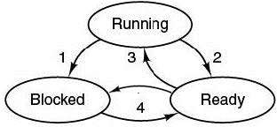

## Thread [Back](./../Java.md)
- Thread(線程)指一個程序中的執行片段,且擁有併發執行的特性.
- 線程間通信可通過共享全局變量來實現

###同步&互斥
- 同步: 指事件處理存在一定的協作順序，而這個順序的改變將會導致結果的差錯. (Semaphore)
- 互斥: 指多個進程將要讀取同一區域(關鍵區)的數據時,將只能允許一個進程進入. (Mutex)

###Ways to create a thread
- Inherit from the calss **Thread** (java.lang.Thread)

```Java
class MyThread extends Thread
{
	//Attributes
	MyThread()
	{
		//Constructor
	}
	
	@SuppressWarnings("deprecation")
	public void run()
	{
		//What you want this thread to do
	}
}
```
- implements Runnable interface
	- with **this**

	```java
class MyThread implements Runnable
{
		Thread t;
		MyThread()
		{
			t = new Thread(this);
			t.start()；
		}

		//Implements
		public void run() 
		{
			//What you want this thread to do
		}
}
```
	- with **unnamed inner class**

	```java
Thread MyThread = new Thread(
new Runnable()
{
		public void run()
		{
			//What you want this thread to do
		}
});
```

###some methods of Threads
- join()

```Java
t.join();	//Wait for this thread to die
```
- yield()

```java
t.yield();	//Causes the currently executing thread object to temporarily pause 
		//and allow other threads to execute.
```

- setPriority(int newPriority)

```java
t.setPriorty(MAX_PRIORITY);	//Changes the priority of this thread to a max one

/*	java.lang.Thread
*	public static final int	MAX_PRIORITY	10
*	public static final int	MIN_PRIORITY	1
*	public static final int	NORM_PRIORITY	5
*/
```

###When sharing same datas

```java
/* do with shared datas */
public synchronized void transfer()
{  
	//synchronized label ensures that this thread won't be schedule out when running this method.
}
``` 


###States of a Thread


1. Process blocks for input
2. Scheduler picks another process
3. Scheduler picks this process
4. Input becomes available

<empty>

- Blocked State

```Java
Thread.sleep(100);	//Blocked State (do not release lock)

@Deprecated
Thread.suspend();	

wait();			//Blocked State (release lock and need other threads to call notify() or notifyall())	
```
- Run State

```Java
Thread t = new MyThread()	//Initialize
t.start();	//Run State
			//Ready State: Waiting CPU to call it
```

- Ready State

