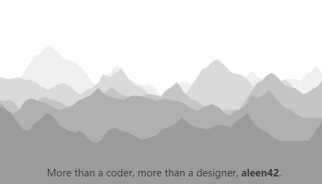

## Mountain [Back](./../react.md)

<p align="center">
    
</p>

<p align="center">
<strong>Mountain</strong>, an awesome designed react component for you
</p>

### Introduction

**Mountain** is an awesome designed components for acting as a footer. It's mainly composed with several SVGs elements inside, and animated by listening to movements of your mouse.

Perhaps, you may say that mountains have sharp edges, resulting in a strange sight. However, because of using SVG, a complicated SVG will make files much huger. As files getting huger and huger, you may have worse experience when viewing on browsers, because the length of content will affect the performance of rendering in browsers.

The whole component will receive two parameters with `props`: 
- `mountainNum`: the number referred to lines of mountains
- `bottomPadding`: a pixel value for pointing out the height of the reserved area given for you to load contents of your footer

When it comes to changing the amplitude of movements, you can pass a new pixel value to the property `moveMax` in the component `MouseMove`. As you may see, each line of mountains will perform differently according to your mouse's movements. That's because the component `MouseMove` has provided a method for child components to subscribe the event of `mouseMove`, so that they can implement a various actions themselves by calling this method, `addTarget()`.

Therefore, inside the lifecycle method `componentDidMount` of the component `Mountain`, there is a code snippet like this:

```js
componentDieMount() {
    if (Objct.prototype.toString.call(this.props.addTarget).toLowerCase() === '[object function]') {
        /** check whether has methods for subscribing */
        this.props.addTarget(this, function (x, y) {
            /** current position (x, y) of the mouse */
            console.log(x, y);
        });
    }
}
```

### Relationships between components

a list for showing the relationship between three mainly used components.

> MouseMove

>> Mountain

>>> MountainSVG

### Demo

<p>
<p data-height="433" data-theme-id="21735" data-slug-hash="zowdqb" data-default-tab="result" data-user="aleen42" data-embed-version="2" data-pen-title="zowdqb" class="codepen">See the Pen <a href="http://codepen.io/aleen42/pen/zowdqb/">zowdqb</a> by aleen42 (<a href="http://codepen.io/aleen42">@aleen42</a>) on <a href="http://codepen.io">CodePen</a>.</p>
<script async src="https://production-assets.codepen.io/assets/embed/ei.js"></script>
</p>
