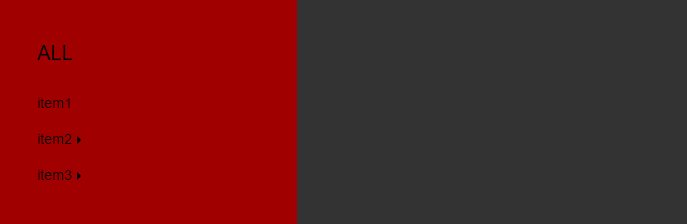

## Multi-level Navigation [Back](./../react.md)

<p align="center">
    
</p>

<p align="center">
<strong>Multi-level Navigation</strong>, a navigation component with funny animation.
</p>

### Properties

Property|Optional|Default|Description
:------:|:-----:|:----------|:------
data|false||an object for defining the structure of your navigation, which structure will be explained later.


### Usage

The whole code is contained in the following codepen demo, and what you need to do is to copy the code of JavaScript, and save it as a `jsx` file, which may need a loader to parse like Babel. Then, before the defined class `Navigation`, just add a key word `export` so that you can import it elsewhere.

```js
export class Navigation extends React.Component {
    /** ... */
}
```

Then, you can use it by importing the component like:

```js
import { Navigation } from 'navigation.jsx';

/** you can also use <Navigation /> */
ReactDOM.render(
    <Navigation data={data}></Navigation>,
    document.querySelector('.container')
);
```

Pay more attention to the object `data`, which should be constructed like this:

```js
var data = {
	name: 'ALL',
	children: [
		{ name: 'item1', children: null },
		{ name: 'item2', children: [
			{ name: 'item12', children: null },
			{ name: 'item13', children: null }
		]},
		{ name: 'item3', children: [
			{ name: 'item4', children: null },
			{ name: 'item5', children: [
				{ name: 'item7', children: null },
				{ name: 'item8', children: null }
			]},
			{ name: 'item6', children: [
				{ name: 'item9', children: null }
			]},
			{ name: 'item10', children: [
				{ name: 'item11', children: null }
			]}
		]}
	]
};
```

As we can see, we should hold a `name` for each menu, and if menus have their own sub-menus, they can be constructed with a `children` object, which should be another array.

### Styles

What styles the component needs is as followed:

```css
.wrapper {
	width: 40%;
	height: 100%;
	box-sizing: border-box;
	overflow: hidden;
	padding: 30px 0;
	min-width: 300px;
	position: relative;
	background-color: #a10000;
}

.wrapper__list {
	margin: 0;
}

.navigation__items {
	display: none;
	left: 100%;
	width: 100%;
	box-sizing: border-box;
}

.navigation__items > li {
	list-style: none;
	margin: 10px 0 20px 0;
	cursor: pointer;

	-webkit-user-select: none;
	-moz-user-select: none;
	-ms-user-select: none;
	-o-user-select: none;
	user-select: none;
}

.navigation__items > li.fade__in--left {
	opacity: 1;
	-webkit-animation: fadeInLeft 1s cubic-bezier(0.55, 0.01, 0.28, 0.82);
	animation: fadeInLeft 1s cubic-bezier(0.55, 0.01, 0.28, 0.82);
}

.navigation__items > li.fade__in--right {
	opacity: 1;
	-webkit-animation: fadeInRight 1s cubic-bezier(0.55, 0.01, 0.28, 0.82);
	animation: fadeInRight 1s cubic-bezier(0.55, 0.01, 0.28, 0.82);
}

.navigation__items > li.fade__out--left {
	opacity: 0;
	-webkit-animation: fadeOutLeft 1s cubic-bezier(0.55, 0.01, 0.28, 0.82);
	animation: fadeOutLeft 1s cubic-bezier(0.55, 0.01, 0.28, 0.82);
}

.navigation__items > li.fade__out--right {
	opacity: 0;
	-webkit-animation: fadeOutRight 1s cubic-bezier(0.55, 0.01, 0.28, 0.82);
	animation: fadeOutRight 1s cubic-bezier(0.55, 0.01, 0.28, 0.82);
}

.navigation__items--active {
	display: block;
}

.navigation__path > li {
	list-style: none;
	display: inline-block;
	cursor: pointer;

	font-size: 20px;
	color: rgba(0, 0, 0, 0.2);

	-webkit-transition: all 0.4s;
	-o-transition: all 0.4s;
	transition: all 0.4s;

	-webkit-user-select: none;
	-moz-user-select: none;
	-ms-user-select: none;
	-o-user-select: none;
	user-select: none;
}

.navigation__path > li.appear {
	opacity: 1;
	-webkit-animation: appear 0.4s cubic-bezier(0.55, 0.01, 0, 1.39);
	animation: appear 0.4s cubic-bezier(0.55, 0.01, 0, 1.39);
}

.navigation__path > li.disappear {
	opacity: 0;
	-webkit-animation: disappear 0.4s cubic-bezier(0.55, 0.01, 0.28, 0.82);
	animation: disappear 0.4s cubic-bezier(0.55, 0.01, 0.28, 0.82);
}

.navigation__path > li:hover {
	text-decoration: underline;
	color: rgba(0, 0, 0, 1);
}

.navigation__path > li.current {
	color: rgba(0, 0, 0, 1);
}

.navigation__path > li.current:hover {
	text-decoration: none;
	color: rgba(0, 0, 0, 1);
}

.navigation__item--multiple::after {
	content: "";
	width: 0;
	height: 0;
	border: 4px solid transparent;
	border-left: 4px solid #000;
	vertical-align: middle;
	display: inline-block;
	margin-left: 5px;
}

.navigation__path--has-before::before {
	content: '>';
	display: inline-block;
	padding: 0 0.5em;
	color: rgba(0, 0, 0, 0.2);
}

.block__wrapper {
	margin: 30px 0;	
}

/** fade out animations */
@keyframes fadeOutLeft {
	0% {
		transform: translateX(0);
		opacity: 1;
	}

	100% {
		transform: translateX(-100%);
		opacity: 0;
	}
}

@-webkit-keyframes fadeOutLeft {
	0% {
		transform: translateX(0);
		opacity: 1;
	}

	100% {
		transform: translateX(-100%);
		opacity: 0;
	}
}

@keyframes fadeOutRight {
	0% {
		transform: translateX(0);
		opacity: 1;
	}

	100% {
		transform: translateX(100%);
		opacity: 0;
	}
}

@-webkit-keyframes fadeOutRight {
	0% {
		transform: translateX(0);
		opacity: 1;
	}

	100% {
		transform: translateX(100%);
		opacity: 0;
	}
}

/** fade in animations */
@keyframes fadeInLeft {
	0% {
		transform: translateX(50%);
		opacity: 0;
	}

	100% {
		transform: translateX(0);
		opacity: 1;
	}
}

@-webkit-keyframes fadeInLeft {
	0% {
		transform: translateX(50%);
		opacity: 0;
	}

	100% {
		transform: translateX(0);
		opacity: 1;
	}
}

@keyframes fadeInRight {
	0% {
		transform: translateX(-50%);
		opacity: 0;
	}

	100% {
		transform: translateX(0);
		opacity: 1;
	}
}

@-webkit-keyframes fadeInRight {
	0% {
		transform: translateX(-50%);
		opacity: 0;
	}

	100% {
		transform: translateX(0);
		opacity: 1;
	}
}

/** appearance animations */
@keyframes appear {
	0% {
		transform: scale(0.2);
		opacity: 0;
	}

	100% {
		transform: scale(1);
		opacity: 1;
	}
}

@-webkit-keyframes appear {
	0% {
		transform: scale(0.2);
		opacity: 0;
	}

	100% {
		transform: scale(1);
		opacity: 1;
	}
}

@keyframes disappear {
	0% {
		transform: scale(1);
		opacity: 1;
	}

	100% {
		transform: scale(0.2);
		opacity: 0;
	}
}

@-webkit-keyframes disappear {
	0% {
		transform: scale(1);
		opacity: 1;
	}

	100% {
		transform: scale(0.2);
		opacity: 0;
	}
}
```

### Demo

<p>
<p data-height="374" data-theme-id="21735" data-slug-hash="MbodzW" data-default-tab="result" data-user="aleen42" data-embed-version="2" data-pen-title="MbodzW" class="codepen">See the Pen <a href="http://codepen.io/aleen42/pen/MbodzW/">MbodzW</a> by aleen42 (<a href="http://codepen.io/aleen42">@aleen42</a>) on <a href="http://codepen.io">CodePen</a>.</p>
<script async src="https://production-assets.codepen.io/assets/embed/ei.js"></script>
</p>
