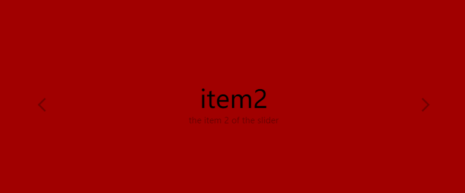

## Slider [Back](./../react.md)

<p align="center">
    
</p>

<p align="center">
<strong>Slider</strong>, a slider component with funny animation.
</p>

### Properties

Property|Optional|Default|Description
:------:|:-----:|:----------|:------
items|false||an object for defining items, which mainly have two parts: the above and the below.
curIndex|true|0|the first item by default


### Usage

The whole code is contained in the following codepen demo, and what you need to do is to copy the code of JavaScript, and save it as a `jsx` file, which may need a loader to parse like Babel. Then, before the defined class `Slider`, just add a key word `export` so that you can import it elsewhere. You can also download [**here**](https://raw.githubusercontent.com/aleen42/PersonalWiki/master/Programming/JavaScript/Framework/react/slider/slider.jsx).

```js
export class Slider extends React.Component {
    /** ... */
}
```

Then, you can use it by importing the component like:

```js
import { Slider } from 'slider.jsx';

/** you can also use <Navigation /> */
ReactDOM.render(
    <Slider items={items}></Slider>,
    document.querySelector('.container')
);
```

Pay more attention to the object `items`, which should be constructed like this:

```js
var items = [
    {
        title: 'any HTML text is supported',
        description: 'any HTML text is supported'
    }, {
        title: 'item2',
        description: 'the item 2'
    }
];
```

As we can see, title and description can be set as texts or any HTML text, as I have used `dangersoulySetInnerHTML` to set the contents for you.

### Styles

What styles the component needs is as followed:

```css
.slider__container {
	width: 100%;
	height: 100%;
	overflow: hidden;
	position: relative;
}

.slider__contents {
	list-style: none;
	margin: 0;
}

.slider__button {
	-webkit-transition: all 0.2s;
	-o-transition: all 0.2s;
	transition: all 0.2s;
	opacity: 0.3;
	cursor: pointer;

	height: 74px;
	line-height: 74px;
	width: 20%;
	top: 50%;
	margin-top: -37px;
	text-align: center;

	font-size: 3em;
	position: absolute;
}

.slider__button:hover {
	opacity: 1;
}

.slider__button--right {
	right: 0;
}

.slider__button--left {
	left: 0;
}

.content__item {
	position: absolute;
	width: 100%;
	text-align: center;
	left: 0;
	top: 50%;
	margin-top: -37px;
}

.content__item .title {
	opacity: 0;
	visibility: hidden;
	font-size: 3em;
}

.content__item .description {
	opacity: 0;
	visibility: hidden;
	color: rgba(0, 0, 0, 0.4);
	width: 50%;
	margin: 10px auto 0 auto;
}

.content__item--current .title {
	opacity: 1;
	visibility: visible;
}

.content__item--current .description {
	opacity: 1;
	visibility: visible;
}
```

### External Depencies

- [Dynamic.js](https://github.com/michaelvillar/dynamics.js/releases)
- [FontAwesome.css](https://github.com/FortAwesome/Font-Awesome/releases)

### Demo

<p>
<p data-height="300" data-theme-id="21735" data-slug-hash="LbrqBO" data-default-tab="result" data-user="aleen42" data-embed-version="2" data-pen-title="LbrqBO" class="codepen">See the Pen <a href="http://codepen.io/aleen42/pen/LbrqBO/">LbrqBO</a> by aleen42 (<a href="http://codepen.io/aleen42">@aleen42</a>) on <a href="http://codepen.io">CodePen</a>.</p>
<script async src="https://production-assets.codepen.io/assets/embed/ei.js"></script>
</p>
