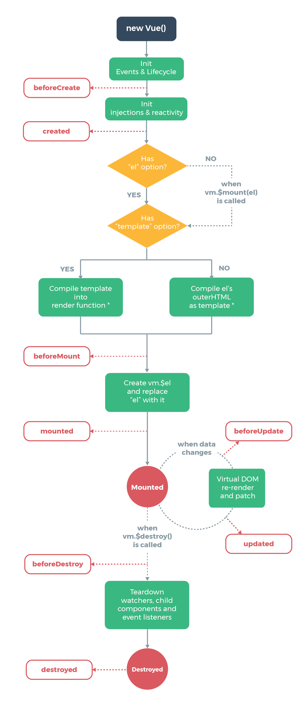

## Vue Instances [Back](../vue.md)

As described in quick start guide before, we can easily create a Vue instance with calling:

```js
const vm = new Vue({ /** options */ });
```

The majority of this guide is to discuss about what options we can pass during creating a Vue instance, and the life cycle (state phase) of it at the same time.

In most cases, a Vue application consists of a **root Vue instance**, and organized with a tree of nested, reusable components. For each component, it is also a Vue instance. Take todo lists as an example, the structure of this application can be described like this:

```
Root Instance
└─ TodoList
   ├─ TodoItem
   │  ├─ DeleteTodoButton
   │  └─ EditTodoButton
   └─ TodoListFooter
      ├─ ClearTodosButton
      └─ TodoListStatistics
```

### 1. Data and Methods

When a Vue instance is created, it adds all the properties found in its `data` object to Vue's **reactivity system**, which should _react_ while data has been modified, except one case where we defined a new property after creation. It means that Vue's reactivity system will only react with properties defined during creating phase.

```js
const vm = new Vue({a : 1});

vm.b = 1; /** won't trigger updating of views */
```

In additional, `Object.freeze()` can result in side effects, as properties can not be modified any more, leading failed tracking of the reactivity system.

```js
const obj = {a : 1};
Object.freeze(obj);

const vm = new Vue(obj);
vm.a = 2; /** won't trigger updating of views */
```

A Vue instance has also exposed a number of useful properties and methods for us, with `$` prefixed to differentiate from user-defined properties.

```js
const vm = new Vue({
    el: '#element',
    data: {a : 1},
});

console.log(vm.$data === data); /** => true */
console.log(vm.$el === document.getElementById('element')); /** => true */

/** $watch is an instance method for watching property change */
vm.$watch('a', (newVal, oldVal) => {
    /** callback when `vm.a` changes */
});
```

Check [here](https://vuejs.org/v2/api/#Instance-Properties) for the full list of instance properties and methods.

### 2. Lifecyle

Each Vue instance goes through a series of steps when created, like setting up data observation, compiling the template, mounting the instance to the DOM, and updating the DOM when data has been modified. All these steps has been defined in Vue as a phase called **lifecycle**, and the handler triggered during these steps are called **lifecycle hooks**, allowing developers to do anything during these steps. A Vue instance mainly has four hooks, which are `created`, `mounted`, `updated`, and `destroyed` respectively. Within each hook, we can access the Vue instance through `this`. (note: `this` can be changed while using arrow functions)

<p align=center>
    
</p>
