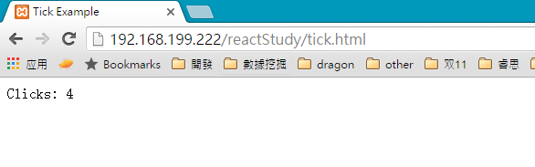

## Webpack + React [Back](./../webpack.md)

For my familiarity, I'll build up with react projects with the following file structure:

> project
> 
> > src
> > 
> > > components
> > > 
> > > \*\_entry.js
> > 
> > build
> 
> webpack.config.js
> 
> \*.html

Files of sites like \(`*.html`\) will be placed in the root of this project or if using Laravel, the place will be other one outside this project. Files emitted by webpack will be in `/build`, and imported by sites. Then, here I would like to use a case for teaching how to use webpack to bundle  files with different dependencies in a React project.

#### 1. Initialize a npm project

```bash
npm init # (answer the questions)
```

#### 2. Install webpack as a development dependency, and global as well

```bash
npm install webpack --save-dev
```

```bash
sudo npm install webpack -g
```

#### 3. Install loaders and dependencies

```bash
npm install babel-core --save-dev
npm install babel-preset-es2015 --save-dev
npm install babel-preset-react --save-dev
npm install babel-loader --save-dev
npm install babel-polyfill --save
```

```bash
npm install react --save
npm install react-dom --save
```

###### Optional

```bash
npm install css-loader --save-dev
npm install file-loader --save-dev
npm install json-loader --save-dev
npm install react-markdown-loader --save-dev
npm install style-loader --save-dev
npm install url-loader --save-dev
```

```bash
npm install font-awesome --save
npm install underscore --save
```

#### 4. Set up a configuration file for webpack `webpack.config.js`

```js
module.exports = {
    entry: './src/entry.js',
    output: {
        path: __dirname + '/build',
        filename: 'entry.js'
    },
    resolve: {
        extensions: ['', '.js', '.jsx']
    },
    module: {
        loaders: [
            {
                test: /\.jsx?$/,
                loader: 'babel-loader',
                exclude: /node_modules/,
                query: {
                    presets: ['es2015', 'react']
                }
            }
        ]
    }
};
```

* **entry**: the entry point of a script
* **output**: point out where to emit files bundled by webpack
* **resolve**: point out which type of files can be import, e.g. `import TickTock from './components/ticktock'`

#### 5. Write certain JavaScript files

**\/src\/components\/ticktock.jsx**

```js
import React from 'react';

export class TickTock extends React.Component {
    constructor(props) {
        super(props);

        this.state = { count: props.initialCount };
        this.tick = this.tick.bind(this);
    }

    tick() {
        this.setState({ count: this.state.count + 1 });
    }

    render() {
        return (
            <div onClick={this.tick}>
                Clicks: {this.state.count}
            </div>
        );
    }
}

TickTock.propTypes = { initialCount: React.PropTypes.number };
TickTock.defaultProps = { initialCount: 0 };

```

**\/src\/entry.js**

```js
import 'babel-polyfill';
import React from 'react';
import ReactDOM from 'react-dom';
import { TickTock } from './components/ticktock';

ReactDOM.render(
    <TickTock />,
    document.getElementById('content')
);
```

#### 6. Import the entry into a html file

```html
<!DOCTYPE html>
<html>
<head>
    <title>Tick Example</title>
</head>
<body>
    <div id="content"></div>
    <script type="text/javascript" src="build/entry.js"></script>
</body>
</html>
```

#### 7. Run `webpack` to start to bundle:

```bash
webpack
```

If you want to listen to the compiling, you can use:

```bash
webpack -d --watch
```

#### Preview



