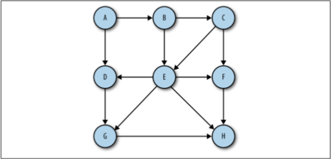
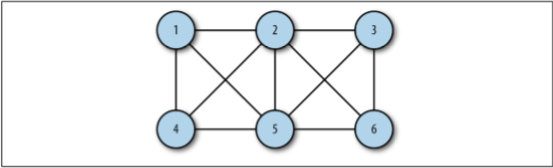

## Graphs [Back](./../data_structure.md)

The study of networks has become one of the great scientific hotbeds (熱點) of this century, though mathematicians and others have been studying networks for many hundreds of years.

In this chapter, we'll look at how networks are modeled with graphs in JavaScript.

### Graphs Definitions

A graph consists of a set of **vertices** (頂點) and **edges**, which mainly consists of two kinds: A **digrapth** (directed graph) and an **unordered graph**.

A graph whose pairs are ordered is called a directed graph (*Figure 1*), or just a digraph.

<p align="center">
    
</p>

<p align="center">
    <strong>Figure 1</strong> A diagraph (directed graph)
</p>

A graph, which is not ordered, is called an unordered graph (*Figure 2*), or just a graph.

<p align="center">
    
</p>

<p align="center">
    <strong>Figure 2</strong> An unordered graph
</p>

A **path** is a sequence of vertices in a graph such that all vertices in the path are connected by edges. The **length** of a path is the number of edges from the first vertex in the path to the last vertex. A path can also consist of a vertex to itself, which is called a **loop**. Loops have a length of 0. 

A **cycle** is a path with at least one edge whose first and last vertices are the same. A simple cycle is one with no repeated edges or vertices for both directed and undirected graphs. Paths that repeat other vertices besides the first and last vertices are called **general cycles**. 

Two vertices are considered **strongly** connected (強連接) if there is a path from the first vertex to the second vertex, and vice versa (反之亦然). If the graph is a directed graph, and all its vertices are strongly connected, then the directed graph is considered strongly connected.

### The Graph Class

Here we will discuss how to define a class for graphs.

### Vertices

```js
function Vertex(label) {
    this.label = label;
}
```

### Edges

For edges, we will use an **adjacency list** (鄰接表) or an array of adjacency list to represent. For example, if the vertex 2 is connected to vectices 0, 1, 3, and 4, the array `adj[2]` will store another array consists of `[0, 1, 3, 4]`.

Another method for representing edges of a graph is called an **adjacency matrix** (鄰接矩陣). For example, if the vertex 2 is connected to vetices 0, 1, 3, and 4, then `adj[2][0]`, `adj[2][1]`, `adj[2][3]` and `adj[2][4]` are all assigned with 1, rather than 0.

### Graphs

Therefore, graphs can be designed as:

```js
function Graph(v) {
    this.vectices = v;
    this.edges = 0;
    this.adj = [];
    
    for (var i = 0; i < this.vectices; i++) {
        this.adj[i] = [];
        this.adj[i].push('');
    }
    
    this.addEdge = addEdge;
    this.toString = toString;
}

function addEdge(v, w) {
    this.adj[v].push(w);
    this.adj[w].push(v);
    
    this.edges++;
}

/** a method for showing all vertices and what they connect to */
function showGraph() {
    for (var i = 0; i < this.vertices; i++) {
        putstr(i + ' -> ');
        
        for (var j = 0; j < this.vertices; j++) {
            putstr(this.adj[i][j] + ' ');
        }
        
        print();
    }
}
```
