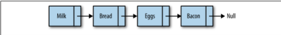
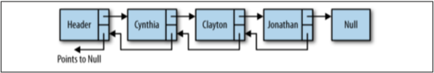
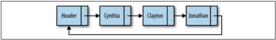

## Linked Lists [Back](./../data_structure.md)

**Linked lists** are sometimes preferred to arrays, and why should we still develop an object-based, linked-list implementation?

### Shortcomings of Arrays

There are several reasons arrays are not always the best data structure to use for organizing data.

In many programming languages, **arrays are fixed in length**, so it is hard to add new data when the last element of the array is reached. Adding and removing data from an array is also difficult because you have to move array elements up or down to reflect either an addition or a deletion. However, these problems do not come up with JavaScript arrays, since we can use the `splice()` function without having to perform additional array element accesses. 

The main problem with using JavaScript arrays, however, is that arrays in JavaScript are implemented as objects, causing them to be less efficient than arrays built in languages such as C++ and Java.

For these reasons, sometimes, if we don't need random access to the elements of a list, we can use linked list to enhance the performance of JavaScript.

### Linked Lists Defined

A linked list is a collection of objects called **nodes**, and each node is linked to a successor node in the list using an object reference (Figure 1).

<p align="center">
    
</p>

<p align="center">
    <strong>Figure 1</strong> A linked list
</p>

Marking the beginning of a linked list can be a problem. Many linked-list implementations include a special node, called the **head**, to denote (標誌) the beginning of a linked list. 

### An object-based Linked List design

#### Nodes

```js
function Node(element) {
    this.element = element;
    this.next = null;
}
```

#### Linked List

```js
function LList() {
    this.head = new Node('head');
    this.find = find;
    this.insert = insert;
    this.remove = remove;
    this.display = display;
}

function find(item) {
    var curNode = this.head;
    
    for (;;) {
        if (curNode.element !== item) {
            curNode = curNode.next;
            
            if (curNode === null) {
                return null;
            }
        } else {
            return curNode;
        }
    }
}

function insert(element, item) {
    var tmpNode = new Node(element);
    var itemNode = this.find(item);
    
    tmpNode.next = prevNextNode;
    itemNode.next = tmpNode;
}

function display() {
    var currentNode = this.head;
    
    while (currentNode.next !== null) {
        console.log(currentNode.next.element);
        currentNode = currentNode.next;
    }
}

function remove(item) {
    var itemNode = this.find(item);
    
    if (itemNode !== null) {
        /** find the prev node */
        var currentNode = this.head;
        
        while (currentNode.next !== itemNode) {
            currentNode = currentNode.next;
        }
        
        currentNode.next = itemNode.next;
    }
}
```

### Doubly Linked Lists

<p align="center">
    
</p>

<p align="center">
    <strong>Figure 2</strong> A doubly linked list
</p>

Although traversing a linked list from the first node to the last node is straightforward, it is not as easy to traverse a linked list backward. So, we define another specific structure named **doubly linked lists** (Figure 2), which has added an additional pointer `prev` for searching backward, compared with normal linked lists.

```js
function Node(element) {
    this.element = element;
    this.next = null;
    this.prev = null;
}
```

Then, changing some normal methods:

```js
function insert(element, item) {
    var tmpNode = new Node(element);
    var itemNode = this.find(item);
 
    tmpNode.next = itemNode.next;
    tmpNode.prev = itemNode;
    itemNode.next = tmpNode;
}

function remove(item) {
    var itemNode = this.find(item);
    
    if (itemNode !== null) {
        itemNode.prev.next = itemNode.next;
        itemNode.next.prev = itemNode.prev;
        
        itemNode.prev = null;
        itemNode.next = null;
    }
}
```

### Circularly Linked Lists

<p align="center">
    
</p>

<p align="center">
    <strong>Figure 3</strong> A circularly linked list
</p>

A **circularly linked list** (Figure 3) is similar to a singly linked list and has the same type of nodes. The only difference is that a circularly linked list, when created, has its head node's next property point back to itself.

```js
function LList() {
    this.head = new Node('head');
    this.head.next = this.head;
    this.find = find;
    this.insert = insert;
    this.remove = remove;
    this.display = display;
}
```

Then, we have to change the method for displaying:

```js
function display() {
    var currentNode = this.head;
    
    while (currentNode.next !== null && currentNode.next.element !== 'head') {
        console.log(currentNode.next.element);
        currentNode = currentNode.next;
    }
}
```