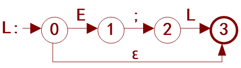

## Generator [Back](../JavaScript.md)

**Generator** is a concept specified in ECMAScript 2015 (ES6) , which stands for a state machine like objects, which have iterable protocol. It means that we can easily use `Generator.prototype.next()` method to access the next state of such a machine.

In JavaScript, if you want to create a generator, you should use `function *` rather than `Generator`, as it is not a constructor.

```js
function * gen() {
	yield 1;
	yield 2;
}

/**
 * a generator
 * @type {IterableIterator<number>}
 */
const generator = gen();
```

With such a object, there are three exposed methods we can use:

1. `Generator.prototype.next()`: returns a value yielded by the `yield` expression.
    ```js
    const generator = gen();
    generator.next(); /** => {value: 1, done: false} */
    generator.next(); /** => {value: 2, done: false} */
    generator.next(); /** => {value: undefined, done: true} */
    ```

2. `Generator.prototype.return()`: returns the given value and finishes the generator.
    ```js
    const generator = gen();
    generator.next(); /** => {value: 1, done: false} */
    generator.return(); /** => {value: undefined, done: true} */
    generator.next(); /** => {value: undefined, done: true} */
    ```

3. `Generator.prototype.throw()`: throws an error to the generator, and finishes it, unless the error caught by the generator.
    ```js
    const generator = gen();
    generator.next(); /** => {value: 1, done: false} */
    generator.throw(1); /** => Uncaught 1 */
    generator.next(); /** => {value: undefined, done: true} */
    ```

So how can we use generators to describe a state machine? Take the following case as an example. Assume that there is a state machine like this:

<p>
<figure align="center">
    
    <figcaption><strong>Figure 1</strong> a simple state machine</figcaption>
</figure>
</p>

And then the generator for this can code like this:

```js
function * machine() {
	/** the start of state */
	let state = 0;
	let action;
	
	/** simple prev checker */
	const _next = (prev, val) => state === prev ? val : state;

	for (;;) {
		/**
		 * get the initial state, and read "action"
		 * passed by `Generator.prototype.next()` each time
		 */
		action = yield state;
		state = _next.apply(0, ({'E': [0, 1], ';': [1, 2], 'L': [2, 3], 'ε': [0, 3]})[action]);
		
		/** the end of state */
		if (state === 3) return state;
	}
}
```

```js
const generator = machine();
generator.next(); /** need to call next at first for initializing states */

generator.next('E'); /** => {value: 1, done: false} */
generator.next(';'); /** => {value: 2, done: false} */
generator.next('L'); /** => {value: 3, done: true} */
```

```js
const generator = machine();
generator.next(); /** need to call next at first for initializing states */

generator.next('ε'); /** => {value: 3, done: false} */
```

Quite easy, right? In addition, we will take a look at some usages of `yield`:

1. If we want to concat two generator, or embed one into another, we can use `yield *`:
    ```js
    function * top(i) {
	    yield i + 1;
	    yield i + 2;
	    yield i + 3;
    }
    
    function * decade(i) {
	    yield i;
	    yield * top(i);
	    yield i + 10;
    }
    
    const generator = decade(10);
    generator.next(); /** => {value: 10, done: false} */
    generator.next(); /** => {value: 11, done: false} */
    generator.next(); /** => {value: 12, done: false} */
    generator.next(); /** => {value: 13, done: false} */
    generator.next(); /** => {value: 20, done: false} */
    ```

2. Pass arguments into generators:
    ```js
    function * log() {
        console.log(0);	
        console.log(1, yield);	
    }
    
    const generator = log();
    generator.next('first'); /** => 0 */
    generator.next('second'); /** => 1 second */
    ```

    As we can see in the snippet above, that's why we need to initialize states at first with calling `Generator.prototype.next()`.

3. Return statements in a generator:
    ```js
    function * method() {
	    yield 'a';
	    return 'close';
	    yield 'unreachable'; /** the generator will be marked as done once it returns */
    }
    
    const generator = method();
    generator.next(); /** => {value: "a", done: false} */
    generator.next(); /** => {value: "close", done: true} */
    generator.next(); /** => {value: undefined, done: true} */
    ```

4. Generator as an object property:
    ```js
    const obj = {
	    * gen() {
	    	yield 1;
	    	yield 2;
	    },
    };

    const generator = obj.gen();
    ```

5. Generator as an class member:
    ```js
    class Component {
	    constructor() {}

	    * gen() {
	    	yield 1;
	    	yield 2;
	    }
    }
    
    const component = new Component();
    const generator = component.gen();
    ```
