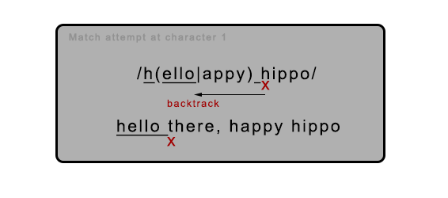
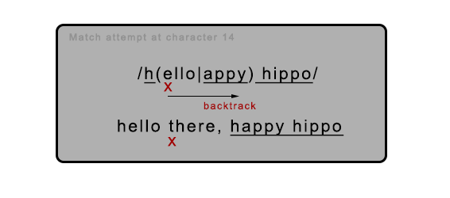

## Strings and Regular Expressions [Back](./../high_performance.md)

This chapter mainly helps you understand how regular expression engines internally process strings and teaches you how to write regular expressions that take advantage of this knowledge.

Also in this chapter, we will learn about the fastest cross-browser methods for concatenating and trimming strings, discover how to increase regex performance by reducing backtracking, and any other tips and tricks for efficiently processing strings and regular expressions.

### 1. String Concatenation

String concatenation is a common task for us to build a string, and how to optimize it? For starters, there is more than one way to merge strings

| Method | Example     |
| :------------- | :------------- |
| The `+` operator       | `str = 'a' + 'b' + 'c';`       |
| The `+=` operator       | `str = 'a';`       |
|| `str += 'b';`       |
|| `str += 'c';`       |
|array.join()| `str = ['a', 'b', 'c'].join('');`       |
|string.concat()| `str = 'a';`       |
|| `str = str.concat('b', 'c');`|

All of these methods are fast when concatenating a few strings, nevertheless as the length and number of strings that must be merged increases, some methods start to show their strength.

#### 1.1 `+` and `+=` Operators

Several techniques maximize the efficiency of these operators.

First, an example.

```js
str += 'one' + 'two';
```

When evaluating this code, four steps are taken:

1. A temporary string is created in memory.
2. The concatenated value "onetwo" is assigned to the temporary string.
3. The temporary string is concatenated with the current value of `str`.
4. The result is assigned to `str`.

But considering the following code, which avoids the temporary string (step 1 and step 2 in the above list), and it will end up running about 10%-40% faster in most browsers:

```js
str += 'one';
str += 'two';
```

In fact, you can get the same performance improvement using one statement like this:

```js
/** equivalent to `str = ((str + 'one') + 'two')` */
str = str + 'one' + 'two';
```

Why? That's because the concatenation is based on the `str` itself, and avoid the temporary string, which will allocate some memory. For this reason, if you assign like this, you'll also lose your improvement:

```js
str = 'one' + str + 'two';
```

Apart from IE, browsers try to expand the memory allocation for the string on the left of an expression and simply copy the second string to the end of it. So, in that browsers, it's recommended not to copy a long string, while there is a short one.

```js
var s1 = 'one';
var s3 = 'three';

/** not `var s = s1 + s3;` */
var s = s3 + s1;
```

These techniques don't apply to IE. They have little, if any, effect in IE8 and can actually make things slower in IE7 and earlier.

In IE8's implementation, concatenating strings merely stores references to the existing string parts that compose the new string, and when you actually use the concatenated string, it starts to copy and replace the previous references so that you can use it anytime.

> IE8'S implementation can throw off synthetic benchmarks, makin concatenation appear faster than it really is, unless you force it to occur.

IE7 has an earlier use an inferior (較次的) implementation of concatenation, in which each pair of concatenated strings must always be copied to a new memory location. Then, considering `largeStr = largeStr + s1 + s2;`, the variable `largeStr` will be copied twice in this case. Conversely, `largeStr += s1 + s2;` will be faster because IE7 and earlier browsers will firstly concatenate two small string `s1` and `s2`, then copy the `largeStr` only once.

When all strings concatenated are compile-time constants, Firefox automatically merges them at compile time:

```js
function folding() {
    var str = 'compile' + 'time' + 'folding';
    str += 'this' + 'works' + 'too';
    str = str + 'but' + 'not' + 'this';
}

console.log(foldingDemo.toString());
/** =>
 * function folding() {
 * 		var str = 'compiletimefolding';
 * 		str = 'thisworkstoo';
 * 		str = str + 'but' + 'not' + 'this';
 * }
 */
```

Since we have not often built strings from compile-time constants, it doesn't help very often at all.

> The YUI Compressor performs this optimization at build time.

#### 1.2 Array Joining

The `Array.prototype.join` method can be used to merge all elements of an array into a string and accepts a separator string to insert between each element. By passing an empty string, you can perform a simple concatenation of all elements in an array.

In most browsers, using this way to concatenate strings is slower than other methods, but is the only efficient way to concatenate lots of strings in IE7 and earlier. To improve that, we're going to have a simple task:

Considering the following code:

```js
var str = 'I\'m a thirty-five character string';
var newStr = '';
var appends = 5000;

while (appends--) {
    newStr += str;
}
```

With changing the value of `appends`, we can have a statistic for how long this task will complete.

|Appends (times)|5,000|10,000|15,000|20,000
|:--------------|:----|:-----|:-----|:-----
|Time (ms)|226|3,955|15,537|32,352

How about using array joining like this:

```js
var str = 'I\'m a thirty-five character string';
var strs = [];
var newStr;
var appends = 5000;

while (appends--) {
    strs[strs.lenght] = str;
}

newStr = strs.join('');
```

|Appends (times)|5,000|10,000|15,000|20,000
|:--------------|:----|:-----|:-----|:-----
|Time (ms)|10|20|30|40

Apparently, the approach of using array joining has reduced so much time to complete this task. Why? IE7's native concatenation algorithm requires that the browser repeatedly copy and allocate memory for larger and larger strings each time through the loop. It's allocations that waste so much time.

#### 1.3 `String.prototype.concat`

The `String.prototype.concat` is an convenient method, which accepts any number of arguments and appends each to the string.

```js
/** append one string */
str = str.concat(s1);

/** append three strings */
str = str.concat(s1, s2, s3);

/** using list and `apply` */
str = String.prototype.concat.apply(str, array);
```

Everything has two coins, and `concat` has paid for its convenience. `concat` is a little slower than simple `+` and `+=` operations in most cases, and can be very slower in IE, Opera, and Chrome. The reason is same as using `+` and `+=` when building large strings in IE7 and earlier.

### 2. Regular Expression Optimization

Incautiously crafted regexes can be a major performance bottleneck, but there is a lot you can do to improve regex efficiency. Just because two regexes match the same text does not mean they do at the same speed.

#### 2.1 How Regular Expressions Work

Before focusing on the improvement of performance, it's important to understand how regular expressions work.

- Step 1: Compilation

    When you create a regex object (using a regex literal or `RegExp` object), the browser will checks your pattern for errors and then converts it into a native code routine that is used to actually perform matches. (**If you assign the regex to a local variable, you can avoid performing this step more than once**)

- Step 2: Setting the starting position

    When a regex is firstly put to use, the first step is to determine the position within the target string, where to search (the start of the string or the position specified by the regex's `lastIndex` property).

    When a regex has succeed or failed to match, the position will be the next one character after where the last attempt started.

    Optimizations that browser makers build into their regex engines can help avoid a lot of unnecessary work in this step.

    - If a regex starts with `^`, IE and Chrome can usually determine that a match cannot be found after the start of a string and avoid foolishly searching subsequent positions.
    - If all possible matches contain `x` as the third character, recent version of Chrome will determine this, quickly search for the next `x`, and set the starting position two characters back from where it's found.
    - ...

- Step 3: Matching each regex token

    Since the regex has known where to start, it steps through the text and the regex pattern. When a particular token failed to match, the regex tries to **backtrack** to a prior point in the match attempt and follow other possible paths through the regex.

- Step 4: Success or failure

    If a complete match is found at the current position in the string, the regex declares success.

    If all possible paths through the regex has been attempted but a match was not found, the regex engine goes back to step 2 and try again at the next one character.

    Only after cycling each character in the string and no matches have been found does the regex declare overall failure.

#### 2.2 Understanding backtracking

Backtracking is a fundamental component of regexes' matching process, but it's, however, computationally expensive and can easily get out of hand if you're not careful.

For each quantifier and alternation, a **decision** must be made about how to proceed. With a qualifier (such as `*`, `+?`, or `{2,}`), the regex must decide when to try matching additional characters. With alternation (via the `|` operator), it must also try one option from those available.

Each time the regex makes such a decision, it remembers the other options to return to later if necessary. If the chosen option can not find a match or anything later in the regex fails, the regex will backtrack to the last decision point where untried options remain and chooses one. This is the process of **backtracking**.

##### 2.2.1 **Alternation and backtracking**

Consider the following case:

```js
/h(ello|appy) hippo/.test('hello there, happy hippo');
```

There are two main processes of backtracking we should focus on:

- Match attempt at character 1:

    

- Match attempt at character 14:

    

##### 2.2.2 **Repetition and backtracking**

The next case shows how backtracking works with repetition quantifier.

```js
/<p>.*<\/p>/.test('<p>Para 1.</p><p>Para 2.</p><div>Div. </div>');
```

This regex will firstly match the whole string from character 4 within the dot `.` qualifier, and then try backtracking to match `<`. Since `</` has been matched at the `</div>` tag, the character `p` does not match the character `d`. So, it still try backtracking continually until it match `</p>` after the string "Para 2.". Therefore, the matched result should be "**&lt;p&gt;Para 1.&lt;/p&gt;&lt;img src="small.jpg" /&gt;&lt;p&gt;Para 2.&lt;/p&gt;**".

If you want to change the regex to match individual paragraph, you can replace the greedy quantifier `*` with the lazy one `*?`. With the lazy quantifier, the regex engine will skip matching `.*?` and directly try to match `</p>`. If it fails, it will backtrack to match the next fewest number of characters, and finally match "**&lt;p&gt;Para 1.&lt;/p&gt;**".

However, if matching the same target with producing the same result, using lazy quantifier should be slower than the greedy one:

<table>
    <thead>
        <th>Target:</th>
        <th><strong>&lt;p&gt;Para 1.&lt;\\/p&gt;</strong></th>
    </thead>
    <tbody>
        <tr>
            <td>Greedy quantifier</td>
            <td>Lazy quantifier</td>
        </tr>
        <tr>
            <td><strong>/&lt;p&gt;.&#42;&lt;\\/p&gt;/i</strong></td>
            <td><strong>/&lt;p&gt;.&#42;?&lt;\\/p&gt;/i</strong></td>
        </tr>
        <tr>
            <td>
                <ol><li>&lt;</li><li>&lt;p</li><li>&lt;p&gt;</li><li>&lt;p&gt;Para 1.&lt;/p&gt;</li><li>&lt;p&gt;Para 1.&lt;/p&gt;  <strong>[backtrack]</strong></li><li>&lt;p&gt;Para 1.&lt;/p</li><li>&lt;p&gt;Para 1.&lt;/p <strong>[backtrack]</strong></li><li>&lt;p&gt;Para 1.&lt;/</li><li>&lt;p&gt;Para 1.&lt;/ <strong>[backtrack]</strong></li><li>&lt;p&gt;Para 1.&lt;</li><li>&lt;p&gt;Para 1.&lt; <strong>[backtrack]</strong></li><li>&lt;p&gt;Para 1.</li><li>&lt;p&gt;Para 1.&lt;</li><li>&lt;p&gt;Para 1.&lt;/</li><li>&lt;p&gt;Para 1.&lt;/p</li><li>&lt;p&gt;Para 1.&lt;/p&gt; <strong>[success]</strong></li></ol>
            </td>
            <td>
                <ol><li>&lt;</li><li>&lt;p</li><li>&lt;p&gt;</li><li>&lt;p&gt; <strong>[zero-length match]</strong></li><li>&lt;p&gt; <strong>[backtrack]</strong></li><li>&lt;p&gt;P</li><li>&lt;p&gt;P <strong>[backtrack]</strong></li><li>&lt;p&gt;Pa</li><li>&lt;p&gt;Pa <strong>[backtrack]</strong></li><li>&lt;p&gt;Par</li><li>&lt;p&gt;Par <strong>[backtrack]</strong></li><li>&lt;p&gt;Para</li><li>&lt;p&gt;Para <strong>[backtrack]</strong></li><li>&lt;p&gt;Para&nbsp;</li><li>&lt;p&gt;Para&nbsp; <strong>[backtrack]</strong></li><li>&lt;p&gt;Para 1</li><li>&lt;p&gt;Para 1 <strong>[backtrack]</strong></li><li>&lt;p&gt;Para 1.</li><li>&lt;p&gt;Para 1.&lt;</li><li>&lt;p&gt;Para 1.&lt;/</li><li>&lt;p&gt;Para 1.&lt;/p</li><li>&lt;p&gt;Para 1.&lt;/p&gt; <strong>[success]</strong></li></ol>
            </td>
        </tr>
    </tbody>
</table>

#### 2.3 Runaway backtracking

When a regular expression cost browsers seconds, minutes, or longer to execute, the problem is most likely a bad case of runaway backtracking. Consider the following regex which is mainly used to match an entire HTML file:

**/&lt;html&gt;[\\s\\S]&#42;?&lt;head&gt;[\\s\\S]&#42;?&lt;title&gt;[\\s\\S]&#42;?&lt;\\/title&gt;[\\s\\S]&#42;?&lt;\\/head&gt;[\\s\\S]&#42;?&lt;body&gt;[\\s\\S]&#42;?&lt;\\/body&gt;[\\s\\S]&#42;?&lt;\\/html&gt;/**

This regex works fine when matching a suitable HTML string, but it turns ugly when the string is missing one or more required tags, such as `</html>`, `</body>`, or `</head>`, as the `[\s\S]*?` will expands to the end of the string more than once. Therefore, we have to use another more specific regular expression for optimization:

**/&lt;html&gt;(?:(?!&lt;head&gt;)[\\s\\S])&#42;&lt;head&gt;(?:(?!&lt;title&gt;)[\\s\\S])&#42;&lt;title&gt;(?:(?!&lt;\\/title&gt;)[\\s\\S])&#42;&lt;\\/title&gt;(?:(?!&lt;\\/head&gt;)[\\s\\S])&#42;&lt;\\/head&gt;(?:(?!&lt;body&gt;)[\\s\\S])&#42;&lt;body&gt;(?:(?!&lt;\\/body&gt;)[\\s\\S])&#42;&lt;\\/body&gt;(?:(?!&lt;\\/html&gt;)[\\s\\S])&#42;&lt;\\/html&gt;/**

Even if the regex has removed the potential for runaway backtracking and allowed to fail at matching incomplete HTML strings in linear time, it still has some problems of efficiency above repeating a lookahead for each matched character.

Some regex flavors, including .NET, Java, and Perl, support a feature called **atomic grouping**. As soon as a regex exit such an atomic group, any backtracking positions within the group are thrown away, which means that we can reduce the times of backtracking. However, in JavaScript, we need to use another way to emulate (模擬) atomic groups by using lookahead and backreferences.

**/(?=(pattern to make atomic))\\1/**

So the resolution should be changed like this:

**/&lt;html&gt;(?=([\\s\\S]&#42;?&lt;head&gt;))\\1(?=([\\s\\S]&#42;?&lt;title&gt;))\\2(?=([\\s\\S]&#42;?&lt;\\/title&gt;))\\3(?=([\\s\\S]&#42;?&lt;\\/head&gt;))\\4(?=([\\s\\S]&#42;?&lt;body&gt;))\\5(?=([\\s\\S]&#42;?&lt;\\/body&gt;))\\6[\\s\\S]&#42;?&lt;\\/html&gt;/**

Now, if there is no trailing `</html>` and the last `[\s\S]*?` expands to the end of the string, the regex immediately fails because there are no backtracking points to return to.

A quantifier is nested when it occurs within a grouping that is itself repeated by a quantifier (e.g., `(x+)*`). Even if it's not actually a performance hazard (危險), it can still easily create a massive number of ways to divide text between the inner and outer quantifiers while attempting to match a string.

Considering the following regex which is mainly used to match HTML tags:

**/&lt;(?:[&#94;&gt;"']|"[&#94;"]&#42;"|'[&#94;']&#42;')&#42;&gt;/**

In comparison with a naive solution **/&lt;[&#94;&gt;]&#42;&gt;/**, it also accounts for `>` characters occur within attribute values. So far, there's no risk of runaway backtracking, despite the nested `*` quantifier. Look at the first alternative in the non-capturing group: `[^>"']`, and this can match only one character at a time, which seems a little inefficient. So, how about adding `+` quantifier at the end of this alternative? A disaster is going to be happened.

If the regex matches an opening `<` character, but there is no following `>` that would allows the match attempt to complete successfully, runaway backtracking will happen. As the huge number of ways the new inner quantifier `+` can be combined with the outer quantifier `*`, there're plenty of  ways to attempt before giving up. **Watch out**!

> Because a regex's performance can be wildly different depending on the text it's applied to, there's no straightforward way to benchmark regexes against each other. To help catching runaway backtracking early, it's recommended to always test regexes with long strings that contain partial (不完整的) matches.

#### 2.4 More ways to improve regular expression efficiency

There're some different additional regex efficiency techniques:

- **Focus on failing faster**

    Slow regex processing is usually caused by slow failure rather than slow matching. It means that if you're using a regex to match small parts of a large string, the regex will fail at many more positions than it will succeed.

- **Start regexes with simple, required tokens**

    Ideally, the leading token in a regex should be fast to test and rule out as many obviously nonmatching positions as possible, such as **anchors** (`^` or `$`), **specific characters** (`x` or `\u263A`), **character classes** (`[a-z]`, or `\d`), and **word boundaries** (`\b`). If possible, avoid starting regexes with groupings or optional tokens, and avoid top-level alternation.

- **Make quantified patterns and their following token mutually exclusive (彼此獨立)**

    When the characters that adjacent tokens or subexpressions are able to match overlap, the number of ways to try will increase. So, make patterns as specific as possible, and do not use `.*?` when you really mean `[^"\r\n]*`.

- **Reduce the amount and reach of alternation**

    Alternation using the `|` may require that all alternation options be tested at every position in a string. Therefore, you can reduce the need for alternation by using character classes and optional components, or by pushing the alternation further back into the regex.

    Character classes are faster than alternation because they're implemented using bit vectors (or other fast implementations) rather than backtracking.

    When alternation is necessary, put frequently occurring alternatives first if this does not affect what the regex matches.

Instead of|Use
:---------|:--
cat&#124;bat|[cb]at
red&#124;read|rea?d
red&#124;raw|r(?:ea&#124;aw)
(.&#124;\\r&#124;\\n)|[\\s\\S]

- **Use non-capturing groups**

    Capturing groups spend time and memory in remembering backreferences and keeping them up to date. If you don't need a backreference, avoid this overhead by using a non-capturing group `(?:)`.

- **Capture interesting text to reduce postprocessing**

    If you need to reference parts of a match, then, by all means, capture those parts and use the backreferences produced, rather than manually process the result.

- **Expose required tokens**

    If you want the regex engine to make smart decisions about how to optimize a search routine, try to make it easy to determine which tokens are required. For example, expose `^` like **/^(ab|cd)/**, but not **/(^ab|^cd)/**.

- **Use appropriate quantifiers**

    Using the more appropriate quantifier type (based on the anticipated amount of backtracking) in cases where they are equally correct can significantly improve performance, especially with long strings.

- **Reuse regexes by assigning them to variables**

    Assigning regexes to variables lets you avoid repeatedly compiling them, especially within loops.

- **Split complex regexes into simpler pieces**

    Avoid doing too much with a single regex. It's hard to maintain and are prone (易於遭受) to backtracking-related problems.

#### 2.5 When not to use regular expressions

When used with care, regexes are very fast. However, they're usually overkill when you are merely searching for literal strings. This is especially true if you know in advance which part of a string you want to test.

For instance, in the case when you want to check a literal string whether it's end with a semicolon (**;**). If you use regex like

```js
var isEndUpWithSemicolon = /;$/.test(str);
```

Then, the regex engine is not smart enough to directly check the end of the string, and iterate over the whole string instead. Therefore, a better approach to skip the iteration is to use literal operations:

```js
var isEndUpWithSemicolon = (str.charAt(str.length - 1) === ';');
```

Or you can also use `split`:

```js
var isEndUpWithSemicolon = (str.split('')[str.length - 1] === ';');
```

Or use `splice`:

```js
var strLen = str.length;
var isEndUpWithSemicolon = (str.slice(strLen - 1, strLen) === ';');
```

#### 2.6 String Trimming

Removing leading and trailing whitespace from a string is a simple but common task. Trimming strings is not a common performance bottleneck, but it serves as a decent case study for regex optimization since there are a variety of ways to implement it.

##### 2.6.1 **Trimming with regular expressions**

```js
if (!String.prototype.trim) {
    String.prototype.trim = function () {
        return this.replace(/^\s+/, '').replace(/\s+$/, '');
    };
}
```

In Firefox, you can give it a performance boost of roughly 35% by replacing second regex **/\\s+$/** with **/\\s\\s&#42;$/**. Therefore, the most efficient way of trimming with regular expressions is using the follow one snippet:

```js
if (!String.prototype.trim) {
    String.prototype.trim = function () {
        return this.replace(/^\s+/, '').replace(/\s\s*$/, '');
    };
}
```

There're also several ways to implement trimming, but all of them are invariably slower than using two simple substitutions when working with long string.

```js
String.prototype.trim = function() {
    return this.replace(/^\s+|\s+$/g, '');
};
```

Alternation options is needed to be tested at each character, making execution slower.

```js
String.prototype.trim = function () {
    return this.replace(/^\s*([\s\S]*?)\s*$/, '$1');
};
```

The lazy quantifier `?` inside the capturing group in the snippet above has done a lot things, which tends to make this option slower, especially slower in Opera 9.x and earlier.

```js
String.prototype.trim = function () {
    return this.replace(/^\s*(\S*(\s+\S+)*)\s*$/, '$1');
};
```

Unless there's more trailing whitespace than other text, this generally ends up being faster than the previous solution that used a lazy quantifier. In fact, it's so much faster that in IE, Safari, Chrome, and Opera 10, it even beats using two substitutions, as those browsers have all contain special optimization for greedy repetition. However, it's considerably slower in Firefox, and Opera 9, so at least for now, using two substitutions still holds up better cross-browser features.

##### 2.6.2 **Trimming without regular expressions**

We may also consider the performance of trimming without using regular expressions:

```js
String.prototype.trim = function () {
    var start = 0;
    var end = this.length - 1;
    var ws = ' \n\r\t\f\x0b\xa0\u1680\u180e\u2000\u2001\u2002\u2003\u2004\u2005\u2006\u2007\u2008\u2009\u200a\u200b\u2028\u2029\u202f\u205f\u3000\ufeff';

    while (ws.indexOf(this.charAt(start)) > -1) {
        start++;
    }

    while (end > start && ws.indexOf(this.charAt(end)) > -1) {
        end--;
    }

    return this.slice(start, end + 1);
};
```

The `ws` variable in this code includes all whitespace characters as defined by ECMAScript 5. Although it's not affected by the overall length of the string, it has its own weakness: **long leading and trailing whitespace**.

To work around this problem, we may use another final approach to combine regex's universal efficiency at trimming leading whitespace with nonregex method's speed at trimming trailing characters:

```js
String.prototype.trim = function () {
    var str = this.replace(/^\s+/, '');
    var end = str.length - 1;
    var ws = /\s/;

    while (ws.test(str, charAt(end))) {
        end--;
    }

    return str.slice(0, end + 1);
};
```

The simplicity of using two regex substitutions provides consistently respectable performance crossing different platforms, and it's arguably the best solution, while the solution above is exceptionally fast with long strings at the cost of slightly longer code.

### 3. Summary

Intensive string operations and incautiously crafted regexes can be major performance:

- When concatenating numerous or large strings, array joining is the only method with reasonable performance in IE7 and earlier.
- If you don't need to worry about IE7 and earlier, use simple `+` and `+=` operators instead.
- Runaway backtracking can cause a regex crashing the browser, which you should pay more attention to.
- Regexes are not always the best tool in the case especially when you're searching for literal strings.
- When trimming a string, using two simple regexes offers a good way for you, while looping from the end of the string or combining this with regexes is a good alternative that is less affected by overall string length.
