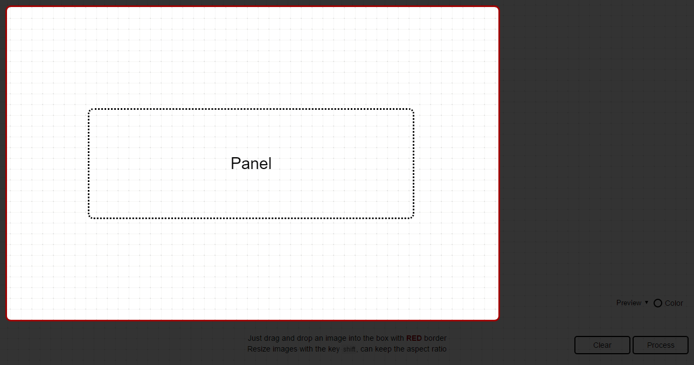
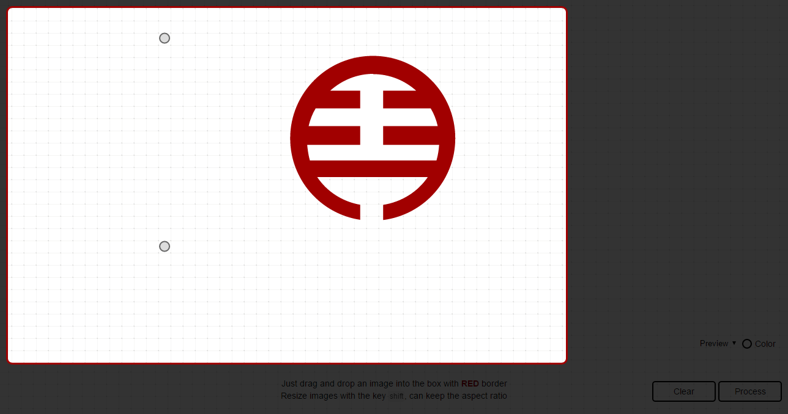

## Calibration parameters for drawing a SVG file [Back](./../SVG.md)

Here what I wrote is all about recording the calculation of the calibration parameters when drawing a SVG file. Before that, you're supposed to know [how to draw](./../../canvas/drawing_a_svg/drawing_a_svg.md) a SVG file with canvas in JavaScript.

### Why need calibration parameters?

In the last step of drawing, we will find that there exists a problem. As shown below, there is a canvas area, which I call **a panel**.

When I drop a SVG file into this panel, and start to draw it,

I find that only data of points is not enough, because the data should always depend on some attributes of a SVG element, including `width`, `height`, and `viewBox`. Besides, what if I can drag and resize this SVG like below:

As I change the size of this SVG, data of points in paths won't change at the same time. What that means is that what I have drawn should be always in the same position.

Attributes like `width`, `height`, and `viewBox` will also affect data of points.