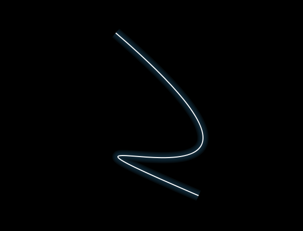

## Animated Glowing Line Drawing [Back](./../canvas.md)

Before what we talk, we can see a screen shot of it:



A few random parameters are first set up to determine the color of the line, as well as it's start and end points, and the control points, then a window interval just calls a function which draws a series of lines in decreasing thicknesses in the highlight color, followed by one thin white line on top.

```html
<canvas id="glow" width="600" height="400">
    Your browser does not support HTML5 Canvas.
</canvas>
```

```js
/**
 * update the position and direction of movement for an end point on the line or one of the control points
 */
function get_bounce_coord(coord_array) {
	coord_array[0] += step * coord_array[1];

	if( (coord_array[0] > (canv.height - 2 * step) && coord_array[2] === 'y')
	    || (coord_array[0] > (canv.width - 2 * step) && coord_array[2] === 'x')
		|| coord_array[0] < 2 * step)	{
		coord_array[1] *= -1;
	}
}

function draw_line() {
	/** paint over the existing canvas */
	context.fillStyle = '#000';
	context.fillRect(0, 0, canv.width, canv.height);

	/** get the new coords based on each ones current trajectory */
	get_bounce_coord(x1);
	get_bounce_coord(y1);
	get_bounce_coord(x2);
	get_bounce_coord(y2);

	get_bounce_coord(cx1);
	get_bounce_coord(cy1);
	get_bounce_coord(cx2);
	get_bounce_coord(cy2);

	for (i = 5; i >= 0; i--) {
		context.beginPath();

		/** draw each line, the last line in each is always white */
		context.lineWidth = (i + 1) * 4 - 2;

		if (i === 0) {
			context.strokeStyle = '#fff';
		} else {
			context.strokeStyle = 'rgba(' + highlight[0] + ',' + highlight[1] + ',' + highlight[2] + ',0.2)';
		}

		context.moveTo(x1[0], y1[0]);
		context.bezierCurveTo(cx1[0],cy1[0],cx2[0],cy2[0],x2[0],y2[0]);
		context.stroke();
		context.closePath();
	}
}

/**
 * get a random x or y coordinate
 */
function random_coord(type) {
	dimension = (type === 'x') ? canv.width : canv.height;
	return Math.random() * (dimension - 2 * step) + step;
}

(function() {
    canv = document.getElementById('glow');

    if (!canv || !canv.getContext) {
        return;
    }

    context = canv.getContext('2d');

    /** the glow color */
    highlight = new Array(Math.round(Math.random() * 255), Math.round(Math.random() * 255), Math.round(Math.random() * 255));
	step = 7;   /** amount each movement of coord is in canvas pixels */

	/** start and end coordinates for the line */
	x1 = new Array(random_coord('x'), -1, 'x');
	y1 = new Array(random_coord('y'), 1, 'y');
	x2 = new Array(random_coord('x'), -1.5, 'x');
	y2 = new Array(random_coord('y'), -1.5, 'y');

	/** coordinates for the control points of the bezier curve */
	cx1 = new Array(random_coord('x'), 1, 'x');
	cy1 = new Array(random_coord('y'), -1, 'y');
	cx2 = new Array(random_coord('x'), -1, 'x');
	cy2 = new Array(random_coord('y'), 1, 'y');

	timer = window.setInterval(draw_line, 30);
})();
```

<p>
<p data-height="300" data-theme-id="21735" data-slug-hash="NRxJQE" data-default-tab="js,result" data-user="aleen42" data-embed-version="2" data-pen-title="NRxJQE" class="codepen">See the Pen <a href="http://codepen.io/aleen42/pen/NRxJQE/">NRxJQE</a> by aleen42 (<a href="http://codepen.io/aleen42">@aleen42</a>) on <a href="http://codepen.io">CodePen</a>.</p>
<script async src="https://production-assets.codepen.io/assets/embed/ei.js"></script>
</p>

After that, there was an attempt at creating a simple animated drawing of a basic line art shape with the same glowing line technique.


Because I wanted to be able to see the shape being drawn it had to be as a series of steps which could be broken down into manageable chunks. I also wanted the code to be flexible enough that I could change the shape it was drawing whenever I liked, without having to code up a complex series of steps each time. These two requirements got me thinking about the shorthand notation of a path used in SVG which uses single letters followed by one or more pairs of coordinates to draw lines and curves.

```nginx
M 161.70443,272.07413
C 148.01517,240.84549 134.3259,209.61686 120.63664,178.38822
C 132.07442,172.84968 139.59482,171.3636 151.84309,171.76866
```

That's basically a `moveTo` command followed by two `curveTo` commands.

As it turned out, that wasn't too difficult, and this is the result of that parser:

```js
var currentPoint = 0;
var nextPoint = 0;
var highlight = new Array(0, 0, 255);
var path = 'M 161.70443,272.07413 C 148.01517,240.84549 134.3259,209.61686 120.63664,178.38822 C 132.07442,172.84968 139.59482,171.3636 151.84309,171.76866';

function animateDrawing() {
    var points = path.split(' ');
	var drawPart = {
	    type: 'm',
	    buffer: new Array()
    };

    i = nextPoint;

    if (i >= points.length) {
        return false;
    } else {
        setTimeout(animateDrawing), 30);
    }

    for (i = currentPoint; i <= nextPoint; i += 2) {
        drawPart.type = points[i].toLowerCase();
        drawPart.buffer.length = 0;

        if (i >= 2) {
            drawPart.buffer.push(points[i - 1].split(','));
        } else {
            drawPart.buffer.push(new Array(0, 0));
        }

        /**
         * i should be incremented by the number of coordinate pairs it has beyond the first
		 * for example, a bezier curve has 3 pairs of coordinates; the two control points &
		 * the end, so it's extra increment is 2 (as i pair of coordinates is always assumed)
		 * also here, m does nothing, so we ignore i
		 */
		 switch(drawPart.type) {
		 case 'c':
		    /** curveTo */
		    drawPart.buffer.push(points[i + 1].split(','));
		    drawPart.buffer.push(points[i + 2].split(','));
		    drawPart.buffer.push(points[i + 3].split(','));

		    i += 2;
		    currentPoint = i;
		    break;
        case 'l':
            /** lineTo */
            drawPart.buffer.push(points[i + 1].split(','));
            currentPoint = i;
            break;
        case 's':
        case 'q':
            /** smooth curveTo */
            drawPart.buffer.push(points[i + 1].split(','));
            drawPart.buffer.push(points[i + 2].split(','));

            i += 1;
            current_point = i;
            break;
        default:
            break;
        }

		drawOutput(drawPart);
    }

    nextPoint = i;
}
```

This processes the string (copied straight out of the SVG source for a curved line) and uses a timeout to draw it a bit at a time. First, the string is broken into instructions based on the space character. The code then checks the current point (which should be a letter as the path should start with a `moveTo` command), reads ahead the right number of coordinate pairs for that instruction, and then increments the `nextPoint` variable so that it doesn't attempt to redraw parts of the image it has drawn already.

The actual drawing is handled with this function, which uses the canvas context we defined above and draws out the line that is stored in the `buffer` array:

```js
function drawOutput(drawObj) {
    for (j = 5; j >= 0; j--) {
        context.beginPath();
		context.lineCap = 'butt';
		context.lineWidth = (j + 1) * 4 + 10;

		/** stroke the last line as solid white to get the glow effect */
		if (j === 0) {
		    context.strokeStyle = '#fff';
		    context.lineWidth = 2;
		} else {
		    context.strokeStyle = 'rgba(' + highlight[0] + ',' + highlight[1] + ',' + highlight[2] + ',0.1)';
		}

		context.moveTo(drawObj.buffer[0][0], drawObj.buffer[0][1]);

		switch(drawObj.type) {
		case 'c':
		    context.bezierCurveTo(drawObj.buffer[1][0], drawObj.buffer[1][1],  drawObj.buffer[2][0], drawObj.buffer[2][1], drawObj.buffer[3][0], drawObj.buffer[3][1]);
		    break;
		case 'l':
		    context.lineTo(drawObj.buffer[1][0], drawObj.buffer[1][1]);
		    break;
        case 's':
        case 'q':
            context.quadraticCurveTo(drawObj.buffer[1][0], drawObj.buffer[1][1],  drawObj.buffer[2][0], drawObj.buffer[2][1]);
            break;
        default:
            break;
        }

        context.stroke();
        context.closePath();
    }
}
```

Then run:

```js
(function () {
    canv = document.getElementById("glow");

	if (!canv || !canv.getContext) {
		return;
	}

	context = canv.getContext("2d");

	context.fillStyle = "#000";
	context.fillRect(0, 0, canv.width, canv.height);

	animateDrawing()
})();
```

<p>
<p data-height="952" data-theme-id="21735" data-slug-hash="jrWRoW" data-default-tab="js,result" data-user="aleen42" data-embed-version="2" data-pen-title="jrWRoW" class="codepen">See the Pen <a href="http://codepen.io/aleen42/pen/jrWRoW/">jrWRoW</a> by aleen42 (<a href="http://codepen.io/aleen42">@aleen42</a>) on <a href="http://codepen.io">CodePen</a>.</p>
<script async src="https://production-assets.codepen.io/assets/embed/ei.js"></script>
</p>
