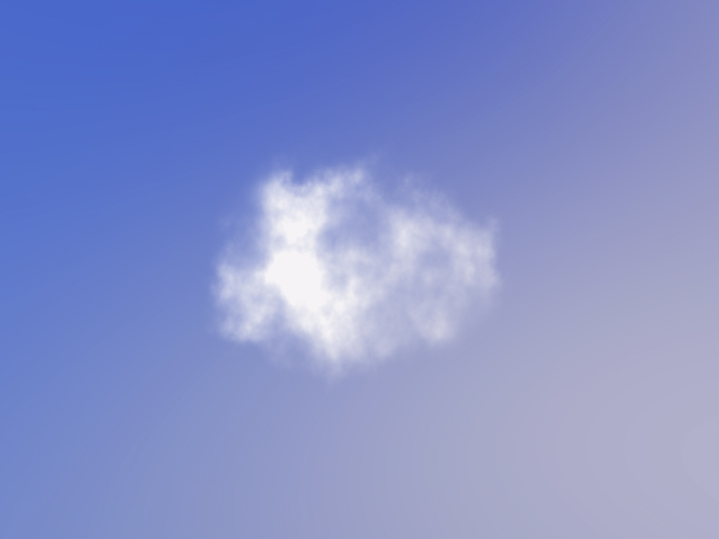
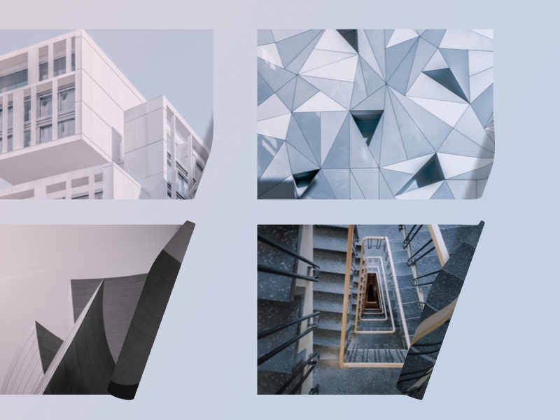
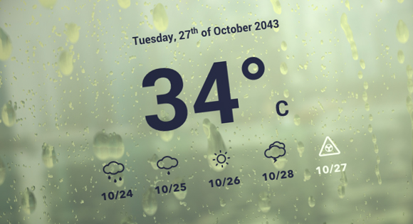
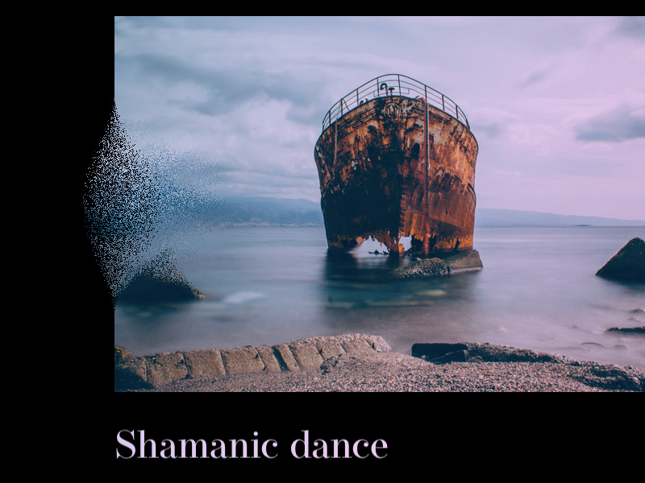
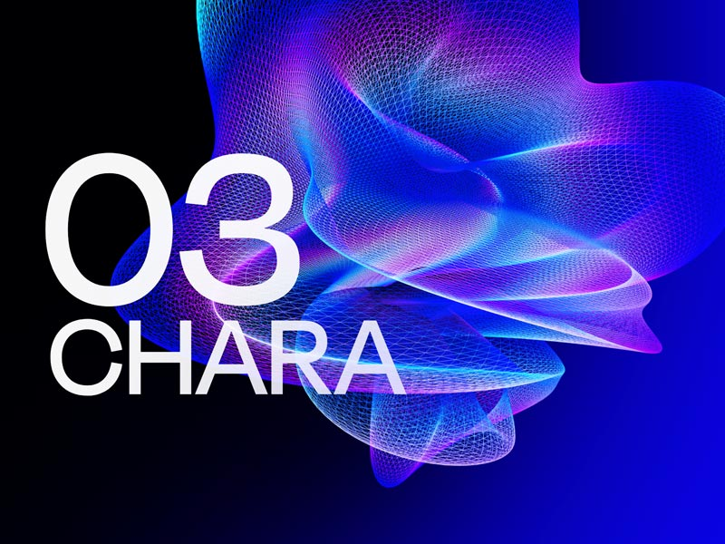

## GLSL [Back](./../webgl.md)

**GLSL**, a.k.a OpenGL Shading Language, is a high-level shading (著色) language based on the syntax of the C programming language. It was created to give developers more direct controls of the graphics pipeline without having to use ARB assembly language or hardware-specific languages.

GLSL shaders are not stand-alone applications, because they require an application that utilizes the OpenGL APIs, which is available on many different platforms (e.g., GNU/Linux, Mac OS X, Windows).

In this document, I will note that how to use it in JavaScript.

### Utils

Before using this language, we should set up some utils to use before:

- [**webgl.js**](./webgl_js/webgl_js.md)
- [**gl-obj.js**](./gl_obj_js/gl_obj_js.md)

### Basics

I hope to learn GLSL via "[**\[O`Reilly\] GLSL Essentials**](https://www.oreilly.com/library/view/glsl-essentials/9781849698009/)", and make some notes here:

- [**The Graphics Rendering Pipeline**](./graphic_rendering_pipeline/graphic_rendering_pipeline.md)
- [**GLSL Basics**](./glsl_basics/glsl_basics.md)
- [**Vertex Shaders**](./vertex_shaders/vertex_shaders.md)

### Advanced

A series of creative examples implemented with GLSL:

<table>
  <tbody>
     <tr>
       <td><a href="https://github.com/dghez/THREEJS_Procedural-clouds" target="_blank"><b>Procedural Clouds Extending Three.js' Sprite</b></a></td>
       <td><a href="https://github.com/akella/UnrollingImages" target="_blank"><b>Image Unroll Effects with Three.js</b></a></td>
     </tr>
     <tr>
       <td></td>
       <td></td>
     </tr>
     <tr>
       <td><a href="https://github.com/lbebber/HeatDistortionEffect" target="_blank"><b>Animated Heat Distortion Effects with WebGL</b></a></td>
       <td><a href="https://github.com/codrops/RainEffect" target="_blank"><b>Rain & Water Effect Experiments</b></a></td>
     </tr>
     <tr>
       <td></td>
       <td></td>
     </tr>
     <tr>
       <td><a href="https://github.com/akella/webgl-mouseover-effects" target="_blank"><b>Interactive Hover Effects with Three.js</b></a></td>
       <td><a href="https://github.com/SardineFish/raindrop-fx" target="_blank"><b>Raindrop FX</b></a> (inspired by the "<a href="https://github.com/codrops/RainEffect" target="_blank">Rain & Water Effect Experiments</a>")</td>
     </tr>
     <tr>
       <td></td>
       <td></td>
     </tr>
     <tr>
       <td><a href="https://github.com/Faboolea/shaders-on-scroll" target="_blank"><b>Rock the Stage with a Smooth WebGL Shader Transformation on Scroll</b></a></td>
     </tr>
     <tr>
       <td></td>
     </tr>
  </tbody>
</table>
