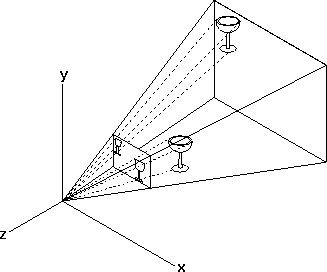
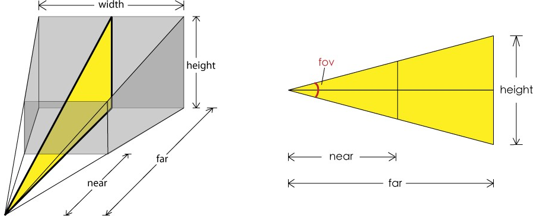

## Camera [Back](./../three.md)

There are two kinds of cameras: **perspective projection(透視投影)** and **rectangular projection(正交投影)**.

### Perspective projection



Perspective projection is usually used in applications, which is similar to eyes of human.

Constructor of creating a perspective camera:

```js
THREE.PerspectiveCamera(fov, aspect, near, far);
```

