## WebGL [Back](./../JavaScript.md)

**WebGL** is a computer vision technology used for rendering 3D or 2D graph with JavaScript, which is cross-platform.

### 2D

- [**Canvas**](./canvas/canvas.md)
- [**SVG**](./SVG/SVG.md)

### 3D

- [**three.js**](./three/three.md)

### Advanced

- [**GLSL**](./glsl/glsl.md)

A series of [creative examples](https://github.com/aleen42?q=weather&tab=stars&q=weather&q=effect) implemented with WebGL:

<table>
  <tbody>
     <tr>
       <td><a href="https://github.com/codrops/ParticleEffectsButtons" target="_blank"><b>Particle Effects for Buttons</b></a></td>
       <td><a href="https://github.com/codrops/DistortedButtonEffects" target="_blank"><b>Distorted Button Effects</b></a></td>
     </tr>
     <tr>
       <td></td>
       <td><a href="http://tympanus.net/Development/DistortedButtonEffects/" target="_blank">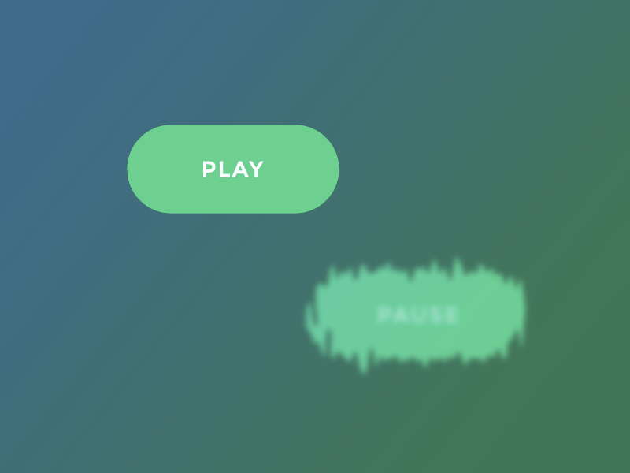</a></td>
     </tr>
     <tr>
       <td><a href="https://github.com/robin-dela/hover-effect" target="_blank"><b>WebGL Distortion Hover Effects</b></a></td>
       <td><a href="https://github.com/codrops/CSSGlitchEffect" target="_blank"><b>CSS Glitch Effect</b></a></td>
     </tr>
     <tr>
       <td><a href="https://tympanus.net/Development/DistortionHoverEffect/" target="_blank">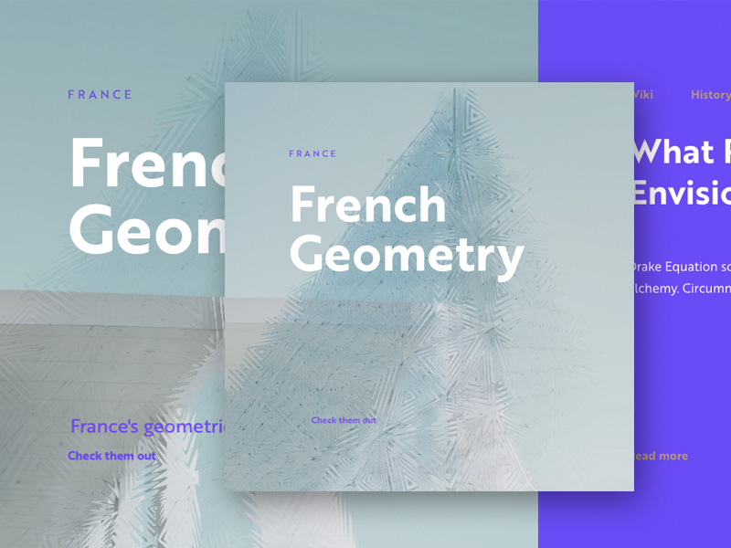</a></td>
       <td><a href="https://tympanus.net/Tutorials/CSSGlitchEffect/" target="_blank">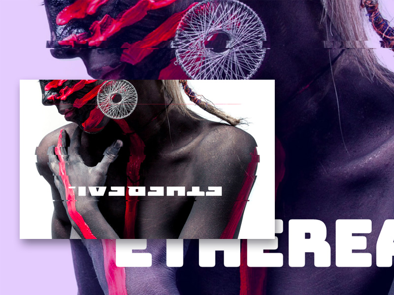</a></td>
     </tr>
     <tr>
       <td><a href="https://github.com/Mamboleoo/InfiniteTubes" target="_blank"><b>Infinite Tubes</b></a></td>
       <td><a href="https://github.com/codrops/CreativeGooeyEffects" target="_blank"><b>Creative Gooey Effects</b></a></td>
     </tr>
     <tr>
       <td><a href="https://tympanus.net/Development/InfiniteTubes/" target="_blank">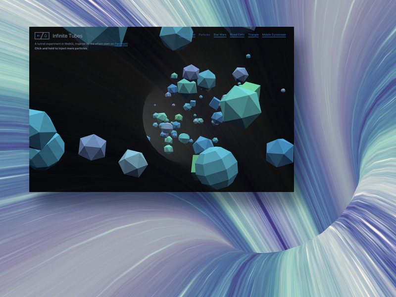</a></td>
       <td><a href="http://tympanus.net/Development/CreativeGooeyEffects/" target="_blank">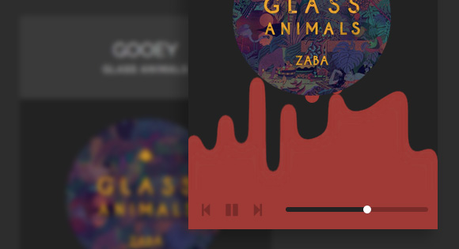</a></td>
     </tr>
     <tr>
       <td><a href="https://github.com/codrops/ImageGridEffects" target="_blank"><b>Image Grid Effects</b></a></td>
       <td><a href="https://github.com/Anemolo/StickyImageEffect" target="_blank"><b>How to Create a Sticky Image Effect with Three.js</b></a></td>
     </tr>
     <tr>
       <td><a href="http://tympanus.net/Development/ImageGridEffects/" target="_blank">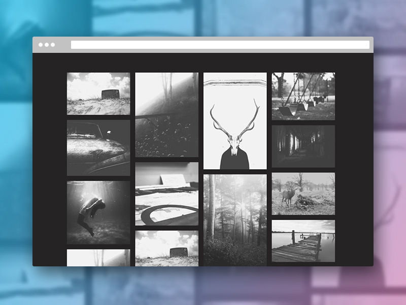</a></td>
       <td></td>
     </tr>
     <tr>
       <td><a href="https://github.com/codrops/GooeyTextHoverEffect" target="_blank"><b>Gooey Text Hover Effect</b></a></td>
       <td><a href="https://github.com/ektogamat/webgi-jewelry" target="_blank"><b>WEBGi Jewelry</b></a></td>
     </tr>
     <tr>
       <td><a href="http://tympanus.net/Development/GooeyTextHover/" target="_blank">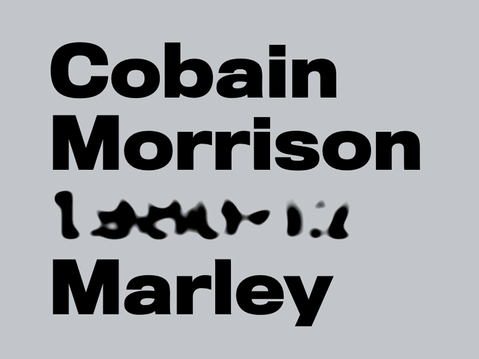</a></td>
       <td></td>
     </tr>
     <tr>
       <td><b>Glowing Marbles</b></td>
       <td><b>140. chakra</b></td>
     </tr>
     <tr>
       <td><a href="https://codepen.io/krautgti/full/vYReorP" target="_blank">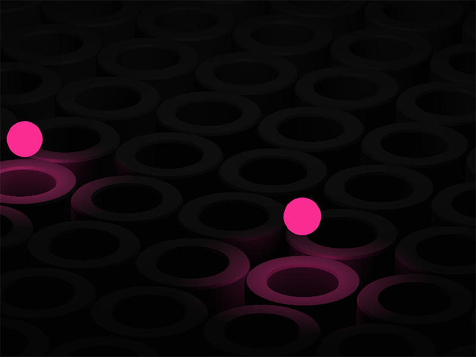</a></td>
       <td><a href="https://codepen.io/ycw/full/QWQVaRb" target="_blank">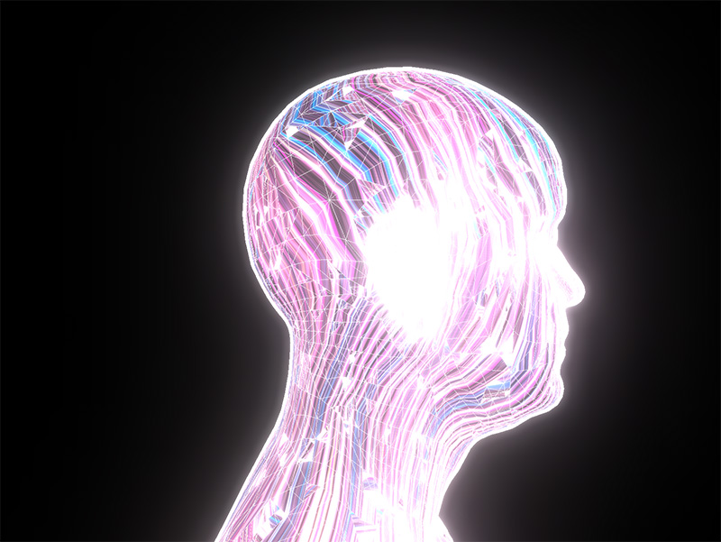</a></td>
     </tr>
     <tr>
       <td><b>Terrain Warp</b></td>
       <td><b>spellcaster</b></td>
     </tr>
     <tr>
       <td><a href="https://terrain-warp.vercel.app/" target="_blank">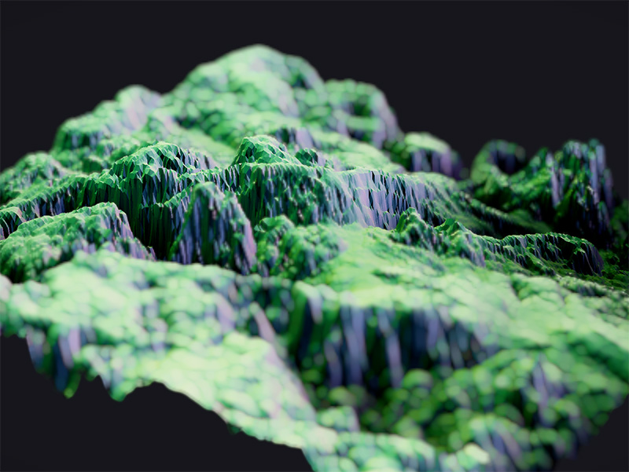</a></td>
       <td><a href="https://adinunz.io/spellcaster/" target="_blank">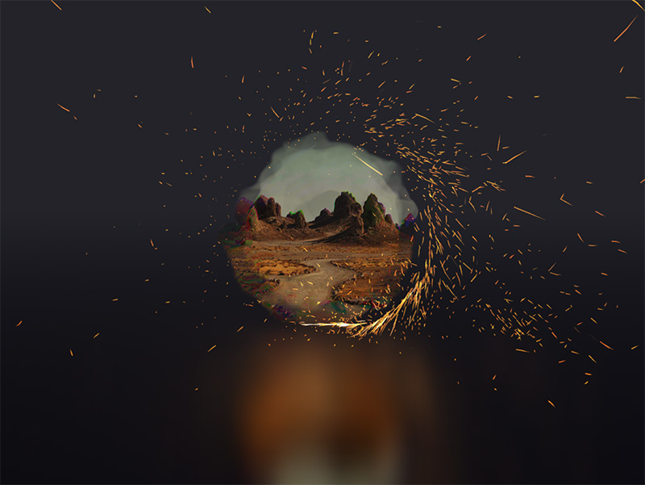</a></td>
     </tr>
     <tr>
       <td><a href="https://github.com/Aqro/gooey-hover-codrops" target="_blank"><b>Gooey Hover Effects</b></a></td>
     </tr>
     <tr>
       <td><a href="http://tympanus.net/Tutorials/GooeyImageHoverEffects/" target="_blank">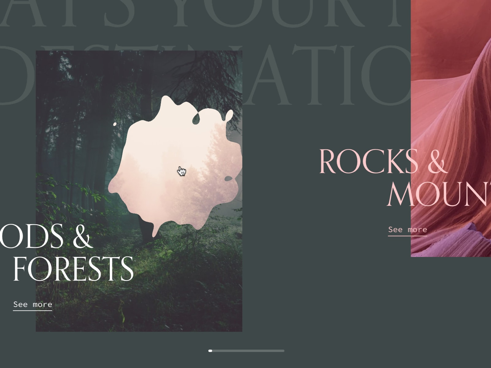</a></td>
     </tr>
  </tbody>
</table>
