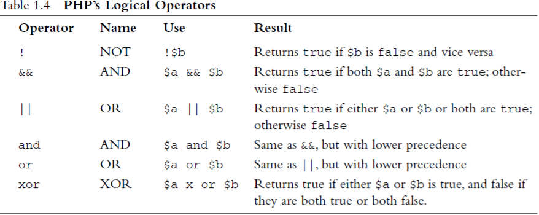
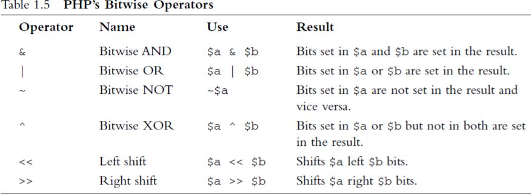
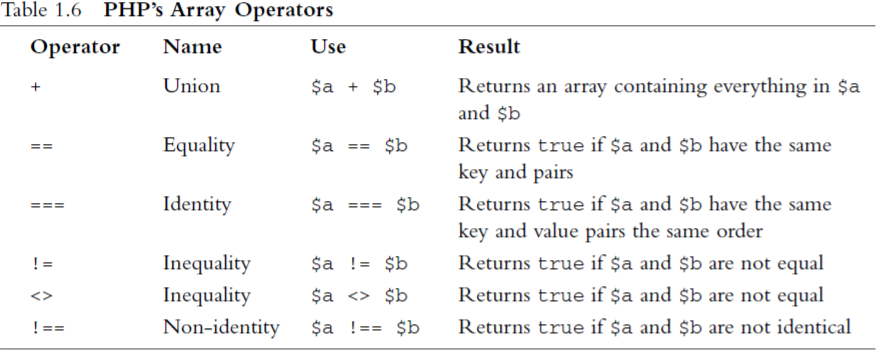

## Crash Course of PHP [Back](./../PHP.md)

### 1. Embedding PHP in HTML

- PHP tags: 
	- **XML** Style: ```<?php echo '<p>Order processed.</p>'; ?>```
	- **Short** Style: ```<? echo '<p>Order processed.</p>'; ?>```
	- **SCRIPT** Style: ```<script language='php'> echo '<p>Order processed.</p>'; </script>```
	- **ASP** Style: ```<% echo '<p>Order processed.</p>'; %>```

```html
<html>
<head>
	<title>Bob's Auto Parts - Order Results</title>
</head>

<body>
	<h1>Bob's Auto Parts</h1>
```

```php
	<?php
		echo '<p>Order processed.</p>';
	?>
```

```html
</body>
</html>
```

### 2. PHP Statements
##### 2.1 Whitespace

```php
<?php echo 'hello     ' . 'world' ?>
<?php echo 'hello ' . 'world' ?>
```

##### 2.2 Comments

```php
<?php 
	echo ‘<p>Order processed.</p>'; // Start printing order
?>
<?php 
	echo ‘<p>Order processed.</p>'; # Start printing order
?>
<?php 
	echo ‘<p>Order processed.</p>'; /* Start printing order */
?>
```

##### 2.3 Function

```php
<?php
	data('H:i, jS F');	// 'H' for 24-hour format with leading zeros
				// 'i' for minutes	with leading zeros
				// 'j' for the day of the month without a leadig zero
				// 'S' for the ordinal suffix(like 'th')
				// 'F' for the full name of month
?>
```

##### 2.4 Variables

- **short style**: requires the **register_globals** configuration setting be turned on with the reson of security issue.(off by default)
- **medium style**: solve the security issue.(**recommended**)
	- **$_POST**: the form was submitted via the *POST* method.
	- **$_GET**: the form was submitted via *GET* method.
	- **$_REQUEST**: th for was submitted via either *POST* or *GET* method.
- **long style**: used on **old** server.

```php
$var				// short style
$_POST['var']			// medium style
$HTTP_POST_VARS['var']		// long style
```
```php
<?php
// create short variable names
$tireqty = $_POST['tireqty'];
$oilqty = $_POST['oilqty'];
$sparkqty = $_POST['sparkqty'];
?>
```

##### 2.5 String Concatenation(字符串連接)

- A period(**.**) is the string concatenation operator, which adds astrings together.

```php
echo('Hello' . ' world');
```

### 3. Variable Types

##### 3.1 Data Type

- Integer
- Float
- String
- Boolean
- Array
- Object
- NULL: variables that have not been given a value.
- resources: represents external resources (such as database connections)

##### 3.2 Type Strength

- PHP is called **weakly** typed, or **dynamically** typed language.

##### 3.3 Variable Variables

- To enable you to change the name of a variable dynamically.

```php
$varname = 'tireqty';
$$varname = 5;
// equivalent to $tireqty = 5;
```

### 4. Declaring and Using Constants

```php
define('TIREPRICE', 100);
define('OILPRICE', 10);
```

- ```phpinfo()``` provides a list of PHP's predefined variables and constants, among other useful information.

### 5. Variable Scope

- 6 basic scope rules in PHP:
	- Built-in superglobal variables are visible everywhere within a script.
	- Constants, once declared, are always visible globally; that is, they can be used inside and outside functions.
	- Global variables declared in a script are visible throughout that script, but not inside functions.
	- Variables inside functions that are declared as global refer to the global variables of the same name.
	- Variables created inside functions and declared as static are invisible from outside the function but keep their value between one execution of the function and the next.
	- Variables created inside functions are local to the function and cease(停止) to exist when the function terminates.
- Some special arrays with their own rules:
	- $GLOBALS:  An array of all global variables.
	- $_SERVER: An array of server environment variables.
	- $_GET: An array of variables passed to the script via the *GET* method.
	- $_POST: An array of variables passed to the scriptvia the *POST* method.
	- $_COOKIE: An array of cookie variables
	- $_FILES: An array of variables related to file uploads.
	- $_ENV: An array of environment variables.
	- $_REQUEST: An array of all user input including the contents of input including $_GET, $_POST, and $_COOKIE but **not** $_FILES.
	- $_SESSION: An array of session(一段時間) variables.

### 6. Some Operators

##### 6.1 Reference Operator

```php
$a = 5;
$b = $a;
$a = 7;		// $b is stll 5
```

```php
$a = 5;
$b = &$a;
$a = 7;		// $b and $a are both 7
```

##### 6.2 Comparison Operators

```php
0 == 0;		// 0 == 0 will be true
0 === 0;	// 0 === 0 will be not because one can be an integer, and the other can be a string
```

##### 6.3 Logical Operators



##### 6.4 Bitwise Operators



##### 6.5 Array Operators



##### 6.6 The Error Suppression Operator

- The error suppression operator (**@**) can be used in front of any expression to suppress(抑制) errors. (Those errors should be handled by error handling code)
- Error message can be stored in the global variable *$php_errormsg* when *track_errors* feature enabled in *php.ini*.

##### 6.7 The Execution Operator

- a pair of backticks (**``**) is used to include executing commands.

```php
$out = `ls -la`;
echo '<pre>' . $out . '</pre>';
```

##### 6.8 Type Operators

```php
class sampleClass{};
$myObject = new sampleClass();
if($myObject istanceof sampleClass)
	echo("myObject is an instance of sampleClass");
```

### 7. Variable Functions

```php
$a = 56;
echo(gettype($a) . '<br />');
settype($a, 'double');
echo(gettype($a) . '<br />');
```
