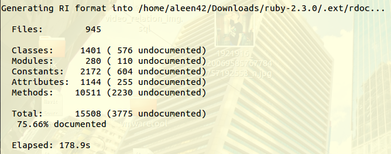

## Installation [Back](./../ruby.md)

#### Ubuntu Installation

i. To see whether you have installed before:

```sh
ruby
```

ii. Install by apt-get when it notify to install:

```sh
sudo apt-get install ruby
```

- *Notice: you should upgrade when its version is older than the latest stable version.*

iii. Downloads latest stable version:

- **Ruby** [downloads](https://www.ruby-lang.org/en/downloads/)
- Use `tar -zxvf` to uncompress the package.
- Configure your installation by typing  `./configure --prefix=$HOME`). Next type `make`, which will build your Ruby interpreter. This might take a few minutes. After that is done, type  `make install` to install it.
- *Notice: it takes some time to complete make process.*



#### Windows Installation

- To download [**Ruby**](https://www.ruby-lang.org/en/downloads/). 

<a href="http://aleen42.github.io/" target="_blank" ></a>