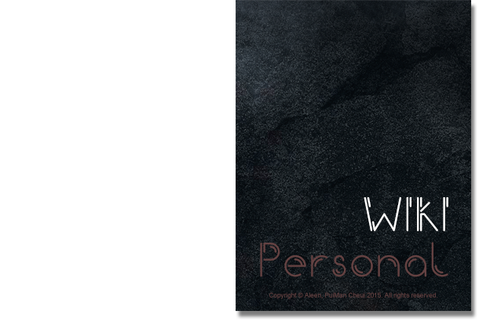

## About

> Why should I memorize something I can so easily get from **BOOK**.    - Albert Einstein

In fact, Einstein claimed never to memorize anything which could be looked up in less than **two minutes**. Therefore, that book is your **NOTE** of your life. In order to organize all the knowledge I have learned, I wrote this note for me to revise all the knowledge.

      

## Start Reading

- Read on [**GitHub Site**](https://github.com/aleen42/personalwiki)
- Downloads (eBook has not been not supported yet):
    - ~~**PDF**~~
    - ~~**ePub**~~
    - ~~**mobi**~~

### Coder

* [**Programming Language**](./Programming/ProgrammingMenu.md)
* [**Algorithm**](./Algorithmn/AlgorithmnMenu.md)
* [**Thought**](./Thought/ThoughtMenu.md)
* [**Database**](./Database/Database.md)
* [**Network**](./Network/Network.md)
* [**OS**](./OS/OS.md)
* [**Embedded System**](./Embedded_System/Embedded_System.md)
* [**Software Architecture**](./Architecture/Architecture.md)
* [**Project Management**](./projectManagement/projectManagement.md)
* [**Multimedia**](./Multimedia/Multimedia.md)
* [**Git**](./git/git.md)
* [**Video & Image**](./vi/vi.md)

### Designer

* [**Creativity**](./Creativity/Creativity.md)
* [**WeByDo**](http://www.webydo.com/)
* [**Falcoon**](./falcoon/falcoon.md)

### Posts

* [**Posts**](./post/post.md)

### Questions & Answer

* [**Q&A**](./qa/qa.md)

### Idols
* [**Sara Soueidan**](http://sarasoueidan.com/)
* [**Chris Gannon**](http://blog.gannon.tv/)
* [**原デザインKenya Hara**, **原研哉**](http://www.ndc.co.jp/hara/en/)

### Books
- Coder
    - [**Antirez's news**](./antirez/antirez.md)
    - [**Gates Notes**](http://www.gatesnotes.com/books)
 	- [**Front-End**](./frontend/frontend.md)
- Designer
    - [**Kenya Hara**](./kenyahara/kenyahara.md)

### Translation

- [**Translation Works**](./translation/translation.md)

### Job

- [**Summary**](./summary/summary.md)

