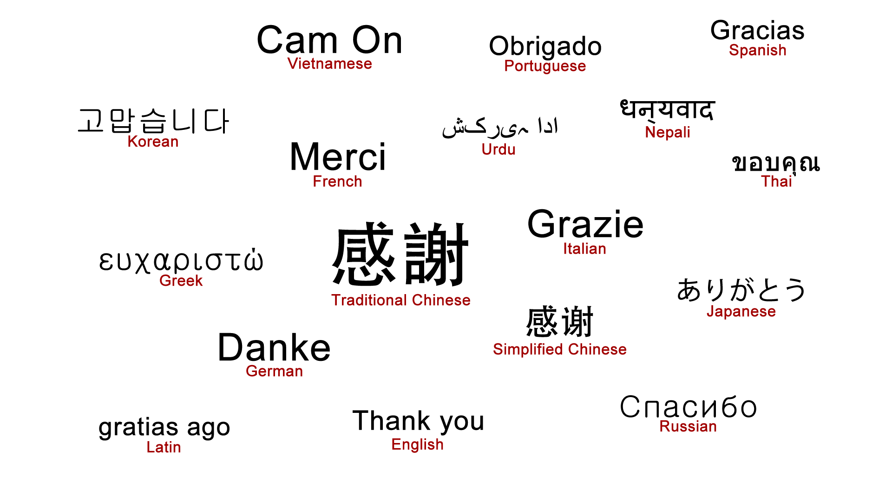

## About

- **Einstein** has said that "Why should I memorize somthing I can so easily get from **BOOK**". In fact, Einstein claimed never to memorize anything which could be looked up in less than **two minutes**. Therefore, that book is your **NOTE** of your life. In order to organize all the knowledges I have learnt, I wrote this note for me to revise all the knowledges.

## Start Reading
### Coder
 * [**Programming Language**](./Programming/Programming%20Menu.md)
 * [**Algorithmn**](./Algorithmn/Algorithmn%20Menu.md)
 * [**Thought**](./Thought/Thought%20Menu.md)
 * [**Database**](./Database/Database.md)
 * [**Network**](./Network/Network.md)
 * [**OS**](./OS/OS.md)
 * [**Embedded System**](./Embedded_System/Embedded_System.md)
 * [**Software Architecture**](./Architecture/Architecture.md)
 * [**Project Management**](./projectManagement/projectManagement.md)
 * [**Multimedia**](./Multimedia/Multimedia.md)
 * [**Git**](./git/git.md)
 * [**Video & Image**](./vi/vi.md)

### Designer
 * [**Creativity**](./Creativity/Creativity.md)
 * [**WeByDo**](http://www.webydo.com/)

### Idols
 * [**Sara Soueidan**](http://sarasoueidan.com/)
 * [**Chris Gannon**](http://blog.gannon.tv/)
 * [**原デザインKenya Hara**, **原研哉**](http://www.ndc.co.jp/hara/en/)

### Book

- Coder
	- [**Antirez's news**](./antirez/antirez.md)
 	- [**Gates Notes**](http://www.gatesnotes.com/books)
 	- [**Front-End**](./frontend/frontend.md)
- Designer
	- [**Kenya Hara**](./kenyahara/kenyahara.md)

### Job
- [**Summary**](./summary/summary.md)

## Supported
 * Thanks to [July](https://www.github.com/julycoding) for how to build a wiki.

## Thank you

## About me

