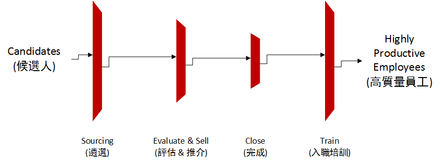

##Recruitment for start-up companies [Back](./../ThoughtMenu.md)

- 創業三大**技能** (3 must-have start-up skills)
	- 開發符合市場需求的好產品 (Build a Product that has great **Product/Market Fit**)
	- 建立銷售和營銷體系 (Build a **Sales & Marketing** Machine)
	- 招兵買馬 (Build a **Recruiting** Machine)
- 背景: 創業公司爆炸性增長, 導致人才需求供不應求.
- 特殊要求: 
	- 管理層的招聘: 聘請獵頭公司幫忙
	- 利用好招聘管理人員的資源: 包括設計管理團隊架構, 幫忙寫職位描述和能力要求, 計算合適薪酬等
	- 入職: 儘快帶領新招的員工進入工作狀態.

## 招聘過程 (三層過濾): 

### 1. 上游(遴選)
- 把目標放在並沒有在主動找工作的被動候選人(Passive Candidates).
- 公司內部安排一個全職的招聘人員, 才能徹底做好遴選的工作.
- CEO應當參與招聘過程.
- 花時間與現有的員工一起, 瞭解他們過往工作認識的人, 讓他們提供遴選的參考意見.
- 多從各大平臺找到合適的人才
	- 根據LinkedIn數據, 只有25%的勞動力在積極找工作, 而願意瞭解潛在機會的人多達85%.
- 樹立自己的品牌, 營造公司文化
	- 根據LinkedIn人才品牌指數顯示, 人才品牌強的公司招聘成本平均低43%, 招聘速度平均快20%.
- 提高應聘者的工作體驗.
- 清晰明確地描述工作崗位
	- <Who, The A Method for Hiring>
	- 建立內部考量表
		- 使命陳述, 對於工作內容的簡短總結
		- 完成特定的任務
		- 勝任職務所需要的能力

### 2. 中游(評估 & 推介)
- 評估候選人之餘, 需要推介自己的公司.
- 第一次交流應該把重點放在介紹公司以及為什麼他們應該考慮這份工作.
- 推介的同時需要收集反饋(FeedBack), 並整理交流的情況.
- 現代化招聘工具(Saas): Lever等, 效率往往比電子錶格要高.
	- Lever
		- CRM部分: 幫助研究和篩選候選人, 並培養與他們的關係.
		- 管理部分: 管理與候選人的交流情況
- 培養關係工作最好由**產品經理**負責, 並做到**個性化**. 如:
	- 時常通過Email介紹公司發展的重要里程碑
	- 不定期安排午餐會
	- 邀請參加公司活動
	- ...
- 評估環節融入三種不同類型的面試:
	- 1. 30到60分鐘的電話和視頻面試
	- 2. 按照時間順序瞭解候選人的職業歷史, 成功和失敗的案例以及他個人取得的成就. 重點在於挖掘候選人在過往崗位所完成的**工作細節**, 並找出與應聘崗位相關的**交集**. 而並非拋出一個問題, 讓候選人憑空給出解決方案.
	- 3. 由團隊成員進行面試, 考察候選人的某個能力點.
- 在招聘高層工作人員時, 應該更關注其**背景調查**. 調查的方法包括: 搜索候選人圈子, 讓候選人的前任Boss提供個人推薦.
- 強烈建議調查候選人過去做過的實際工作, 而不要聽信個人的觀點.
- 若要瞭解候選人的弱點, 可以讓他們說說和這崗位最優秀人才的差距, 並問問需要付出怎樣的努力才能做到Top one.
	
### 3. 下游(完成)
- 選擇一個晚餐機會, 理解候選人作出選擇的依據.
- 衡量自己公司與工資高的大公司或者股權高的小公司相比的優勢, 並把其告訴自己的員工.
- 聯合管理層人員舉辦歡迎晚宴, 以促使候選人如約辭職.
