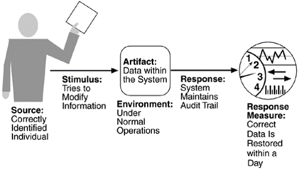

## Security	[Back](./../QA.md)
- Security(安全性)衡量一個系統抵抗非法使用的能力或該系統是否存在安全問題.
- Attack(攻擊): 指嘗試違反系統安全的行為.
- Nonrepudiation(不可否認性): 指一個事務不能被否認的性質
- Confidentiality(保密性): 指數據或服務不能被無驗證訪問的性質
- Integrity(完整性): 指數據或服務提交後不能被隨意修改的性質
- Assurance(保證性): 指事務被確保完成的性質
- Availability(可用性): 指系統可用的性質
- Auditing(審核): 指系統會追尋每一活動的性質

## Scenario

- example:

##Tatics(策略)

### 1. Resisting Attacks(防止攻擊)
- Authenticate users: 驗證用戶 (密碼, 一次性密碼)
- Authorize users: 授權用戶
- Maintain data confidentiality: 維持數據的保密性 (網銀使用https協議, 雙通道/雙因素驗證)
- Maintain integrity: 維持完整性 (MD5值)
- Limit exposure: 限制暴露 (關閉端口, 關閉服務, 關閉無線SSID等)
- Limit access: 限制訪問 (防火牆, MAC地址過濾)

### 2. Detecting Attacks(檢測攻擊)
- Intrusion Detection: 入侵檢測
	- Intrusion Detection System(IDS): traffic pattern

### 3. Recovering from Attacks(從攻擊中恢復)
- Restoring state: 修復狀態
- Attacker identification: 識別攻擊者的身份
	- audit trail = copy of transaction + identifying information
