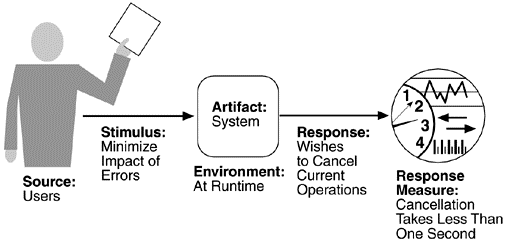
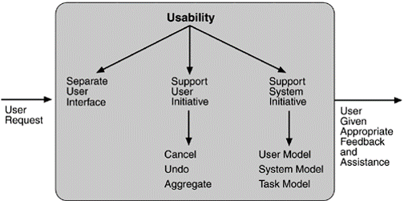

## Usability	[Back](./../QA.md)
- Usability(易用性)衡量的是一個系統其使用的容易程度(交互性).
- 注意與Availability(可用性)區分, 可用性是衡量一個系統其是否可用.
- 可以通過記錄用戶習慣來提高易用性.

##Scenarios(場景)

- example:

##Tatics(策略)

### 1. Support System Initiative(Runtime)
- Maintain a model of the user: 系統根據用戶度身定制 (調整滾輪速度)
- Maintain a model of the system: 系統本身提高可用性 (通過Loading來消除卡頓帶來的消極影響)
- Maintain a model of the task: 系統猜測用戶要完成的任務 (自動設置頭字母大寫)

### 2. Support User Initiative
- Cancel: 系統提供取消操作功能
- Undo: 系統提供撤銷操作功能
- Aggregate

### 3. Separate User Interface(Design-time)
- 業務邏輯與介面設計分開 (MVC)
