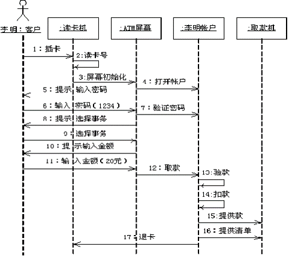

## Sequence Diagram(序列圖)	[Back](./../document.md)
- 序列圖反映了若干對象之間的動態協作關係(強調**時間和順序**).
- 每個對象都有一個時間軸, 稱作**生命週期**.
- 箭頭表示**一個對象調用另外一個對象的方法**.
- 描述多個對象在一個用例下的協作.
- [**State Diagram**](./../state/state.md): 描述一個對象在多個用例下的協作.
- [**Activity Diagram**](./../activity/activity.md): 描述跨越多個用例或線程的行為.
- example:

