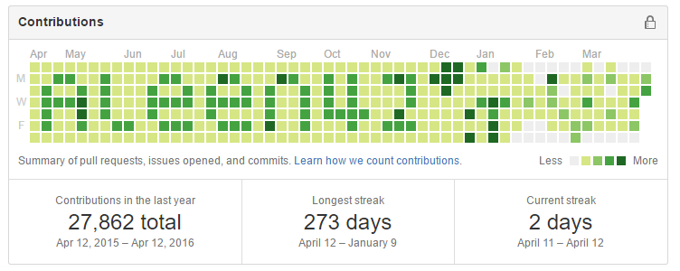

## Contributions
Whatever comments, bugs, enhancements or policy problems you want to contribute to one of my projects, just **open an issue** for me, and make my life easier.

#### Something to do before opening issues

- First of all, checkout the list and find whether anyone else has opened the same issue with yours. If so, just join and give out your words on those issue.

- It's important for you to add the platform and software information after figuring out bugs like **the version of OS, the version of Node** etc. Screen shots are what I wish to ask for, because I would like to see what you have seen before.

- It's suggested to wait for feedback before continuing to next steps. Nevertheless, if the issue is clear and the fix is simple, you can just fix it.

- Make a detailed description about your issue, and make me understood what you want to contribute for my projects.

#### Fixing issues

Fork this project in your account and create a branch with a standard naming convention:

&nbsp; &nbsp; &nbsp; &nbsp;**fix-#1-aleen42**

- **#1**: the issue number
- **aleen42**: the user name of your github

**PAY ATTENTION: ** write your code under my [guide style](https://aleen42.gitbooks.io/javascript/content/), and comment what you have written as much as possible.

#### Creating a pull request

After fix the issue, just open a pull request and reference the initial issue in the message you commit like **fixes #1**. Write down a understandable description and title to make me know what your pull request have done.

Again to notice that, if it makes sense, add screen shots for your fixes.

#### Waiting for feedback

Before accepting your contributions, I'll review what you have done, and keep contact with you after. Maybe sometimes I am too busy to review, so please wait for my feedback. I'll merge your contributions as once I am certain that there is no problems.

#### :laughing::laughing: There is one thing :laughing::laughing:

Don't care too much about the number of contributions, and it's just noise all along. Do you see the word **aleen42** in the following image?

