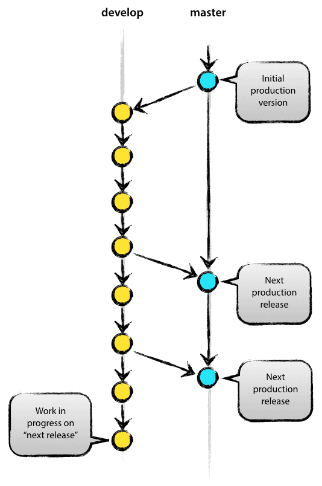

## A successful Git branching model	[Back](./../git.md)

- 
- By **Vincent Driessen**
- on Tuesday, January 05, 2010

- [**中文翻譯**](./../../translation/successful_git_branching/successful_git_branching.md)

In this post I present the development model that I've introduced for all of my projects (both at work and private) about a year ago, and which has turned out to be very successful. I've been meaning to write about it for a while now, but I've never really found the time to do so thoroughly, until now. I won't talk about any of the projects' details, merely about the branching strategy and release management.

It focuses around Git as the tool for the versioning of all of our source code. (By the way, if you're interested in Git, our company GitPrime provides some awesome realtime data analytics on software engineering performance.)

### Why git?

For a thorough discussion on the pros and cons of Git compared to centralized source code control systems, [see](http://whygitisbetterthanx.com/) the [web](http://git.or.cz/gitwiki/GitSvnComparsion). There are plenty of flame wars going on there. As a developer, I prefer Git above all other tools around today. Git really changed the way developers think of merging and branching. From the classic CVS/Subversion world I came from, merging/branching has always been considered a bit scary ("beware of merge conflicts, they bite you!") and something you only do every once in a while.

But with Git, these actions are extremely cheap and simple, and they are considered one of the core parts of your daily workflow, really. For example, in CVS/Subversion [books](http://svnbook.red-bean.com/), branching and merging is first discussed in the later chapters (for advanced users), while in [every](http://book.git-scm.com/) [Git](http://pragprog.com/titles/tsgit/pragmatic-version-control-using-git) [book](http://github.com/progit/progit), it’s already covered in chapter 3 (basics).

As a consequence of its simplicity and repetitive nature, branching and merging are no longer something to be afraid of. Version control tools are supposed to assist in branching/merging more than anything else.

Enough about the tools, let’s head onto the development model. The model that I’m going to present here is essentially no more than a set of procedures that every team member has to follow in order to come to a managed software development process.

### Decentralized but centralized 

The repository setup that we use and that works well with this branching model, is that with a central "truth" repo. Note that this repo is only considered to be the central one (since Git is a DVCS, there is no such thing as a central repo at a technical level). We will refer to this repo as **origin**, since this name is familiar to all Git users.

Each developer pulls and pushes to origin. But besides the centralized push-pull relationships, each developer may also pull changes from other peers to form sub teams. For example, this might be useful to work together with two or more developers on a big new feature, before pushing the work in progress to origin prematurely. In the figure above, there are subteams of Alice and Bob, Alice and David, and Clair and David.

Technically, this means nothing more than that Alice has defined a Git remote, named bob, pointing to Bob’s repository, and vice versa.

### The main branches

At the core, the development model is greatly inspired by existing models out there. The central repo holds two main branches with an infinite lifetime:

- **master**
- **develop**

The **master** branch at **origin** should be familiar to every Git user. Parallel to the master branch, another branch exists called **develop**.

We consider **origin/master** to be the main branch where the source code of **HEAD** always reflects a production-ready state.

We consider **origin/develop** to be the main branch where the source code of **HEAD** always reflects a state with the latest delivered development changes for the next release. Some would call this the “integration branch”. This is where any automatic nightly builds are built from.

When the source code in the **develop** branch reaches a stable point and is ready to be released, all of the changes should be merged back into **master** somehow and then tagged with a release number. How this is done in detail will be discussed further on.

Therefore, each time when changes are merged back into **master**, this is a new production release by definition. We tend to be very strict at this, so that theoretically, we could use a Git hook script to automatically build and roll-out our software to our production servers everytime there was a commit on **master**.

