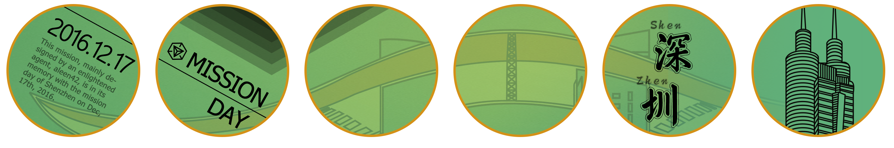
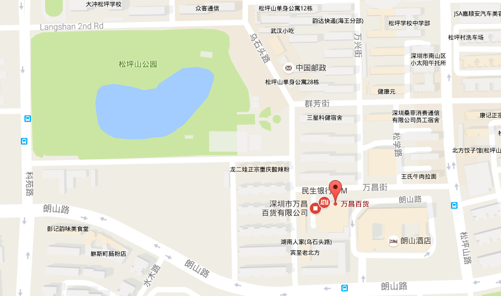
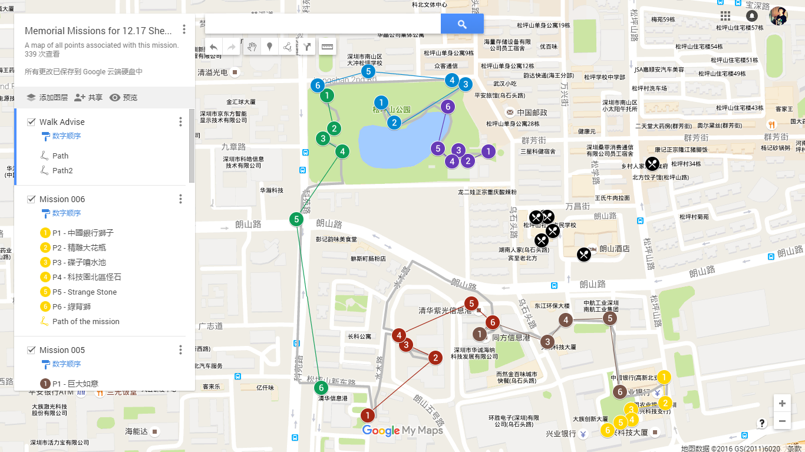
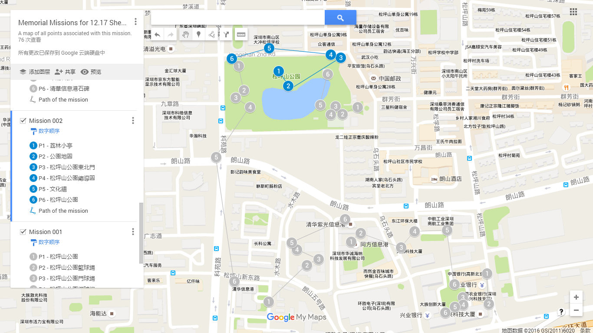
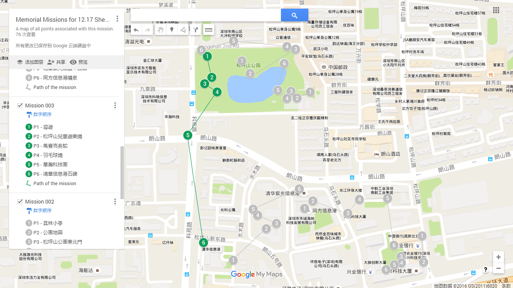
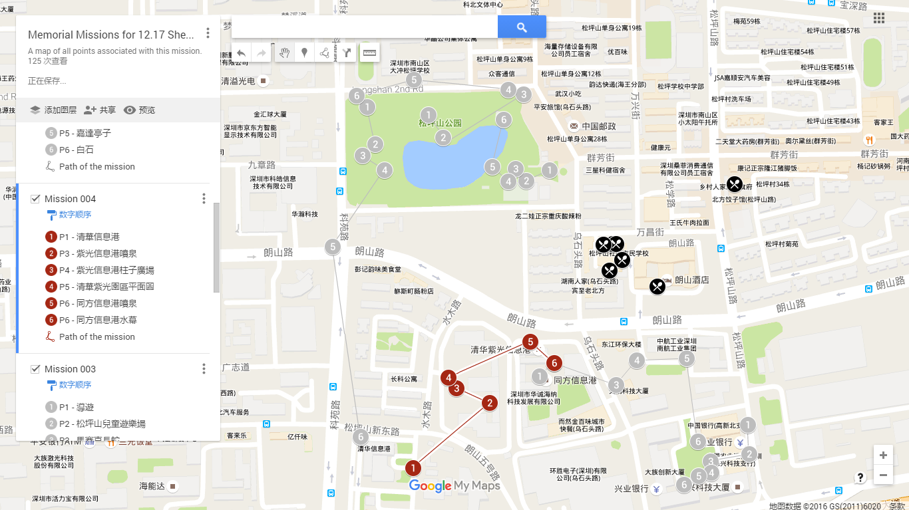
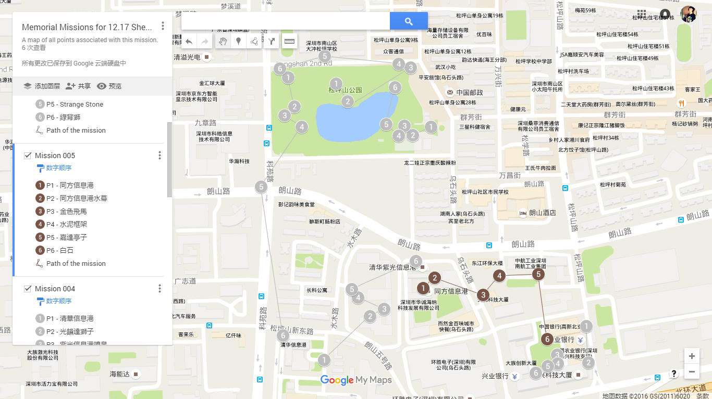
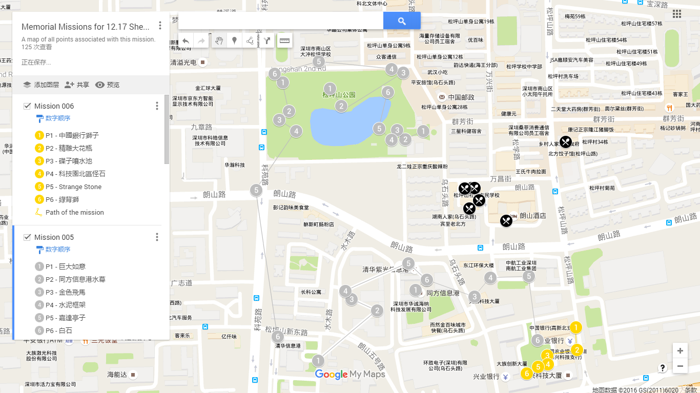

## [原創] Memorial Missions for 12.17 Shenzhen [Back](./../post.md)

 
 

  
  

  A <strong>memorial mission</strong> for 12.17 Shenzhen (<strong>Published</storng>)

 
 

  

### Description

昔為漁者之村，今為賈商之城。始於秦，且屬南海郡所轄。漢有“東官”於南頭所設，而晉有寶安立縣之始。其新安之名，乃明萬曆元年（1573年）所賜，寓有“革新鼎安，轉危為安”之意。此乃何地？深圳也，亦名鹏城。

Though it was a region of villages gathering sort of fishers yesterday, it has now become a modern city for business today. Date back to Qin dynasty, a county, named the Sounth China Sea Country, has already had jurisdiction over it. While in Han, ond kind of officeholders was set up at Nantou, which was called "Dung Gun (東官)". After that, the Baoan Country appeared during Jin dynasity right here. Nevertheless, where did the Xin'an Country arise? The answer is in the first year of Ming Wanli (1573). Actually, the name, Xin'an, also has a deep moral: Innovate to promote peace, while making any dangerous thing through. So, what is it exactly? That's Shenzhen, a.k.a the Peng City.

### Attentions

- 第三個任務中最後一個po可能需要走近300米, 若實在太累直接在華瀚科技公交站隨便上一部公交, 搭一站路即可
- 清華紫光同方信息港由於處於高樓之中, 因此可能會有飄的現象.

 

- The last portal in the third task will need you to walk around 300 meters, and if you're really tired with it, you can actually just find any bus to go to the next station of Huahan Science and Technology.
- Due to the high buildings of three info ports, your GPS info will occur phenomenons of non-accuracy.

### Area

全任務主要在深圳市南山區松坪山, 即科技園北區附近進行. 據非官方統計, 完成該組任務可能歷時約59分鐘36秒.

The whole task is mainly in the region of the Songpingshan, a.k.a the north of the Science and Technology Park, in Nanshan district, Shenzhen city, Guangdong province of China. According to a unofficial statistic, it may takes you around 59 minutes plus 36 seconds to complete.

任務所在地會經過有松坪山公園, 清華信息港, 同方信息港等, 意在讓各位體驗一下各信息港中, 深圳科技企業的辦公樓及附近環境. 除此之外, 任務區域附近還設置有多個拼圖任務可供大家完成. 若有朋友組團聚餐的話, 松坪山附近可推薦有添星碼頭, KFC 等. 具體位置可定位於萬昌百貨:

The mission will go through some places, like the Songpingshan Park, the Qinghua Info Port, the Tongfang info port, and etc. It aims to give any players an experience around different kinds of info ports, the technology companies in Shenzhen, and their environments for work. In addition, there're different kinds of missions to complete nearby the region, in which there're also some places recommended for parties, such as Hong Kong Tianxing Wharf Cantonese Teahouse, KFC, and so on. You can search it exactly by searching WangChang Department Store.

- [百度地圖](http://j.map.baidu.com/2qhkH)
- [谷歌地圖](https://goo.gl/maps/hPV6rJkenwK2)

 

- [Baidu Map](http://j.map.baidu.com/2qhkH)
- [Google Map](https://goo.gl/maps/hPV6rJkenwK2)

### Tasks

任務主要分為六大部分 (詳細請查看[谷歌地圖](https://www.google.com/maps/d/embed?mid=1N9Jhsabsrk3s-FmMt75Q5AvdxQs))，建议沿著灰色線行走:

The task has been divided into 6 small one (more details in [Google map](https://www.google.com/maps/d/embed?mid=1N9Jhsabsrk3s-FmMt75Q5AvdxQs)), it's advised to walk through the grey path:

#### Memorial Missions for 12.17 Shenzhen - 001

1. 松坪山公園
2. 松坪山公園籃球場
3. 門球場
4. 松坪山網球場
5. 花壇
6. 圓形劇場

#### Memorial Missions for 12.17 Shenzhen - 002

1. 荔林小亭
2. 公園地圖
3. 松坪山公園東北門
4. 松坪山公園總導圖
5. 文化牆
6. 松坪山公園

#### Memorial Missions for 12.17 Shenzhen - 003

1. 導遊
2. 松坪山兒童遊樂場
3. 馬賽克長蛇
4. 羽毛球場
5. 華翰科技園
6. 清華信息港石碑

#### Memorial Missions for 12.17 Shenzhen - 004

1. 清華信息港
2. 紫光信息港噴泉
3. 紫光信息港柱子廣場
4. 清華紫光園區平面圖
5. 同方信息港噴泉
6. 同方信息港水幕

#### Memorial Missions for 12.17 Shenzhen - 005

1. 巨大如意
2. 同方信息港水幕 (由於重複 hack 可休憩約 5 分鐘)
3. 金色飛馬
4. 水泥框架
5. 嘉達亭子
6. 白石

#### Memorial Missions for 12.17 Shenzhen - 006

1. 中國銀行獅子
2. 精雕大花瓶
3. 碟子噴水池
4. 科技園北區怪石
5. Strange Stone
6. 綠背獅

### Map

    <iframe src="https://www.google.com/maps/d/embed?mid=1N9Jhsabsrk3s-FmMt75Q5AvdxQs" width="60%" height="360px"></iframe>

