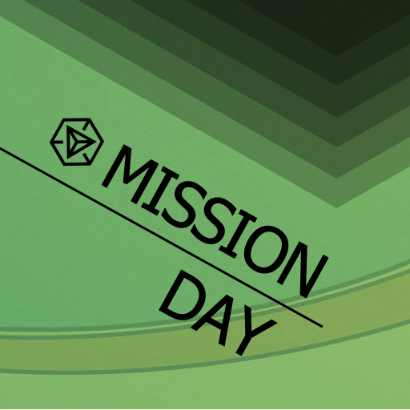

## [原創] Memorial Missions for 12.17 Shenzhen [Back](./../post.md)

 
 

  
  

  A <strong>memorial mission</strong> for 12.17 Shenzhen (<strong>Uploading</storng>)

 
 

  

### Description

昔為漁者之村，今為賈商之城。始於秦，且屬南海郡所轄。漢有“東官”於南頭所設，而晉有寶安立縣之始。其新安之名，乃明萬曆元年（1573年）所賜，寓有“革新鼎安，轉危為安”之意。此乃何地？深圳也，亦名鹏城。

Though it was a region of villages gathering sort of fishers yesterday, it has now become a modern city for business today. Date back to Qin dynasty, a county, named the Sounth China Sea Country, has already had jurisdiction over it. While in Han, ond kind of officeholders was set up at Nantou, which was called "Dung Gun (東官)". After that, the Baoan Country appeared during Jin dynasity right here. Nevertheless, where did the Xin'an Country arise? The answer is in the first year of Ming Wanli (1573). Actually, the name, Xin'an, also has a deep moral: Innovate to promote peace, while making any dangerous thing through. So, what is it exactly? That's Shenzhen, a.k.a the Peng City.

### Area

全任務主要在深圳市南山區松坪山, 即科技園北區附近進行. 據非官方統計, 完成該組任務可能歷時約 30 分鐘.

任務所在地會經過有松坪山公園, 清華信息港, 同方信息港等, 意在讓各位體驗一下各信息港中, 深圳科技企業的辦公樓及附近環境. 除此之外, 任務區域附近還設置有多個拼圖任務可供大家完成. 若有朋友組團聚餐的話, 松坪山附近可推薦有添星碼頭, KFC 等. 具體位置可定位於萬昌百貨:

- [百度地圖](http://j.map.baidu.com/2qhkH)
- [谷歌地圖](https://goo.gl/maps/hPV6rJkenwK2)

### Tasks

#### Memorial Missions for 12.17 Shenzhen - 001

#### Memorial Missions for 12.17 Shenzhen - 002

#### Memorial Missions for 12.17 Shenzhen - 003

#### Memorial Missions for 12.17 Shenzhen - 004

#### Memorial Missions for 12.17 Shenzhen - 005

#### Memorial Missions for 12.17 Shenzhen - 006

