## [轉載] 22個優質的 React 開源項目 [Back](./../post.md)

> - Author: [稀土区](https://xituqu.com/author/1)
> - Origin: https://xituqu.com/201.html
> - Time: Jun, 3rd, 2016

**本文是对[React](https://xituqu.com/tag/react).JS库里[开源](https://xituqu.com/tag/open-source)应用进行了整合，我们从Github上800个开源的项目甄选出排名前22的优秀的开源项目。（React Native: 11个, React: 11个）
**

&nbsp; &nbsp; &nbsp; &nbsp;React是由facebook的开源的一个JavaScript库，用于构建“可预期的”和“声明式的”Web用户界面。

&nbsp; &nbsp; &nbsp; &nbsp;为了保证开源项目的质量，所以我们通过AI来进行全方位的分析，22个项目GitHub的Star的平均数为1681。只为给予开发者灵感和高质量的开源项目。

&nbsp; &nbsp; &nbsp; &nbsp;开源的项目可以帮助初学者更好的学习阅读代码，且方便高级程序员使用现有代码来节省时间。我们整合这些开源项目的初衷就是帮助开发者节省时间，而不是花几个小时的时间来寻找。

> &nbsp; &nbsp; &nbsp; &nbsp;注意React UI组件，模板，工具和框架是分离开来的，这样使得React构建的应用更易于管理。

**&lt;React Native&gt;**

[React native iOS and Android apps that give attendees a schedule for the F8 conference.](https://github.com/fbsamples/f8app)

Courtesy of [Alex Kotlyarskiy](https://medium.com/u/6b836daf2d29) **[5780 Stars]**

[Hacker News iOS and Android App: Made with React Native](https://github.com/iSimar/HackerNews-React-Native)

Courtesy of [Simar Singh](https://medium.com/u/65c679c51e1c) **[2004 Stars]**

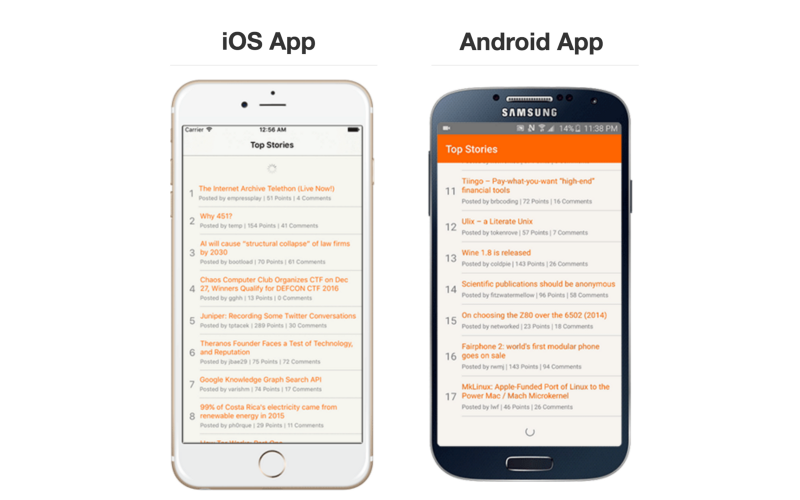

[Dribbble app built with React Native](https://github.com/catalinmiron/react-native-dribbble-app)

Courtesy of [Catalin MIRON](https://medium.com/u/4b53d99b3317) **[1073 Stars]**

注：[Dribbble](https://github.com/catalinmiron/react-native-dribbble-app) 是一个面向创作家、艺术工作者、设计师等创意类作品的人群，提供作品在线服务，供网友在线查看已经完成的作品或者正在创作的作品的交流网站。

[Ready-to-use chat interface for iOS and Android React-Native apps.](https://github.com/FaridSafi/react-native-gifted-messenger)

Courtesy of [Farid from Safi](https://medium.com/u/fea63d4e28f3) **[919 Stars]**

[iOS's Stocks App clone: Written in React Native available both iOS and Android.](https://github.com/7kfpun/FinanceReactNative)

Courtesy of [kf](https://medium.com/u/e113f0f1abc9) **[609 Stars]**

[A Zhihu Daily App client implemented using React Native (Android and iOS).](https://github.com/race604/ZhiHuDaily-React-Native)

Courtesy of [Race604](https://medium.com/u/b6daafb44ceb) **[2624 Stars]**

[A Camera app for React Native (also supports barcode scanning).](https://github.com/lwansbrough/react-native-camera)

Courtesy of [@CharlieHawker](https://twitter.com/CharlieHawker) **[1140 Stars]**

[Github client written with react-native.](https://github.com/xiekw2010/react-native-gitfeed)

Courtesy of [David Tse](https://medium.com/u/1138287b92ae) **[1106 Stars]**

[iOS and Android NBA App built with React Native.](https://github.com/wwayne/react-native-nba-app)

Courtesy of [WangZixiao](https://medium.com/u/f73d39bdfb7d) **[586 Stars]**

[React Native Reddit Reader.](https://github.com/akveo/react-native-reddit-reader)

Courtesy of Andrei Hrabouski **[220 Stars]**

[FB Basketball game clone built in React.JS Native.](https://github.com/faridsafi/react-native-basketball)

Courtesy of [Farid from Safi](https://medium.com/u/fea63d4e28f3) **[111 Stars]**

[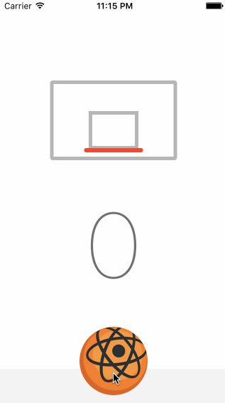](https://github.com/faridsafi/react-native-basketball)

**&lt;React&gt;**

[A Soundcloud client built with React / Redux.](https://github.com/andrewngu/sound-redux)

Courtesy of [Andrew Nguyen](https://medium.com/u/9c93da259760) **[1335 Stars]**

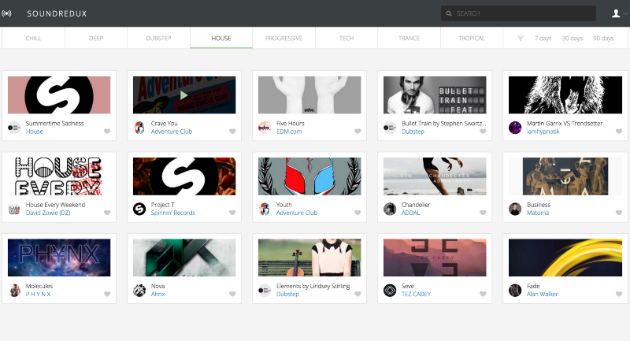

[Calculator built with React (Website), Electorn (Desktop), and React Native (iOS & Android).](https://github.com/benoitvallon/react-native-nw-react-calculator)

Courtesy of [Benoit VALLON](https://medium.com/u/d3f29aae3923) **[2796 Stars]**

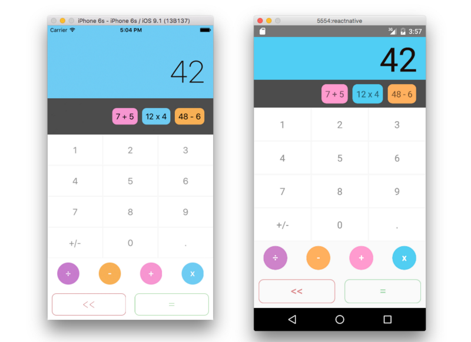

[React-color: Color Pickers from Sketch, Photoshop, Chrome & more.](https://github.com/casesandberg/react-color)

Courtesy of [Case Sandberg](https://medium.com/u/fbdb48f94b64) **[1966 Stars]**

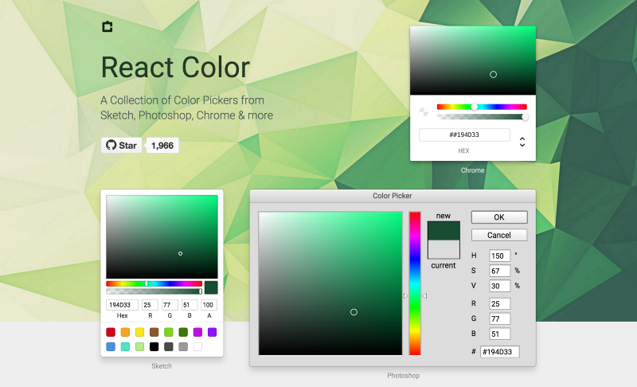

[Gatsby: Transform plain text into dynamic blogs and websites using React.js.
](https://github.com/gatsbyjs/gatsby)

Courtesy of [kylemathews](https://medium.com/u/d8a8061f22e1) **[2816 Stars]**

[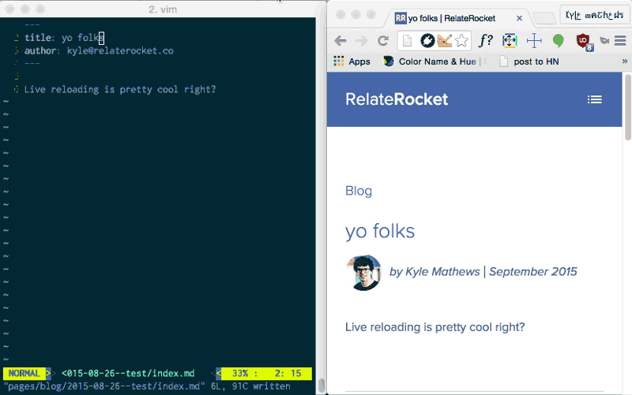](https://github.com/gatsbyjs/gatsby)

[Sentry is cross-platform crash reporting built with React.](https://github.com/getsentry/sentry/)

Courtesy of [Armin Ronacher](https://medium.com/u/d38a80b1d039) **[9229 Stars]**

[Isomorphic500: A web application featuring photos from 500px, built on express using React and Flux with yahoo/fluxible.](https://github.com/gpbl/isomorphic500)

Courtesy of [gp](https://medium.com/u/9bb1e7ea08d2) **[953 Stars]**

[A React & react-router-powered implementation of Hacker News using its Firebase API.](https://github.com/insin/react-hn)

Courtesy of [Arthur Stolyar](https://medium.com/u/577c0e279fd5) **[505 Stars]**

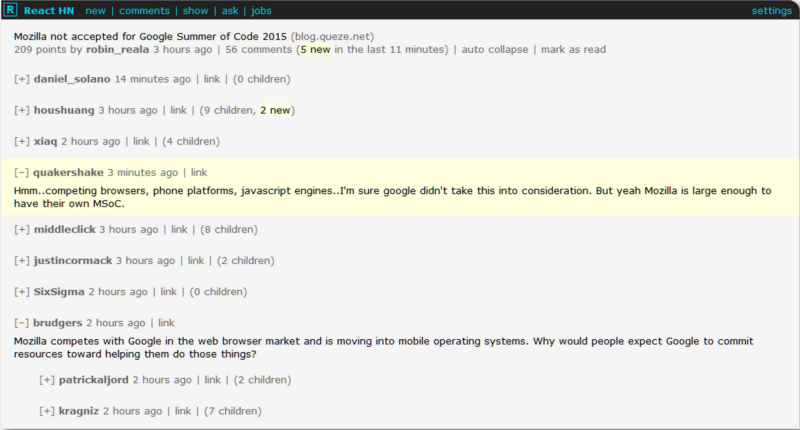

[A playground for in-browser interpreters. Built with React/Redux.](https://github.com/fatiherikli/fil)

Courtesy of [Mican](https://medium.com/u/4c842c8dc89a) **[509 Stars]**

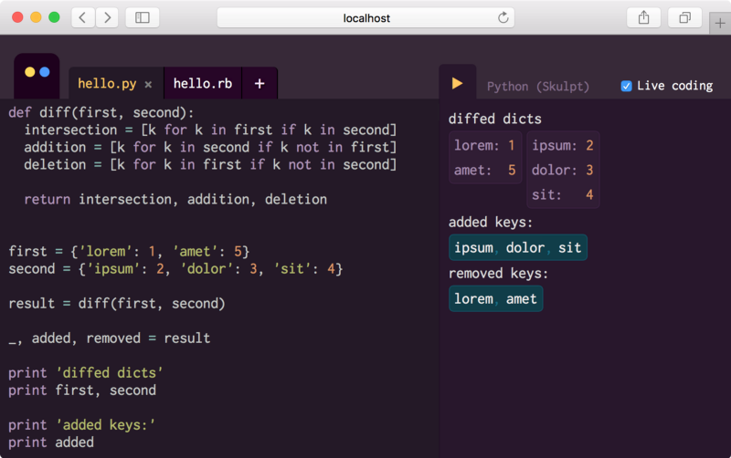

[Perseus: Khan Academy's new exercise question editor and renderer built with React](https://github.com/khan/perseus)

[591 Stars]

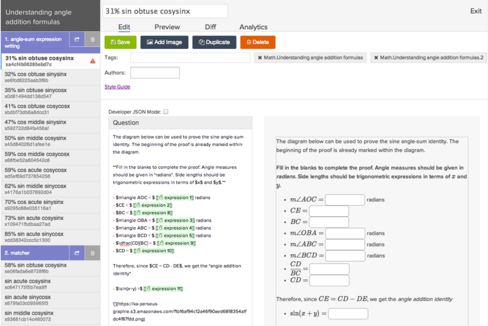

[React-based Imgur-like isomorphic demo app.](https://github.com/BinaryMuse/imgsible)

Courtesy of [Brandon Tilley](https://medium.com/u/7f7796c1b7dd) **[39 Stars]**

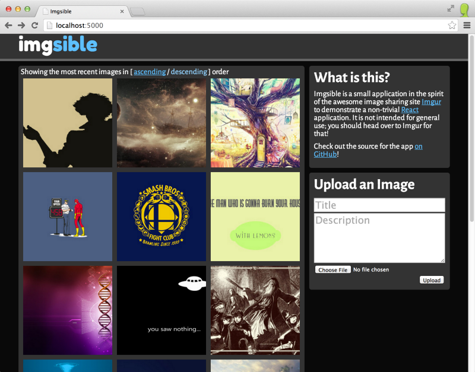

[Flatris: Tetris app for Cosmos, built with React.](https://github.com/skidding/flatris)

Courtesy of [Ovidiu Cherecheș](https://medium.com/u/781d032b61cf) **[71 Stars]**

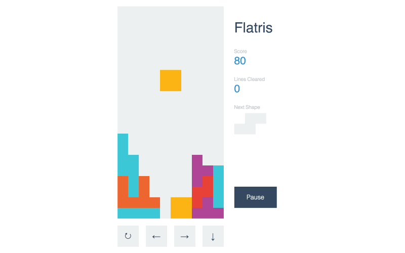

**&lt;Bonus: Books to learn React.JS&gt;**

[For Beginners — Learning React Native: Building Native Mobile Apps with JavaScript (highest rating on Amazon as of May 2016).](http://www.amazon.com/gp/product/1491929006?ie=UTF8&camp=1789&creativeASIN=1491929006&linkCode=xm2&tag=mybridge-20)

Courtesy of Twitter Engineer [Bonnie Eisenman](https://medium.com/u/88ac114d185d)

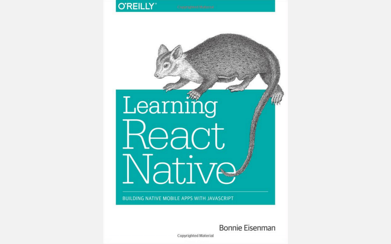

For Advanced — [Pro React.](http://www.amazon.com/gp/product/1484212614?ie=UTF8&camp=1789&creativeASIN=1484212614&linkCode=xm2&tag=mybridge-20)

