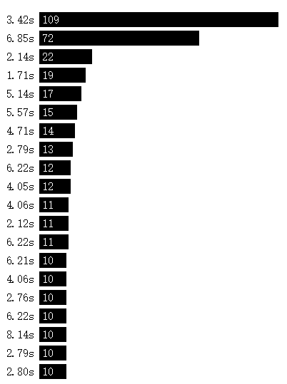
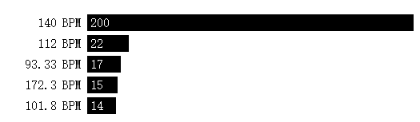
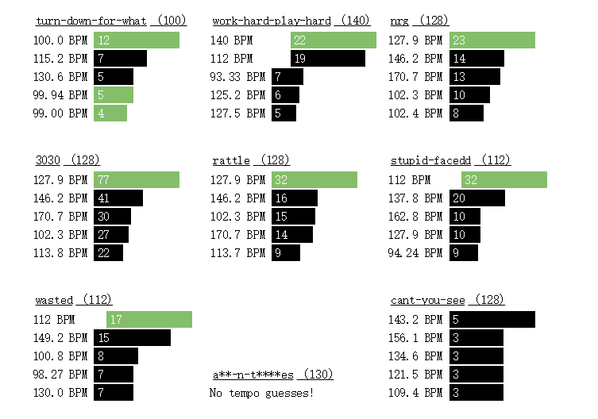
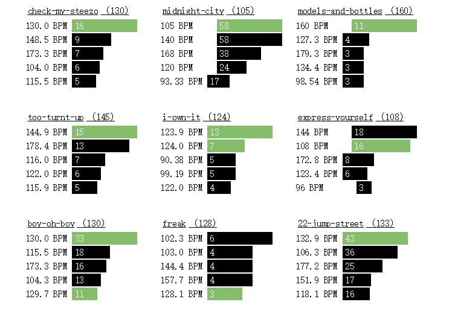

## [轉載] Beat Detection Using JavaScript and the Web Audio API [Back](./../post.md)

> - Author: [Joe Sullivan](https://twitter.com/itsjoesullivan)
> - Origin: http://joesul.li/van/beat-detection-using-web-audio/

By [Joe Sullivan](https://twitter.com/itsjoesullivan)

This article explores using the [Web Audio API](https://developer.mozilla.org/en-US/docs/Web/API/Web_Audio_API) and JavaScript to accomplish beat detection in the browser. Let's define beat detection as determining (1) the location of significant drum hits within a song in order to (2) establish a tempo, in beats per minute (BPM).

If you're not familiar with using the WebAudio API and creating buffers, [this tutorial will get you up to speed](http://www.html5rocks.com/en/tutorials/webaudio/intro/). We'll use [Go](http://www.beatport.com/release/go/1338457) from [Grimes](http://www.beatport.com/artist/grimes/173967) as our sample track for the examples below.

<svg xmlns="http://www.w3.org/2000/svg" width="90%" height="40">
    <rect x="10.327715185612098%" y="0" width="1" height="100%"></rect>
    <rect x="21.714948845035394%" y="0" width="1" height="100%"></rect>
    <rect x="23.124814760853496%" y="0" width="1" height="100%"></rect>
    <rect x="24.50925223330013%" y="0" width="1" height="100%"></rect>
    <rect x="25.757129546899986%" y="0" width="1" height="100%"></rect>
    <rect x="26.85243620027103%" y="0" width="1" height="100%"></rect>
    <rect x="27.091651926802626%" y="0" width="1" height="100%"></rect>
    <rect x="27.589861058043624%" y="0" width="1" height="100%"></rect>
    <rect x="28.896129611977965%" y="0" width="1" height="100%"></rect>
    <rect x="30.95677531926588%" y="0" width="1" height="100%"></rect>
    <rect x="31.196932839996418%" y="0" width="1" height="100%"></rect>
    <rect x="31.329725822047422%" y="0" width="1" height="100%"></rect>
    <rect x="32.81493527378099%" y="0" width="1" height="100%"></rect>
    <rect x="33.16810809838472%" y="0" width="1" height="100%"></rect>
    <rect x="37.987269014377524%" y="0" width="1" height="100%"></rect>
    <rect x="38.86407941359373%" y="0" width="1" height="100%"></rect>
    <rect x="51.32966743080709%" y="0" width="1" height="100%"></rect>
    <rect x="53.02395519470606%" y="0" width="1" height="100%"></rect>
    <rect x="54.18518744200314%" y="0" width="1" height="100%"></rect>
    <rect x="54.35471039781293%" y="0" width="1" height="100%"></rect>
    <rect x="55.21362670724921%" y="0" width="1" height="100%"></rect>
    <rect x="55.825792936562344%" y="0" width="1" height="100%"></rect>
    <rect x="56.490699641016306%" y="0" width="1" height="100%"></rect>
    <rect x="57.217764762600524%" y="0" width="1" height="100%"></rect>
    <rect x="59.92542308456248%" y="0" width="1" height="100%"></rect>
    <rect x="60.11378192435114%" y="0" width="1" height="100%"></rect>
    <rect x="60.762678127423065%" y="0" width="1" height="100%"></rect>
    <rect x="62.461674862316755%" y="0" width="1" height="100%"></rect>
    <rect x="62.7432713278008%" y="0" width="1" height="100%"></rect>
    <rect x="63.74063138448174%" y="0" width="1" height="100%"></rect>
    <rect x="65.35204125887371%" y="0" width="1" height="100%"></rect>
    <rect x="65.47824168153211%" y="0" width="1" height="100%"></rect>
    <rect x="66.45864944263207%" y="0" width="1" height="100%"></rect>
    <rect x="66.86267915397875%" y="0" width="1" height="100%"></rect>
    <rect x="67.26388348272857%" y="0" width="1" height="100%"></rect>
    <rect x="67.5407709772179%" y="0" width="1" height="100%"></rect>
    <rect x="68.05969958083566%" y="0" width="1" height="100%"></rect>
    <rect x="68.5936968916365%" y="0" width="1" height="100%"></rect>
    <rect x="68.9807743074022%" y="0" width="1" height="100%"></rect>
    <rect x="69.08437166928596%" y="0" width="1" height="100%"></rect>
    <rect x="69.3292381610112%" y="0" width="1" height="100%"></rect>
    <rect x="69.58163900632802%" y="0" width="1" height="100%"></rect>
    <rect x="70.90956882683805%" y="0" width="1" height="100%"></rect>
    <rect x="72.17063125922311%" y="0" width="1" height="100%"></rect>
    <rect x="76.98319961582331%" y="0" width="1" height="100%"></rect>
    <rect x="78.11711983135103%" y="0" width="1" height="100%"></rect>
    <rect x="78.60214384380683%" y="0" width="1" height="100%"></rect>
</svg>

<svg xmlns="http://www.w3.org/2000/svg" width="90%" height="40">
    <rect x="10.327715185612098%" y="0" width="1" height="100%"></rect>
    <rect x="14.303970293550659%" y="0" width="1" height="100%"></rect>
    <rect x="16.442784919350867%" y="0" width="1" height="100%"></rect>
    <rect x="20.001825197157554%" y="0" width="1" height="100%"></rect>
    <rect x="20.9144237759336%" y="0" width="1" height="100%"></rect>
    <rect x="21.15834847345991%" y="0" width="1" height="100%"></rect>
    <rect x="21.362717814630603%" y="0" width="1" height="100%"></rect>
    <rect x="21.700821932051245%" y="0" width="1" height="100%"></rect>
    <rect x="22.19526388649647%" y="0" width="1" height="100%"></rect>
    <rect x="22.48722008816889%" y="0" width="1" height="100%"></rect>
    <rect x="22.932688744269065%" y="0" width="1" height="100%"></rect>
    <rect x="23.124814760853496%" y="0" width="1" height="100%"></rect>
    <rect x="24.006334131064413%" y="0" width="1" height="100%"></rect>
    <rect x="24.33125312969985%" y="0" width="1" height="100%"></rect>
    <rect x="24.50925223330013%" y="0" width="1" height="100%"></rect>
    <rect x="25.757129546899986%" y="0" width="1" height="100%"></rect>
    <rect x="25.883329969558385%" y="0" width="1" height="100%"></rect>
    <rect x="26.094291870121683%" y="0" width="1" height="100%"></rect>
    <rect x="26.3165553010723%" y="0" width="1" height="100%"></rect>
    <rect x="26.648066859100336%" y="0" width="1" height="100%"></rect>
    <rect x="26.7582567803767%" y="0" width="1" height="100%"></rect>
    <rect x="27.091651926802626%" y="0" width="1" height="100%"></rect>
    <rect x="27.20466723067582%" y="0" width="1" height="100%"></rect>
    <rect x="27.4109201602444%" y="0" width="1" height="100%"></rect>
    <rect x="27.518284698923935%" y="0" width="1" height="100%"></rect>
    <rect x="27.828134990376277%" y="0" width="1" height="100%"></rect>
    <rect x="28.0635835401121%" y="0" width="1" height="100%"></rect>
    <rect x="28.368724860569724%" y="0" width="1" height="100%"></rect>
    <rect x="28.48174016444292%" y="0" width="1" height="100%"></rect>
    <rect x="28.89518781777902%" y="0" width="1" height="100%"></rect>
    <rect x="28.990309031872293%" y="0" width="1" height="100%"></rect>
    <rect x="29.457438954548167%" y="0" width="1" height="100%"></rect>
    <rect x="29.75316233301636%" y="0" width="1" height="100%"></rect>
    <rect x="29.87936275567476%" y="0" width="1" height="100%"></rect>
    <rect x="30.736395476713152%" y="0" width="1" height="100%"></rect>
    <rect x="30.880489989151474%" y="0" width="1" height="100%"></rect>
    <rect x="31.050012944961267%" y="0" width="1" height="100%"></rect>
    <rect x="31.196932839996418%" y="0" width="1" height="100%"></rect>
    <rect x="31.329725822047422%" y="0" width="1" height="100%"></rect>
    <rect x="31.454042656307937%" y="0" width="1" height="100%"></rect>
    <rect x="32.81493527378099%" y="0" width="1" height="100%"></rect>
    <rect x="33.10689147545341%" y="0" width="1" height="100%"></rect>
    <rect x="34.59210092718697%" y="0" width="1" height="100%"></rect>
    <rect x="35.153410269757174%" y="0" width="1" height="100%"></rect>
    <rect x="37.03888225604163%" y="0" width="1" height="100%"></rect>
    <rect x="37.987269014377524%" y="0" width="1" height="100%"></rect>
    <rect x="38.25379677267848%" y="0" width="1" height="100%"></rect>
    <rect x="38.5740068003192%" y="0" width="1" height="100%"></rect>
    <rect x="38.86407941359373%" y="0" width="1" height="100%"></rect>
    <rect x="39.96032786116371%" y="0" width="1" height="100%"></rect>
    <rect x="41.48980164024761%" y="0" width="1" height="100%"></rect>
    <rect x="44.56287611139956%" y="0" width="1" height="100%"></rect>
    <rect x="49.363201143413505%" y="0" width="1" height="100%"></rect>
    <rect x="51.32966743080709%" y="0" width="1" height="100%"></rect>
    <rect x="52.094404320349035%" y="0" width="1" height="100%"></rect>
    <rect x="52.30913339770811%" y="0" width="1" height="100%"></rect>
    <rect x="53.02395519470606%" y="0" width="1" height="100%"></rect>
    <rect x="54.18518744200314%" y="0" width="1" height="100%"></rect>
    <rect x="54.35471039781293%" y="0" width="1" height="100%"></rect>
    <rect x="54.473376466879785%" y="0" width="1" height="100%"></rect>
    <rect x="55.08930987298869%" y="0" width="1" height="100%"></rect>
    <rect x="55.21362670724921%" y="0" width="1" height="100%"></rect>
    <rect x="55.49239779013642%" y="0" width="1" height="100%"></rect>
    <rect x="55.60541309400961%" y="0" width="1" height="100%"></rect>
    <rect x="55.79471372799722%" y="0" width="1" height="100%"></rect>
    <rect x="55.89736929568203%" y="0" width="1" height="100%"></rect>
    <rect x="56.490699641016306%" y="0" width="1" height="100%"></rect>
    <rect x="56.636677741852516%" y="0" width="1" height="100%"></rect>
    <rect x="56.76570354710775%" y="0" width="1" height="100%"></rect>
    <rect x="57.1085166355231%" y="0" width="1" height="100%"></rect>
    <rect x="57.217764762600524%" y="0" width="1" height="100%"></rect>
    <rect x="58.189696375909996%" y="0" width="1" height="100%"></rect>
    <rect x="58.48259437178136%" y="0" width="1" height="100%"></rect>
    <rect x="59.92542308456248%" y="0" width="1" height="100%"></rect>
    <rect x="60.09871321716805%" y="0" width="1" height="100%"></rect>
    <rect x="60.37277532906054%" y="0" width="1" height="100%"></rect>
    <rect x="60.65060461774881%" y="0" width="1" height="100%"></rect>
    <rect x="60.762678127423065%" y="0" width="1" height="100%"></rect>
    <rect x="60.95668773240538%" y="0" width="1" height="100%"></rect>
    <rect x="61.31927849899854%" y="0" width="1" height="100%"></rect>
    <rect x="61.74214409432408%" y="0" width="1" height="100%"></rect>
    <rect x="62.269548845732324%" y="0" width="1" height="100%"></rect>
    <rect x="62.461674862316755%" y="0" width="1" height="100%"></rect>
    <rect x="62.55679607641002%" y="0" width="1" height="100%"></rect>
    <rect x="62.72443544382193%" y="0" width="1" height="100%"></rect>
    <rect x="63.26031634302066%" y="0" width="1" height="100%"></rect>
    <rect x="63.387458559878006%" y="0" width="1" height="100%"></rect>
    <rect x="63.61066378502757%" y="0" width="1" height="100%"></rect>
    <rect x="63.74063138448174%" y="0" width="1" height="100%"></rect>
    <rect x="63.885667691119004%" y="0" width="1" height="100%"></rect>
    <rect x="64.01469349637424%" y="0" width="1" height="100%"></rect>
    <rect x="64.4968921262332%" y="0" width="1" height="100%"></rect>
    <rect x="64.76530347293203%" y="0" width="1" height="100%"></rect>
    <rect x="65.30118437213076%" y="0" width="1" height="100%"></rect>
    <rect x="65.41137429340714%" y="0" width="1" height="100%"></rect>
    <rect x="65.57242110142643%" y="0" width="1" height="100%"></rect>
    <rect x="65.68355281690174%" y="0" width="1" height="100%"></rect>
    <rect x="66.4115597326849%" y="0" width="1" height="100%"></rect>
    <rect x="66.5876752478873%" y="0" width="1" height="100%"></rect>
    <rect x="66.86267915397875%" y="0" width="1" height="100%"></rect>
    <rect x="67.25069836394337%" y="0" width="1" height="100%"></rect>
    <rect x="67.45318411671619%" y="0" width="1" height="100%"></rect>
    <rect x="67.57373377418092%" y="0" width="1" height="100%"></rect>
    <rect x="67.69145804904883%" y="0" width="1" height="100%"></rect>
    <rect x="68.00507551729694%" y="0" width="1" height="100%"></rect>
    <rect x="68.58616253804496%" y="0" width="1" height="100%"></rect>
    <rect x="68.68316734053612%" y="0" width="1" height="100%"></rect>
    <rect x="68.92520844966454%" y="0" width="1" height="100%"></rect>
    <rect x="69.08437166928596%" y="0" width="1" height="100%"></rect>
    <rect x="69.3292381610112%" y="0" width="1" height="100%"></rect>
    <rect x="69.58163900632802%" y="0" width="1" height="100%"></rect>
    <rect x="69.78318296490187%" y="0" width="1" height="100%"></rect>
    <rect x="69.93198644833491%" y="0" width="1" height="100%"></rect>
    <rect x="70.1928634414422%" y="0" width="1" height="100%"></rect>
    <rect x="70.75228919561452%" y="0" width="1" height="100%"></rect>
    <rect x="70.90956882683805%" y="0" width="1" height="100%"></rect>
    <rect x="71.10734560861614%" y="0" width="1" height="100%"></rect>
    <rect x="71.21471014729568%" y="0" width="1" height="100%"></rect>
    <rect x="71.40212719288539%" y="0" width="1" height="100%"></rect>
    <rect x="71.62156524123917%" y="0" width="1" height="100%"></rect>
    <rect x="72.17063125922311%" y="0" width="1" height="100%"></rect>
    <rect x="72.32602730204876%" y="0" width="1" height="100%"></rect>
    <rect x="72.71122112941656%" y="0" width="1" height="100%"></rect>
    <rect x="72.97209812252385%" y="0" width="1" height="100%"></rect>
    <rect x="73.76320524963621%" y="0" width="1" height="100%"></rect>
    <rect x="74.37725506734724%" y="0" width="1" height="100%"></rect>
    <rect x="76.98319961582331%" y="0" width="1" height="100%"></rect>
    <rect x="77.12917771665953%" y="0" width="1" height="100%"></rect>
    <rect x="78.11711983135103%" y="0" width="1" height="100%"></rect>
    <rect x="78.40719244462557%" y="0" width="1" height="100%"></rect>
    <rect x="78.55411233966072%" y="0" width="1" height="100%"></rect>
    <rect x="78.64923355375399%" y="0" width="1" height="100%"></rect>
    <rect x="79.29718796262698%" y="0" width="1" height="100%"></rect>
    <rect x="81.49251024036377%" y="0" width="1" height="100%"></rect>
</svg>

<svg xmlns="http://www.w3.org/2000/svg" width="90%" height="40">
    <rect x="8.610824360938484%" y="0" width="1" height="100%"></rect>
    <rect x="8.875468530841546%" y="0" width="1" height="100%"></rect>
    <rect x="9.590290327839503%" y="0" width="1" height="100%"></rect>
    <rect x="10.327715185612098%" y="0" width="1" height="100%"></rect>
    <rect x="12.879977464748409%" y="0" width="1" height="100%"></rect>
    <rect x="13.20960543437856%" y="0" width="1" height="100%"></rect>
    <rect x="13.594799261746363%" y="0" width="1" height="100%"></rect>
    <rect x="13.878279315628294%" y="0" width="1" height="100%"></rect>
    <rect x="14.303970293550659%" y="0" width="1" height="100%"></rect>
    <rect x="14.661852089149109%" y="0" width="1" height="100%"></rect>
    <rect x="15.028210032538048%" y="0" width="1" height="100%"></rect>
    <rect x="15.72796312235291%" y="0" width="1" height="100%"></rect>
    <rect x="16.023686500821103%" y="0" width="1" height="100%"></rect>
    <rect x="16.442784919350867%" y="0" width="1" height="100%"></rect>
    <rect x="16.791248772959882%" y="0" width="1" height="100%"></rect>
    <rect x="17.252727930442095%" y="0" width="1" height="100%"></rect>
    <rect x="18.33108228823216%" y="0" width="1" height="100%"></rect>
    <rect x="20.001825197157554%" y="0" width="1" height="100%"></rect>
    <rect x="20.108247941638144%" y="0" width="1" height="100%"></rect>
    <rect x="20.276829103248993%" y="0" width="1" height="100%"></rect>
    <rect x="20.88899533256213%" y="0" width="1" height="100%"></rect>
    <rect x="20.99824345963955%" y="0" width="1" height="100%"></rect>
    <rect x="21.15834847345991%" y="0" width="1" height="100%"></rect>
    <rect x="21.294908632306687%" y="0" width="1" height="100%"></rect>
    <rect x="21.44182852734184%" y="0" width="1" height="100%"></rect>
    <rect x="21.700821932051245%" y="0" width="1" height="100%"></rect>
    <rect x="21.96546610195431%" y="0" width="1" height="100%"></rect>
    <rect x="22.19526388649647%" y="0" width="1" height="100%"></rect>
    <rect x="22.31298816136438%" y="0" width="1" height="100%"></rect>
    <rect x="22.43824678982384%" y="0" width="1" height="100%"></rect>
    <rect x="22.556912858890694%" y="0" width="1" height="100%"></rect>
    <rect x="22.732086579894144%" y="0" width="1" height="100%"></rect>
    <rect x="22.85357803155783%" y="0" width="1" height="100%"></rect>
    <rect x="22.963767952834193%" y="0" width="1" height="100%"></rect>
    <rect x="23.090910169691536%" y="0" width="1" height="100%"></rect>
    <rect x="23.199216502570017%" y="0" width="1" height="100%"></rect>
    <rect x="23.57875956474416%" y="0" width="1" height="100%"></rect>
    <rect x="23.743573549559237%" y="0" width="1" height="100%"></rect>
    <rect x="24.006334131064413%" y="0" width="1" height="100%"></rect>
    <rect x="24.156079408696396%" y="0" width="1" height="100%"></rect>
    <rect x="24.285105213951628%" y="0" width="1" height="100%"></rect>
    <rect x="24.50925223330013%" y="0" width="1" height="100%"></rect>
    <rect x="25.712865219549652%" y="0" width="1" height="100%"></rect>
    <rect x="25.86731946817635%" y="0" width="1" height="100%"></rect>
    <rect x="25.962440682269623%" y="0" width="1" height="100%"></rect>
    <rect x="26.094291870121683%" y="0" width="1" height="100%"></rect>
    <rect x="26.206365379795933%" y="0" width="1" height="100%"></rect>
    <rect x="26.3165553010723%" y="0" width="1" height="100%"></rect>
    <rect x="26.603802531750002%" y="0" width="1" height="100%"></rect>
    <rect x="26.718701424021084%" y="0" width="1" height="100%"></rect>
    <rect x="26.85243620027103%" y="0" width="1" height="100%"></rect>
    <rect x="26.98428738812309%" y="0" width="1" height="100%"></rect>
    <rect x="27.091651926802626%" y="0" width="1" height="100%"></rect>
    <rect x="27.19619108288533%" y="0" width="1" height="100%"></rect>
    <rect x="27.299788444769092%" y="0" width="1" height="100%"></rect>
    <rect x="27.4109201602444%" y="0" width="1" height="100%"></rect>
    <rect x="27.518284698923935%" y="0" width="1" height="100%"></rect>
    <rect x="27.676506124346407%" y="0" width="1" height="100%"></rect>
    <rect x="27.828134990376277%" y="0" width="1" height="100%"></rect>
    <rect x="28.0635835401121%" y="0" width="1" height="100%"></rect>
    <rect x="28.27642902907328%" y="0" width="1" height="100%"></rect>
    <rect x="28.455369926872507%" y="0" width="1" height="100%"></rect>
    <rect x="28.560850877154156%" y="0" width="1" height="100%"></rect>
    <rect x="28.810426339874127%" y="0" width="1" height="100%"></rect>
    <rect x="28.990309031872293%" y="0" width="1" height="100%"></rect>
    <rect x="29.457438954548167%" y="0" width="1" height="100%"></rect>
    <rect x="29.61283499737381%" y="0" width="1" height="100%"></rect>
    <rect x="29.75316233301636%" y="0" width="1" height="100%"></rect>
    <rect x="29.87936275567476%" y="0" width="1" height="100%"></rect>
    <rect x="29.982018323359576%" y="0" width="1" height="100%"></rect>
    <rect x="30.198630989116534%" y="0" width="1" height="100%"></rect>
    <rect x="30.736395476713152%" y="0" width="1" height="100%"></rect>
    <rect x="30.880489989151474%" y="0" width="1" height="100%"></rect>
    <rect x="31.030235266783457%" y="0" width="1" height="100%"></rect>
    <rect x="31.133832628667218%" y="0" width="1" height="100%"></rect>
    <rect x="31.261916639723506%" y="0" width="1" height="100%"></rect>
    <rect x="31.39753500437134%" y="0" width="1" height="100%"></rect>
    <rect x="31.507724925647704%" y="0" width="1" height="100%"></rect>
    <rect x="31.62639099471456%" y="0" width="1" height="100%"></rect>
    <rect x="31.743173475383525%" y="0" width="1" height="100%"></rect>
    <rect x="32.28753052237275%" y="0" width="1" height="100%"></rect>
    <rect x="32.46835500856986%" y="0" width="1" height="100%"></rect>
    <rect x="32.81493527378099%" y="0" width="1" height="100%"></rect>
    <rect x="32.971273110805576%" y="0" width="1" height="100%"></rect>
    <rect x="33.10689147545341%" y="0" width="1" height="100%"></rect>
    <rect x="33.26228751827905%" y="0" width="1" height="100%"></rect>
    <rect x="34.26341475175577%" y="0" width="1" height="100%"></rect>
    <rect x="34.53088430425566%" y="0" width="1" height="100%"></rect>
    <rect x="34.781401561174576%" y="0" width="1" height="100%"></rect>
    <rect x="35.153410269757174%" y="0" width="1" height="100%"></rect>
    <rect x="36.01703555018817%" y="0" width="1" height="100%"></rect>
    <rect x="36.82980394387622%" y="0" width="1" height="100%"></rect>
    <rect x="36.98614178090081%" y="0" width="1" height="100%"></rect>
    <rect x="37.11893476295182%" y="0" width="1" height="100%"></rect>
    <rect x="37.37886996186016%" y="0" width="1" height="100%"></rect>
    <rect x="37.987269014377524%" y="0" width="1" height="100%"></rect>
    <rect x="38.25379677267848%" y="0" width="1" height="100%"></rect>
    <rect x="38.53539323816252%" y="0" width="1" height="100%"></rect>
    <rect x="38.65876827822409%" y="0" width="1" height="100%"></rect>
    <rect x="38.80286279066242%" y="0" width="1" height="100%"></rect>
    <rect x="38.965793187079605%" y="0" width="1" height="100%"></rect>
    <rect x="39.06091440117287%" y="0" width="1" height="100%"></rect>
    <rect x="39.425388756163926%" y="0" width="1" height="100%"></rect>
    <rect x="39.941491977184846%" y="0" width="1" height="100%"></rect>
    <rect x="40.05168189846121%" y="0" width="1" height="100%"></rect>
    <rect x="40.220263060072064%" y="0" width="1" height="100%"></rect>
    <rect x="40.85032337916512%" y="0" width="1" height="100%"></rect>
    <rect x="41.00477762779182%" y="0" width="1" height="100%"></rect>
    <rect x="41.10178243028298%" y="0" width="1" height="100%"></rect>
    <rect x="41.48980164024761%" y="0" width="1" height="100%"></rect>
    <rect x="42.52577525908523%" y="0" width="1" height="100%"></rect>
    <rect x="42.856345022914326%" y="0" width="1" height="100%"></rect>
    <rect x="43.050354627896645%" y="0" width="1" height="100%"></rect>
    <rect x="43.44119922045811%" y="0" width="1" height="100%"></rect>
    <rect x="43.7651764248946%" y="0" width="1" height="100%"></rect>
    <rect x="44.53744766802809%" y="0" width="1" height="100%"></rect>
    <rect x="45.23437537524613%" y="0" width="1" height="100%"></rect>
    <rect x="45.96144049683035%" y="0" width="1" height="100%"></rect>
    <rect x="47.32515849690023%" y="0" width="1" height="100%"></rect>
    <rect x="48.123799977604136%" y="0" width="1" height="100%"></rect>
    <rect x="49.363201143413505%" y="0" width="1" height="100%"></rect>
    <rect x="50.1703187719079%" y="0" width="1" height="100%"></rect>
    <rect x="50.519724419715864%" y="0" width="1" height="100%"></rect>
    <rect x="50.67041149154679%" y="0" width="1" height="100%"></rect>
    <rect x="50.994388695983275%" y="0" width="1" height="100%"></rect>
    <rect x="51.15449370980364%" y="0" width="1" height="100%"></rect>
    <rect x="51.32966743080709%" y="0" width="1" height="100%"></rect>
    <rect x="51.51614268219786%" y="0" width="1" height="100%"></rect>
    <rect x="51.62256542667845%" y="0" width="1" height="100%"></rect>
    <rect x="52.094404320349035%" y="0" width="1" height="100%"></rect>
    <rect x="52.21307038941589%" y="0" width="1" height="100%"></rect>
    <rect x="52.30913339770811%" y="0" width="1" height="100%"></rect>
    <rect x="52.58319550960061%" y="0" width="1" height="100%"></rect>
    <rect x="53.02395519470606%" y="0" width="1" height="100%"></rect>
    <rect x="54.18518744200314%" y="0" width="1" height="100%"></rect>
    <rect x="54.35471039781293%" y="0" width="1" height="100%"></rect>
    <rect x="54.460191348094575%" y="0" width="1" height="100%"></rect>
    <rect x="54.59015894754875%" y="0" width="1" height="100%"></rect>
    <rect x="54.717301164406095%" y="0" width="1" height="100%"></rect>
    <rect x="55.08930987298869%" y="0" width="1" height="100%"></rect>
    <rect x="55.21362670724921%" y="0" width="1" height="100%"></rect>
    <rect x="55.34171071830549%" y="0" width="1" height="100%"></rect>
    <rect x="55.450958845382914%" y="0" width="1" height="100%"></rect>
    <rect x="55.60541309400961%" y="0" width="1" height="100%"></rect>
    <rect x="55.79471372799722%" y="0" width="1" height="100%"></rect>
    <rect x="55.89736929568203%" y="0" width="1" height="100%"></rect>
    <rect x="56.14129399320835%" y="0" width="1" height="100%"></rect>
    <rect x="56.30704977222236%" y="0" width="1" height="100%"></rect>
    <rect x="56.48881605261842%" y="0" width="1" height="100%"></rect>
    <rect x="56.636677741852516%" y="0" width="1" height="100%"></rect>
    <rect x="56.76570354710775%" y="0" width="1" height="100%"></rect>
    <rect x="56.92109958993339%" y="0" width="1" height="100%"></rect>
    <rect x="57.04730001259179%" y="0" width="1" height="100%"></rect>
    <rect x="57.217764762600524%" y="0" width="1" height="100%"></rect>
    <rect x="57.32230391868323%" y="0" width="1" height="100%"></rect>
    <rect x="57.501244816482455%" y="0" width="1" height="100%"></rect>
    <rect x="57.80261896014431%" y="0" width="1" height="100%"></rect>
    <rect x="57.91280888142067%" y="0" width="1" height="100%"></rect>
    <rect x="58.189696375909996%" y="0" width="1" height="100%"></rect>
    <rect x="58.29894450298742%" y="0" width="1" height="100%"></rect>
    <rect x="58.48259437178136%" y="0" width="1" height="100%"></rect>
    <rect x="58.6248052958218%" y="0" width="1" height="100%"></rect>
    <rect x="58.74535495328654%" y="0" width="1" height="100%"></rect>
    <rect x="58.90734355550479%" y="0" width="1" height="100%"></rect>
    <rect x="59.71351938980024%" y="0" width="1" height="100%"></rect>
    <rect x="59.83595263566286%" y="0" width="1" height="100%"></rect>
    <rect x="59.97910535390225%" y="0" width="1" height="100%"></rect>
    <rect x="60.09871321716805%" y="0" width="1" height="100%"></rect>
    <rect x="60.22962261082116%" y="0" width="1" height="100%"></rect>
    <rect x="60.37277532906054%" y="0" width="1" height="100%"></rect>
    <rect x="60.65060461774881%" y="0" width="1" height="100%"></rect>
    <rect x="60.76079453902518%" y="0" width="1" height="100%"></rect>
    <rect x="60.95668773240538%" y="0" width="1" height="100%"></rect>
    <rect x="61.093247891252155%" y="0" width="1" height="100%"></rect>
    <rect x="61.2203901081095%" y="0" width="1" height="100%"></rect>
    <rect x="61.31927849899854%" y="0" width="1" height="100%"></rect>
    <rect x="61.49068504320623%" y="0" width="1" height="100%"></rect>
    <rect x="61.74214409432408%" y="0" width="1" height="100%"></rect>
    <rect x="61.92391037472014%" y="0" width="1" height="100%"></rect>
    <rect x="62.07459744655106%" y="0" width="1" height="100%"></rect>
    <rect x="62.24694578495768%" y="0" width="1" height="100%"></rect>
    <rect x="62.461674862316755%" y="0" width="1" height="100%"></rect>
    <rect x="62.55679607641002%" y="0" width="1" height="100%"></rect>
    <rect x="62.65662626149801%" y="0" width="1" height="100%"></rect>
    <rect x="62.77246694796804%" y="0" width="1" height="100%"></rect>
    <rect x="63.00979908610175%" y="0" width="1" height="100%"></rect>
    <rect x="63.26031634302066%" y="0" width="1" height="100%"></rect>
    <rect x="63.387458559878006%" y="0" width="1" height="100%"></rect>
    <rect x="63.561690486682515%" y="0" width="1" height="100%"></rect>
    <rect x="63.739689590282794%" y="0" width="1" height="100%"></rect>
    <rect x="63.885667691119004%" y="0" width="1" height="100%"></rect>
    <rect x="63.988323258803824%" y="0" width="1" height="100%"></rect>
    <rect x="64.08815344389181%" y="0" width="1" height="100%"></rect>
    <rect x="64.1964597767703%" y="0" width="1" height="100%"></rect>
    <rect x="64.4968921262332%" y="0" width="1" height="100%"></rect>
    <rect x="64.76530347293203%" y="0" width="1" height="100%"></rect>
    <rect x="65.06385223399705%" y="0" width="1" height="100%"></rect>
    <rect x="65.30118437213076%" y="0" width="1" height="100%"></rect>
    <rect x="65.41137429340714%" y="0" width="1" height="100%"></rect>
    <rect x="65.56488674783489%" y="0" width="1" height="100%"></rect>
    <rect x="65.68355281690174%" y="0" width="1" height="100%"></rect>
    <rect x="65.83329809453373%" y="0" width="1" height="100%"></rect>
    <rect x="66.03860922990336%" y="0" width="1" height="100%"></rect>
    <rect x="66.22037551029942%" y="0" width="1" height="100%"></rect>
    <rect x="66.37106258213035%" y="0" width="1" height="100%"></rect>
    <rect x="66.51044812357395%" y="0" width="1" height="100%"></rect>
    <rect x="66.60556933766722%" y="0" width="1" height="100%"></rect>
    <rect x="66.73271155452457%" y="0" width="1" height="100%"></rect>
    <rect x="66.84949403519353%" y="0" width="1" height="100%"></rect>
    <rect x="67.01524981420755%" y="0" width="1" height="100%"></rect>
    <rect x="67.11507999929555%" y="0" width="1" height="100%"></rect>
    <rect x="67.25069836394337%" y="0" width="1" height="100%"></rect>
    <rect x="67.41362876036057%" y="0" width="1" height="100%"></rect>
    <rect x="67.5407709772179%" y="0" width="1" height="100%"></rect>
    <rect x="67.69145804904883%" y="0" width="1" height="100%"></rect>
    <rect x="67.88264227143432%" y="0" width="1" height="100%"></rect>
    <rect x="68.00507551729694%" y="0" width="1" height="100%"></rect>
    <rect x="68.26595251040423%" y="0" width="1" height="100%"></rect>
    <rect x="68.43830084881085%" y="0" width="1" height="100%"></rect>
    <rect x="68.58616253804496%" y="0" width="1" height="100%"></rect>
    <rect x="68.68316734053612%" y="0" width="1" height="100%"></rect>
    <rect x="68.78111393722622%" y="0" width="1" height="100%"></rect>
    <rect x="68.89318744690047%" y="0" width="1" height="100%"></rect>
    <rect x="69.00431916237578%" y="0" width="1" height="100%"></rect>
    <rect x="69.09944037646905%" y="0" width="1" height="100%"></rect>
    <rect x="69.23411694691794%" y="0" width="1" height="100%"></rect>
    <rect x="69.3292381610112%" y="0" width="1" height="100%"></rect>
    <rect x="69.43660269969075%" y="0" width="1" height="100%"></rect>
    <rect x="69.58163900632802%" y="0" width="1" height="100%"></rect>
    <rect x="69.69747969279804%" y="0" width="1" height="100%"></rect>
    <rect x="69.80390243727862%" y="0" width="1" height="100%"></rect>
    <rect x="69.93198644833491%" y="0" width="1" height="100%"></rect>
    <rect x="70.11940349392464%" y="0" width="1" height="100%"></rect>
    <rect x="70.3473176900689%" y="0" width="1" height="100%"></rect>
    <rect x="70.52531679366919%" y="0" width="1" height="100%"></rect>
    <rect x="70.75228919561452%" y="0" width="1" height="100%"></rect>
    <rect x="70.90956882683805%" y="0" width="1" height="100%"></rect>
    <rect x="71.00469004093132%" y="0" width="1" height="100%"></rect>
    <rect x="71.10734560861614%" y="0" width="1" height="100%"></rect>
    <rect x="71.21471014729568%" y="0" width="1" height="100%"></rect>
    <rect x="71.40212719288539%" y="0" width="1" height="100%"></rect>
    <rect x="71.52926940974274%" y="0" width="1" height="100%"></rect>
    <rect x="71.74117310450497%" y="0" width="1" height="100%"></rect>
    <rect x="72.17063125922311%" y="0" width="1" height="100%"></rect>
    <rect x="72.32602730204876%" y="0" width="1" height="100%"></rect>
    <rect x="72.42114851614203%" y="0" width="1" height="100%"></rect>
    <rect x="72.58502070675816%" y="0" width="1" height="100%"></rect>
    <rect x="72.71122112941656%" y="0" width="1" height="100%"></rect>
    <rect x="72.95326223854498%" y="0" width="1" height="100%"></rect>
    <rect x="73.39496371784938%" y="0" width="1" height="100%"></rect>
    <rect x="73.60027485321902%" y="0" width="1" height="100%"></rect>
    <rect x="73.76320524963621%" y="0" width="1" height="100%"></rect>
    <rect x="74.12862139882621%" y="0" width="1" height="100%"></rect>
    <rect x="74.26612335187193%" y="0" width="1" height="100%"></rect>
    <rect x="74.37725506734724%" y="0" width="1" height="100%"></rect>
    <rect x="75.01861691682761%" y="0" width="1" height="100%"></rect>
    <rect x="75.26725058534865%" y="0" width="1" height="100%"></rect>
    <rect x="75.80124789614949%" y="0" width="1" height="100%"></rect>
    <rect x="76.96907270283917%" y="0" width="1" height="100%"></rect>
    <rect x="77.11410900947644%" y="0" width="1" height="100%"></rect>
    <rect x="77.22524072495173%" y="0" width="1" height="100%"></rect>
    <rect x="77.87319513382472%" y="0" width="1" height="100%"></rect>
    <rect x="78.11523624295315%" y="0" width="1" height="100%"></rect>
    <rect x="78.40719244462557%" y="0" width="1" height="100%"></rect>
    <rect x="78.52209133689665%" y="0" width="1" height="100%"></rect>
    <rect x="78.61815434518886%" y="0" width="1" height="100%"></rect>
    <rect x="78.71892632447579%" y="0" width="1" height="100%"></rect>
    <rect x="79.29059540323436%" y="0" width="1" height="100%"></rect>
    <rect x="79.5392290717554%" y="0" width="1" height="100%"></rect>
    <rect x="79.89146010216018%" y="0" width="1" height="100%"></rect>
    <rect x="80.07322638255624%" y="0" width="1" height="100%"></rect>
    <rect x="80.70705387844508%" y="0" width="1" height="100%"></rect>
    <rect x="80.96322190055766%" y="0" width="1" height="100%"></rect>
    <rect x="81.24387657184275%" y="0" width="1" height="100%"></rect>
    <rect x="81.49251024036377%" y="0" width="1" height="100%"></rect>
</svg>

Presence of "peaks" in a song above 0.8, 0.9, and 0.95 respectively.

### Premise (前提)

The central premise is that the peak (峰值)/tempo (節奏) data is readily available; people can, after all, very easily dance to music. Therefore, applying common sense to the data should reveal that information.

### Setup

I've selected a sample song. We'll take various cracks at analyzing it and coming up with a reasonable algorithm for determining tempo, then we'll look out-of-sample to test our algorithm.

### Song data

A song is a piece of music. Here we'll deal with it as an array of floats that represent the waveform of that music measured at 44,100 hz.

Getting started

I placed my initial effort at the top of the screen. What you see is a chart of all the floats in the buffer (again, representing the song) above a certain threshold, mapped to their position within the song. There does appear to be some regularity to the peaks, but their distribution is hardly uniform within any threshold.

If we can find a way to graph the song with a very uniform distribution of peaks, it should be simple to determine tempo. Therefore I'll try to manipulate the audio buffer in order to achieve that type of distribution. This is where the Web Audio API comes in: I can use it to transform the audio in a relatively intuitive (直觀的) way.

```js
// Function to identify peaks

function getPeaksAtThreshold(data, threshold) {
    var peaksArray = [];
    var length = data.length;
    for(var i = 0; i < length;) {
        if (data[i] > threshold) {
            peaksArray.push(i);
            // Skip forward ~ 1/4s to get past this peak.
            i += 10000;
        }
        i++;
    }
    return peaksArray;
}
```

### Filtering

How simple is it to transform our song with the Web Audio API? Here's an example that passes the song through a low-pass filter and returns it.

```js
// Create offline context
var offlineContext = new OfflineAudioContext(1, buffer.length, buffer.sampleRate);

// Create buffer source
var source = offlineContext.createBufferSource();
source.buffer = buffer;

// Create filter
var filter = offlineContext.createBiquadFilter();
filter.type = "lowpass";

// Pipe the song into the filter, and the filter into the offline context
source.connect(filter);
filter.connect(offlineContext.destination);

// Schedule the song to start playing at time:0
source.start(0);

// Render the song
offlineContext.startRendering()

// Act on the result
offlineContext.oncomplete = function(e) {
    // Filtered buffer!
    var filteredBuffer = e.renderedBuffer;
};
```

Now I'll run a low-, mid-, and high- pass filter over the song and graph the peaks measured from them. Because certain instruments are more faithful representatives of tempo (kick drum (大鼓), snare drum (小鼓), claps), I'm hoping that these filters will draw them out more so that "song peaks" will turn into "instrument peaks", or instrument **hits**.

<svg xmlns="http://www.w3.org/2000/svg" width="90%" height="40">
    <rect x="8.878293913438377%" y="0" width="1" height="100%"></rect>
    <rect x="9.226757767047394%" y="0" width="1" height="100%"></rect>
    <rect x="9.590290327839503%" y="0" width="1" height="100%"></rect>
    <rect x="10.302286742240629%" y="0" width="1" height="100%"></rect>
    <rect x="10.650750595849646%" y="0" width="1" height="100%"></rect>
    <rect x="11.014283156641755%" y="0" width="1" height="100%"></rect>
    <rect x="11.72627957104288%" y="0" width="1" height="100%"></rect>
    <rect x="12.074743424651897%" y="0" width="1" height="100%"></rect>
    <rect x="12.170806432944111%" y="0" width="1" height="100%"></rect>
    <rect x="12.438275985444006%" y="0" width="1" height="100%"></rect>
    <rect x="13.150272399845132%" y="0" width="1" height="100%"></rect>
    <rect x="13.49873625345415%" y="0" width="1" height="100%"></rect>
    <rect x="13.594799261746363%" y="0" width="1" height="100%"></rect>
    <rect x="13.859443431649428%" y="0" width="1" height="100%"></rect>
    <rect x="14.574265228647384%" y="0" width="1" height="100%"></rect>
    <rect x="14.9227290822564%" y="0" width="1" height="100%"></rect>
    <rect x="15.018792090548615%" y="0" width="1" height="100%"></rect>
    <rect x="15.28343626045168%" y="0" width="1" height="100%"></rect>
    <rect x="15.730788504949741%" y="0" width="1" height="100%"></rect>
    <rect x="15.998258057449634%" y="0" width="1" height="100%"></rect>
    <rect x="16.34672191105865%" y="0" width="1" height="100%"></rect>
    <rect x="16.442784919350867%" y="0" width="1" height="100%"></rect>
    <rect x="16.70742908925393%" y="0" width="1" height="100%"></rect>
    <rect x="17.15478133375199%" y="0" width="1" height="100%"></rect>
    <rect x="17.422250886251888%" y="0" width="1" height="100%"></rect>
    <rect x="17.77354012245773%" y="0" width="1" height="100%"></rect>
    <rect x="18.134247300653012%" y="0" width="1" height="100%"></rect>
    <rect x="18.578774162554243%" y="0" width="1" height="100%"></rect>
    <rect x="20.00653416815227%" y="0" width="1" height="100%"></rect>
    <rect x="20.266469367060616%" y="0" width="1" height="100%"></rect>
    <rect x="20.889937126761073%" y="0" width="1" height="100%"></rect>
    <rect x="21.1668246212504%" y="0" width="1" height="100%"></rect>
    <rect x="21.43052699695452%" y="0" width="1" height="100%"></rect>
    <rect x="21.690462195862867%" y="0" width="1" height="100%"></rect>
    <rect x="22.313929955563324%" y="0" width="1" height="100%"></rect>
    <rect x="22.59081745005265%" y="0" width="1" height="100%"></rect>
    <rect x="22.85451982575677%" y="0" width="1" height="100%"></rect>
    <rect x="23.11445502466512%" y="0" width="1" height="100%"></rect>
    <rect x="23.737922784365576%" y="0" width="1" height="100%"></rect>
    <rect x="24.00445054266653%" y="0" width="1" height="100%"></rect>
    <rect x="24.275687271962195%" y="0" width="1" height="100%"></rect>
    <rect x="24.543156824462088%" y="0" width="1" height="100%"></rect>
    <rect x="25.695912923968674%" y="0" width="1" height="100%"></rect>
    <rect x="25.962440682269623%" y="0" width="1" height="100%"></rect>
    <rect x="26.58590844197008%" y="0" width="1" height="100%"></rect>
    <rect x="26.862795936459406%" y="0" width="1" height="100%"></rect>
    <rect x="27.126498312163527%" y="0" width="1" height="100%"></rect>
    <rect x="27.386433511071875%" y="0" width="1" height="100%"></rect>
    <rect x="28.009901270772332%" y="0" width="1" height="100%"></rect>
    <rect x="28.286788765261658%" y="0" width="1" height="100%"></rect>
    <rect x="28.55049114096578%" y="0" width="1" height="100%"></rect>
    <rect x="28.810426339874127%" y="0" width="1" height="100%"></rect>
    <rect x="29.433894099574584%" y="0" width="1" height="100%"></rect>
    <rect x="29.709839799864966%" y="0" width="1" height="100%"></rect>
    <rect x="29.971658587171202%" y="0" width="1" height="100%"></rect>
    <rect x="30.24854608166053%" y="0" width="1" height="100%"></rect>
    <rect x="30.888966136941963%" y="0" width="1" height="100%"></rect>
    <rect x="31.350445294424176%" y="0" width="1" height="100%"></rect>
    <rect x="31.65841199747863%" y="0" width="1" height="100%"></rect>
    <rect x="32.281879757179084%" y="0" width="1" height="100%"></rect>
    <rect x="32.54840751548004%" y="0" width="1" height="100%"></rect>
    <rect x="32.833771157759855%" y="0" width="1" height="100%"></rect>
    <rect x="33.08240482628088%" y="0" width="1" height="100%"></rect>
    <rect x="33.70587258598134%" y="0" width="1" height="100%"></rect>
    <rect x="33.97240034428229%" y="0" width="1" height="100%"></rect>
    <rect x="34.257763986562104%" y="0" width="1" height="100%"></rect>
    <rect x="34.506397655083134%" y="0" width="1" height="100%"></rect>
    <rect x="35.131749003181476%" y="0" width="1" height="100%"></rect>
    <rect x="35.39639317308454%" y="0" width="1" height="100%"></rect>
    <rect x="35.667629902380206%" y="0" width="1" height="100%"></rect>
    <rect x="35.944517396869536%" y="0" width="1" height="100%"></rect>
    <rect x="37.09350631958034%" y="0" width="1" height="100%"></rect>
    <rect x="37.35438331268764%" y="0" width="1" height="100%"></rect>
    <rect x="37.97973466078598%" y="0" width="1" height="100%"></rect>
    <rect x="38.244378830689044%" y="0" width="1" height="100%"></rect>
    <rect x="38.5174991483826%" y="0" width="1" height="100%"></rect>
    <rect x="38.778376141489886%" y="0" width="1" height="100%"></rect>
    <rect x="39.40372748958823%" y="0" width="1" height="100%"></rect>
    <rect x="39.66837165949129%" y="0" width="1" height="100%"></rect>
    <rect x="39.941491977184846%" y="0" width="1" height="100%"></rect>
    <rect x="40.03661319127812%" y="0" width="1" height="100%"></rect>
    <rect x="40.20236897029214%" y="0" width="1" height="100%"></rect>
    <rect x="40.82772031839048%" y="0" width="1" height="100%"></rect>
    <rect x="41.09236448829355%" y="0" width="1" height="100%"></rect>
    <rect x="41.36360121758921%" y="0" width="1" height="100%"></rect>
    <rect x="41.64048871207854%" y="0" width="1" height="100%"></rect>
    <rect x="42.786652252192525%" y="0" width="1" height="100%"></rect>
    <rect x="43.40446924669932%" y="0" width="1" height="100%"></rect>
    <rect x="44.21064508099477%" y="0" width="1" height="100%"></rect>
    <rect x="44.50354307686614%" y="0" width="1" height="100%"></rect>
    <rect x="44.82846207550157%" y="0" width="1" height="100%"></rect>
    <rect x="45.18916925369685%" y="0" width="1" height="100%"></rect>
    <rect x="45.63463790979703%" y="0" width="1" height="100%"></rect>
    <rect x="45.901165668097974%" y="0" width="1" height="100%"></rect>
    <rect x="46.252454904303825%" y="0" width="1" height="100%"></rect>
    <rect x="46.372062767569616%" y="0" width="1" height="100%"></rect>
    <rect x="47.055805356002445%" y="0" width="1" height="100%"></rect>
    <rect x="47.32515849690023%" y="0" width="1" height="100%"></rect>
    <rect x="47.67644773310607%" y="0" width="1" height="100%"></rect>
    <rect x="48.03715491130135%" y="0" width="1" height="100%"></rect>
    <rect x="48.482623567401525%" y="0" width="1" height="100%"></rect>
    <rect x="48.74915132570248%" y="0" width="1" height="100%"></rect>
    <rect x="49.10044056190833%" y="0" width="1" height="100%"></rect>
    <rect x="49.461147740103605%" y="0" width="1" height="100%"></rect>
    <rect x="49.90379101360695%" y="0" width="1" height="100%"></rect>
    <rect x="50.17314415450473%" y="0" width="1" height="100%"></rect>
    <rect x="50.52443339071058%" y="0" width="1" height="100%"></rect>
    <rect x="50.885140568905854%" y="0" width="1" height="100%"></rect>
    <rect x="51.327783842409204%" y="0" width="1" height="100%"></rect>
    <rect x="51.59713698330698%" y="0" width="1" height="100%"></rect>
    <rect x="51.948426219512825%" y="0" width="1" height="100%"></rect>
    <rect x="52.30913339770811%" y="0" width="1" height="100%"></rect>
    <rect x="53.02112981210924%" y="0" width="1" height="100%"></rect>
    <rect x="54.181420265207365%" y="0" width="1" height="100%"></rect>
    <rect x="54.30667889366682%" y="0" width="1" height="100%"></rect>
    <rect x="54.44229725831465%" y="0" width="1" height="100%"></rect>
    <rect x="55.07141578320877%" y="0" width="1" height="100%"></rect>
    <rect x="55.332292776316066%" y="0" width="1" height="100%"></rect>
    <rect x="55.60541309400961%" y="0" width="1" height="100%"></rect>
    <rect x="55.86629008711691%" y="0" width="1" height="100%"></rect>
    <rect x="56.495408612011026%" y="0" width="1" height="100%"></rect>
    <rect x="56.756285605118315%" y="0" width="1" height="100%"></rect>
    <rect x="57.02940592281187%" y="0" width="1" height="100%"></rect>
    <rect x="57.29028291591916%" y="0" width="1" height="100%"></rect>
    <rect x="57.919401440813274%" y="0" width="1" height="100%"></rect>
    <rect x="58.18027843392056%" y="0" width="1" height="100%"></rect>
    <rect x="58.451515163216236%" y="0" width="1" height="100%"></rect>
    <rect x="58.71804292151718%" y="0" width="1" height="100%"></rect>
    <rect x="59.87739158041637%" y="0" width="1" height="100%"></rect>
    <rect x="60.13826857352366%" y="0" width="1" height="100%"></rect>
    <rect x="60.76738709841778%" y="0" width="1" height="100%"></rect>
    <rect x="61.030147679922955%" y="0" width="1" height="100%"></rect>
    <rect x="61.30138440921862%" y="0" width="1" height="100%"></rect>
    <rect x="61.562261402325916%" y="0" width="1" height="100%"></rect>
    <rect x="62.191379927220034%" y="0" width="1" height="100%"></rect>
    <rect x="62.45414050872521%" y="0" width="1" height="100%"></rect>
    <rect x="62.725377238020876%" y="0" width="1" height="100%"></rect>
    <rect x="62.83556715929724%" y="0" width="1" height="100%"></rect>
    <rect x="62.986254231128164%" y="0" width="1" height="100%"></rect>
    <rect x="63.61537275602228%" y="0" width="1" height="100%"></rect>
    <rect x="63.885667691119004%" y="0" width="1" height="100%"></rect>
    <rect x="64.14748647842524%" y="0" width="1" height="100%"></rect>
    <rect x="64.41401423672619%" y="0" width="1" height="100%"></rect>
    <rect x="65.30966051992125%" y="0" width="1" height="100%"></rect>
    <rect x="65.57336289562538%" y="0" width="1" height="100%"></rect>
    <rect x="65.83423988873267%" y="0" width="1" height="100%"></rect>
    <rect x="66.46335841362678%" y="0" width="1" height="100%"></rect>
    <rect x="66.73365334872351%" y="0" width="1" height="100%"></rect>
    <rect x="66.99735572442763%" y="0" width="1" height="100%"></rect>
    <rect x="67.25823271753492%" y="0" width="1" height="100%"></rect>
    <rect x="67.88735124242903%" y="0" width="1" height="100%"></rect>
    <rect x="68.15764617752576%" y="0" width="1" height="100%"></rect>
    <rect x="68.42134855322988%" y="0" width="1" height="100%"></rect>
    <rect x="68.68222554633718%" y="0" width="1" height="100%"></rect>
    <rect x="69.30475151183869%" y="0" width="1" height="100%"></rect>
    <rect x="69.58163900632802%" y="0" width="1" height="100%"></rect>
    <rect x="69.85287573562368%" y="0" width="1" height="100%"></rect>
    <rect x="70.1099855519352%" y="0" width="1" height="100%"></rect>
    <rect x="71.00563183513026%" y="0" width="1" height="100%"></rect>
    <rect x="71.26933421083439%" y="0" width="1" height="100%"></rect>
    <rect x="71.53209479233956%" y="0" width="1" height="100%"></rect>
    <rect x="72.15273716944318%" y="0" width="1" height="100%"></rect>
    <rect x="72.26104350232167%" y="0" width="1" height="100%"></rect>
    <rect x="72.42962466393251%" y="0" width="1" height="100%"></rect>
    <rect x="72.69332703963664%" y="0" width="1" height="100%"></rect>
    <rect x="72.97209812252385%" y="0" width="1" height="100%"></rect>
    <rect x="73.57672999824544%" y="0" width="1" height="100%"></rect>
    <rect x="73.68503633112392%" y="0" width="1" height="100%"></rect>
    <rect x="73.85361749273477%" y="0" width="1" height="100%"></rect>
    <rect x="74.11731986843888%" y="0" width="1" height="100%"></rect>
    <rect x="74.21903364192477%" y="0" width="1" height="100%"></rect>
    <rect x="74.38384762673984%" y="0" width="1" height="100%"></rect>
    <rect x="75.0007228270477%" y="0" width="1" height="100%"></rect>
    <rect x="75.10902915992617%" y="0" width="1" height="100%"></rect>
    <rect x="75.27761032153703%" y="0" width="1" height="100%"></rect>
    <rect x="75.54884705083269%" y="0" width="1" height="100%"></rect>
    <rect x="75.8059568671442%" y="0" width="1" height="100%"></rect>
    <rect x="76.96059655504868%" y="0" width="1" height="100%"></rect>
    <rect x="77.06701929952926%" y="0" width="1" height="100%"></rect>
    <rect x="77.23183328434435%" y="0" width="1" height="100%"></rect>
    <rect x="77.84870848465219%" y="0" width="1" height="100%"></rect>
    <rect x="77.94948046393912%" y="0" width="1" height="100%"></rect>
    <rect x="78.12559597914152%" y="0" width="1" height="100%"></rect>
    <rect x="78.38929835484564%" y="0" width="1" height="100%"></rect>
    <rect x="78.49101212833152%" y="0" width="1" height="100%"></rect>
    <rect x="78.65582611314659%" y="0" width="1" height="100%"></rect>
    <rect x="79.27270131345445%" y="0" width="1" height="100%"></rect>
    <rect x="79.38100764633292%" y="0" width="1" height="100%"></rect>
    <rect x="79.54958880794378%" y="0" width="1" height="100%"></rect>
    <rect x="79.81329118364789%" y="0" width="1" height="100%"></rect>
    <rect x="79.91500495713377%" y="0" width="1" height="100%"></rect>
    <rect x="80.07981894194884%" y="0" width="1" height="100%"></rect>
    <rect x="80.6966941422567%" y="0" width="1" height="100%"></rect>
    <rect x="80.80500047513517%" y="0" width="1" height="100%"></rect>
    <rect x="80.97358163674602%" y="0" width="1" height="100%"></rect>
    <rect x="81.24387657184275%" y="0" width="1" height="100%"></rect>
    <rect x="81.50192818235321%" y="0" width="1" height="100%"></rect>
    <rect x="82.1348138840431%" y="0" width="1" height="100%"></rect>
    <rect x="82.39757446554827%" y="0" width="1" height="100%"></rect>
</svg>

<svg xmlns="http://www.w3.org/2000/svg" width="90%" height="40">
    <rect x="3.2670840761342665%" y="0" width="1" height="100%"></rect>
    <rect x="5.399306142541871%" y="0" width="1" height="100%"></rect>
    <rect x="7.546596916132567%" y="0" width="1" height="100%"></rect>
    <rect x="8.247291800146375%" y="0" width="1" height="100%"></rect>
    <rect x="8.61270794933637%" y="0" width="1" height="100%"></rect>
    <rect x="8.9592882145475%" y="0" width="1" height="100%"></rect>
    <rect x="9.508354232531437%" y="0" width="1" height="100%"></rect>
    <rect x="10.16195940659808%" y="0" width="1" height="100%"></rect>
    <rect x="10.396466162134958%" y="0" width="1" height="100%"></rect>
    <rect x="11.111287959132913%" y="0" width="1" height="100%"></rect>
    <rect x="11.676364478498886%" y="0" width="1" height="100%"></rect>
    <rect x="11.807273872152003%" y="0" width="1" height="100%"></rect>
    <rect x="12.886570024141012%" y="0" width="1" height="100%"></rect>
    <rect x="13.068336304537066%" y="0" width="1" height="100%"></rect>
    <rect x="13.231266700954254%" y="0" width="1" height="100%"></rect>
    <rect x="13.41868374654397%" y="0" width="1" height="100%"></rect>
    <rect x="13.601391821138966%" y="0" width="1" height="100%"></rect>
    <rect x="13.871686756235691%" y="0" width="1" height="100%"></rect>
    <rect x="13.997887178894091%" y="0" width="1" height="100%"></rect>
    <rect x="14.098659158181023%" y="0" width="1" height="100%"></rect>
    <rect x="14.303028499351717%" y="0" width="1" height="100%"></rect>
    <rect x="14.661852089149109%" y="0" width="1" height="100%"></rect>
    <rect x="14.957575467617302%" y="0" width="1" height="100%"></rect>
    <rect x="15.103553568453512%" y="0" width="1" height="100%"></rect>
    <rect x="15.371964915152349%" y="0" width="1" height="100%"></rect>
    <rect x="15.562207343338892%" y="0" width="1" height="100%"></rect>
    <rect x="15.727021328153969%" y="0" width="1" height="100%"></rect>
    <rect x="15.905962225953193%" y="0" width="1" height="100%"></rect>
    <rect x="16.08301953535453%" y="0" width="1" height="100%"></rect>
    <rect x="16.359907029843857%" y="0" width="1" height="100%"></rect>
    <rect x="16.791248772959882%" y="0" width="1" height="100%"></rect>
    <rect x="17.516430306146216%" y="0" width="1" height="100%"></rect>
    <rect x="17.681244290961292%" y="0" width="1" height="100%"></rect>
    <rect x="18.29435231447337%" y="0" width="1" height="100%"></rect>
    <rect x="18.393240705362416%" y="0" width="1" height="100%"></rect>
    <rect x="18.49212909625146%" y="0" width="1" height="100%"></rect>
    <rect x="18.67483717084646%" y="0" width="1" height="100%"></rect>
    <rect x="19.190940391867382%" y="0" width="1" height="100%"></rect>
    <rect x="19.658070314543252%" y="0" width="1" height="100%"></rect>
    <rect x="19.78897970819637%" y="0" width="1" height="100%"></rect>
    <rect x="19.931190632236806%" y="0" width="1" height="100%"></rect>
    <rect x="20.532055331162624%" y="0" width="1" height="100%"></rect>
    <rect x="21.254411481752125%" y="0" width="1" height="100%"></rect>
    <rect x="21.77710726216565%" y="0" width="1" height="100%"></rect>
    <rect x="21.97111686714797%" y="0" width="1" height="100%"></rect>
    <rect x="22.67557892795755%" y="0" width="1" height="100%"></rect>
    <rect x="23.11162964206829%" y="0" width="1" height="100%"></rect>
    <rect x="23.387575342358673%" y="0" width="1" height="100%"></rect>
    <rect x="23.912154711170086%" y="0" width="1" height="100%"></rect>
    <rect x="24.156079408696396%" y="0" width="1" height="100%"></rect>
    <rect x="25.17980970294775%" y="0" width="1" height="100%"></rect>
    <rect x="25.357808806548032%" y="0" width="1" height="100%"></rect>
    <rect x="25.475533081415943%" y="0" width="1" height="100%"></rect>
    <rect x="26.061329073158667%" y="0" width="1" height="100%"></rect>
    <rect x="26.17057720023609%" y="0" width="1" height="100%"></rect>
    <rect x="27.087884750006854%" y="0" width="1" height="100%"></rect>
    <rect x="27.312973563554298%" y="0" width="1" height="100%"></rect>
    <rect x="28.19543472796416%" y="0" width="1" height="100%"></rect>
    <rect x="28.369666654768668%" y="0" width="1" height="100%"></rect>
    <rect x="28.907431142365287%" y="0" width="1" height="100%"></rect>
    <rect x="29.61942755676641%" y="0" width="1" height="100%"></rect>
    <rect x="29.96224064518177%" y="0" width="1" height="100%"></rect>
    <rect x="30.694014737760703%" y="0" width="1" height="100%"></rect>
    <rect x="30.852236163183175%" y="0" width="1" height="100%"></rect>
    <rect x="30.95677531926588%" y="0" width="1" height="100%"></rect>
    <rect x="31.058489092751756%" y="0" width="1" height="100%"></rect>
    <rect x="31.179038750216495%" y="0" width="1" height="100%"></rect>
    <rect x="31.341969146633684%" y="0" width="1" height="100%"></rect>
    <rect x="31.745998857980357%" y="0" width="1" height="100%"></rect>
    <rect x="32.27622899198543%" y="0" width="1" height="100%"></rect>
    <rect x="32.45799527238148%" y="0" width="1" height="100%"></rect>
    <rect x="33.16999168678261%" y="0" width="1" height="100%"></rect>
    <rect x="34.60622784017112%" y="0" width="1" height="100%"></rect>
    <rect x="36.02174452118288%" y="0" width="1" height="100%"></rect>
    <rect x="37.466456822361884%" y="0" width="1" height="100%"></rect>
    <rect x="37.63409618977379%" y="0" width="1" height="100%"></rect>
    <rect x="38.15490838178943%" y="0" width="1" height="100%"></rect>
    <rect x="38.86596300199162%" y="0" width="1" height="100%"></rect>
    <rect x="39.57795941639274%" y="0" width="1" height="100%"></rect>
    <rect x="40.289955830793865%" y="0" width="1" height="100%"></rect>
    <rect x="42.44478095797611%" y="0" width="1" height="100%"></rect>
    <rect x="42.85540322871538%" y="0" width="1" height="100%"></rect>
    <rect x="43.06353974668185%" y="0" width="1" height="100%"></rect>
    <rect x="44.56287611139956%" y="0" width="1" height="100%"></rect>
    <rect x="45.306893528564764%" y="0" width="1" height="100%"></rect>
    <rect x="45.6384050865928%" y="0" width="1" height="100%"></rect>
    <rect x="45.99440329379336%" y="0" width="1" height="100%"></rect>
    <rect x="46.71958482697969%" y="0" width="1" height="100%"></rect>
    <rect x="48.123799977604136%" y="0" width="1" height="100%"></rect>
    <rect x="48.31686778838751%" y="0" width="1" height="100%"></rect>
    <rect x="48.47697280220787%" y="0" width="1" height="100%"></rect>
    <rect x="48.66627343619547%" y="0" width="1" height="100%"></rect>
    <rect x="48.83673818620421%" y="0" width="1" height="100%"></rect>
    <rect x="48.948811695878454%" y="0" width="1" height="100%"></rect>
    <rect x="49.082546472128406%" y="0" width="1" height="100%"></rect>
    <rect x="49.363201143413505%" y="0" width="1" height="100%"></rect>
    <rect x="49.54873460060533%" y="0" width="1" height="100%"></rect>
    <rect x="49.64762299149437%" y="0" width="1" height="100%"></rect>
    <rect x="49.90002383681118%" y="0" width="1" height="100%"></rect>
    <rect x="50.08461549980406%" y="0" width="1" height="100%"></rect>
    <rect x="50.2051651572688%" y="0" width="1" height="100%"></rect>
    <rect x="50.317238666943055%" y="0" width="1" height="100%"></rect>
    <rect x="50.43590473600991%" y="0" width="1" height="100%"></rect>
    <rect x="50.612962045411244%" y="0" width="1" height="100%"></rect>
    <rect x="50.86630468492699%" y="0" width="1" height="100%"></rect>
    <rect x="50.97649460620335%" y="0" width="1" height="100%"></rect>
    <rect x="51.11117117665225%" y="0" width="1" height="100%"></rect>
    <rect x="51.20629239074552%" y="0" width="1" height="100%"></rect>
    <rect x="51.32401666561343%" y="0" width="1" height="100%"></rect>
    <rect x="51.51614268219786%" y="0" width="1" height="100%"></rect>
    <rect x="51.6931999915992%" y="0" width="1" height="100%"></rect>
    <rect x="51.84011988663435%" y="0" width="1" height="100%"></rect>
    <rect x="51.944659042717056%" y="0" width="1" height="100%"></rect>
    <rect x="52.079335613165945%" y="0" width="1" height="100%"></rect>
    <rect x="52.25921830516411%" y="0" width="1" height="100%"></rect>
    <rect x="52.39389487561301%" y="0" width="1" height="100%"></rect>
    <rect x="52.504084796889366%" y="0" width="1" height="100%"></rect>
    <rect x="52.74800949441568%" y="0" width="1" height="100%"></rect>
    <rect x="52.97121471956524%" y="0" width="1" height="100%"></rect>
    <rect x="53.10589129001413%" y="0" width="1" height="100%"></rect>
    <rect x="53.24150965466196%" y="0" width="1" height="100%"></rect>
    <rect x="53.81694591021631%" y="0" width="1" height="100%"></rect>
    <rect x="55.45472602217869%" y="0" width="1" height="100%"></rect>
    <rect x="55.6072966824075%" y="0" width="1" height="100%"></rect>
    <rect x="56.6668151562187%" y="0" width="1" height="100%"></rect>
    <rect x="56.85329040760947%" y="0" width="1" height="100%"></rect>
    <rect x="57.01904618662349%" y="0" width="1" height="100%"></rect>
    <rect x="57.38540413001243%" y="0" width="1" height="100%"></rect>
    <rect x="58.09740054441356%" y="0" width="1" height="100%"></rect>
    <rect x="58.44303901542575%" y="0" width="1" height="100%"></rect>
    <rect x="58.7990372226263%" y="0" width="1" height="100%"></rect>
    <rect x="59.53269490360313%" y="0" width="1" height="100%"></rect>
    <rect x="59.657953532062585%" y="0" width="1" height="100%"></rect>
    <rect x="59.843486989254416%" y="0" width="1" height="100%"></rect>
    <rect x="60.06857580280186%" y="0" width="1" height="100%"></rect>
    <rect x="60.22303005142856%" y="0" width="1" height="100%"></rect>
    <rect x="60.93502646582969%" y="0" width="1" height="100%"></rect>
    <rect x="61.55661063713225%" y="0" width="1" height="100%"></rect>
    <rect x="62.367495442422424%" y="0" width="1" height="100%"></rect>
    <rect x="62.55679607641002%" y="0" width="1" height="100%"></rect>
    <rect x="63.08137544522144%" y="0" width="1" height="100%"></rect>
    <rect x="63.18591460130414%" y="0" width="1" height="100%"></rect>
    <rect x="63.785837506031015%" y="0" width="1" height="100%"></rect>
    <rect x="63.9770217284165%" y="0" width="1" height="100%"></rect>
    <rect x="64.07308473670872%" y="0" width="1" height="100%"></rect>
    <rect x="64.86325006962214%" y="0" width="1" height="100%"></rect>
    <rect x="65.09022247156747%" y="0" width="1" height="100%"></rect>
    <rect x="65.22678263041425%" y="0" width="1" height="100%"></rect>
    <rect x="65.35109946467476%" y="0" width="1" height="100%"></rect>
    <rect x="66.51327350617078%" y="0" width="1" height="100%"></rect>
    <rect x="66.63005598683975%" y="0" width="1" height="100%"></rect>
    <rect x="67.34205240124088%" y="0" width="1" height="100%"></rect>
    <rect x="67.54359635981474%" y="0" width="1" height="100%"></rect>
    <rect x="68.24805842062432%" y="0" width="1" height="100%"></rect>
    <rect x="68.78111393722622%" y="0" width="1" height="100%"></rect>
    <rect x="68.9939594261874%" y="0" width="1" height="100%"></rect>
    <rect x="69.49311035162734%" y="0" width="1" height="100%"></rect>
    <rect x="69.76717246351984%" y="0" width="1" height="100%"></rect>
    <rect x="69.88207135579093%" y="0" width="1" height="100%"></rect>
    <rect x="70.19003805884537%" y="0" width="1" height="100%"></rect>
    <rect x="70.29740259752491%" y="0" width="1" height="100%"></rect>
    <rect x="70.55733779643326%" y="0" width="1" height="100%"></rect>
    <rect x="70.68071283649483%" y="0" width="1" height="100%"></rect>
    <rect x="70.90297626744544%" y="0" width="1" height="100%"></rect>
    <rect x="71.09604407822881%" y="0" width="1" height="100%"></rect>
    <rect x="71.61497268184657%" y="0" width="1" height="100%"></rect>
    <rect x="72.32602730204876%" y="0" width="1" height="100%"></rect>
    <rect x="73.03896551064882%" y="0" width="1" height="100%"></rect>
    <rect x="73.76320524963621%" y="0" width="1" height="100%"></rect>
    <rect x="74.46295833945108%" y="0" width="1" height="100%"></rect>
    <rect x="75.7993643077516%" y="0" width="1" height="100%"></rect>
    <rect x="78.64452458275927%" y="0" width="1" height="100%"></rect>
    <rect x="79.53452010076069%" y="0" width="1" height="100%"></rect>
    <rect x="80.06851741156153%" y="0" width="1" height="100%"></rect>
    <rect x="80.69104337706304%" y="0" width="1" height="100%"></rect>
    <rect x="80.87092606906121%" y="0" width="1" height="100%"></rect>
    <rect x="81.49251024036377%" y="0" width="1" height="100%"></rect>
    <rect x="82.29303530946557%" y="0" width="1" height="100%"></rect>
 </svg>

 <svg xmlns="http://www.w3.org/2000/svg" width="90%" height="40">
    <rect x="8.872643148244718%" y="0" width="1" height="100%"></rect>
    <rect x="10.29663597704697%" y="0" width="1" height="100%"></rect>
    <rect x="14.659026706552279%" y="0" width="1" height="100%"></rect>
    <rect x="15.367255944157632%" y="0" width="1" height="100%"></rect>
    <rect x="15.520768398585387%" y="0" width="1" height="100%"></rect>
    <rect x="22.677462516355433%" y="0" width="1" height="100%"></rect>
    <rect x="22.774467318846593%" y="0" width="1" height="100%"></rect>
    <rect x="24.26815291837065%" y="0" width="1" height="100%"></rect>
    <rect x="25.40866569329097%" y="0" width="1" height="100%"></rect>
    <rect x="25.555585588326124%" y="0" width="1" height="100%"></rect>
    <rect x="25.6921457471729%" y="0" width="1" height="100%"></rect>
    <rect x="26.02742448199671%" y="0" width="1" height="100%"></rect>
    <rect x="27.11613857597515%" y="0" width="1" height="100%"></rect>
    <rect x="28.37625921416127%" y="0" width="1" height="100%"></rect>
    <rect x="28.476089399249258%" y="0" width="1" height="100%"></rect>
    <rect x="29.964124233579653%" y="0" width="1" height="100%"></rect>
    <rect x="30.854119751581063%" y="0" width="1" height="100%"></rect>
    <rect x="31.373048355198815%" y="0" width="1" height="100%"></rect>
    <rect x="38.50902300059211%" y="0" width="1" height="100%"></rect>
    <rect x="44.788906719145956%" y="0" width="1" height="100%"></rect>
    <rect x="51.20629239074552%" y="0" width="1" height="100%"></rect>
    <rect x="51.76006737972417%" y="0" width="1" height="100%"></rect>
    <rect x="51.959727749900146%" y="0" width="1" height="100%"></rect>
    <rect x="52.21212859521695%" y="0" width="1" height="100%"></rect>
    <rect x="52.569068596616454%" y="0" width="1" height="100%"></rect>
    <rect x="52.761194613200885%" y="0" width="1" height="100%"></rect>
    <rect x="52.93919371680117%" y="0" width="1" height="100%"></rect>
    <rect x="54.17106052901899%" y="0" width="1" height="100%"></rect>
    <rect x="56.84387246562004%" y="0" width="1" height="100%"></rect>
    <rect x="56.950295210100634%" y="0" width="1" height="100%"></rect>
    <rect x="58.176511257124794%" y="0" width="1" height="100%"></rect>
    <rect x="59.56283231796931%" y="0" width="1" height="100%"></rect>
    <rect x="61.0244969147293%" y="0" width="1" height="100%"></rect>
    <rect x="62.54926172281848%" y="0" width="1" height="100%"></rect>
    <rect x="62.6519172905033%" y="0" width="1" height="100%"></rect>
    <rect x="64.40647988313465%" y="0" width="1" height="100%"></rect>
    <rect x="68.2565345684148%" y="0" width="1" height="100%"></rect>
    <rect x="68.35542295930385%" y="0" width="1" height="100%"></rect>
    <rect x="82.38344755256412%" y="0" width="1" height="100%"></rect>
  </svg>

Peaks with a lowpass, highpass, and bandpass filter, respectively.

Each of these graphs have some pattern to them; hopefully, we're now looking at the pattern of individual instruments. The low-pass graph, in fact, is looking particularly good. I'd venture to guess that each peak we see on the low-pass graph represents a kick drum hit.

At this point it might be a good idea to take a look at what the data **should** look like, so we can start evaluating our method visually.

The actual tempo of the song is around 140 beats per minute. Let's take a look at that by drawing a line for each measure, then our lowpass filter again:

<svg xmlns="http://www.w3.org/2000/svg" width="90%" height="40">
    <rect x="0%" y="0" width="1" height="100%"></rect>
    <rect x="0.7119964144011258%" y="0" width="1" height="100%"></rect>
    <rect x="1.4239928288022516%" y="0" width="1" height="100%"></rect>
    <rect x="2.1359892432033774%" y="0" width="1" height="100%"></rect>
    <rect x="2.8479856576045033%" y="0" width="1" height="100%"></rect>
    <rect x="3.559982072005629%" y="0" width="1" height="100%"></rect>
    <rect x="4.271978486406755%" y="0" width="1" height="100%"></rect>
    <rect x="4.983974900807881%" y="0" width="1" height="100%"></rect>
    <rect x="5.695971315209007%" y="0" width="1" height="100%"></rect>
    <rect x="6.4079677296101325%" y="0" width="1" height="100%"></rect>
    <rect x="7.119964144011258%" y="0" width="1" height="100%"></rect>
    <rect x="7.8319605584123835%" y="0" width="1" height="100%"></rect>
    <rect x="8.54395697281351%" y="0" width="1" height="100%"></rect>
    <rect x="9.255953387214635%" y="0" width="1" height="100%"></rect>
    <rect x="9.967949801615761%" y="0" width="1" height="100%"></rect>
    <rect x="10.679946216016887%" y="0" width="1" height="100%"></rect>
    <rect x="11.391942630418013%" y="0" width="1" height="100%"></rect>
    <rect x="12.103939044819139%" y="0" width="1" height="100%"></rect>
    <rect x="12.815935459220265%" y="0" width="1" height="100%"></rect>
    <rect x="13.527931873621391%" y="0" width="1" height="100%"></rect>
    <rect x="14.239928288022517%" y="0" width="1" height="100%"></rect>
    <rect x="14.951924702423643%" y="0" width="1" height="100%"></rect>
    <rect x="15.663921116824767%" y="0" width="1" height="100%"></rect>
    <rect x="16.375917531225895%" y="0" width="1" height="100%"></rect>
    <rect x="17.08791394562702%" y="0" width="1" height="100%"></rect>
    <rect x="17.799910360028147%" y="0" width="1" height="100%"></rect>
    <rect x="18.51190677442927%" y="0" width="1" height="100%"></rect>
    <rect x="19.2239031888304%" y="0" width="1" height="100%"></rect>
    <rect x="19.935899603231523%" y="0" width="1" height="100%"></rect>
    <rect x="20.64789601763265%" y="0" width="1" height="100%"></rect>
    <rect x="21.359892432033774%" y="0" width="1" height="100%"></rect>
    <rect x="22.0718888464349%" y="0" width="1" height="100%"></rect>
    <rect x="22.783885260836026%" y="0" width="1" height="100%"></rect>
    <rect x="23.49588167523715%" y="0" width="1" height="100%"></rect>
    <rect x="24.207878089638278%" y="0" width="1" height="100%"></rect>
    <rect x="24.919874504039402%" y="0" width="1" height="100%"></rect>
    <rect x="25.63187091844053%" y="0" width="1" height="100%"></rect>
    <rect x="26.343867332841654%" y="0" width="1" height="100%"></rect>
    <rect x="27.055863747242782%" y="0" width="1" height="100%"></rect>
    <rect x="27.767860161643906%" y="0" width="1" height="100%"></rect>
    <rect x="28.479856576045034%" y="0" width="1" height="100%"></rect>
    <rect x="29.191852990446158%" y="0" width="1" height="100%"></rect>
    <rect x="29.903849404847286%" y="0" width="1" height="100%"></rect>
    <rect x="30.61584581924841%" y="0" width="1" height="100%"></rect>
    <rect x="31.327842233649534%" y="0" width="1" height="100%"></rect>
    <rect x="32.03983864805066%" y="0" width="1" height="100%"></rect>
    <rect x="32.75183506245179%" y="0" width="1" height="100%"></rect>
    <rect x="33.46383147685291%" y="0" width="1" height="100%"></rect>
    <rect x="34.17582789125404%" y="0" width="1" height="100%"></rect>
    <rect x="34.887824305655165%" y="0" width="1" height="100%"></rect>
    <rect x="35.59982072005629%" y="0" width="1" height="100%"></rect>
    <rect x="36.311817134457414%" y="0" width="1" height="100%"></rect>
    <rect x="37.02381354885854%" y="0" width="1" height="100%"></rect>
    <rect x="37.73580996325967%" y="0" width="1" height="100%"></rect>
    <rect x="38.4478063776608%" y="0" width="1" height="100%"></rect>
    <rect x="39.15980279206192%" y="0" width="1" height="100%"></rect>
    <rect x="39.871799206463045%" y="0" width="1" height="100%"></rect>
    <rect x="40.58379562086417%" y="0" width="1" height="100%"></rect>
    <rect x="41.2957920352653%" y="0" width="1" height="100%"></rect>
    <rect x="42.00778844966642%" y="0" width="1" height="100%"></rect>
    <rect x="42.71978486406755%" y="0" width="1" height="100%"></rect>
    <rect x="43.43178127846868%" y="0" width="1" height="100%"></rect>
    <rect x="44.1437776928698%" y="0" width="1" height="100%"></rect>
    <rect x="44.855774107270925%" y="0" width="1" height="100%"></rect>
    <rect x="45.56777052167205%" y="0" width="1" height="100%"></rect>
    <rect x="46.27976693607318%" y="0" width="1" height="100%"></rect>
    <rect x="46.9917633504743%" y="0" width="1" height="100%"></rect>
    <rect x="47.70375976487543%" y="0" width="1" height="100%"></rect>
    <rect x="48.415756179276556%" y="0" width="1" height="100%"></rect>
    <rect x="49.127752593677684%" y="0" width="1" height="100%"></rect>
    <rect x="49.839749008078805%" y="0" width="1" height="100%"></rect>
    <rect x="50.55174542247993%" y="0" width="1" height="100%"></rect>
    <rect x="51.26374183688106%" y="0" width="1" height="100%"></rect>
    <rect x="51.97573825128218%" y="0" width="1" height="100%"></rect>
    <rect x="52.68773466568331%" y="0" width="1" height="100%"></rect>
    <rect x="53.399731080084436%" y="0" width="1" height="100%"></rect>
    <rect x="54.111727494485564%" y="0" width="1" height="100%"></rect>
    <rect x="54.823723908886684%" y="0" width="1" height="100%"></rect>
    <rect x="55.53572032328781%" y="0" width="1" height="100%"></rect>
    <rect x="56.24771673768894%" y="0" width="1" height="100%"></rect>
    <rect x="56.95971315209007%" y="0" width="1" height="100%"></rect>
    <rect x="57.67170956649119%" y="0" width="1" height="100%"></rect>
    <rect x="58.383705980892316%" y="0" width="1" height="100%"></rect>
    <rect x="59.09570239529344%" y="0" width="1" height="100%"></rect>
    <rect x="59.80769880969457%" y="0" width="1" height="100%"></rect>
    <rect x="60.51969522409569%" y="0" width="1" height="100%"></rect>
    <rect x="61.23169163849682%" y="0" width="1" height="100%"></rect>
    <rect x="61.94368805289795%" y="0" width="1" height="100%"></rect>
    <rect x="62.65568446729907%" y="0" width="1" height="100%"></rect>
    <rect x="63.367680881700196%" y="0" width="1" height="100%"></rect>
    <rect x="64.07967729610132%" y="0" width="1" height="100%"></rect>
    <rect x="64.79167371050245%" y="0" width="1" height="100%"></rect>
    <rect x="65.50367012490358%" y="0" width="1" height="100%"></rect>
    <rect x="66.2156665393047%" y="0" width="1" height="100%"></rect>
    <rect x="66.92766295370582%" y="0" width="1" height="100%"></rect>
    <rect x="67.63965936810695%" y="0" width="1" height="100%"></rect>
    <rect x="68.35165578250808%" y="0" width="1" height="100%"></rect>
    <rect x="69.0636521969092%" y="0" width="1" height="100%"></rect>
    <rect x="69.77564861131033%" y="0" width="1" height="100%"></rect>
    <rect x="70.48764502571146%" y="0" width="1" height="100%"></rect>
    <rect x="71.19964144011259%" y="0" width="1" height="100%"></rect>
    <rect x="71.91163785451371%" y="0" width="1" height="100%"></rect>
    <rect x="72.62363426891483%" y="0" width="1" height="100%"></rect>
    <rect x="73.33563068331596%" y="0" width="1" height="100%"></rect>
    <rect x="74.04762709771708%" y="0" width="1" height="100%"></rect>
    <rect x="74.75962351211821%" y="0" width="1" height="100%"></rect>
    <rect x="75.47161992651934%" y="0" width="1" height="100%"></rect>
    <rect x="76.18361634092047%" y="0" width="1" height="100%"></rect>
    <rect x="76.8956127553216%" y="0" width="1" height="100%"></rect>
    <rect x="77.6076091697227%" y="0" width="1" height="100%"></rect>
    <rect x="78.31960558412383%" y="0" width="1" height="100%"></rect>
    <rect x="79.03160199852496%" y="0" width="1" height="100%"></rect>
    <rect x="79.74359841292609%" y="0" width="1" height="100%"></rect>
    <rect x="80.45559482732722%" y="0" width="1" height="100%"></rect>
    <rect x="81.16759124172835%" y="0" width="1" height="100%"></rect>
    <rect x="81.87958765612947%" y="0" width="1" height="100%"></rect>
    <rect x="82.5915840705306%" y="0" width="1" height="100%"></rect>
    <rect x="83.30358048493171%" y="0" width="1" height="100%"></rect>
    <rect x="84.01557689933284%" y="0" width="1" height="100%"></rect>
    <rect x="84.72757331373397%" y="0" width="1" height="100%"></rect>
    <rect x="85.4395697281351%" y="0" width="1" height="100%"></rect>
    <rect x="86.15156614253623%" y="0" width="1" height="100%"></rect>
    <rect x="86.86356255693735%" y="0" width="1" height="100%"></rect>
    <rect x="87.57555897133848%" y="0" width="1" height="100%"></rect>
    <rect x="88.2875553857396%" y="0" width="1" height="100%"></rect>
    <rect x="88.99955180014072%" y="0" width="1" height="100%"></rect>
    <rect x="89.71154821454185%" y="0" width="1" height="100%"></rect>
    <rect x="90.42354462894298%" y="0" width="1" height="100%"></rect>
    <rect x="91.1355410433441%" y="0" width="1" height="100%"></rect>
    <rect x="91.84753745774523%" y="0" width="1" height="100%"></rect>
    <rect x="92.55953387214636%" y="0" width="1" height="100%"></rect>
    <rect x="93.27153028654747%" y="0" width="1" height="100%"></rect>
    <rect x="93.9835267009486%" y="0" width="1" height="100%"></rect>
    <rect x="94.69552311534973%" y="0" width="1" height="100%"></rect>
    <rect x="95.40751952975086%" y="0" width="1" height="100%"></rect>
    <rect x="96.11951594415198%" y="0" width="1" height="100%"></rect>
    <rect x="96.83151235855311%" y="0" width="1" height="100%"></rect>
    <rect x="97.54350877295424%" y="0" width="1" height="100%"></rect>
    <rect x="98.25550518735537%" y="0" width="1" height="100%"></rect>
    <rect x="98.96750160175648%" y="0" width="1" height="100%"></rect>
    <rect x="99.67949801615761%" y="0" width="1" height="100%"></rect>
</svg>

<svg xmlns="http://www.w3.org/2000/svg" width="90%" height="40">
    <rect x="8.878293913438377%" y="0" width="1" height="100%"></rect>
    <rect x="9.226757767047394%" y="0" width="1" height="100%"></rect>
    <rect x="9.590290327839503%" y="0" width="1" height="100%"></rect>
    <rect x="10.302286742240629%" y="0" width="1" height="100%"></rect>
    <rect x="10.650750595849646%" y="0" width="1" height="100%"></rect>
    <rect x="11.014283156641755%" y="0" width="1" height="100%"></rect>
    <rect x="11.72627957104288%" y="0" width="1" height="100%"></rect>
    <rect x="12.074743424651897%" y="0" width="1" height="100%"></rect>
    <rect x="12.170806432944111%" y="0" width="1" height="100%"></rect>
    <rect x="12.438275985444006%" y="0" width="1" height="100%"></rect>
    <rect x="13.150272399845132%" y="0" width="1" height="100%"></rect>
    <rect x="13.49873625345415%" y="0" width="1" height="100%"></rect>
    <rect x="13.594799261746363%" y="0" width="1" height="100%"></rect>
    <rect x="13.859443431649428%" y="0" width="1" height="100%"></rect>
    <rect x="14.574265228647384%" y="0" width="1" height="100%"></rect>
    <rect x="14.9227290822564%" y="0" width="1" height="100%"></rect>
    <rect x="15.018792090548615%" y="0" width="1" height="100%"></rect>
    <rect x="15.28343626045168%" y="0" width="1" height="100%"></rect>
    <rect x="15.730788504949741%" y="0" width="1" height="100%"></rect>
    <rect x="15.998258057449634%" y="0" width="1" height="100%"></rect>
    <rect x="16.34672191105865%" y="0" width="1" height="100%"></rect>
    <rect x="16.442784919350867%" y="0" width="1" height="100%"></rect>
    <rect x="16.70742908925393%" y="0" width="1" height="100%"></rect>
    <rect x="17.15478133375199%" y="0" width="1" height="100%"></rect>
    <rect x="17.422250886251888%" y="0" width="1" height="100%"></rect>
    <rect x="17.77354012245773%" y="0" width="1" height="100%"></rect>
    <rect x="18.134247300653012%" y="0" width="1" height="100%"></rect>
    <rect x="18.578774162554243%" y="0" width="1" height="100%"></rect>
    <rect x="20.00653416815227%" y="0" width="1" height="100%"></rect>
    <rect x="20.266469367060616%" y="0" width="1" height="100%"></rect>
    <rect x="20.889937126761073%" y="0" width="1" height="100%"></rect>
    <rect x="21.1668246212504%" y="0" width="1" height="100%"></rect>
    <rect x="21.43052699695452%" y="0" width="1" height="100%"></rect>
    <rect x="21.690462195862867%" y="0" width="1" height="100%"></rect>
    <rect x="22.313929955563324%" y="0" width="1" height="100%"></rect>
    <rect x="22.59081745005265%" y="0" width="1" height="100%"></rect>
    <rect x="22.85451982575677%" y="0" width="1" height="100%"></rect>
    <rect x="23.11445502466512%" y="0" width="1" height="100%"></rect>
    <rect x="23.737922784365576%" y="0" width="1" height="100%"></rect>
    <rect x="24.00445054266653%" y="0" width="1" height="100%"></rect>
    <rect x="24.275687271962195%" y="0" width="1" height="100%"></rect>
    <rect x="24.543156824462088%" y="0" width="1" height="100%"></rect>
    <rect x="25.695912923968674%" y="0" width="1" height="100%"></rect>
    <rect x="25.962440682269623%" y="0" width="1" height="100%"></rect>
    <rect x="26.58590844197008%" y="0" width="1" height="100%"></rect>
    <rect x="26.862795936459406%" y="0" width="1" height="100%"></rect>
    <rect x="27.126498312163527%" y="0" width="1" height="100%"></rect>
    <rect x="27.386433511071875%" y="0" width="1" height="100%"></rect>
    <rect x="28.009901270772332%" y="0" width="1" height="100%"></rect>
    <rect x="28.286788765261658%" y="0" width="1" height="100%"></rect>
    <rect x="28.55049114096578%" y="0" width="1" height="100%"></rect>
    <rect x="28.810426339874127%" y="0" width="1" height="100%"></rect>
    <rect x="29.433894099574584%" y="0" width="1" height="100%"></rect>
    <rect x="29.709839799864966%" y="0" width="1" height="100%"></rect>
    <rect x="29.971658587171202%" y="0" width="1" height="100%"></rect>
    <rect x="30.24854608166053%" y="0" width="1" height="100%"></rect>
    <rect x="30.888966136941963%" y="0" width="1" height="100%"></rect>
    <rect x="31.350445294424176%" y="0" width="1" height="100%"></rect>
    <rect x="31.65841199747863%" y="0" width="1" height="100%"></rect>
    <rect x="32.281879757179084%" y="0" width="1" height="100%"></rect>
    <rect x="32.54840751548004%" y="0" width="1" height="100%"></rect>
    <rect x="32.833771157759855%" y="0" width="1" height="100%"></rect>
    <rect x="33.08240482628088%" y="0" width="1" height="100%"></rect>
    <rect x="33.70587258598134%" y="0" width="1" height="100%"></rect>
    <rect x="33.97240034428229%" y="0" width="1" height="100%"></rect>
    <rect x="34.257763986562104%" y="0" width="1" height="100%"></rect>
    <rect x="34.506397655083134%" y="0" width="1" height="100%"></rect>
    <rect x="35.131749003181476%" y="0" width="1" height="100%"></rect>
    <rect x="35.39639317308454%" y="0" width="1" height="100%"></rect>
    <rect x="35.667629902380206%" y="0" width="1" height="100%"></rect>
    <rect x="35.944517396869536%" y="0" width="1" height="100%"></rect>
    <rect x="37.09350631958034%" y="0" width="1" height="100%"></rect>
    <rect x="37.35438331268764%" y="0" width="1" height="100%"></rect>
    <rect x="37.97973466078598%" y="0" width="1" height="100%"></rect>
    <rect x="38.244378830689044%" y="0" width="1" height="100%"></rect>
    <rect x="38.5174991483826%" y="0" width="1" height="100%"></rect>
    <rect x="38.778376141489886%" y="0" width="1" height="100%"></rect>
    <rect x="39.40372748958823%" y="0" width="1" height="100%"></rect>
    <rect x="39.66837165949129%" y="0" width="1" height="100%"></rect>
    <rect x="39.941491977184846%" y="0" width="1" height="100%"></rect>
    <rect x="40.03661319127812%" y="0" width="1" height="100%"></rect>
    <rect x="40.20236897029214%" y="0" width="1" height="100%"></rect>
    <rect x="40.82772031839048%" y="0" width="1" height="100%"></rect>
    <rect x="41.09236448829355%" y="0" width="1" height="100%"></rect>
    <rect x="41.36360121758921%" y="0" width="1" height="100%"></rect>
    <rect x="41.64048871207854%" y="0" width="1" height="100%"></rect>
    <rect x="42.786652252192525%" y="0" width="1" height="100%"></rect>
    <rect x="43.40446924669932%" y="0" width="1" height="100%"></rect>
    <rect x="44.21064508099477%" y="0" width="1" height="100%"></rect>
    <rect x="44.50354307686614%" y="0" width="1" height="100%"></rect>
    <rect x="44.82846207550157%" y="0" width="1" height="100%"></rect>
    <rect x="45.18916925369685%" y="0" width="1" height="100%"></rect>
    <rect x="45.63463790979703%" y="0" width="1" height="100%"></rect>
    <rect x="45.901165668097974%" y="0" width="1" height="100%"></rect>
    <rect x="46.252454904303825%" y="0" width="1" height="100%"></rect>
    <rect x="46.372062767569616%" y="0" width="1" height="100%"></rect>
    <rect x="47.055805356002445%" y="0" width="1" height="100%"></rect>
    <rect x="47.32515849690023%" y="0" width="1" height="100%"></rect>
    <rect x="47.67644773310607%" y="0" width="1" height="100%"></rect>
    <rect x="48.03715491130135%" y="0" width="1" height="100%"></rect>
    <rect x="48.482623567401525%" y="0" width="1" height="100%"></rect>
    <rect x="48.74915132570248%" y="0" width="1" height="100%"></rect>
    <rect x="49.10044056190833%" y="0" width="1" height="100%"></rect>
    <rect x="49.461147740103605%" y="0" width="1" height="100%"></rect>
    <rect x="49.90379101360695%" y="0" width="1" height="100%"></rect>
    <rect x="50.17314415450473%" y="0" width="1" height="100%"></rect>
    <rect x="50.52443339071058%" y="0" width="1" height="100%"></rect>
    <rect x="50.885140568905854%" y="0" width="1" height="100%"></rect>
    <rect x="51.327783842409204%" y="0" width="1" height="100%"></rect>
    <rect x="51.59713698330698%" y="0" width="1" height="100%"></rect>
    <rect x="51.948426219512825%" y="0" width="1" height="100%"></rect>
    <rect x="52.30913339770811%" y="0" width="1" height="100%"></rect>
    <rect x="53.02112981210924%" y="0" width="1" height="100%"></rect>
    <rect x="54.181420265207365%" y="0" width="1" height="100%"></rect>
    <rect x="54.30667889366682%" y="0" width="1" height="100%"></rect>
    <rect x="54.44229725831465%" y="0" width="1" height="100%"></rect>
    <rect x="55.07141578320877%" y="0" width="1" height="100%"></rect>
    <rect x="55.332292776316066%" y="0" width="1" height="100%"></rect>
    <rect x="55.60541309400961%" y="0" width="1" height="100%"></rect>
    <rect x="55.86629008711691%" y="0" width="1" height="100%"></rect>
    <rect x="56.495408612011026%" y="0" width="1" height="100%"></rect>
    <rect x="56.756285605118315%" y="0" width="1" height="100%"></rect>
    <rect x="57.02940592281187%" y="0" width="1" height="100%"></rect>
    <rect x="57.29028291591916%" y="0" width="1" height="100%"></rect>
    <rect x="57.919401440813274%" y="0" width="1" height="100%"></rect>
    <rect x="58.18027843392056%" y="0" width="1" height="100%"></rect>
    <rect x="58.451515163216236%" y="0" width="1" height="100%"></rect>
    <rect x="58.71804292151718%" y="0" width="1" height="100%"></rect>
    <rect x="59.87739158041637%" y="0" width="1" height="100%"></rect>
    <rect x="60.13826857352366%" y="0" width="1" height="100%"></rect>
    <rect x="60.76738709841778%" y="0" width="1" height="100%"></rect>
    <rect x="61.030147679922955%" y="0" width="1" height="100%"></rect>
    <rect x="61.30138440921862%" y="0" width="1" height="100%"></rect>
    <rect x="61.562261402325916%" y="0" width="1" height="100%"></rect>
    <rect x="62.191379927220034%" y="0" width="1" height="100%"></rect>
    <rect x="62.45414050872521%" y="0" width="1" height="100%"></rect>
    <rect x="62.725377238020876%" y="0" width="1" height="100%"></rect>
    <rect x="62.83556715929724%" y="0" width="1" height="100%"></rect>
    <rect x="62.986254231128164%" y="0" width="1" height="100%"></rect>
    <rect x="63.61537275602228%" y="0" width="1" height="100%"></rect>
    <rect x="63.885667691119004%" y="0" width="1" height="100%"></rect>
    <rect x="64.14748647842524%" y="0" width="1" height="100%"></rect>
    <rect x="64.41401423672619%" y="0" width="1" height="100%"></rect>
    <rect x="65.30966051992125%" y="0" width="1" height="100%"></rect>
    <rect x="65.57336289562538%" y="0" width="1" height="100%"></rect>
    <rect x="65.83423988873267%" y="0" width="1" height="100%"></rect>
    <rect x="66.46335841362678%" y="0" width="1" height="100%"></rect>
    <rect x="66.73365334872351%" y="0" width="1" height="100%"></rect>
    <rect x="66.99735572442763%" y="0" width="1" height="100%"></rect>
    <rect x="67.25823271753492%" y="0" width="1" height="100%"></rect>
    <rect x="67.88735124242903%" y="0" width="1" height="100%"></rect>
    <rect x="68.15764617752576%" y="0" width="1" height="100%"></rect>
    <rect x="68.42134855322988%" y="0" width="1" height="100%"></rect>
    <rect x="68.68222554633718%" y="0" width="1" height="100%"></rect>
    <rect x="69.30475151183869%" y="0" width="1" height="100%"></rect>
    <rect x="69.58163900632802%" y="0" width="1" height="100%"></rect>
    <rect x="69.85287573562368%" y="0" width="1" height="100%"></rect>
    <rect x="70.1099855519352%" y="0" width="1" height="100%"></rect>
    <rect x="71.00563183513026%" y="0" width="1" height="100%"></rect>
    <rect x="71.26933421083439%" y="0" width="1" height="100%"></rect>
    <rect x="71.53209479233956%" y="0" width="1" height="100%"></rect>
    <rect x="72.15273716944318%" y="0" width="1" height="100%"></rect>
    <rect x="72.26104350232167%" y="0" width="1" height="100%"></rect>
    <rect x="72.42962466393251%" y="0" width="1" height="100%"></rect>
    <rect x="72.69332703963664%" y="0" width="1" height="100%"></rect>
    <rect x="72.97209812252385%" y="0" width="1" height="100%"></rect>
    <rect x="73.57672999824544%" y="0" width="1" height="100%"></rect>
    <rect x="73.68503633112392%" y="0" width="1" height="100%"></rect>
    <rect x="73.85361749273477%" y="0" width="1" height="100%"></rect>
    <rect x="74.11731986843888%" y="0" width="1" height="100%"></rect>
    <rect x="74.21903364192477%" y="0" width="1" height="100%"></rect>
    <rect x="74.38384762673984%" y="0" width="1" height="100%"></rect>
    <rect x="75.0007228270477%" y="0" width="1" height="100%"></rect>
    <rect x="75.10902915992617%" y="0" width="1" height="100%"></rect>
    <rect x="75.27761032153703%" y="0" width="1" height="100%"></rect>
    <rect x="75.54884705083269%" y="0" width="1" height="100%"></rect>
    <rect x="75.8059568671442%" y="0" width="1" height="100%"></rect>
    <rect x="76.96059655504868%" y="0" width="1" height="100%"></rect>
    <rect x="77.06701929952926%" y="0" width="1" height="100%"></rect>
    <rect x="77.23183328434435%" y="0" width="1" height="100%"></rect>
    <rect x="77.84870848465219%" y="0" width="1" height="100%"></rect>
    <rect x="77.94948046393912%" y="0" width="1" height="100%"></rect>
    <rect x="78.12559597914152%" y="0" width="1" height="100%"></rect>
    <rect x="78.38929835484564%" y="0" width="1" height="100%"></rect>
    <rect x="78.49101212833152%" y="0" width="1" height="100%"></rect>
    <rect x="78.65582611314659%" y="0" width="1" height="100%"></rect>
    <rect x="79.27270131345445%" y="0" width="1" height="100%"></rect>
    <rect x="79.38100764633292%" y="0" width="1" height="100%"></rect>
    <rect x="79.54958880794378%" y="0" width="1" height="100%"></rect>
    <rect x="79.81329118364789%" y="0" width="1" height="100%"></rect>
    <rect x="79.91500495713377%" y="0" width="1" height="100%"></rect>
    <rect x="80.07981894194884%" y="0" width="1" height="100%"></rect>
    <rect x="80.6966941422567%" y="0" width="1" height="100%"></rect>
    <rect x="80.80500047513517%" y="0" width="1" height="100%"></rect>
    <rect x="80.97358163674602%" y="0" width="1" height="100%"></rect>
    <rect x="81.24387657184275%" y="0" width="1" height="100%"></rect>
    <rect x="81.50192818235321%" y="0" width="1" height="100%"></rect>
    <rect x="82.1348138840431%" y="0" width="1" height="100%"></rect>
    <rect x="82.39757446554827%" y="0" width="1" height="100%"></rect>
</svg>

Each measure of the song is represented by a single line (top); Lowpass peaks as seen before (bottom)

We seem to have a problem in that much of the song, especially the beginning and the end, is not being picked up in the peaks. Of course, this is because the beginning and end of the song are quieter, i.e. have less peaks, than the rest of the song.

<svg xmlns="http://www.w3.org/2000/svg" width="90%" height="100">
    <rect x="0%" y="99.99975585658103" width="1" height="0.00024414341896772385"></rect>
    <rect x="0.7119964144011258%" y="94.5431068437174" width="1" height="5.456893156282604"></rect>
    <rect x="1.4239928288022516%" y="94.70165244862437" width="1" height="5.2983475513756275"></rect>
    <rect x="2.1359892432033774%" y="94.88832586538047" width="1" height="5.111674134619534"></rect>
    <rect x="2.8479856576045033%" y="93.86737335287035" width="1" height="6.132626647129655"></rect>
    <rect x="3.559982072005629%" y="91.74792212434113" width="1" height="8.25207787565887"></rect>
    <rect x="4.271978486406755%" y="87.29773067869246" width="1" height="12.702269321307542"></rect>
    <rect x="4.983974900807881%" y="92.46987111028284" width="1" height="7.5301288897171625"></rect>
    <rect x="5.695971315209007%" y="88.1868710713461" width="1" height="11.813128928653896"></rect>
    <rect x="6.4079677296101325%" y="96.40326998382807" width="1" height="3.5967300161719318"></rect>
    <rect x="7.119964144011258%" y="91.34896534215659" width="1" height="8.651034657843411"></rect>
    <rect x="7.8319605584123835%" y="90.3594736866653" width="1" height="9.640526313334703"></rect>
    <rect x="8.54395697281351%" y="92.18478813488036" width="1" height="7.815211865119637"></rect>
    <rect x="9.255953387214635%" y="83.87802517414093" width="1" height="16.12197482585907"></rect>
    <rect x="9.967949801615761%" y="87.9798648133874" width="1" height="12.020135186612606"></rect>
    <rect x="10.679946216016887%" y="88.3204868240282" width="1" height="11.679513175971806"></rect>
    <rect x="11.391942630418013%" y="79.33360990695655" width="1" height="20.666390093043447"></rect>
    <rect x="12.103939044819139%" y="88.53313174005598" width="1" height="11.466868259944022"></rect>
    <rect x="12.815935459220265%" y="82.76736610941589" width="1" height="17.23263389058411"></rect>
    <rect x="13.527931873621391%" y="87.4956817375496" width="1" height="12.504318262450397"></rect>
    <rect x="14.239928288022517%" y="85.53362057264894" width="1" height="14.46637942735106"></rect>
    <rect x="14.951924702423643%" y="84.68772711604834" width="1" height="15.312272883951664"></rect>
    <rect x="15.663921116824767%" y="81.42434048093855" width="1" height="18.575659519061446"></rect>
    <rect x="16.375917531225895%" y="85.15259219426662" width="1" height="14.847407805733381"></rect>
    <rect x="17.08791394562702%" y="85.21544988453388" width="1" height="14.78455011546612"></rect>
    <rect x="17.799910360028147%" y="80.21936201117933" width="1" height="19.780637988820672"></rect>
    <rect x="18.51190677442927%" y="77.27857745904475" width="1" height="22.721422540955245"></rect>
    <rect x="19.2239031888304%" y="87.45236702729017" width="1" height="12.547632972709835"></rect>
    <rect x="19.935899603231523%" y="77.48333485331386" width="1" height="22.516665146686137"></rect>
    <rect x="20.64789601763265%" y="56.92950439453125" width="1" height="43.07049560546875"></rect>
    <rect x="21.359892432033774%" y="81.06420228071511" width="1" height="18.935797719284892"></rect>
    <rect x="22.0718888464349%" y="56.64196777343751" width="1" height="43.3580322265625"></rect>
    <rect x="22.783885260836026%" y="71.12028768472373" width="1" height="28.87971231527626"></rect>
    <rect x="23.49588167523715%" y="58.247314453125" width="1" height="41.752685546875"></rect>
    <rect x="24.207878089638278%" y="75.55625319574028" width="1" height="24.443746804259717"></rect>
    <rect x="24.919874504039402%" y="82.26065890584141" width="1" height="17.73934109415859"></rect>
    <rect x="25.63187091844053%" y="83.83524083159864" width="1" height="16.16475916840136"></rect>
    <rect x="26.343867332841654%" y="58.269561767578125" width="1" height="41.730438232421875"></rect>
    <rect x="27.055863747242782%" y="84.20974955894053" width="1" height="15.79025044105947"></rect>
    <rect x="27.767860161643906%" y="54.93463134765625" width="1" height="45.06536865234375"></rect>
    <rect x="28.479856576045034%" y="73.78964630328119" width="1" height="26.210353696718812"></rect>
    <rect x="29.191852990446158%" y="54.5736083984375" width="1" height="45.4263916015625"></rect>
    <rect x="29.903849404847286%" y="82.44517798908055" width="1" height="17.55482201091945"></rect>
    <rect x="30.61584581924841%" y="75.72142718732357" width="1" height="24.27857281267643"></rect>
    <rect x="31.327842233649534%" y="66.08312634937465" width="1" height="33.91687365062535"></rect>
    <rect x="32.03983864805066%" y="55.55157470703125" width="1" height="44.44842529296875"></rect>
    <rect x="32.75183506245179%" y="89.65124396886677" width="1" height="10.348756031133235"></rect>
    <rect x="33.46383147685291%" y="64.90203857421875" width="1" height="35.09796142578125"></rect>
    <rect x="34.17582789125404%" y="89.39672472514212" width="1" height="10.603275274857879"></rect>
    <rect x="34.887824305655165%" y="58.536651611328125" width="1" height="41.463348388671875"></rect>
    <rect x="35.59982072005629%" y="90.11291384510696" width="1" height="9.88708615489304"></rect>
    <rect x="36.311817134457414%" y="80.00030525308102" width="1" height="19.999694746918976"></rect>
    <rect x="37.02381354885854%" y="91.13365965988487" width="1" height="8.86634034011513"></rect>
    <rect x="37.73580996325967%" y="56.876983642578125" width="1" height="43.123016357421875"></rect>
    <rect x="38.4478063776608%" y="88.54239819943905" width="1" height="11.457601800560951"></rect>
    <rect x="39.15980279206192%" y="56.368743896484375" width="1" height="43.631256103515625"></rect>
    <rect x="39.871799206463045%" y="90.5606258250773" width="1" height="9.439374174922705"></rect>
    <rect x="40.58379562086417%" y="56.156646728515625" width="1" height="43.843353271484375"></rect>
    <rect x="41.2957920352653%" y="94.05483673978597" width="1" height="5.945163260214031"></rect>
    <rect x="42.00778844966642%" y="77.2681548371911" width="1" height="22.731845162808895"></rect>
    <rect x="42.71978486406755%" y="86.03938273526728" width="1" height="13.960617264732718"></rect>
    <rect x="43.43178127846868%" y="71.34333917405456" width="1" height="28.656660825945433"></rect>
    <rect x="44.1437776928698%" y="86.43363524135202" width="1" height="13.566364758647978"></rect>
    <rect x="44.855774107270925%" y="83.72970352135599" width="1" height="16.270296478644013"></rect>
    <rect x="45.56777052167205%" y="77.13771970197558" width="1" height="22.862280298024416"></rect>
    <rect x="46.27976693607318%" y="81.65701278671622" width="1" height="18.342987213283777"></rect>
    <rect x="46.9917633504743%" y="79.25521257240325" width="1" height="20.744787427596748"></rect>
    <rect x="47.70375976487543%" y="70.90404134243727" width="1" height="29.095958657562733"></rect>
    <rect x="48.415756179276556%" y="82.22649550624192" width="1" height="17.773504493758082"></rect>
    <rect x="49.127752593677684%" y="75.97323692403734" width="1" height="24.026763075962663"></rect>
    <rect x="49.839749008078805%" y="82.11514922138304" width="1" height="17.884850778616965"></rect>
    <rect x="50.55174542247993%" y="71.96262489445508" width="1" height="28.037375105544925"></rect>
    <rect x="51.26374183688106%" y="84.45095276460052" width="1" height="15.549047235399485"></rect>
    <rect x="51.97573825128218%" y="77.84558638185263" width="1" height="22.154413618147373"></rect>
    <rect x="52.68773466568331%" y="81.11432471033186" width="1" height="18.885675289668143"></rect>
    <rect x="53.399731080084436%" y="79.95496412180364" width="1" height="20.04503587819636"></rect>
    <rect x="54.111727494485564%" y="88.90236855950207" width="1" height="11.097631440497935"></rect>
    <rect x="54.823723908886684%" y="52.878997802734375" width="1" height="47.121002197265625"></rect>
    <rect x="55.53572032328781%" y="83.89691532216966" width="1" height="16.10308467783034"></rect>
    <rect x="56.24771673768894%" y="51.491546630859375" width="1" height="48.508453369140625"></rect>
    <rect x="56.95971315209007%" y="74.64360790234059" width="1" height="25.35639209765941"></rect>
    <rect x="57.67170956649119%" y="50.8017578125" width="1" height="49.1982421875"></rect>
    <rect x="58.383705980892316%" y="84.08040117099881" width="1" height="15.919598829001188"></rect>
    <rect x="59.09570239529344%" y="70.97466965019703" width="1" height="29.02533034980297"></rect>
    <rect x="59.80769880969457%" y="76.50755371246487" width="1" height="23.49244628753513"></rect>
    <rect x="60.51969522409569%" y="52.725006103515625" width="1" height="47.274993896484375"></rect>
    <rect x="61.23169163849682%" y="72.40535008627921" width="1" height="27.594649913720787"></rect>
    <rect x="61.94368805289795%" y="52.46405029296874" width="1" height="47.53594970703125"></rect>
    <rect x="62.65568446729907%" y="65.61882738023996" width="1" height="34.38117261976004"></rect>
    <rect x="63.367680881700196%" y="52.361907958984375" width="1" height="47.638092041015625"></rect>
    <rect x="64.07967729610132%" y="74.33860611822456" width="1" height="25.66139388177544"></rect>
    <rect x="64.79167371050245%" y="79.1448488784954" width="1" height="20.855151121504605"></rect>
    <rect x="65.50367012490358%" y="80.0730132739991" width="1" height="19.926986726000905"></rect>
    <rect x="66.2156665393047%" y="53.97637939453125" width="1" height="46.02362060546875"></rect>
    <rect x="66.92766295370582%" y="70.74228293821217" width="1" height="29.25771706178784"></rect>
    <rect x="67.63965936810695%" y="58.04369104653597" width="1" height="41.95630895346403"></rect>
    <rect x="68.35165578250808%" y="63.08805797342212" width="1" height="36.91194202657789"></rect>
    <rect x="69.0636521969092%" y="54.366577005013816" width="1" height="45.63342299498618"></rect>
    <rect x="69.77564861131033%" y="75.81803488358855" width="1" height="24.181965116411448"></rect>
    <rect x="70.48764502571146%" y="79.7364551210776" width="1" height="20.263544878922403"></rect>
    <rect x="71.19964144011259%" y="77.28536310140043" width="1" height="22.714636898599565"></rect>
    <rect x="71.91163785451371%" y="51.28497314453124" width="1" height="48.71502685546875"></rect>
    <rect x="72.62363426891483%" y="75.2915128171444" width="1" height="24.708487182855606"></rect>
    <rect x="73.33563068331596%" y="51.47097778320313" width="1" height="48.529022216796875"></rect>
    <rect x="74.04762709771708%" y="76.04727149382234" width="1" height="23.952728506177664"></rect>
    <rect x="74.75962351211821%" y="50.27600097656251" width="1" height="49.7239990234375"></rect>
    <rect x="75.47161992651934%" y="74.89683541841805" width="1" height="25.10316458158195"></rect>
    <rect x="76.18361634092047%" y="67.49674993753433" width="1" height="32.50325006246567"></rect>
    <rect x="76.8956127553216%" y="80.49205454718322" width="1" height="19.507945452816784"></rect>
    <rect x="77.6076091697227%" y="50.85205078125" width="1" height="49.14794921875"></rect>
    <rect x="78.31960558412383%" y="74.83040875568986" width="1" height="25.16959124431014"></rect>
    <rect x="79.03160199852496%" y="50.563934326171875" width="1" height="49.436065673828125"></rect>
    <rect x="79.74359841292609%" y="72.99142440408468" width="1" height="27.008575595915318"></rect>
    <rect x="80.45559482732722%" y="50.849639892578125" width="1" height="49.150360107421875"></rect>
    <rect x="81.16759124172835%" y="73.509781062603" width="1" height="26.490218937397003"></rect>
    <rect x="81.87958765612947%" y="66.85021537542343" width="1" height="33.14978462457657"></rect>
    <rect x="82.5915840705306%" y="69.15488149225712" width="1" height="30.84511850774288"></rect>
    <rect x="83.30358048493171%" y="90.78681304119527" width="1" height="9.213186958804727"></rect>
    <rect x="84.01557689933284%" y="97.13557477388531" width="1" height="2.8644252261146903"></rect>
    <rect x="84.72757331373397%" y="97.10660809092224" width="1" height="2.8933919090777636"></rect>
    <rect x="85.4395697281351%" y="95.5014374293387" width="1" height="4.498562570661306"></rect>
    <rect x="86.15156614253623%" y="94.24134910665452" width="1" height="5.758650893345475"></rect>
    <rect x="86.86356255693735%" y="96.53073973301798" width="1" height="3.469260266982019"></rect>
    <rect x="87.57555897133848%" y="93.07151889055967" width="1" height="6.928481109440327"></rect>
    <rect x="88.2875553857396%" y="93.40889379940927" width="1" height="6.59110620059073"></rect>
    <rect x="88.99955180014072%" y="92.33696550317109" width="1" height="7.663034496828914"></rect>
    <rect x="89.71154821454185%" y="96.4574880823493" width="1" height="3.5425119176506996"></rect>
    <rect x="90.42354462894298%" y="95.05662454571575" width="1" height="4.943375454284251"></rect>
    <rect x="91.1355410433441%" y="94.6998033458367" width="1" height="5.300196654163301"></rect>
    <rect x="91.84753745774523%" y="94.6723409788683" width="1" height="5.327659021131694"></rect>
    <rect x="92.55953387214636%" y="97.3311140332371" width="1" height="2.6688859667629004"></rect>
    <rect x="93.27153028654747%" y="97.32089854869992" width="1" height="2.6791014513000846"></rect>
    <rect x="93.9835267009486%" y="95.64162231702358" width="1" height="4.358377682976425"></rect>
    <rect x="94.69552311534973%" y="97.50820332672447" width="1" height="2.4917966732755303"></rect>
    <rect x="95.40751952975086%" y="98.48011331353337" width="1" height="1.5198866864666343"></rect>
    <rect x="96.11951594415198%" y="98.6822348376736" width="1" height="1.3177651623263955"></rect>
    <rect x="96.83151235855311%" y="99.3692552857101" width="1" height="0.6307447142899036"></rect>
    <rect x="97.54350877295424%" y="99.56926835887134" width="1" height="0.43073164112865925"></rect>
    <rect x="98.25550518735537%" y="99.89867988787591" width="1" height="0.10132011212408543"></rect>
    <rect x="98.96750160175648%" y="99.99490349553525" width="1" height="0.0050965044647455215"></rect>
    <rect x="99.67949801615761%" y="100" width="1" height="0"></rect>
</svg>

The volume of the song at a given measure.

<svg xmlns="http://www.w3.org/2000/svg" width="90%" height="100">
    <rect x="8.878293913438377%" y="67.67096945736557" width="1" height="32.32903054263443"></rect>
    <rect x="9.226757767047394%" y="62.53940923977643" width="1" height="37.46059076022357"></rect>
    <rect x="9.590290327839503%" y="60.84012980572879" width="1" height="39.15987019427121"></rect>
    <rect x="10.302286742240629%" y="69.63500851020217" width="1" height="30.36499148979783"></rect>
    <rect x="10.650750595849646%" y="60.218833456747234" width="1" height="39.781166543252766"></rect>
    <rect x="11.014283156641755%" y="58.10018162801862" width="1" height="41.89981837198138"></rect>
    <rect x="11.72627957104288%" y="68.65929345507175" width="1" height="31.340706544928253"></rect>
    <rect x="12.074743424651897%" y="56.55782929807902" width="1" height="43.442170701920986"></rect>
    <rect x="12.170806432944111%" y="61.02430672012269" width="1" height="38.975693279877305"></rect>
    <rect x="12.438275985444006%" y="64.62149319984019" width="1" height="35.37850680015981"></rect>
    <rect x="13.150272399845132%" y="68.53358029015362" width="1" height="31.466419709846377"></rect>
    <rect x="13.49873625345415%" y="52.07857880368829" width="1" height="47.92142119631171"></rect>
    <rect x="13.594799261746363%" y="56.11477056145668" width="1" height="43.88522943854332"></rect>
    <rect x="13.859443431649428%" y="47.44856543093919" width="1" height="52.55143456906081"></rect>
    <rect x="14.574265228647384%" y="64.13207655120641" width="1" height="35.86792344879359"></rect>
    <rect x="14.9227290822564%" y="53.86056271381676" width="1" height="46.13943728618324"></rect>
    <rect x="15.018792090548615%" y="63.495546136051416" width="1" height="36.504453863948584"></rect>
    <rect x="15.28343626045168%" y="52.70187300071121" width="1" height="47.2981269992888"></rect>
    <rect x="15.730788504949741%" y="60.24498148821294" width="1" height="39.75501851178706"></rect>
    <rect x="15.998258057449634%" y="57.210509590804584" width="1" height="42.78949040919542"></rect>
    <rect x="16.34672191105865%" y="49.0843463819474" width="1" height="50.9156536180526"></rect>
    <rect x="16.442784919350867%" y="47.63100193440914" width="1" height="52.36899806559086"></rect>
    <rect x="16.70742908925393%" y="49.45345463603735" width="1" height="50.54654536396265"></rect>
    <rect x="17.15478133375199%" y="60.406966601498425" width="1" height="39.593033398501575"></rect>
    <rect x="17.422250886251888%" y="58.266160800121725" width="1" height="41.733839199878275"></rect>
    <rect x="17.77354012245773%" y="61.25885823648423" width="1" height="38.74114176351577"></rect>
    <rect x="18.134247300653012%" y="61.34253220260144" width="1" height="38.65746779739857"></rect>
    <rect x="18.578774162554243%" y="72.06018415931612" width="1" height="27.939815840683877"></rect>
    <rect x="20.00653416815227%" y="60.59603641089052" width="1" height="39.40396358910948"></rect>
    <rect x="20.266469367060616%" y="49.1097004339099" width="1" height="50.8902995660901"></rect>
    <rect x="20.889937126761073%" y="74.98799280636013" width="1" height="25.012007193639874"></rect>
    <rect x="21.1668246212504%" y="63.963822724297636" width="1" height="36.03617727570236"></rect>
    <rect x="21.43052699695452%" y="68.72289204224944" width="1" height="31.27710795775056"></rect>
    <rect x="21.690462195862867%" y="52.77144902944565" width="1" height="47.22855097055435"></rect>
    <rect x="22.313929955563324%" y="75.62266836035997" width="1" height="24.377331639640033"></rect>
    <rect x="22.59081745005265%" y="64.7743300460279" width="1" height="35.2256699539721"></rect>
    <rect x="22.85451982575677%" y="62.65916299354285" width="1" height="37.34083700645715"></rect>
    <rect x="23.11445502466512%" y="50.387935913167894" width="1" height="49.612064086832106"></rect>
    <rect x="23.737922784365576%" y="75.79142748937011" width="1" height="24.208572510629892"></rect>
    <rect x="24.00445054266653%" y="70.05154173821211" width="1" height="29.94845826178789"></rect>
    <rect x="24.275687271962195%" y="71.88785880990326" width="1" height="28.112141190096736"></rect>
    <rect x="24.543156824462088%" y="38.20263671875001" width="1" height="61.79736328124999"></rect>
    <rect x="25.695912923968674%" y="55.4087079949677" width="1" height="44.5912920050323"></rect>
    <rect x="25.962440682269623%" y="53.43344079237431" width="1" height="46.56655920762569"></rect>
    <rect x="26.58590844197008%" y="75.07927763834596" width="1" height="24.920722361654043"></rect>
    <rect x="26.862795936459406%" y="65.4901234107092" width="1" height="34.5098765892908"></rect>
    <rect x="27.126498312163527%" y="61.56285033840686" width="1" height="38.43714966159314"></rect>
    <rect x="27.386433511071875%" y="59.708471827208996" width="1" height="40.291528172791004"></rect>
    <rect x="28.009901270772332%" y="72.8014937415719" width="1" height="27.198506258428097"></rect>
    <rect x="28.286788765261658%" y="63.62468142062425" width="1" height="36.375318579375744"></rect>
    <rect x="28.55049114096578%" y="65.92985616717488" width="1" height="34.070143832825124"></rect>
    <rect x="28.810426339874127%" y="58.24452863447368" width="1" height="41.75547136552632"></rect>
    <rect x="29.433894099574584%" y="73.83972004801035" width="1" height="26.16027995198965"></rect>
    <rect x="29.709839799864966%" y="32.34607991576195" width="1" height="67.65392008423805"></rect>
    <rect x="29.971658587171202%" y="77.12144711893052" width="1" height="22.87855288106948"></rect>
    <rect x="30.24854608166053%" y="44.20957057178021" width="1" height="55.79042942821979"></rect>
    <rect x="30.888966136941963%" y="48.090853460133076" width="1" height="51.909146539866924"></rect>
    <rect x="31.350445294424176%" y="64.5491486415267" width="1" height="35.4508513584733"></rect>
    <rect x="31.65841199747863%" y="64.61118841171265" width="1" height="35.38881158828735"></rect>
    <rect x="32.281879757179084%" y="77.44616566225886" width="1" height="22.553834337741137"></rect>
    <rect x="32.54840751548004%" y="78.22400094941258" width="1" height="21.775999050587416"></rect>
    <rect x="32.833771157759855%" y="58.370979622006416" width="1" height="41.629020377993584"></rect>
    <rect x="33.08240482628088%" y="67.82636102009565" width="1" height="32.173638979904354"></rect>
    <rect x="33.70587258598134%" y="82.04452500678599" width="1" height="17.95547499321401"></rect>
    <rect x="33.97240034428229%" y="76.9620126336813" width="1" height="23.037987366318703"></rect>
    <rect x="34.257763986562104%" y="62.99423211067915" width="1" height="37.00576788932085"></rect>
    <rect x="34.506397655083134%" y="75.12459053657949" width="1" height="24.87540946342051"></rect>
    <rect x="35.131749003181476%" y="64.80692187510431" width="1" height="35.19307812489569"></rect>
    <rect x="35.39639317308454%" y="84.2847296167165" width="1" height="15.715270383283498"></rect>
    <rect x="35.667629902380206%" y="82.48908627778292" width="1" height="17.510913722217083"></rect>
    <rect x="35.944517396869536%" y="46.2217475771904" width="1" height="53.7782524228096"></rect>
    <rect x="37.09350631958034%" y="56.96066299080849" width="1" height="43.03933700919151"></rect>
    <rect x="37.35438331268764%" y="78.06612222641706" width="1" height="21.933877773582935"></rect>
    <rect x="37.97973466078598%" y="64.30644509196281" width="1" height="35.693554908037186"></rect>
    <rect x="38.244378830689044%" y="84.25598552636802" width="1" height="15.744014473631978"></rect>
    <rect x="38.5174991483826%" y="58.451701761223376" width="1" height="41.548298238776624"></rect>
    <rect x="38.778376141489886%" y="75.01074086129665" width="1" height="24.989259138703346"></rect>
    <rect x="39.40372748958823%" y="65.16687897220254" width="1" height="34.83312102779746"></rect>
    <rect x="39.66837165949129%" y="78.26947854086757" width="1" height="21.730521459132433"></rect>
    <rect x="39.941491977184846%" y="55.62557834200561" width="1" height="44.37442165799439"></rect>
    <rect x="40.03661319127812%" y="55.77291250787675" width="1" height="44.227087492123246"></rect>
    <rect x="40.20236897029214%" y="81.20803373958915" width="1" height="18.791966260410845"></rect>
    <rect x="40.82772031839048%" y="62.52209180220962" width="1" height="37.477908197790384"></rect>
    <rect x="41.09236448829355%" y="86.46269828081131" width="1" height="13.53730171918869"></rect>
    <rect x="41.36360121758921%" y="85.51645095646381" width="1" height="14.483549043536186"></rect>
    <rect x="41.64048871207854%" y="48.138462454080575" width="1" height="51.861537545919425"></rect>
    <rect x="42.786652252192525%" y="72.68303049076349" width="1" height="27.316969509236515"></rect>
    <rect x="43.40446924669932%" y="67.64250588789582" width="1" height="32.35749411210418"></rect>
    <rect x="44.21064508099477%" y="59.37299856543541" width="1" height="40.62700143456459"></rect>
    <rect x="44.50354307686614%" y="74.29849813971668" width="1" height="25.701501860283315"></rect>
    <rect x="44.82846207550157%" y="65.60467110387981" width="1" height="34.39532889612019"></rect>
    <rect x="45.18916925369685%" y="59.35802503861487" width="1" height="40.64197496138513"></rect>
    <rect x="45.63463790979703%" y="68.91764631588012" width="1" height="31.08235368411988"></rect>
    <rect x="45.901165668097974%" y="60.66685398295522" width="1" height="39.33314601704478"></rect>
    <rect x="46.252454904303825%" y="68.2125141043216" width="1" height="31.7874858956784"></rect>
    <rect x="46.372062767569616%" y="59.14795380830764" width="1" height="40.85204619169235"></rect>
    <rect x="47.055805356002445%" y="59.34270508214831" width="1" height="40.65729491785169"></rect>
    <rect x="47.32515849690023%" y="60.963940997608" width="1" height="39.036059002391994"></rect>
    <rect x="47.67644773310607%" y="71.04277310147882" width="1" height="28.95722689852118"></rect>
    <rect x="48.03715491130135%" y="61.403264079242945" width="1" height="38.596735920757055"></rect>
    <rect x="48.482623567401525%" y="51.604786571115255" width="1" height="48.395213428884745"></rect>
    <rect x="48.74915132570248%" y="55.52213088423014" width="1" height="44.47786911576986"></rect>
    <rect x="49.10044056190833%" y="62.78096016123891" width="1" height="37.21903983876109"></rect>
    <rect x="49.461147740103605%" y="61.00859076809137" width="1" height="38.99140923190862"></rect>
    <rect x="49.90379101360695%" y="43.441535655409105" width="1" height="56.558464344590895"></rect>
    <rect x="50.17314415450473%" y="59.60099670197815" width="1" height="40.39900329802185"></rect>
    <rect x="50.52443339071058%" y="65.12614604178818" width="1" height="34.87385395821184"></rect>
    <rect x="50.885140568905854%" y="59.25083202496171" width="1" height="40.74916797503829"></rect>
    <rect x="51.327783842409204%" y="51.4344267770648" width="1" height="48.5655732229352"></rect>
    <rect x="51.59713698330698%" y="64.6940095378086" width="1" height="35.3059904621914"></rect>
    <rect x="51.948426219512825%" y="68.60069118626416" width="1" height="31.399308813735843"></rect>
    <rect x="52.30913339770811%" y="64.12922652810812" width="1" height="35.87077347189188"></rect>
    <rect x="53.02112981210924%" y="61.8767025442794" width="1" height="38.1232974557206"></rect>
    <rect x="54.181420265207365%" y="57.01912098377944" width="1" height="42.98087901622057"></rect>
    <rect x="54.30667889366682%" y="43.38755463063717" width="1" height="56.61244536936283"></rect>
    <rect x="54.44229725831465%" y="73.59398054517806" width="1" height="26.406019454821944"></rect>
    <rect x="55.07141578320877%" y="73.82530343346299" width="1" height="26.17469656653702"></rect>
    <rect x="55.332292776316066%" y="81.42957838624716" width="1" height="18.570421613752842"></rect>
    <rect x="55.60541309400961%" y="67.29018033389002" width="1" height="32.70981966610998"></rect>
    <rect x="55.86629008711691%" y="76.80705196969211" width="1" height="23.19294803030789"></rect>
    <rect x="56.495408612011026%" y="73.96847248077393" width="1" height="26.03152751922607"></rect>
    <rect x="56.756285605118315%" y="81.18634649645537" width="1" height="18.81365350354463"></rect>
    <rect x="57.02940592281187%" y="70.82762169651687" width="1" height="29.172378303483125"></rect>
    <rect x="57.29028291591916%" y="75.68872727360576" width="1" height="24.311272726394236"></rect>
    <rect x="57.919401440813274%" y="76.32603566721082" width="1" height="23.673964332789183"></rect>
    <rect x="58.18027843392056%" y="79.99590939283371" width="1" height="20.00409060716629"></rect>
    <rect x="58.451515163216236%" y="85.33312208764255" width="1" height="14.666877912357448"></rect>
    <rect x="58.71804292151718%" y="51.97237736359239" width="1" height="48.027622636407614"></rect>
    <rect x="59.87739158041637%" y="69.20848618168384" width="1" height="30.79151381831616"></rect>
    <rect x="60.13826857352366%" y="78.34781212732196" width="1" height="21.65218787267804"></rect>
    <rect x="60.76738709841778%" y="73.35339462943375" width="1" height="26.646605370566252"></rect>
    <rect x="61.030147679922955%" y="33.268829345703125" width="1" height="66.73117065429688"></rect>
    <rect x="61.30138440921862%" y="73.41653006058186" width="1" height="26.583469939418137"></rect>
    <rect x="61.562261402325916%" y="74.50804833695292" width="1" height="25.491951663047075"></rect>
    <rect x="62.191379927220034%" y="73.48272298183292" width="1" height="26.51727701816708"></rect>
    <rect x="62.45414050872521%" y="35.77166748046875" width="1" height="64.22833251953125"></rect>
    <rect x="62.725377238020876%" y="62.62560813687742" width="1" height="37.37439186312258"></rect>
    <rect x="62.83556715929724%" y="42.154790073633194" width="1" height="57.845209926366806"></rect>
    <rect x="62.986254231128164%" y="76.94751945696771" width="1" height="23.05248054303229"></rect>
    <rect x="63.61537275602228%" y="72.94783889874816" width="1" height="27.052161101251844"></rect>
    <rect x="63.885667691119004%" y="49.64247767627239" width="1" height="50.35752232372761"></rect>
    <rect x="64.14748647842524%" y="83.72880465071648" width="1" height="16.271195349283516"></rect>
    <rect x="64.41401423672619%" y="51.023190461099155" width="1" height="48.97680953890085"></rect>
    <rect x="65.30966051992125%" y="53.315063364803784" width="1" height="46.68493663519621"></rect>
    <rect x="65.57336289562538%" y="79.5491884117946" width="1" height="20.450811588205397"></rect>
    <rect x="65.83423988873267%" y="71.86365680769086" width="1" height="28.136343192309145"></rect>
    <rect x="66.46335841362678%" y="72.54306909814477" width="1" height="27.45693090185523"></rect>
    <rect x="66.73365334872351%" y="53.20939116179944" width="1" height="46.79060883820057"></rect>
    <rect x="66.99735572442763%" y="74.54583810735494" width="1" height="25.45416189264506"></rect>
    <rect x="67.25823271753492%" y="68.19334943592548" width="1" height="31.806650564074516"></rect>
    <rect x="67.88735124242903%" y="73.9444301398471" width="1" height="26.0555698601529"></rect>
    <rect x="68.15764617752576%" y="53.06196353584528" width="1" height="46.93803646415472"></rect>
    <rect x="68.42134855322988%" y="73.16381737496704" width="1" height="26.83618262503296"></rect>
    <rect x="68.68222554633718%" y="66.95845013391227" width="1" height="33.041549866087735"></rect>
    <rect x="69.30475151183869%" y="71.79144332185388" width="1" height="28.208556678146124"></rect>
    <rect x="69.58163900632802%" y="51.550686582922935" width="1" height="48.449313417077065"></rect>
    <rect x="69.85287573562368%" y="55.37096560839563" width="1" height="44.629034391604364"></rect>
    <rect x="70.1099855519352%" y="46.956982351839535" width="1" height="53.043017648160465"></rect>
    <rect x="71.00563183513026%" y="59.40606828965247" width="1" height="40.59393171034753"></rect>
    <rect x="71.26933421083439%" y="71.0527595244348" width="1" height="28.947240475565195"></rect>
    <rect x="71.53209479233956%" y="45.498504638671875" width="1" height="54.501495361328125"></rect>
    <rect x="72.15273716944318%" y="81.94220490474254" width="1" height="18.05779509525746"></rect>
    <rect x="72.26104350232167%" y="37.168126344680786" width="1" height="62.831873655319214"></rect>
    <rect x="72.42962466393251%" y="54.96001807413995" width="1" height="45.03998192586005"></rect>
    <rect x="72.69332703963664%" y="69.29193709138781" width="1" height="30.708062908612195"></rect>
    <rect x="72.97209812252385%" y="64.23734461143613" width="1" height="35.76265538856387"></rect>
    <rect x="73.57672999824544%" y="82.26302049960941" width="1" height="17.73697950039059"></rect>
    <rect x="73.68503633112392%" y="36.81182312965393" width="1" height="63.18817687034607"></rect>
    <rect x="73.85361749273477%" y="54.59914219379425" width="1" height="45.40085780620575"></rect>
    <rect x="74.11731986843888%" y="71.07260391395539" width="1" height="28.92739608604461"></rect>
    <rect x="74.21903364192477%" y="36.40299701690674" width="1" height="63.59700298309326"></rect>
    <rect x="74.38384762673984%" y="56.57341245189309" width="1" height="43.42658754810691"></rect>
    <rect x="75.0007228270477%" y="82.99602905754" width="1" height="17.00397094246"></rect>
    <rect x="75.10902915992617%" y="37.22644740343094" width="1" height="62.77355259656906"></rect>
    <rect x="75.27761032153703%" y="56.494337271898985" width="1" height="43.505662728101015"></rect>
    <rect x="75.54884705083269%" y="59.95910513773561" width="1" height="40.040894862264395"></rect>
    <rect x="75.8059568671442%" y="45.935332459397614" width="1" height="54.064667540602386"></rect>
    <rect x="76.96059655504868%" y="59.17257598694414" width="1" height="40.82742401305586"></rect>
    <rect x="77.06701929952926%" y="35.71407222747802" width="1" height="64.28592777252197"></rect>
    <rect x="77.23183328434435%" y="62.74230193719268" width="1" height="37.25769806280732"></rect>
    <rect x="77.84870848465219%" y="82.04722641501576" width="1" height="17.952773584984243"></rect>
    <rect x="77.94948046393912%" y="41.95965456962586" width="1" height="58.04034543037414"></rect>
    <rect x="78.12559597914152%" y="55.885202541947365" width="1" height="44.114797458052635"></rect>
    <rect x="78.38929835484564%" y="72.31697415933013" width="1" height="27.683025840669874"></rect>
    <rect x="78.49101212833152%" y="39.25275427103042" width="1" height="60.74724572896958"></rect>
    <rect x="78.65582611314659%" y="60.71555805206299" width="1" height="39.28444194793701"></rect>
    <rect x="79.27270131345445%" y="83.43351277988404" width="1" height="16.56648722011596"></rect>
    <rect x="79.38100764633292%" y="39.14130055904388" width="1" height="60.85869944095612"></rect>
    <rect x="79.54958880794378%" y="56.09968005865813" width="1" height="43.90031994134188"></rect>
    <rect x="79.81329118364789%" y="70.50968478340656" width="1" height="29.490315216593444"></rect>
    <rect x="79.91500495713377%" y="37.529191136360176" width="1" height="62.470808863639824"></rect>
    <rect x="80.07981894194884%" y="63.66294350195676" width="1" height="36.33705649804324"></rect>
    <rect x="80.6966941422567%" y="85.1283894116059" width="1" height="14.871610588394105"></rect>
    <rect x="80.80500047513517%" y="38.2261418402195" width="1" height="61.7738581597805"></rect>
    <rect x="80.97358163674602%" y="57.36643607541918" width="1" height="42.63356392458081"></rect>
    <rect x="81.24387657184275%" y="23.526200234889984" width="1" height="76.47379976511002"></rect>
    <rect x="81.50192818235321%" y="37.92047119140625" width="1" height="62.07952880859375"></rect>
    <rect x="82.1348138840431%" y="58.848597704432905" width="1" height="41.151402295567095"></rect>
    <rect x="82.39757446554827%" y="59.89676952920855" width="1" height="40.10323047079146"></rect>
</svg>

Low-pass peaks, with the height of each bar representing the track volume at that point.

### Let's try something...

I think that the lowpass graph is tracking the drum rhythm well enough that we can now measure the length of a drum pattern and jump from there to tempo. But how to measure the length of a pattern?

Let's draw a histogram listing the average interval of time between peaks:



Average interval between peaks in a song.
This measurement is not just of the closest neighbor but of all neighbors in the vicinity of a given peak.

This is very cool. I didn't expect to see a strong mode emerge, but with 3.42 and 3.42*2 taking first and second place, I think we can make one conclusion: 3.42s is a very important interval in this song!

Just how does 3.42s relate to the tempo? Might it be the length of a measure? Well, a song with measures of length 3.42s would have beats of length 0.855s, of which you can fit 70.175 into a minute. In other words: measure length 3.42s maps to 70BPM.

Of course, the magic number we're looking for is double that: 140. If you double the tempo, you halve the measure length, so the interval we're **looking for** is 1.72s, and as you can see we measured that duration 19 times. Isn't that nice?

```js
// Function used to return a histogram of peak intervals

function countIntervalsBetweenNearbyPeaks(peaks) {
    var intervalCounts = [];
    peaks.forEach(function(peak, index) {
        for(var i = 0; i < 10; i++) {
            var interval = peaks[index + i] - peak;
            var foundInterval = intervalCounts.some(function(intervalCount) {
                if (intervalCount.interval === interval)
                    return intervalCount.count++;
            });
            if (!foundInterval) {
                intervalCounts.push({
                    interval: interval,
                    count: 1
                });
            }
        }
    });
    return intervalCounts;
}
```

Let's draw the histogram again, this time grouping by target tempo. Because most dance music is between 90BPM and 180BPM (actually, most dance music is between 120-140BPM), I'll just assume that any interval that suggests a tempo outside of that range is actually representing multiple measures or some other power of 2 of the tempo. So: an interval suggesting a BPM of 70 will be interpreted as 140. (This logical step is probably a good example of why out-of-sample testing is important.)



Frequency of intervals grouped by the tempo they suggest.

It's quite clear which candidate is a winner: nearly 10x more intervals point to 140BPM than to its nearest competitor.

```js
// Function used to return a histogram of tempo candidates.

function groupNeighborsByTempo(intervalCounts) {
    var tempoCounts = []
    intervalCounts.forEach(function(intervalCount, i) {
        // Convert an interval to tempo
        var theoreticalTempo = 60 / (intervalCount.interval / 44100 );

        // Adjust the tempo to fit within the 90-180 BPM range
        while (theoreticalTempo < 90) theoreticalTempo *= 2;
        while (theoreticalTempo > 180) theoreticalTempo /= 2;

        var foundTempo = tempoCounts.some(function(tempoCount) {
            if (tempoCount.tempo === theoreticalTempo)
                return tempoCount.count += intervalCount.count;
        });
        if (!foundTempo) {
            tempoCounts.push({
                tempo: theoreticalTempo,
                count: intervalCount.count
            });
        }
    });
}
```

### Review

As far as I'm concerned, we've now established the tempo of this song. Let's go back over our algorithm before doing some out-of-sample testing:

1. Run the song through a low-pass filter to isolate the kick drum
2. Identify peaks in the song, which we can interpret as drum hits
3. Create an array composed of the most common intervals between drum hits
4. Group the count of those intervals by tempos they might represent.
    - We assume that any interval is some power-of-two of the length of a measure
    - We assume the tempo is between 90-180BPM
5. Select the tempo that the highest number of intervals point to

### Testing

Let's now test it! I'm using for a dataset the [22 Jump Street](https://en.wikipedia.org/wiki/22_Jump_Street) soundtrack because it's full of contemporary dance music. I pulled down the [30-second iTunes previews](https://itunes.apple.com/us/album/22-jump-street-original-motion/id883867721), then grabbed the actual tempos from [Beatport](http://www.beatport.com/release/22-jump-street-original-motion-picture-soundtrack/1323661). Below are the top five guesses for each song. I've highlighted in green where a guess matches the actual tempo.





Well, that's pretty reassuring! The algorithm accurately predicts tempo 14 times out of 18 tracks, or 78% of the time.

Furthermore, it looks like there's a strong correlation between # of peaks measured and guess accuracy: there's no instance in which it makes more than three observations of the correct tempo where it doesn't place the correct tempo in the top two guesses. That suggests to me that (1) our assumptions about the relationship between neighboring peaks and tempo are correct and (2) by tweaking the algorithm to surface more peaks we can increase its accuracy.

There's an interesting pattern present in **wasted**, **midnight-city**, and **express-yourself**: the two top tempo candidates are related by a ratio of 4/3, and the lower of the two is correct. In midnight-city, the two are tied, whereas in express-yourself the higher of the two knocks out the actual tempo for the top spot. Listening to each sample, they all have triplets in the drum section, which explains the presence of the higher ratio. The algorithm should be tweaked to identify this sympathetic tempos and fold their results into the lower of the two.

However, this article has exhausted its scope. The bottom line is: you can do pretty good beat detection using JavaScript, the Web Audio API, and a couple of rules of thumb.
