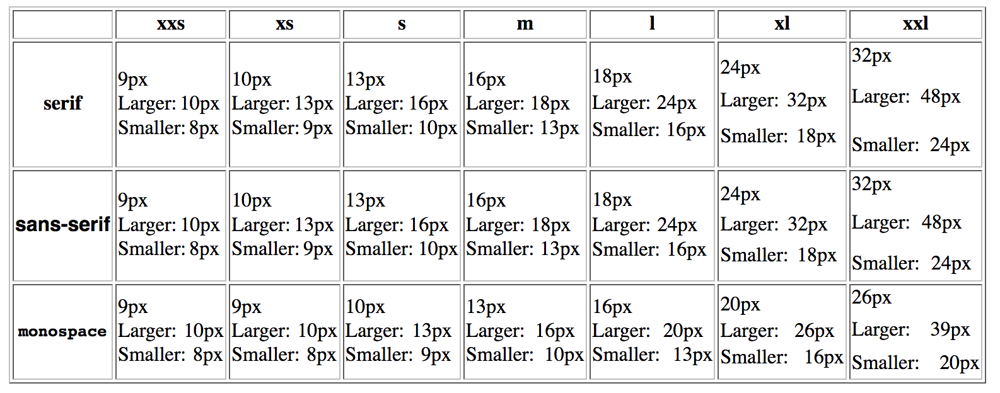

## [轉載] Font-size: An Unexpectedly Complex CSS Property [Back](./../post.md)

> - Author: [Manish Goregaokar](https://github.com/Manishearth)
> - Origin: https://manishearth.github.io/blog/2017/08/10/font-size-an-unexpectedly-complex-css-property/
> - Time: August 10th, 2017

[`font-size`](https://developer.mozilla.org/en/docs/Web/CSS/font-size) is the worst.

It's a CSS property probably everyone who writes CSS has used at some point. It's pretty ubiquitous.

And it's *super* complicated.

"But it's just a number", you say. "How can that be complicated?"

I too felt that way one time. And then I worked on implementing it for [stylo](https://wiki.mozilla.org/Quantum/Stylo).

Stylo is the project to integrate [Servo](http://github.com/servo/servo/)'s styling system into Firefox. The styling system handles parsing CSS, determining which rules apply to which elements, running this through the cascade, and eventually computing and assigning styles to individual elements in the tree. This happens not only on page load, but also whenever various kinds of events (including DOM manipulation) occur, and is a nontrivial portion of pageload and interaction times.

Servo is in [Rust](https://rust-lang.org/), and makes use of Rust's safe parallelism in many places, one of them being styling. Stylo has the potential to bring these speedups into Firefox, along with the added safety of the code being in a safer systems language.

Anyway, as far as the styling system is concerned, I believe that font-size is the most complex property it has to handle. Some properties may be more complicated when it comes to layout or rendering, but font-size is probably the most complex one in the department of styling.

I'm hoping this post can give an idea of how complex the Web can *get* , and also serve as documentation for some of these complexities. I'll also try to give an idea of how the styling system works throughout this post.

Alright. Let's see what is so complex about font-size.

### The basics

The syntax of the property is pretty straightforward. You can specify it as:

* A length (`12px`, `15pt`, `13em`, `4in`, `8rem`)
* A percentage (`50%`)
* A compound of the above, via a calc (`calc(12px + 4em + 20%)`)
* An absolute keyword (`medium`, `small`, `large`, `x-large`, etc)
* A relative keyword (`larger`, `smaller`)

The first three are common amongst quite a few length-related properties. Nothing abnormal in the syntax.

The next two are interesting. Essentially, the absolute keywords map to various pixel values, and match the result of `<font size=foo>` (e.g. `size=3` is the same as `font-size: medium`). The *actual* value they map to is not straightforward, and I'll get to that later in this post.

The relative keywords basically scale the size up or down. The mechanism of the scaling was also complex, however this has changed. I'll get to that too.

### em and rem units

First up: `em` units. One of the things you can specify in *any* length-based CSS property is a value with an `em`or `rem` unit.

`5em` means "5 times the `font-size` of the element this is applied to". `5rem` means "5 times the font-size of the root element"

The implications of this are that font-size needs to be computed before all the other properties (well, not quite, but we'll get to that!) so that it is available during that time.

You can also use `em` units within `font-size` itself. In this case, it computed relative to the font-size of the *parent* element, since you can't use the font-size of the element to compute itself.

### Minimum font size

Browsers let you set a "minimum" font size in their preferences, and text will not be scaled below it. It's useful for those with trouble seeing small text.

However, this doesn't affect properties which depend on font-size via `em` units. So if you're using a minimum font size, `<div style="font-size: 1px; height: 1em; background-color: red">` will have a very tiny height (which you'll notice from the color), but the text will be clamped to the minimum size.

What this effectively means is that you need to keep track of *two* separate computed font size values. There's one value that is used to actually determine the font size used for the text, and one value that is used whenever the style system needs to know the font-size (e.g. to compute an `em` unit.)

This gets slightly more complicated when [ruby](https://en.wikipedia.org/wiki/Ruby_character) is involved. In ideographic scripts (usually, Han and Han-based scripts like Kanji or Hanja) it's sometimes useful to have the pronunciation of each character above it in a phonetic script, for the aid of readers without proficiency in that script, and this is known as "ruby" ("furigana" in Japanese). Because these scripts are ideographic, it's not uncommon for learners to know the pronunciation of a word but have no idea how to write it. An example would be 日 本, which is 日本 ("nihon", i.e. "Japan") in Kanji with ruby にほん in the phonetic Hiragana script above it.

As you can probably see, the phonetic ruby text is in a smaller font size (usually 50% of the font size of the main text [<a id="fnref1" href="#fn1">1</a>] ). The minimum font-size support *respects* this, and ensures that if the ruby is supposed to be `50%`of the size of the text, the minimum font size for the ruby is `50%` of the original minimum font size. This avoids clamped text from looking like 日 本 (where both get set to the same size), which is pretty ugly.

### Text zoom

Firefox additionally lets you zoom text only when zooming. If you have trouble reading small things, it's great to be able to just blow up the text on the page without having the whole page get zoomed (which means you need to scroll around a lot).

In this case, `em` units of other properties *do* get zoomed as well. After all, they're supposed to be relative to the text's font size (and may have some relation to the text), so if that size has changed so should they.

(Of course, that argument could also apply to the min font size stuff. I don't have an answer for why it doesn't.)

This is actually pretty straightforward to implement. When computing absolute font sizes (including keywords), zoom them if text zoom is on. For everything else continue as normal.

Text zoom is also disabled within `<svg:text>` elements, which leads to some trickiness here.

### Interlude: How the style system works

Before I go ahead it's probably worth giving a quick overview of how everything works.

The responsibility of a style system is to take in CSS code and a DOM tree, and assign computed styles to each element.

There's a distinction between "specified" and "computed" here. "specified" styles are in the format you specify in CSS, whereas computed styles are those that get attached to the elements, sent to layout, and inherited from. A given specified style may compute to different values when applied to different elements.

So while you can *specify* `width: 5em`, it will compute to something like `width: 80px`. Computed values are usually a cleaned up form of the specified value.

The style system will first parse the CSS, producing a bunch of rules usually containing declarations (a declaration is like `width: 20%;`; i.e. a property name and a specified value)

It then goes through the tree in top-down order (this is parallelized in Stylo), figuring out which declarations *apply* to each element and in which order -- some declarations have precedence over others. Then it will compute each relevant declaration against the element's style (and parent style, among other bits of info), and store this value in the element's "computed style".

There are a bunch of optimizations that Gecko and Servo do here to avoid duplicated work [<a id="fnref2" href="#fn2">2</a>] . There's a bloom filter for quickly checking if deep descendent selectors apply to a subtree. There's a "rule tree" that helps cache effort from determining applicable declarations. Computed styles are reference counted and shared very often (since the default state is to inherit from the parent or from the default style).

But ultimately, this is the gist of what happens.

### Keyword values

Alright, this is where it gets complicated.

Remember when I said `font-size: medium` was a thing that mapped to a value?

So what does it map to?

Well, it turns out, it depends on the font family. For the following HTML:

```html
<span style="font: medium monospace">text</span>
<span style="font: medium sans-serif">text</span>
```

you get ([codepen](https://codepen.io/aleen42/pen/GddgYB))

<p>
<p data-height="166" data-theme-id="21735" data-slug-hash="GddgYB" data-default-tab="html,result" data-user="aleen42" data-embed-version="2" data-pen-title="GddgYB" class="codepen">See the Pen <a href="https://codepen.io/aleen42/pen/GddgYB/">GddgYB</a> by aleen42 (<a href="https://codepen.io/aleen42">@aleen42</a>) on <a href="https://codepen.io">CodePen</a>.</p>
<script async src="https://static.codepen.io/assets/embed/ei.js"></script>
</p>

where the first one computes to a font-size of 13px, and the second one computes to a font-size of 16px. You can check this in the computed style pane of your devtools, or by using `getComputedStyle()`.

I *think* the reason behind this is that monospace fonts tend to be wider, so the default font size (medium) is scaled so that they have similar widths, and all other keyword font sizes get shifted as well. The final result is something like this:



Firefox and Servo have [a matrix](https://github.com/servo/servo/blob/d415617a5bbe65a73bd805808a7ac76f38a1861c/components/style/properties/longhand/font.mako.rs#L763-L774) that helps derive the values for all the absolute font-size keywords based on the "base size" (i.e. the computed of `font-size: medium`). Actually, Firefox has [three tables](http://searchfox.org/mozilla-central/rev/c329d562fb6c6218bdb79290faaf015467ef89e2/layout/style/nsRuleNode.cpp#3272-3341) to support some legacy use cases like quirks mode (Servo has yet to add support for these tables). We query other parts of the browser for what the "base size" is based on the language and font family.

Wait, but what does the language have to do with this anyway? How does the language impact font-size?

It turns out that the base size depends on the font family *and* the language, and you can configure this.

Both Firefox and Chrome (using an extension) actually let you tweak which fonts get used on a per-language basis, *as well as the default (base) font-size* .

This is not as obscure as one might think. Default system fonts are often really ugly for non-Latin- using scripts. I have a separate font installed that produces better-looking Devanagari ligatures.

Similarly, some scripts are just more intricate than Latin. My default font size for Devanagari is set to 18 instead of 16. I've started learning Mandarin and I've set that font size to 18 as well. Hanzi glyphs can get pretty complicated and I still struggle to learn (and later recognize) them. A larger font size is great for this.

Anyway, this doesn't complicate things too much. This does mean that the font family needs to be computed before font-size, which already needs to be computed before most other properties. The language, which can be set using a `lang` HTML attribute, is internally treated as a CSS property by Firefox since it inherits, and it must be computed earlier as well.

Not too bad. So far.

Now here's the kicker. This *dependence* on the language and family *inherits* .

Quick, what's the font-size of the inner `div`?

```html
<div style="font-size: medium; font-family: sans-serif;"> <!-- base size 16 -->
    font size is 16px
    <div style="font-family: monospace"> <!-- base size 13 -->
        font size is ??
    </div>
</div>
```

For a normal inherited CSS property [<a id="fnref3" href="#fn3">3</a>] , if the parent has a computed value of `16px`, and the child has no additional values specified, the child will inherit a value of `16px`. *Where* the parent got that computed value from doesn't matter.

Here, `font-size` "inherits" a value of `13px`. You can see this below ([codepen](https://codepen.io/aleen42/pen/PeewXx)):

<p>
<p data-height="236" data-theme-id="21735" data-slug-hash="PeewXx" data-default-tab="html,result" data-user="aleen42" data-embed-version="2" data-pen-title="PeewXx" class="codepen">See the Pen <a href="https://codepen.io/aleen42/pen/PeewXx/">PeewXx</a> by aleen42 (<a href="https://codepen.io/aleen42">@aleen42</a>) on <a href="https://codepen.io">CodePen</a>.</p>
<script async src="https://static.codepen.io/assets/embed/ei.js"></script>
</p>

Basically, if the computed value originated from a keyword, whenever the font family or language change, font-size is recomputed from the original keyword with the new font family and language.

The reason this exists is because otherwise the differing font sizes wouldn't work anyway! The default font size is `medium`, so basically the root element gets a `font-size: medium` and all elements inherit from it. If you change to monospace or a different language in the document you need the font-size recomputed.

But it doesn't stop here. This even inherits *through relative units* (Not in IE).

```html
<div style="font-size: medium; font-family: sans-serif;"> <!-- base size 16 -->
    font size is 16px
    <div style="font-size: 0.9em"> <!-- could also be font-size: 50%-->
        font size is 14.4px (16 * 0.9)
        <div style="font-family: monospace"> <!-- base size 13 -->
            font size is 11.7px! (13 * 0.9)
        </div>
    </div>
</div>
```

([codepen](https://codepen.io/aleen42/pen/zjjxbo))

<p>
<p data-height="300" data-theme-id="21735" data-slug-hash="zjjxbo" data-default-tab="html,result" data-user="aleen42" data-embed-version="2" data-pen-title="zjjxbo" class="codepen">See the Pen <a href="https://codepen.io/aleen42/pen/zjjxbo/">zjjxbo</a> by aleen42 (<a href="https://codepen.io/aleen42">@aleen42</a>) on <a href="https://codepen.io">CodePen</a>.</p>
<script async src="https://static.codepen.io/assets/embed/ei.js"></script>
</p>

So we're actually inheriting a font-size of `0.9*medium` when we inherit from the second div, not `14.4px`.

Another way of looking at it is whenever the font family or language changes, you should recompute the font-size as if the language and family *were always that way* up the tree.

Firefox code uses both of these strategies. The original Gecko style system handles this by actually going back to the top of the tree and recalculating the font size as if the language/family were different. I suspect this is inefficient, but the rule tree seems to be involved in making this slightly more efficient

Servo, on the other hand, stores some extra data on the side when computing stuff, data which gets copied over to the child element. It basically stores the equivalent of saying "Yes, this font was computed from a keyword. The keyword was `medium`, and after that we applied a factor of 0.9 to it." [<a id="fnref4" href="#fn4">4</a>]

In both cases, this leads to a bunch of complexities in all the *other* font-size complexities, since they need to be carefully preserved through this.

In Servo, *most* of this gets handled [via custom cascading functions for font-size](https://github.com/servo/servo/blob/53c6f8ea8bf1002d0c99c067601fe070dcd6bcf1/components/style/properties/longhand/font.mako.rs#L964-L1061).

### Larger/smaller

So I mentioned that `font-size: larger` and `smaller` scale the size, but didn't mention by what fraction.

According [to the spec](https://drafts.csswg.org/css-fonts-3/#relative-size-value), if the font-size currently matches the value of an absolute keyword size (medium/large/etc), you should pick the value of the next/previous keyword sizes respectively.

If it is *between* two, find the same point between the next/previous two sizes.

This, of course, must play well with the weird inheritance of keyword font sizes mentioned before. In gecko's model this isn't too hard, since Gecko recalculates things anyway. In Servo's model we'd have to store a sequence of applications of `larger`/`smaller` and relative units, instead of storing just a relative unit.

Additionally, when computing this during text-zoom, you have to unzoom before looking it up in the table, and then rezoom.

Overall, a bunch of complexity for not much gain --- turns out only Gecko actually followed the spec here! All other browser engines used simple ratios here.

So my fix here [was simply to remove this behavior from Gecko](https://bugzilla.mozilla.org/show_bug.cgi?id=1361550). That simplified things.

### MathML

Firefox and Safari support MathML, a markup language for math. It doesn't get used much on the Web these days, but it exists.

MathML has its own complexities when it comes to font-size. Specifically, `scriptminsize`, `scriptlevel`, and `scriptsizemultiplier`.

For example, in MathML, the text in the numerator or denominator of a fraction or the text of a superscript is 0.71 times the size of the text outside of it. This is because the default `scriptsizemultiplier` for MathML elements is 0.71, and these specific elements all get a default scriptlevel of `+1`.

Basically, `scriptlevel=+1` means "multiply the font size by `scriptsizemultiplier`", and `scriptlevel=-1` is for dividing. This can be specified via a `scriptlevel` HTML attribute on an `mstyle` element. You can similarly tweak the (inherited) multiplier via the `scriptsizemultiplier` HTML attribute, and the minimum size via `scriptminsize`.

So, for example:

```html
<math>
    <msup>
        <mi>text</mi>
        <mn>small superscript</mn>
    </msup>
</math><br>
<math> text
    <mstyle scriptlevel=+1> small
        <mstyle scriptlevel=+1> smaller
            <mstyle scriptlevel=-1> small again</mstyle>
        </mstyle>
    </mstyle>
</math>
```

will show as (you will need Firefox to see the rendered version, Safari supports MathML too but the support isn't as good):

([codepen](https://codepen.io/aleen42/pen/deePEd))

<p>
<p data-height="357" data-theme-id="21735" data-slug-hash="deePEd" data-default-tab="html,result" data-user="aleen42" data-embed-version="2" data-pen-title="deePEd" class="codepen">See the Pen <a href="https://codepen.io/aleen42/pen/deePEd/">deePEd</a> by aleen42 (<a href="https://codepen.io/aleen42">@aleen42</a>) on <a href="https://codepen.io">CodePen</a>.</p>
<script async src="https://static.codepen.io/assets/embed/ei.js"></script>
</p>

So this isn't as bad. It's as if `scriptlevel` is a weird `em` unit. No biggie, we know how to deal with those already.

Except you also have `scriptminsize`. This lets you set the minimum font size *for changes caused by `scriptlevel`* .

This means that `scriptminsize` will make sure `scriptlevel` never causes changes that make the font smaller than the min size, but it will ignore cases where you deliberately specify an `em` unit or a pixel value.

There's already a subtle bit of complexity introduced here, `scriptlevel` now becomes another thing that tweaks how `font-size` inherits. Fortunately, in Firefox/Servo internally `scriptlevel` (as are `scriptminsize`and `scriptsizemultiplier`) is also handled as a CSS property, which means that we can use the same framework we used for font-family and language here -- compute the script properties before font-size, and if `scriptlevel` is set, force-recalculate the font size even if font-size itself was not set.

### Interlude: early and late computed properties

In Servo the way we handle dependencies in properties is to have a set of "early" properties and a set of "late" properties (which are allowed to depend on early properties). We iterate the declarations twice, once looking for early properties, and once for late. However, now we have a pretty intricate set of dependencies, where font-size must be calculated after language, font-family, and the script properties, but before everything else that involves lengths. Additionally, font-family has to be calculated after all the other early properties due to another font complexity I'm not covering here.

The way we handle this is to [pull font-size and font-family](https://github.com/servo/servo/blob/53c6f8ea8bf1002d0c99c067601fe070dcd6bcf1/components/style/properties/properties.mako.rs#L3195-L3204) out during the early computation, but not deal with them until [after the early computation is done](https://github.com/servo/servo/blob/53c6f8ea8bf1002d0c99c067601fe070dcd6bcf1/components/style/properties/properties.mako.rs#L3211-L3327).

At that stage we first [handle the disabling of text-zoom](https://github.com/servo/servo/blob/53c6f8ea8bf1002d0c99c067601fe070dcd6bcf1/components/style/properties/properties.mako.rs#L3219-L3233), and then handle [the complexities of font-family](https://github.com/servo/servo/blob/53c6f8ea8bf1002d0c99c067601fe070dcd6bcf1/components/style/properties/properties.mako.rs#L3235-L3277).

We then [compute the font family](https://github.com/servo/servo/blob/53c6f8ea8bf1002d0c99c067601fe070dcd6bcf1/components/style/properties/properties.mako.rs#L3280-L3303). If a font size was specified, we [just compute that](https://github.com/servo/servo/blob/53c6f8ea8bf1002d0c99c067601fe070dcd6bcf1/components/style/properties/properties.mako.rs#L3305-L3309). If it was not, but a font family, lang, or scriptlevel was specified, we [force compute as inherited](https://github.com/servo/servo/blob/53c6f8ea8bf1002d0c99c067601fe070dcd6bcf1/components/style/properties/properties.mako.rs#L3310-L3324), which handles all the constraints.

### Why scriptminsize gets complicated

Unlike with the other "minimum font size", using an `em` unit in any property will calculate the length with the clamped value, not the "if nothing had been clamped" value, when the font size has been clamped with scriptminsize. So at first glance handling this seems straightforward; only consider the script min size when deciding to scale because of scriptlevel.

As always, it's not that simple 😀:

```html
<math>
    <mstyle scriptminsize="10px" scriptsizemultiplier="0.75" style="font-size:20px">
        20px
        <mstyle scriptlevel="+1">
            15px
            <mstyle scriptlevel="+1">
                11.25px
                <mstyle scriptlevel="+1">
                    would be 8.4375, but is clamped at 10px
                    <mstyle scriptlevel="+1">
                        would be 6.328125, but is clamped at 10px
                        <mstyle scriptlevel="-1">
                            This is not 10px/0.75=13.3, rather it is still clamped at 10px
                            <mstyle scriptlevel="-1">
                                This is not 10px/0.75=13.3, rather it is still clamped at 10px
                                <mstyle scriptlevel="-1">
                                    This is 11.25px again
                                    <mstyle scriptlevel="-1">
                                        This is 15px again
                                    </mstyle>
                                </mstyle>
                            </mstyle>
                        </mstyle>
                    </mstyle>
                </mstyle>
            </mstyle>
        </mstyle>
    </mstyle>
</math>
```
([codepen](https://codepen.io/anon/pen/wqepjo))

<p>
<p data-height="209" data-theme-id="21735" data-slug-hash="OZZPKq" data-default-tab="result" data-user="aleen42" data-embed-version="2" data-pen-title="OZZPKq" class="codepen">See the Pen <a href="https://codepen.io/aleen42/pen/OZZPKq/">OZZPKq</a> by aleen42 (<a href="https://codepen.io/aleen42">@aleen42</a>) on <a href="https://codepen.io">CodePen</a>.</p>
<script async src="https://static.codepen.io/assets/embed/ei.js"></script>
</p>

Basically, if you increase the level a bunch of times after hitting the min size, decreasing it by one should not immediately compute `min size / multiplier`. That would make things asymmetric; something with a net script level of `+5` should have the same size as something with a net script level of `+6 -1`, provided the multiplier hasn't changed.

So what happens is that the script level is calculated against the font size *as if scriptminsize had never applied* , and we only use that size if it is greater than the min size.

It's not just a matter of keeping track of the script level at which clamping happened -- the multiplier could change in the process and you need to keep track of that too. So this ends up in creating *yet another font-size value to inherit* .

To recap, we are now at *four* different notions of font size being inherited:

* The main font size used by styling
* The "actual" font size, i.e. the main font size but clamped by the min size
* (In servo only) The "keyword" size; i.e. the size stored as a keyword and ratio, if it was derived from a keyword
* The "script unconstrained" size; the font size as if scriptminsize never existed.

Another complexity here is that the following should still work:

```html
<math>
    <mstyle scriptminsize="10px" scriptsizemultiplier="0.75" style="font-size: 5px">
        5px
        <mstyle scriptlevel="-1">
            6.666px
        </mstyle>
    </mstyle>
</math>
```

([codepen](https://codepen.io/aleen42/pen/OZZVJq))

<p>
<p data-height="241" data-theme-id="21735" data-slug-hash="OZZVJq" data-default-tab="html,result" data-user="aleen42" data-embed-version="2" data-pen-title="OZZVJq" class="codepen">See the Pen <a href="https://codepen.io/aleen42/pen/OZZVJq/">OZZVJq</a> by aleen42 (<a href="https://codepen.io/aleen42">@aleen42</a>) on <a href="https://codepen.io">CodePen</a>.</p>
<script async src="https://static.codepen.io/assets/embed/ei.js"></script>
</p>

Basically, if you were already below the scriptminsize, reducing the script level (to increase the font size) should not get clamped, since then you'd get something too large.

This basically means you only apply scriptminsize if you are applying the script level to a value *greater than* the script min size.

In Servo, all of the MathML handling culminates in [this wonderful function that is more comment than code](https://github.com/servo/servo/blob/53c6f8ea8bf1002d0c99c067601fe070dcd6bcf1/components/style/properties/gecko.mako.rs#L2304-L2403), and some code in the functions near it.

*** ** * ** ***

So there you have it. `font-size` is actually pretty complicated. A lot of the web platform has hidden complexities like this, and it's always fun to encounter more of them.

(Perhaps less fun when I have to implement them 😂)

*Thanks to mystor, mgattozzi, bstrie, and projektir for reviewing drafts of this post*

*** ** * ** ***

<ol>
    <li id="fn1">Interestingly, in Firefox, this number is 50% for all ruby *except* for when the language is Taiwanese Mandarin (where it is 30%). This is because Taiwan uses a phonetic script called Bopomofo, and each Han glyph can be represented as a maximum of 3 Bopomofo letters. So it is possible to choose a reasonable minimum size such that the ruby never extends the size of the glyph below it. On the other hand, pinyin can be up to six letters, and Hiranaga up to (I think) 5, and the corresponding "no overflow" scaling will be too tiny. So fitting them on top of the glyph is not a consideration and instead we elect to have a larger font size for better readability. Additionally, Bopomofo ruby is often set on the side of the glyph instead of on top, and 30% works better there. (h/t @upsuper for pointing this out)<a href="#fnref1">↩</a></li>
    <li id="fn2">Other browser engines have other optimizations, I'm just less familiar with them<a href="#fnref2">↩</a></li>
    <li id="fn3">Some properties are inherited, some are "reset". For example, <code>font-family</code> is inherited --- child elements inherit font family from the parent unless otherwise specified. However <code>transform</code> is not, if you transform an element that does not further transform the children.<a href="#fnref3">↩</a></li>
    <li id="fn4">This won't handle <code>calc</code>s, which is something I need to fix. Fixing this is trivial, you store an absolute offset in addition to the ratio.<a href="#fnref4">↩</a></li>
</ol>
