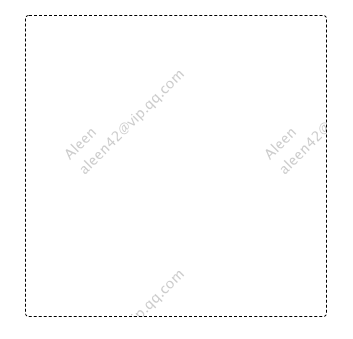

## [原創] Web skills for creating watermarks [Back](../post.md)

<p>
<p class="codepen" data-height="493" data-theme-id="21735" data-default-tab="result" data-user="aleen42" data-slug-hash="VNEmjQ" style="height: 493px; box-sizing: border-box; display: flex; align-items: center; justify-content: center; border: 2px solid black; margin: 1em 0; padding: 1em;" data-pen-title="VNEmjQ">
  <span>See the Pen <a href="https://codepen.io/aleen42/pen/VNEmjQ/">
  VNEmjQ</a> by aleen42 (<a href="https://codepen.io/aleen42">@aleen42</a>)
  on <a href="https://codepen.io">CodePen</a>.</span>
</p>
<script async src="https://static.codepen.io/assets/embed/ei.js"></script>
</p>

I have recently implemented a requirement in which we need Canvas to render watermarks in a site, and I hope to use this document to mark down how the plan was, and what we should concern about. For instance, because watermarks should be placed at the top of any element with a transparent background, how can we avoid its "capturing" users actions, like clicking, selecting, etc. Besides, we should also concern about how to calculate the position of each watermark, with configuring the position of its container. Certainly, the performance of Canvas is another problem, which we need to work around.

When it comes to the compatibility of browsers, watermarks can only be supported over IE 10, as I have used `pointer-event` CSS property (Basic support at IE 11) and Canvas (basic support at IE 8). More details can be checked in the following list:

- [https://caniuse.com/#feat=pointer-events](https://caniuse.com/#feat=pointer-events)
- [https://developer.mozilla.org/kab/docs/Web/HTML/Element/canvas#Browser_compatibility](https://developer.mozilla.org/kab/docs/Web/HTML/Element/canvas#Browser_compatibility)

However, some basic APIs of Canvas are still not supported under IE8, like getting a drawing context with [`HTMLCanvasElement.getContext()`](https://developer.mozilla.org/en-US/docs/Web/API/HTMLCanvasElement/getContext). Finally, I will discuss about compatibility around IE8.

### 1. Avoid Blocking User Actions

To avoid blocking user actions, like clicking buttons, selecting text or scrolling, I have temporarily used a new CSS property named `pointer-event`, with setting it as `none`. However, this should not the best choice as it's only supported over IE 10, which can be really disappointed for us. (_If there is any other suggestion, please contact me._)

### 2. Parameters

During the process of designing a watermark component, one the most important thing for me at that moment was to define its parameters, mainly used for describing what watermarks should be. As for this component, I totally defined 10 parameters for it:

```
 -----------------------------------------
|   |ox: 300(px)|    |                   |   DEBUG_MODE  : debug canvas drawing calculation
|   |___________|      align: left       |   contents    : an array of text contents for drawing watermarks
|  /           /     | alpha: 0.2        |   ox          : different value at axis-x between each watermark region
|  -----       ----    font-size: 30     |   oy          : different value at axis-y between each watermark region
| ||||||\_    ||||||   font-rotate: -45° |   ow (150px)  : the width of each watermark region
| ||||||  |   |||||| | line-height: 1.5x |   oh (150px)  : the height of each watermark region
| ----- \_|oh -----                      |   font-size   : the font size of watermarks
| \    \      \______|                   |   font-rotate : the rotate degree of watermarks
| |_ow_|          |      - - - - - - - - |   line-height : line height of each content
|       -----     |                      |   alpha       : the opacity of contents
|      |||||||    |                      |   align       : the align style of contents
|      |||||||    | oy: 300(px)          |
|      ------     |                      |
|             \___|___                   |
-----------------------------------------
```

- **contents**: a list of contents to construct the content of a watermark. For instance, if we specify `contents` with an array of "xxx" and "xxxxxxx", watermarks will be finally generated two lines of sentences.
- **line-height**: as contents can be specified as more than one line, this parameter should be needed for users to specify how height between each line. (Note: this value does not mean the distance between the bottom side of former line and the top side of next one).
- **font-size**: as the literal meaning, to specify the size of fonts.
- **font-rotate**: in our common sense, watermarks are always rendered obliquely, and that's why we need a parameter to specify the rotate degree.
- **alpha**: mainly used to define the opacity of watermarks.
- **align**: to specify the align style of lines contents.

The other four parameter was mainly used to describe the position of each watermark, as watermarks should be rendered in a repeated way, which were **ox**, **oy**, **ow**, and **oh**.

### 3. Position

Since that, we had known that there were four parameters to define the position, and the next step was to calculate the actual position of rendered watermarks according theses parameters. This process was quite complicated for me to some extend, as I should clearly know the behavior of drawing in Canvas, especially when we need to rotate.

#### 3.1 Text Drawing

CanvasRenderingContext2D interfaces has provided a method named `fillText()` for developers to render text inside a Canvas, and it basically accepts three parameters during calling, among which the second and the third one mainly used to specify the position where you want to fill your text. What if passing zero to both, and we will find that the content does not rendered within the Canvas as expected, and you may ask whether the method does not work? Actually not. According to the official document, this two parameter has respectively described the coordinate of the point where to begin to draw the text, in pixels, but does not clearly tell us the point is at the left top or the left bottom. After some testing, I found that the so-called point was at the left bottom rather than the left top, which meant that I needed to specify a value with the height of current text line to adjust this behavior. To help understand, we can check the following visual case, which have apparently shown how the adjusted value work at the y-coordinate parameter:

<p>
<p data-height="406" data-theme-id="21735" data-slug-hash="RMXXqv" data-default-tab="result" data-user="aleen42" data-embed-version="2" data-pen-title="RMXXqv" class="codepen">See the Pen <a href="https://codepen.io/aleen42/pen/RMXXqv/">RMXXqv</a> by aleen42 (<a href="https://codepen.io/aleen42">@aleen42</a>) on <a href="https://codepen.io">CodePen</a>.</p>
<script async src="https://static.codepen.io/assets/embed/ei.js"></script>
</p>

#### 3.2 Center Alignment

The component was exactly designed as center alignment, which can be optimized in the future by setting a parameter. But if we wanted to render a watermark in the center of an area, which had already been defined with four positional parameters mentioned above, there were a series of calculations to work. Here I just post the formula, and do not dig into why here, and if you have any questions for this equation, you can leave an issue in this project, or directly contact me with e-mails.

```
              x                 fw: textWidth
            x        |  fw  |   fs: fontSize
          x         /      /__  fh: fontSize + lineHeight * rows
     x  x           xxx
   x  x             xxxxxxx __ fh
 x--x----------
 |x    ow     x
 | ---------x               dx = ow/2-fw/2+ow/2*(1-cos)/cos-(oh/2+ow/2)*sin
 | |      x|                   = ow/2*(1-sin*cos)/cos-fw/2-oh/2*sin
 | | x  x  |  oh
 | x  x    |
 x -x-------                dy = (oh/2+ow/2)*sin-fh/2+fs*cos
```

Another POC:

<p>
<p class="codepen" data-height="456" data-theme-id="21735" data-default-tab="js,result" data-user="aleen42" data-slug-hash="KRPPVW" style="height: 456px; box-sizing: border-box; display: flex; align-items: center; justify-content: center; border: 2px solid black; margin: 1em 0; padding: 1em;" data-pen-title="KRPPVW">
  <span>See the Pen <a href="https://codepen.io/aleen42/pen/KRPPVW/">
  KRPPVW</a> by aleen42 (<a href="https://codepen.io/aleen42">@aleen42</a>)
  on <a href="https://codepen.io">CodePen</a>.</span>
</p>
<script async src="https://static.codepen.io/assets/embed/ei.js"></script>
</p>

Then, with a clear formula, we can loop to draw now:

```js
const _draw = () => {
    /** ... */
    for (let x = 0; x < canvas.width; x += ox) {
        for (let y = 0; y < canvas.height; y += oy) {
            /** ... */

            /** render context */
            context.fillText(content, dx, dy);
        }
    }
};
```

During drawing, we had handled two special cases. One was that a watermark with single color could be easily eliminated visually by setting the background with the same color, and the other one was that contents could be reduplicated in the same position while there were long contents. To avoid them, the first thing we did were to stroke again with another color, so that we could restore text even if the background color was lost. Besides, translated pivot according to the current row, with a given distance like a half of `ox`, had given us a great favor to solve the problem of reduplication as the following snippet shown:

```js
/** translate pivot when it is an odd row */
context.translate(x + (y / oy + 1) % 2 * (ox / 2), y);
```

Certainly, after creating a new Canvas element with script, context won't be ready to draw in some browsers, and I solved this strange situation by putting the logic into another event loop:

```js
setTimeout(_draw);
```

So far has we already known how to render watermarks with specifying the coordinate value after some calculations, and to repeatedly draw. However, the limitation of Canvas has forbidden us from drawing steadily what if needing to generate watermarks on a long page. That is the reason that we still need to talk about the relationship between performances and spaces in next session.

### 4. Performances or Spaces

According to data researched at October 13rd, 2014, all tested browsers had limitations in terms of size of a Canvas element, and the maximum value was not different at all.

| &nbsp;               |       Chrome       |      Firefox       |      IE      |  IE Mobile   |
|:---------------------|:------------------:|:------------------:|:------------:|:------------:|
| Maximum height/width |   32,767 pixels    |   32,767 pixels    | 8,192 pixels | 4,096 pixels |
| Maximum area         | 268,435,456 pixels | 472,907,776 pixels |     N/A      |     N/A      |

According to a [guide](https://developer.apple.com/library/safari/documentation/AppleApplications/Reference/SafariWebContent/CreatingContentforSafarioniPhone/CreatingContentforSafarioniPhone.html#//apple_ref/doc/uid/TP40006482-SW15) under section "Know iOS Resource Limits", we clearly know the following conclusion:

> The maximum size for a canvas element is 3 megapixels for devices with less than 256 MB RAM and 5 megapixels for devices with greater or equal than 256 MB RAM.

The limitation size all depends on strategies of different browsers, to avoid using too much local memory. In such a situation, we need to find a way to workaround this limitation by giving up a few performances, and that is why we all said that, we can not satisfy both performances and spaces at the same time.

In this watermark component, I have designed another parameter named "reserved ratio" to specify how many spaces we need more to do a trade-off. In theory, this so-called reserved area should be set with more than `2ox * 2oy` size to guarantee that watermarks can full fill the whole window. Nevertheless, the lowest size should be more than `9ox * 9oy` if we want to support iOS Safari. Therefore, **9** is our final choice for the ratio value.

Since we gave up some performances to workaround this problem, we also needed to set the offset of the Canvas element to make sure that watermarks can be rendered synchronously as scrolling. By the way, we should take this situation into consideration, while the scrollable elements are different corresponding to x-coordinate and y-coordinate.

```js
if (scrollElements.x === scrollElements.y) {
    scrollElements.x.scroll(checkCanvasPosition.bind(null, ''));
} else {
    scrollElements.x.scroll(checkCanvasPosition.bind(null, 'x'));
    scrollElements.y.scroll(checkCanvasPosition.bind(null, 'y'));
}
```

Oops, because of the pivot translation on odd rows, we should also need to ensure that checking position with a distance of even `ox` or `oy`.

### 5. Generated by Servers

Canvas is not completely supported Under IE8, and the only alternative is to generate watermarks by servers, and render it with CSS. In this way, we may only need to generate an image wrapped in the center of a container, as shown in the following figure:

<p align="center">

</p>

And then, we can repeat it with CSS easily by using `background-repeat`:

```css
.wrapper {
    background: url(xxx.jsp);
}
```

<p align="center">

</p>

If you want to check the demo code written with `java.awt`, you can check the snippet [here](https://github.com/aleen42/watermarks/blob/master/watermark.jsp).

### 6. Summary

Watermarks are actually an interesting thing when we try to implement ourselves, and during the process of implementation, we can learn a lot of things, like solving some the problem of space limitations, or of position calculations. If you want my source code, please wait for its releasing within a separate project later.
