## [轉載] Discover the Full Story of City's Buildings [Back](./../post.md)

> - Author: [The Design Inspiration](https://github.com/gorkamolero)
> - Origin: http://thedesigninspiration.com/articles/discover-the-full-story-of-citys-buildings/ 
> - Time: Jun, 28th, 2014

The purpose of the "Discover the Full Story" campaign, designed by [Saatchi &amp; Saatchi Russia](http://saatchi.ru/ru-ru/), is to tell about the wonderful museum in collections that reflect the architectural heritage of a thousand-year history of Russia. This shows us that there is a different story behind the facade of each building.

Our knowledge is just the tip of the iceberg. The project draws attention to Muscovites and tourists on the history of Moscow, its architectural heritage, inviting to visit the museum and view the complete history of the city's buildings.

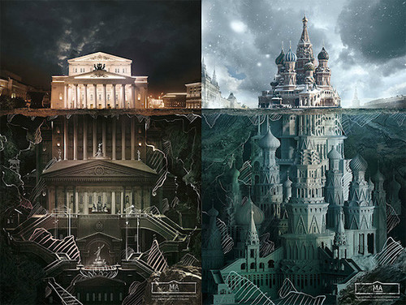

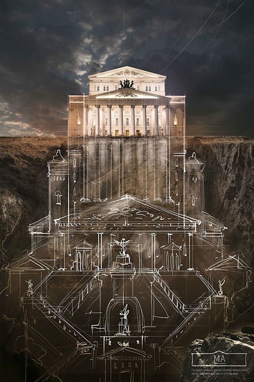

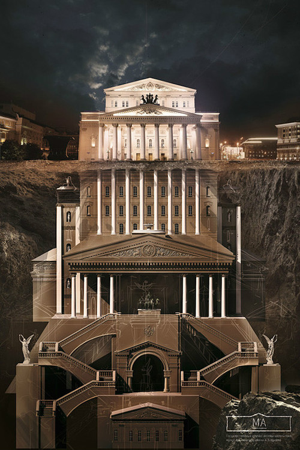

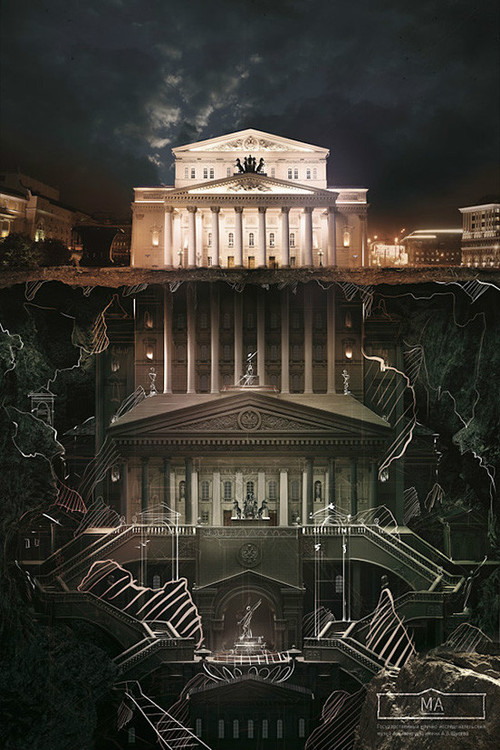

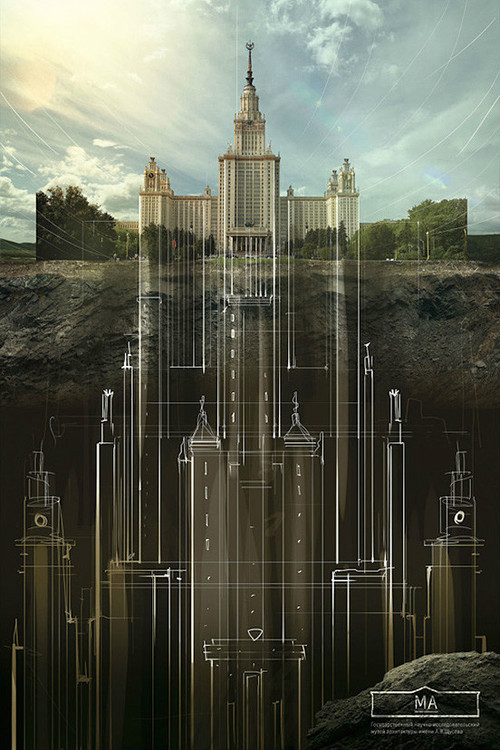

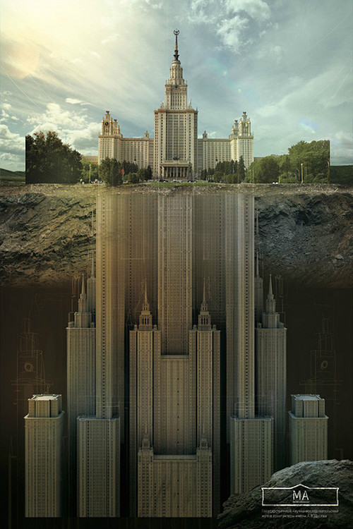

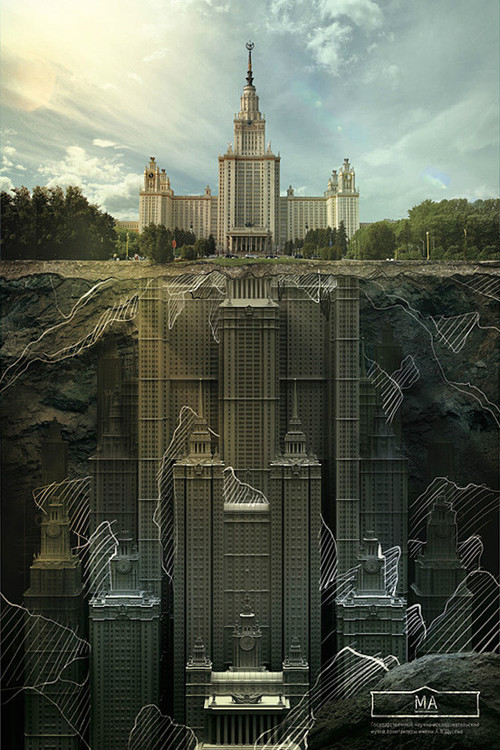

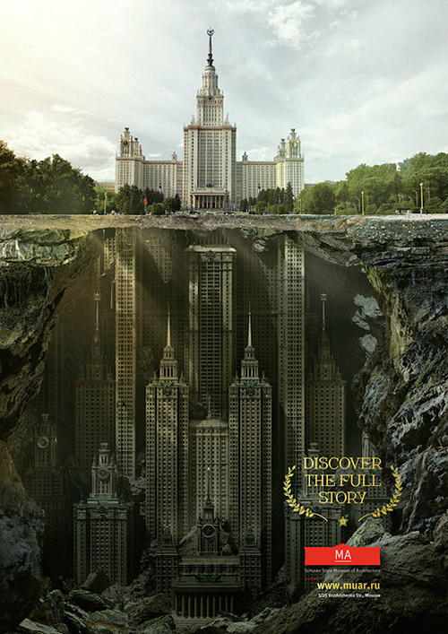

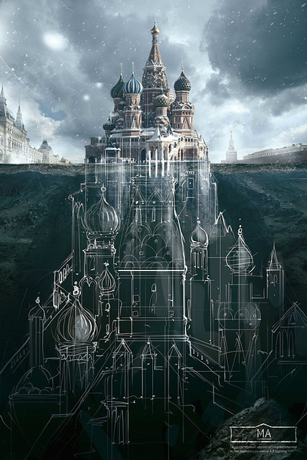

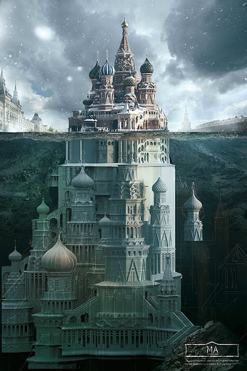

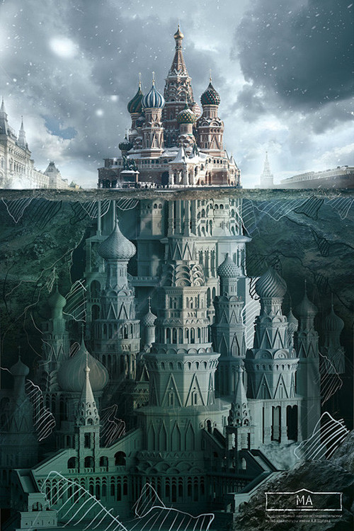

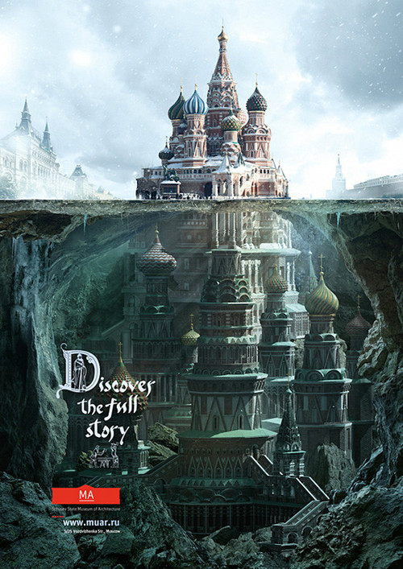

