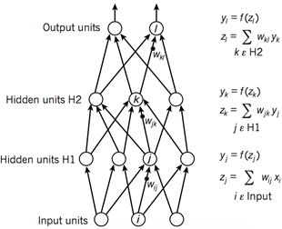
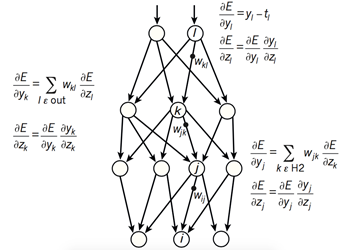
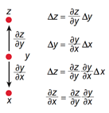
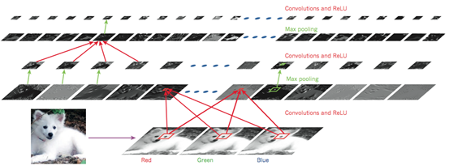
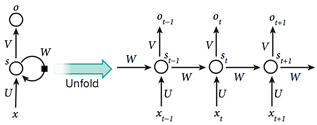
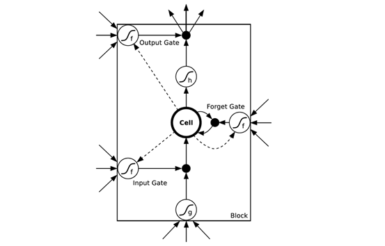
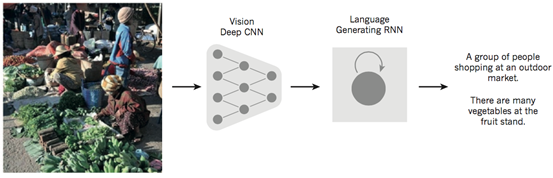

## [轉載] 從圖像到知識: 深度神經網絡實現圖像理解的原理解析 [Back](./../post.md)

> - Author: [xinchrome](http://www.cnblogs.com/xinchrome/)
> - Origin: http://www.cnblogs.com/xinchrome/p/5661884.html
> - Time: Jul, 11st, 2016

**摘要**：本文将详细解析深度神经网络识别图形图像的基本原理。针对卷积神经网络，本文将详细探讨网络中每一层在图像识别中的原理和作用，例如卷积层(convolutional layer)，采样层(pooling layer)，全连接层(hidden layer)，输出层(softmax output layer)。针对递归神经网络，本文将解释它在序列数据上表现出的强大能力。针对通用的深度神经网络模型，本文也将详细探讨网络的前馈和学习过程。卷积神经网络和递归神经网络的结合形成的深度学习模型甚至可以自动生成针对图片的文字描述。作为近年来重新兴起的技术，深度学习已经在诸多人工智能领域取得了令人瞩目的进展，但是神经网络模型的可解释性仍然是一个难题，本文从原理的角度探讨了用深度学习实现图像识别的基本原理，详细解析了从图像到知识的转换过程。

### **1 引言**

传统的机器学习技术往往使用原始形式来处理自然数据，模型的学习能力受到很大的局限，构成一个模式识别或机器学习系统往往需要相当的专业知识来从原始数据中（如图像的像素值）提取特征，并转换成一个适当的内部表示。而深度学习则具有自动提取特征的能力，它是一种针对表示的学习。

深度学习允许多个处理层组成复杂计算模型，从而自动获取数据的表示与多个抽象级别。这些方法大大推动了语音识别，视觉识别物体，物体检测，药物发现和基因组学等领域的发展。通过使用BP算法，深度学习有能力发现在大的数据集的隐含的复杂结构。

“表示学习”能够从原始输入数据中自动发现需要检测的特征。深度学习方法包含多个层次，每一个层次完成一次变换（通常是非线性的变换），把某个较低级别的特征表示表示成更加抽象的特征。只要有足够多的转换层次，即使非常复杂的模式也可以被自动学习。对于图像分类的任务，神经网络将会自动剔除不相关的特征，例如背景颜色，物体的位置等，但是会自动放大有用的特征，例如形状。图像往往以像素矩阵的形式作为原始输入，那么神经网络中第一层的学习功能通常是检测特定方向和形状的边缘的存在与否，以及这些边缘在图像中的位置。第二层往往会检测多种边缘的特定布局，同时忽略边缘位置的微小变化。第三层可以把特定的边缘布局组合成为实际物体的某个部分。后续的层次将会把这些部分组合起来，实现物体的识别，这往往通过全连接层来完成。对于深度学习而言，这些特征和层次并不需要通过人工设计：它们都可以通过通用的学习过程得到。

### **2 神经网络的训练过程**

如图1所示，深度学习模型的架构一般是由一些相对简单的模块多层堆叠起来，并且每个模块将会计算从输入到输出的非线性映射。每个模块都拥有对于输入的选择性和不变性。一个具有多个非线性层的神经网络通常具有5〜20的深度，它将可以选择性地针对某些微小的细节非常敏感，同时针对某些细节并不敏感，例如为背景。

在模式识别的初期，研究者们就希望利用可训练的多层网络来代替手工提取特征的功能，但是神经网络的训练过程一直没有被广泛理解。直到20世纪80年代中期，研究者才发现并证明了，多层架构可以通过简单的随机梯度下降来进行训练。只要每个模块都对应一个比较平滑的函数，就可以使用反向传播过程计算误差函数对于参数梯度。

图1 神经网络的前馈过程

图2 神经网络的反向误差传播过程

图3 链式法则

如图2所示，复杂神经网络基于反向传播过程来计算目标函数相对于每个模块中的参数的梯度。反向传播过程的数学原理即为链式法则，如图3所示。目标函数相对于每个模块的梯度具有一定的独立性，这是链式法则的关键，目标函数相对于一个模块的输入的梯度可以在计算出目标函数相对于这个模块输出的梯度之后被计算，反向传播规则可以反复施加通过所有模块传播梯度，从而实现梯度（亦即误差）的不断反向传播，从最后一层一直传播到原始的输入。

在90年代后期，神经网络和以及其它基于反向传播的机器学习领域在很大程度上为人诟病，计算机视觉和语音识别社区也忽略了这样的模型。人们普遍认为，学习很少先验知识是有用的，多阶段的自动特征提取是不可行的。尤其是简单的梯度下降将得到局部极小值，这个局部极小值和全局最小值可能相差甚远。

但是在实践中，局部最优很少会成为大型网络的一个问题。实践证明，不管初始条件，系统几乎总是达到非常接近的结果。一些最近的理论和实证研究结果也倾向于表明局部最优不是一个严重问题。相反，模型中会存在大量鞍点，在鞍点位置梯度为0，训练过程会滞留在这些点上。但是分析表明，大部分鞍点都具有想接近的目标函数值，因此，它训练过程被卡在哪一个鞍点上往往并不重要。

前馈神经网络有一种特殊的类型，即为卷积神经网络（CNN）。人们普遍认为这种前馈网络是更容易被训练并且具有更好的泛化能力，尤其是图像领域。卷积神经网络已经在计算机视觉领域被广泛采用。

### **3 卷积神经网络与图像理解**

卷积神经网络（CNN）通常被用来张量形式的输入，例如一张彩色图象对应三个二维矩阵，分别表示在三个颜色通道的像素强度。许多其它输入数据也是张量的形式：如信号序列、语言、音频谱图、3D视频等等。卷积神经网络具有如下特点：局部连接，共享权值，采样和多层。

如图4所示，一个典型CNN的结构可以被解释为一系列阶段的组合。最开始的几个阶段主要由两种层组成：卷积层(convolutional layer)和采样层(pooling layer)。卷积层的输入和输出都是多重矩阵。卷积层包含多个卷积核，每个卷积核都是一个矩阵，每一个卷积核相当于是一个滤波器，它可以输出一张特定的特征图，每张特征图也就是卷积层的一个输出单元。然后通过一个非线性激活函数（如ReLU）进一步把特征图传递到下一层。不同特征图使用不同卷积核，但是同一个特征图中的不同位置和输入图之间的连接均为共享权值。这样做的原因是双重的。首先，在张量形式的数据中（例如图像），相邻位置往往是高度相关的，并且可以形成的可以被检测到的局部特征。其次，相同的模式可能出现在不同位置，亦即如果局部特征出现在某个位置，它也可能出现在其它任何位置。在数学上，根据卷积核得到特征图的操作对应于离散卷积，因此而得名。

图 4 卷积神经网络与图像理解

事实上有研究表明无论识别什么样的图像，前几个卷积层中的卷积核都相差不大，原因在于它们的作用都是匹配一些简单的边缘。卷积核的作用在于提取局部微小特征，如果在某个位置匹配到了特定的边缘，那么所得到的特征图中的这个位置就会有较大的强度值。如果多个卷积核在临近的位置匹配到了多个特征，那么这些特征就组合成为了一个可识别的物体。对于现实世界中的图像而言，图形常常都是由很多简单的边缘组成，因此可以通过检测一系列简单边缘的存在与否实现物体的识别。

卷积层的作用是从前一层的输出中检测的局部特征，不同的是，采样层的作用是把含义相似的特征合并成相同特征，以及把位置上相邻的特征合并到更接近的位置。由于形成特定主题的每个特征的相对位置可能发生微小变化，因此可以通过采样的方法输入特征图中强度最大的位置，减小了中间表示的维度（即特征图的尺寸），从而，即使局部特征发生了一定程度的位移或者扭曲，模型仍然可以检测到这个特征。CNN的梯度计算和参数训练过程和常规深度网络相同，训练的是卷积核中的所有参数。

自上世纪90年代初以来，CNN已经被应用到诸多领域。，在90年代初，CNN就已经被应用在自然图像，脸和手的检测，面部识别和物体检测中。人们还使用卷积网络实现语音识别和文档阅读系统，这被称为时间延迟神经网络。这个文档阅读系统同时训练了卷积神经网络和用于约束自然语言的概率模型。此外还有许多基于CNN的光学字符识别和手写识别系统。

### **4 递归神经网络与自然语言理解**

当涉及到处理不定长序列数据（如语音，文本）时，使用递归神经网络（RNN）更加自然。不同于前馈神经网络，RNN具有内部状态，在其隐藏单元中保留了“状态矢量”，隐式地包含了关于该序列的过去的输入信息。当RNN接受一个新的输入时，会把隐含的状态矢量同新的输入组合起来，生成依赖于整个序列的输出。RNN和CNN可以结合起来，形成对图像的更全面准确的理解。

图5 递归神经网络

如图5所示，如果我们把递归神经网络按照不同的离散时间步展开，把不同时间步的输出看作是网络中不同神经元的输出，那么RNN就可以被看做是一个很深的前馈神经网络，也就可以应用常规的反向传播过程训练这一网络，这种按照时间步反向传播的方法被称为BPTT(Back Propagation Through Time)。但是尽管RNN是非常强大的动态系统，它的训练过程仍会遇到一个很大的问题，因为梯度在每个时间步可能增长也可能下降，所以在经过许多时间步的反向传播之后，梯度常常会爆炸或消失，网络的内部状态对于长远过去输入的记忆作用十分微弱。

解决这个问题的一种方案是在网络中增加一个显式的记忆模块，增强网络对于长远过去的记忆能力。长短时记忆模型（LSTM）就是这样一类模型，LSTM引入的一个核心元素就是Cell。LSTM网络已被证明比常规RNN更有效，尤其是在网络中每个时间步都具有若干层的时候。

图6 长短时记忆模型

如图6所示，在LSTM的网络结构中，前一层的输入会通过更多的路径作用于输出，门（Gate）的引入使得网络具有了聚焦作用。LSTM可以更加自然地记住很长一段时间之前的输入。存储单元Cell是一个特殊的单元，作用就像一个累加器或一个“gated leaky neuron”：这个单元具有从上一个状态到下一个状态之间的直接连接，所以它可以复制自身的当前状态并累积所有的外部信号，同时由于遗忘门（Forget Gate）的存在，LSTM可以学习决定何时清除存储单元的内容。

### **5 图片描述的自动生成**

如图7所示，深度学习领域的一个匪夷所思的Demo结合了卷积网络和递归网络实现图片标题的自动生成。首先通过卷积神经网络（CNN）理解原始图像，并把它转换为语义的分布式表示。然后，递归神经网络（RNN）会把这种高级表示转换成为自然语言。

图7 图片描述的自动生成

除了利用RNN的记忆机制（memory），还可以增加聚焦机制（attention），通过把注意力放在图片的不同部位，从而把图片翻译成不同的标题。聚焦机制甚至可以让模型更加可视化，类似于RNN机器翻译的聚焦机制，在通过语义表示生成词语的同时我们能解释模型正在关注哪个部分。

### **6 未来展望**

无监督学习曾经促进了深度学习领域的复兴，但纯粹的监督学习的所取得的巨大成功掩盖了其作用。我们期待无监督学习能成为在长期看来的更重要的方法。人类和动物的学习主要是无监督的方式：我们通过自主地观察世界而不是被告知每个对象的名称来发现世界的结构。我们期待未来大部分关于图像理解的进步来自于训练端到端的模型，并且将常规的CNN和使用了强化学习的RNN结合起来，实现更好的聚焦机制。深度学习和强化学习系统的结合目前还处于起步阶段，但他们已经在分类任务上超越了被动视觉系统，并在学习视频游戏领域中取得了不俗的成绩。

### **参考文献**

1. Krizhevsky, A., Sutskever, I. & Hinton, G. ImageNet classification with deep convolutional neural networks. In Proc. Advances in Neural Information Processing Systems 25 1090–1098 (2012).

2. Hinton, G. et al. Deep neural networks for acoustic modeling in speech recognition. IEEE Signal Processing Magazine 29, 82–97 (2012).

3. Sutskever, I. Vinyals, O. & Le. Q. V. Sequence to sequence learning with neural networks. In Proc. Advances in Neural Information Processing Systems 27 3104–3112 (2014).

4. Fredkin, E.: Trie memory. Communications of the ACM 3(9), 490–499 (1960)

5. Glorot, X., Bordes, A., Bengio, Y.: Deep sparse rectifier neural networks. In: International Conference on Artificial Intelligence and Statistics. pp. 315–323 (2011)

6. He, K., Zhang, X., Ren, S., Sun, J.: Delving deep into rectifiers: Surpassing human-level performance on imagenet classification. In: ICCV (2015)

7. Herlihy, M., Shavit, N.: The art of multiprocessor programming. Revised Reprint (2012)

8. Hinton, G.E., Srivastava, N., Krizhevsky, A., Sutskever, I., Salakhutdinov, R.R.: Improving neural networks by preventing co-adaptation of feature detectors. arXiv preprint arXiv:1207.0580 (2012)

9. Jelinek, F.: Interpolated estimation of markov source parameters from sparse data. Pattern recognition in practice (1980)

10. Kingma, D.P., Adam, J.B.: A method for stochastic optimization. In: International Conference on Learning Representation (2015)

11. Lai, S., Liu, K., Xu, L., Zhao, J.: How to generate a good word embedding? arXiv preprint arXiv:1507.05523 (2015)

12. Maas, A.L., Hannun, A.Y., Ng, A.Y.: Rectifier nonlinearities improve neural net- work acoustic models. In: Proc. ICML. vol. 30, p. 1 (2013)

13. Mikolov, T., Deoras, A., Kombrink, S., Burget, L., Cernocky, J.: Empirical evalu- ation and combination of advanced language modeling techniques. Proceedings of Interspeech pp. 605–608 (2011)

14. Mikolov, T., Chen, K., Corrado, G., Dean, J.: Efficient estimation of word repre- sentations in vector space. arXiv preprint arXiv:1301.3781 (2013)

15. Mnih, A., Hinton, G.: A scalable hierarchical distributed language model (2009)

16. Mnih, A., Teh, Y.W.: A fast and simple algorithm for training neural probabilistic language models (2012)