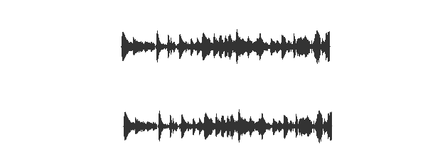

## [轉載] Drawing Audio Waveforms [Back](./../post.md)

> * Author: [Joe Sullivan](https://twitter.com/itsjoesullivan)
> * Origin: [http://joesul.li/van/2014/03/drawing-waveforms/](http://joesul.li/van/2014/03/drawing-waveforms/)

Working on [scat.io](http://scat.io/) I ran into the interesting issue of rendering audio waveforms on-screen. This is a walkthrough of my trial-and-error method of figuring out a good way to accomplish that using d3 and the Web Audio API.

### The data

We receive the audio data in the form of a typed array, like:

```
[ 0, 0.0253245, 0.0452343, ... ]
```

Audio data is that simple. Practically speaking, the values of the array correspond to the position of a speaker. At 44100 frames per second, it hardly sounds digital at all.

So far so good, except for those pesky 44100 frames for every second of audio...

### Boiling it down

So let's pare down this data. We don't reasonably need more data than we can display on the screen. In other words, we only need an array of values with length equal to the number of pixels along the x-axis.

```js
function summarize( data, pixels ) {
    var pixelLength = Math.round(data.length/pixels);
    var vals = []; // For each pixel we display
    for (var i = 0; i < pixels; i++) {
        var posSum = 0,
            negSum = 0;

        // Cycle through the data-points relevant to the pixel
        for (var j = 0; j < pixelLength; j++) {
            var val = data[ i * pixelLength + j ];

            // Keep track of positive and negative values separately
            if (val > 0) {
                posSum += val;
            } else {
                negSum += val;
            }
        }
        vals.push( [ negSum / pixelLength, posSum / pixelLength ] );
    }
    return vals;
}
```

Rendering

First I gave it the old college try:

```js
function render1() {
    var multiplier = 100;
    var summary = summarize(data, 100);
    d3.select('#ex1')
        .selectAll('div')
        .data( summary )
        .enter()
        .append('div')
        .style('height', function( pt ) {
            var sum = pt[1] - pt[0];
            return sum * multiplier + 'px';
        });
}
```

Resulting in:


Not bad--obviously we're looking at audio data. But it's not symmetrical. Let's center those lines:

```js
function render2() {
    var multiplier = 100;
    var summary = summaraize(data, 200);
    d3.select('#ex1')
        .selectAll('div')
        .data( summary )
        .enter()
        .append('div')
        .style('height', function( pt ) {
            var sum = pt[1];
            return sum * multiplier + 'px';
        })
        .style('margin-top', function( pt ) {
            var sum = pt[1]/2;
            return - sum * multiplier + 'px';
        });
}
```

Result:


Even better. However, we're not really being honest here because we're just mirroring the waveform, ignoring the 50% of the data beneath zero. (Now you can see why `summarize` tallies positive and negative datapoints separately.)

```js
function render3() {
    var multiplier = 200;
    var summary = summarize(data, 300);
    d3.select('#ex3')
        .selectAll('div')
        .data( summary )
        .enter()
        .append('div')
        .style('height', function( pt ) {
            var sum = pt[1] - pt[0];
            return sum * multiplier + 'px';
        })
        .style('margin-top', function( pt ) {
            return - pt[1] * multiplier + 'px';
        });
}
```

Result:


Ahh. Pleasantly imperfect. This is the algorithm I pretty much stuck with.

### Further considerations

#### Performance

Now, keep in mind that it took my modest machine under 10ms to draw each of these waveforms. The way my original `summarize` code is written, however, that duration will scale with audio clip length--the majority of the processing time is spent looping through the audio clip.

But luckily we aren't concerned with what each individual audio frame says; we just want enough of a snapshot to draw an accurate pixel. In other words, rendering audio waveforms should be limited by the dimensions of the rendering, not the length of the clip.

So let's define a `maxSampleSize` which limits how many frames we count per pixel:

```js
function summarizeFaster( data, pixels ) {
    var pixelLength = Math.round(data.length/pixels);
    var vals = [];

    // Define a minimum sample size per pixel
    var maxSampleSize = 1000;
    sampleSize = Math.min(pixelLength, maxSampleSize);

    // For each pixel we display
    for (var i = 0; i < pixels; i++) {
        var posSum = 0,
            negSum = 0;

        // Cycle through the data-points relevant to the pixel
        // Don't cycle through more than sampleSize frames per pixel.
        for (var j = 0; j < sampleSize; j++) {
            var val = data[ i * pixelLength + j ];

            // Keep track of positive and negative values separately
            if (val > 0) {
                posSum += val;
            } else {
                negSum += val;
            }
        }
        vals.push( [ negSum / sampleSize, posSum / sampleSize ] );
    }
    return vals;
}
```

Results:


It looks almost as good and will render audio clips of any length quickly.

### Anti-aliasing

At least I think that's what it's called. Below are two versions of the previous dataset. The first is rendered precisely as above. The second uses some anti-aliasing by rendering the top and bottom pixel of each sample "grey", corresponding to the actual decimal remainder value accorded to the top/bottom pixels. I'm pretty impressed.



```js
function render5() {
    var multiplier = 200;
    var summary = summarizeFaster(data, 300);
    d3.select('#ex5b')
        .selectAll('div')
        .data( summary )
        .enter()
        .append('div')
        .style('height', function( pt ) {
            var sum = pt[1] - pt[0];
            return Math.floor(sum * multiplier - 2) + 'px';
        })
        .style('margin-top', function( pt ) {
            return - Math.floor(pt[1] * multiplier) + 'px';
        })
        .style('border-top', function( pt ) {
            var remainder = pt[1] * multiplier % 1;
            var val = Math.floor( (1 - remainder) * 256 );
            var str = '1px solid rgb(' + val + ',' + val + ',' + val + ')';
            return str;
        })
        .style('border-bottom', function( pt ) {
            var remainder = Math.abs(pt[0] * multiplier % 1);
            var val = Math.floor( (1 - remainder) * 256 );
            var str = '1px solid rgb(' + val + ',' + val + ',' + val + ')';
            return str;
        })
}
```

### SVG

Ok, you may be wondering why I haven't been drawing these as SVGs the whole time. Well, I hadn't quite figured SVGs out yet. But after a a few minutes with [Scott Murray's great D3 tutorial](http://alignedleft.com/tutorials/d3/drawing-svgs) I am feeling more comfortable with them. Here's the SVG version. I draw at twice the resolution as before and my aliasing concerns are behind me.

```js
function renderSVG() {
    var summary = summarizeFaster(data, 600);
    var multiplier = 200;
    var w = 0.5;
    d3.select('#ex6')
        .append('svg')
        .attr('width', 300)
        .attr('height', 150)
        .selectAll('circle')
        .data( summary )
        .enter()
        .append('rect')
        .attr('x', function(d, i) {
            return ( i * w ) + 25;
        })
        .attr('y', function(d, i) {
            return 50 - (multiplier * d[1] );
        })
        .attr('width', w)
        .attr('height', function(d) {
            return multiplier*(d[1] - d[0]);
        });
}
```

Tadaaa:


