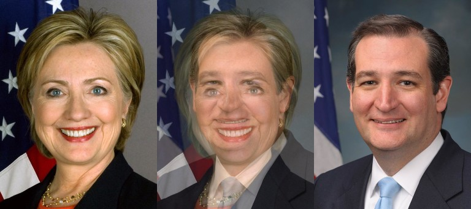
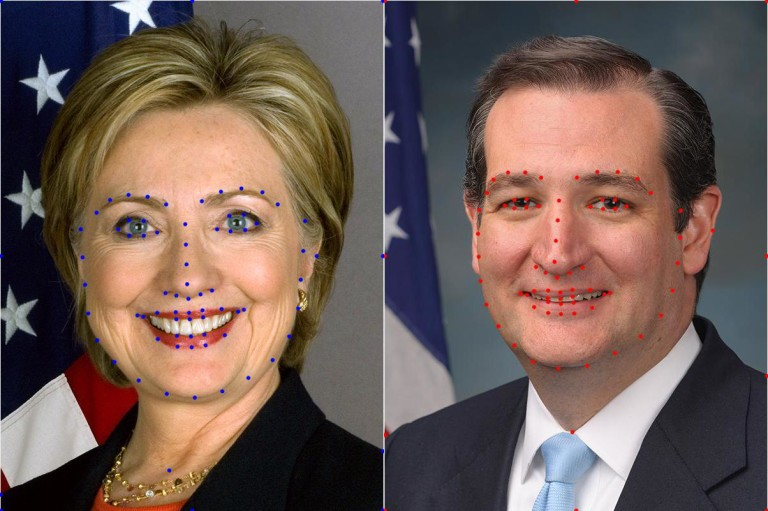
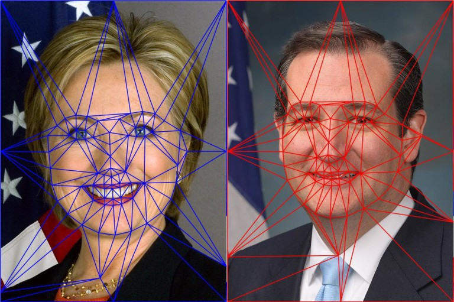

## [轉載] Face Morph Using OpenCV — C++ / Python [Back](./../post.md)

> - Author: [SATYA MALLICK](http://www.learnopencv.com/about/)
- Origin: http://www.learnopencv.com/face-morph-using-opencv-cpp-python/
- Time: Mar, 11st, 2016

In this tutorial we will learn how to morph one face into another using OpenCV.

I have chosen to use the photos of the top three American Presidential candidates, but this is not a political post and I have no political agenda. And yes, that is the prettiest picture of Donald Trump I could find!

> You can [download](http://www.learnopencv.com/face-morph-using-opencv-cpp-python/#download) the code and images used in this post by subscribing to our newsletter [here](http://www.learnopencv.com/face-morph-using-opencv-cpp-python/#download).

In my previous posts I have covered [Facial Landmark Detection](http://www.learnopencv.com/facial-landmark-detection/) and [Delaunay Triangulation](http://www.learnopencv.com/delaunay-triangulation-and-voronoi-diagram-using-opencv-c-python/). It is a good idea to review those posts to better understand this one.

### Image Morphing

Image morphing was first used extensively in the movie Willow using a technique developed at Industrial Light and Magic. A scene from the movie is shown below.

The idea behind Image Morphing is rather simple. Given two images $$I$$ and $$J$$ we want to create an in-between image $$M$$ by blending images $$I$$ and $$J$$. The blending of images $$I$$ and $$J$$ is controlled by a parameter $$\alpha$$ that is between 0 and 1 $$( 0 \leq \alpha \leq 1 )$$. When $$\alpha$$ is 0, the morph $$M$$ looks like $$I$$, and when $$\alpha$$ is 1, $$M$$ looks exactly like $$J$$. Naively, you can blend the images using the following equation at every pixel $$(x, y)$$

$$M (x, y) = ( 1 - \alpha ) I (x, y) + \alpha J (x , y)$$

However, using the above equation to generate a blend between the image of Secretary Hillary Clinton and Senator Ted Cruz with $$\alpha$$ set to 0.5, you will get the following terrible results.

The resulting image is disturbing, but it also screams a solution at you. It begs you to somehow align the eyes and the mouth before blending the images. You get similar disturbing results when you try to blend two different political ideologies without first aligning the minds, but I digress.

So, to morph image $$I$$ into image $$J$$ we need to first establish pixel correspondence between the two images. In other words, for every pixel $$(x_i, y_i)$$ in image $$I$$, we need to find it’s corresponding pixel $$(x_j, y_j)$$ in image $$J$$. Suppose we have magically found these correspondences, we can blend the images in two steps. First, we need to calculate the location $$(x_m, y_m)$$ of the pixel in the morphed image. It is given by the following equation

$$\begin{align*}  x_m &= (1 - \alpha) x_i + \alpha x_j \\ y_m &= (1 - \alpha) y_i + \alpha y_j \end{align*}$$

Second, we need to find the intensity of the pixel at (x_m, y_m) using the following equation

$$\begin{equation*} M(x_m,y_m) = (1 - \alpha) I(x_i, y_i) + \alpha J(x_j, y_j) \end{equation*}$$

That’s it. We are done. Now, Let’s go and vote for Trump. Kidding! Just like Trump, I left out some important details. Finding a corresponding point in image J for every pixel in image I is about as difficult as building a 10 ft wall between the United States and Mexico. It can be done, but it is expensive and not really necessary.

But it is very easy to find a few point correspondences. For morphing two dissimilar objects, like a cat’s face and a human’s face, we can click on a few points on the two images to establish correspondences and interpolate the results for the rest of the pixels. We will next see how Face Morphing is done in detail, but the same technique can be applied to any two objects.

### Face Morphing : Step by Step

Morphing two faces can be done using the following steps. For simplicity, we will assume the images are of the same size, but it is not a necessity.

#### 1. Find Point Correspondences using Facial Feature Detection

Let’s start by obtaining corresponding points. First, we can get a lot of points by automatically ( or manually ) by [detecting facial feature points](http://www.learnopencv.com/facial-landmark-detection/). I used dlib to detect 68 corresponding points. Next, I added four more points ( one on the right hand side ear, one on the neck, and two on the shoulders ). Finally, I added the corners of the image and half way points between those corners as corresponding points as well. Needless to say, one can add a few more points around the head and neck to get even better results, or remove the manually clicked points to get slightly worse ( but fully automatic ) results.

#### 2. Delaunay Triangulation

From the previous step we have two sets of 80 points — one set per image. We can calculate the average of corresponding points in the two sets and obtain a single set of 80 points. On this set of average points we perform [Delaunay Triangulation](http://www.learnopencv.com/delaunay-triangulation-and-voronoi-diagram-using-opencv-c-python/). The result of Delaunay triangulation is a list of triangles represented by the indices of points in the 80 points array. In this particular case the triangulation produces 149 triangles connecting the 80 points. The triangulation is stored as an array of three columns. The first few rows of the triangulation is shown below.

> Triangulation

> 38 40 37

> 35 30 29

> 38 37 20

> 18 37 36

> 33 32 30

> …

It shows that points 38, 40 and 37 form a triangle and so on. The triangulation is shown on the two images below.

Notice the triangles in the two images capture approximately similar regions. We had started with point correspondences and now, because of triangulation, we have triangle ( or region ) correspondences.

#### 3. Warping images and alpha blending