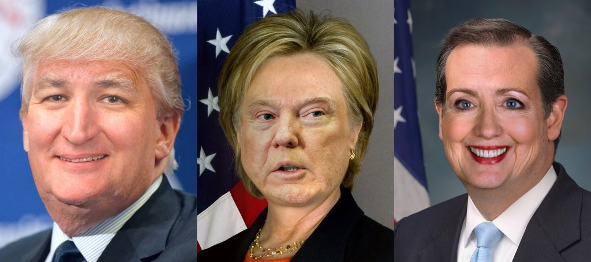
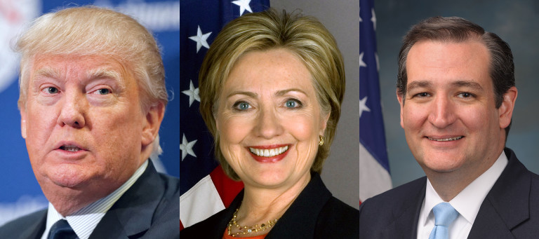
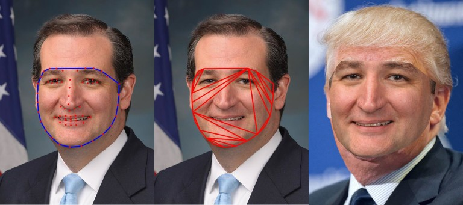
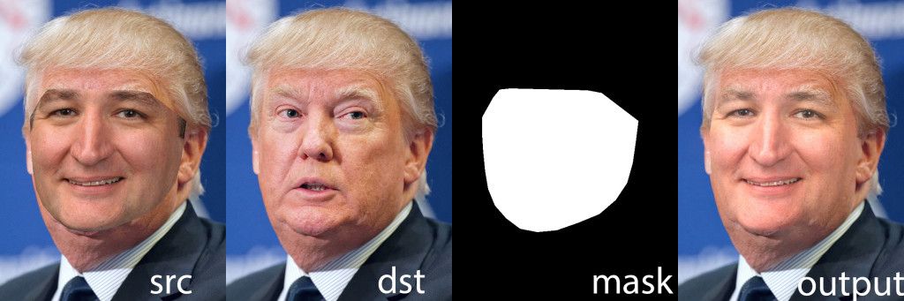

## [轉載] Face Swap using OpenCV ( C++ / Python ) [Back](./../post.md)

> - Author: [Satya Mallick](http://www.learnopencv.com/about/)
> - Origin: http://www.learnopencv.com/face-swap-using-opencv-c-python/
> - Time: Apr, 5th, 2016



**Figure 1 : Face Swapped Presidential Candidates**

In this tutorial we will learn how to swap out a face in one image with a completely different face using OpenCV and DLib in C++ and Python.

> To understand the description below better, [download](http://www.learnopencv.com/face-swap-using-opencv-c-python/#download) the C++ and Python code and images by subscribing to our newsletter [here](http://www.learnopencv.com/face-swap-using-opencv-c-python/#download).

Ladies and gentlemen, let me present Ted Trump, Donald Clinton and Hillary Cruz. Do you like any of them ? Me neither! I know, I know, I know, the above images are pretty disturbing, but so are the original choices of presidential candidates. It is a race among clowns, so let's have some fun at their expense.

This post builds on previous posts on Facial Landmark Detection, Delaunay Triangulation, Face Morphing and Seamless Cloning.

### Why is Face-Swap difficult ?

The human brain treats human faces as a special category and has specialized machinery to process faces. We are very good at analyzing faces and can easily detect a fake face. It is easy to computationally replace a face in one image with a different face if you want to do it for giggles, but extremely difficult to do if you want to do it completely automatically at a quality that will fool people consistently. After all, we are trying to fool one of the most advanced cognitive machinery in the human brain.

Consider the images of top three presidential candidates in Figure 2.



**Figure 2 : Original Image of Presidential Candidates**

The three images are pretty different. Yes, Donald Trump is very ugly, but that is not what I mean.

First, the facial geometry of regular human beings like Secretary Hillary Clinton and Senator Ted Cruz varies quite a bit. Add Donald Trump to the mix, and you now have to deal with outliers that lie on the intersection of homo sapiens and some unknown primate with funny hair.

Second, the lighting on the face combined with the tone of the skin can make the images look very different. E.g. Secretary Hillary Clinton's image looks yellow, while Senator Ted Cruz's image looks red, and Donald Trump continues to look ugly.

Third, the pose of the face ( or camera angle if you will ) can vary significantly.

And finally, the texture of the skin can vary from smooth to almost leathery ( i.e. Clinton to Trump ).

The technique proposed in this post will address the first two problems but not the last two.

### FaceSwap : Step by Step using OpenCV

i. **Face Alignment** : To replace one face with another, we first need place one face approximately on top of the other so that it covers the face below. An example is shown in Figure 3.



**Figure 3. Face Alignment. Left : Detected facial landmarks and convex hull. Middle : Delaunay triangulation of points on convex hull. Right : Face alignment by affine warping triangles.**

- i. **Facial Landmark Detection** 

    The geometry of the two faces are very different and so we need  to warp the source face a bit so that it covers the target face, but we also want to make sure we do not warp it beyond recognition.To achieve this we first detect facial landmarks on both images using dlib. However, unlike in Face Morphing, we do not and should not use all the points for face alignment. We simply need the points on the outer boundary of the face as show in the image. 
    
- ii. **Find Convex Hull**

    In Computer Vision and Math jargon, the boundary of a collection of points or shape is called a "hull". A boundary that does not have any concavities is called a "**Convex Hull**". In Figure 3. the image on the left shows facial landmarks detected using dlib in red and the convex hull of the points is shown in blue. The convex hull of a set of points can be calculated using OpenCV's convexHull function.

    - Python:

    ```py
    # points is numpy array of points obtained 
    # using dlib.
    hullIndex = cv2.convexHull(points, returnPoints = False)
    # hullIndex is a vector of indices of points 
    # that form the convex hull. 
    ```
    
    - C++:
    
    ```cpp
    // C++
    vector<int> hullIndex;
    // points is of type vector<Point2f> obtained 
    // using dlib.
    convexHull(points, hullIndex, false, false);
    // hullIndex is a vector of indices of points 
    // that form the convex hull.
    ```
    
- iii. **Delaunay Triangulation **

    The next step in alignment is to do a [Delaunay triangulation](http://www.learnopencv.com/delaunay-triangulation-and-voronoi-diagram-using-opencv-c-python/) of the points on the convex hull. The triangulation is shown in the middle image in Figure 3. This allows us to divide the face into smaller parts. My previous post that explains Delaunay triangulation in detail can be found here
    
- iv. **Affine warp triangles **

    The final steps of face alignment to to consider corresponding triangles between the source face and the target face, and affine warp the source face triangle onto the target face. More details can be found in my post about [Face Morphing](http://www.learnopencv.com/face-morph-using-opencv-cpp-python/). However, as you can see in the right image of Figure 3, aligning the face and slapping one face on top of the other hardly looks unnatural. The seams are visible because of lighting and skin tone differences between the two images. The next step shows how to seamlessly combine the two images.
    
ii. **Seamless Cloning** : Good technical ideas are like good magic. Good magicians use a combination of physics, psychology and good old sleight of hand to achieve the incredible. Image warping alone looks pretty bad. Combine it with [Seamless Cloning](http://www.learnopencv.com/seamless-cloning-using-opencv-python-cpp/) and the results are magical! I had written a post explaining the details here.

It is a feature in OpenCV 3 that allows you to seamlessly clone parts of the source image ( identified by a mask ) onto a destination image.

- Python:

```py
output = cv2.seamlessClone(src, dst, mask, center, cv2.NORMAL_CLONE)

```

- C++:

```cpp
seamlessClone(src, dst, mask, center, output, NORMAL_CLONE);
```



The **src** image in the above usage is the shown in Figure 3. ( Right ). The **dst** image is image onto which we want to blend the source image (i.e. the image of Donald Trump ). The mask is calculated by filling the convex hull with white using **fillConvexPoly** and the center is the center of the bounding box that contains the mask.
