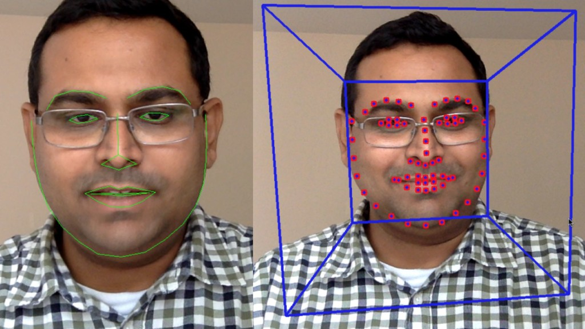
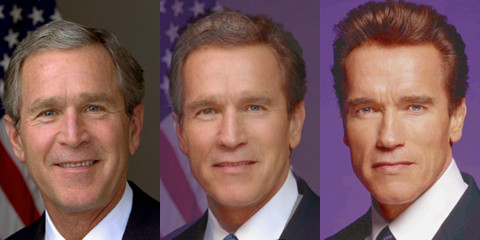
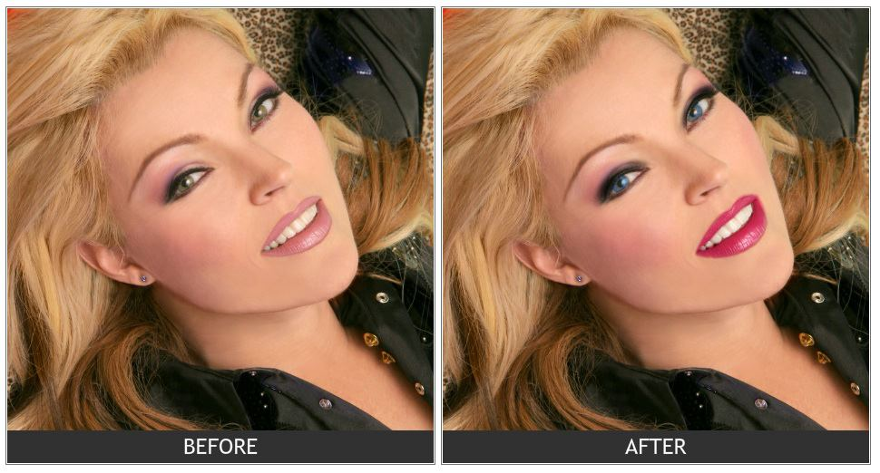

## [轉載] Facial Landmark Detection [Back](./../post.md)

> - Author: [Satya Mallick](http://www.learnopencv.com/about/)
> - Origin: http://www.learnopencv.com/facial-landmark-detection/
> - Time: Oct, 18th, 2015

<p align="center">
    </img>
</p>

<p align="center">
    <strong>Facial landmark detection using Dlib (left) and CLM-framework (right).</strong>
</p>

> Who sees the human face correctly: the photographer, the mirror, or the painter? — Pablo Picasso

If Picasso was alive today, he would have definitely added one more professional to that list — a computer vision engineer!

As computer vision engineers and researchers we have been trying to understand the human face since the very early days. The most obvious application of facial analysis is Face Recognition. But to be able to identify a person in an image we first need to find where in the image a face is located. Therefore, face detection — locating a face in an image and returning a bounding rectangle / square that contains the face — was a hot research area. In 2001, Paul Viola and Michael Jones pretty much nailed the problem with their seminal paper titled "[Rapid Object Detection using a Boosted Cascade of Simple Features.](https://www.cs.cmu.edu/~efros/courses/LBMV07/Papers/viola-cvpr-01.pdf)" In the early days of OpenCV and to some extent even now, the killer application of OpenCV was a good implementation of the Viola and Jones face detector.

Once you have a bounding box around the face, the obvious research problem is to see if you can find the location of different facial features ( e.g. corners of the eyes, eyebrows, and the mouth, the tip of the nose etc ) accurately. Facial feature detection is also referred to as "facial landmark detection", "facial keypoint detection" and "face alignment" in the literature, and you can use those keywords in Google for finding additional material on the topic.

### Applications of Facial Keypoint Detection

There are several interesting applications of keypoint detection in human faces. A few of them are listed below.

#### Facial feature detection improves face recognition

Facial landmarks can be used to align facial images to a mean face shape, so that after alignment the location of facial landmarks in all images is approximately the same. Intuitively it makes sense that facial recognition algorithms trained with aligned images would perform much better, and this intuition has been confirmed by many research papers.

#### Head pose estimation

Once you know a few landmark points, you can also estimate the pose of the head. In other words you can figure out how the head is oriented in space, or where the person is looking. E.g. CLM-Framework described in this post also returns the head pose.

#### Face Morphing

Facial landmarks can be used to align faces that can then be morphed to produce in-between images. An example is shown in Figure 1.

<p align="center">
    </img>
</p>

<p align="center">
    <strong>Figure 1. A morph between President Bush and the The Governator!</strong>
</p>

> Click [here](http://www.learnopencv.com/face-morph-using-opencv-cpp-python/) for my followup post on [Face Morphing](http://www.learnopencv.com/face-morph-using-opencv-cpp-python/).

#### Virtual Makeover

At my company ( [TAAZ.com](http://www.taaz.com/) ) we had written our own facial landmark detector. The detected landmarks were used to the calculate contours of the mouth, eyes etc. to render makeup virtually. An example is shown in Figure 2.

<p align="center">
    </img>
</p>

<p align="center">
    <strong>Figure 2. Landmark detection for virtual makeover.</strong>
</p>

#### Face Replacement

If you have facial feature points estimated on two faces, you can align one face to the other, and then seamlessly clone one face onto the other. You can also do something goofy like this

https://auduno.github.io/clmtrackr/examples/facesubstitution.html

> Click [here](http://www.learnopencv.com/face-swap-using-opencv-c-python/) to read my followup post on [Face Swap](http://www.learnopencv.com/face-swap-using-opencv-c-python/)

In a previous post, we showed how to use facial features to predict [facial attractiveness](http://www.learnopencv.com/computer-vision-for-predicting-facial-attractiveness/).

Clearly, the ability to detect facial features in images and videos open up possibilities of a ton of interesting applications. Let us now get our hands dirty with some tools that will allow us to do this.

### Facial Feature Detection & Tracking Libraries

There has been a flurry of activity in this area in the last 5 years. Part of the reason for this activity is the availability of large annotated datasets like LFPW and Helen. I have listed a bunch of papers in the next section. However, I do not recommend implementing these papers from scratch because now we have access to high quality open source implementations of some of these papers.

In the video below, you can see two of the libraries, **Dlib** and **CLM-framework** in action.

#### Dlib ( C++ / Python )

[Dlib](http://dlib.net/) is a collection of miscellaneous algorithms in Machine Learning, Computer Vision, Image Processing, and Linear Algebra. Most of the library is just header files that you can include in your C++ application. **Oh you prefer python ? No problem, it has a python API as well**.

I personally like Dlib more than any other facial feature detection & tracking library because the code is very clean, well documented, the license permits use in commercial applications, the algorithm they have chosen to implement is very fast and accurate, and you can easily integrate the library in your C++ project by just including the header files.

##### How to compile Dlib ?

i. Download a copy from github
```bash
git clone https://github.com/davisking/dlib.git
```
ii. Build examples ( OSX / Linux )
```bash
cd dlib/examples
mkdir build
cd build
cmake ..
cmake --build . --config Release
```
These examples are a great way to start using dlib. Make a copy of an example cpp file, modify it, modify examples/CMakeLists.txt and compile again using the instructions above. Easy!
iii. Compile dlib python module
```bash
cd dlib/python_examples
./compile_dlib_python_module.bat
```
iv. Set PYTHONPATH environment variable
```bash
# Put the following line in .bashrc or .profile
export PYTHONPATH=/path/to/dlib/python_examples:$PYTHONPATH
```
v. Test python module
```bash
python -c "import dlib"
```

If the above line does not give an error, you are all set.

In case you run into any compilation issues, there are [additional instructions at Dlib.net](http://dlib.net/compile.html)

##### How to run Dlib's facial landmark detector ?

After you have built the examples, to run the facial landmark detector using a webcam, do the following.

```bash
cd examples/build/
#Download the face landmark model
wget http://dlib.net/files/shape_predictor_68_face_landmarks.dat.bz2
tar xvjf shape_predictor_68_face_landmarks.dat.bz2
./webcam_face_pose_ex
```

If you want to run it on a single image, you can try

```bash
./face_landmark_detection_ex shape_predictor_68_face_landmarks.dat faces/*.jpg
```

#### CLM-Framework (C++)

[CLM-framework](https://github.com/TadasBaltrusaitis/CLM-framework), also known as the Cambridge Face Tracker, is a C++ library for facial keypoint detection and head pose estimation. You can see how well it works in the included video. Compiling this library on OSX was bit of a challenge but it was not too bad. The library depends on OpenCV 3 and requires X11.

There are two important ways in which Dlib beats CLM-Framework. First, DLib is much faster than CLM-Framework. Second, Dlib's license allows you to use it in commercial applications. If I had to pick, I would use Dlib. Interestingly, CLM-Framework depends on Dlib!

##### How to compile CLM-Framework ?

Compiling CLM-Framework was a bit involved for OSX. For windows and linux there are detailed instructions here. For compiling version 1.3.0 on OSX, I used the instructions for linux but made the following changes.

Most of the dependencies were installed using brew.

In file **CMakeLists.txt** ( red text was replaced with green text ).

> <s>find_package( OpenCV 3.0 REQUIRED )</s>

> find_package( OpenCV 3.0 REQUIRED HINTS /path/to/opencv )

> INCLUDE_DIRECTORIES(${OpenCV_INCLUDE_DIRS})

> INCLUDE_DIRECTORIES(/opt/X11/include)

In file **exe/SimpleCLM/SimpleCLM.cpp**

> <s>writerFace = VideoWriter(tracked_videos_output[f_n], CV_FOURCC('D','I','V','X'), 30, captured_image.size(), true);</s>

> writerFace = VideoWriter(tracked_videos_output[f_n], CV_FOURCC('M','P','4′,'V'), 15, captured_image.size(), true);

##### How to run CLM-Framework's Facial Feature Detector ?

After compiling CLM-Framework, the executables are in the **bin** directory. For the webcam demo shown in this post, you can use

```bash
bin/SimpleCLM
```

#### Face++ ( FacePlusPlus ) : Web API

One of the best implementations of facial landmark detection is by FacePlusPlus. They won the [300 Faces In-the-Wild Landmark Detection Challenge](http://ibug.doc.ic.ac.uk/resources/300-W/), 2013. They provide an easy to use API. The problem is that you need to upload an image to their servers and that raises a lot of privacy concerns. But if privacy is not an issue, Face++ is very good option. You can see a demo at

http://www.faceplusplus.com/demo-landmark/

### Facial Feature Detection Research

Many different approaches have been used to solve this problem and it is difficult to summarize them in a blog post. I am simply linking to some important papers ( with major bias toward recent work ) for people who want to investigate more.

1. [Active Appearance Model (AAM)](https://www.cs.cmu.edu/~efros/courses/LBMV07/Papers/cootes-eccv-98.pdf) by T. Cootes, G. Edwards and C. J. Taylor. [1998]
2. [Face Alignment through Subspace Constrained Mean-Shifts](http://www.ri.cmu.edu/pub_files/2009/9/CameraReady-6.pdf) by Jason M. Saragih, Simon Lucey and Jeffrey F. Cohn. [2009]
3. [Localizing Parts of Faces Using a Consensus of Exemplars](http://neerajkumar.org/projects/face-parts/base/papers/nk_cvpr2011_faceparts.pdf) by Peter N. Belhumeur, David W. Jacobs, David J. Kriegman, Neeraj Kumar [ 2011 ]
4. [Face Alignment by Explicit Shape Regression](http://research.microsoft.com/pubs/192097/cvpr12_facealignment.pdf) by Xudong Cao Yichen Wei Fang Wen Jian Sun [2012]
5. [Supervised Descent Method and Its Applications to Face Alignment](https://courses.cs.washington.edu/courses/cse590v/13au/intraface.pdf) by Xuehan Xiong and Fernando De la Torre [2013]
6. [Constrained Local Neural Fields for robust facial landmark detection in the wild](https://www.cl.cam.ac.uk/~tb346/pub/papers/iccv2013.pdf) by Tadas Baltrusaitis, Peter Robinson, and Louis-Philippe Morency. [2013]
7. [Extensive Facial Landmark Localization with Coarse-to-fine Convolutional Network Cascade](http://www.faceplusplus.com/wp-content/uploads/FacialLandmarkpaper.pdf) by Erjin Zhou, Haoqiang Fan, Zhimin Cao, Yuning Jiang and Qi Yin. [2013]
8. [Face alignment at 3000 fps via regressing local binary features](http://research.microsoft.com/en-US/people/yichenw/cvpr14_facealignment.pdf) by S Ren, X Cao, Y Wei, J Sun. [2014]
9. [Facial Landmark Detection by Deep Multi-task Learning](http://personal.ie.cuhk.edu.hk/~ccloy/files/eccv_2014_deepfacealign.pdf) by Zhanpeng Zhang, Ping Luo, Chen Change Loy, and Xiaoou Tang. [2014]
10. [One Millisecond Face Alignment with an Ensemble of Regression Trees](http://www.cv-foundation.org/openaccess/content_cvpr_2014/papers/Kazemi_One_Millisecond_Face_2014_CVPR_paper.pdf) by Vahid Kazemi and Josephine Sullivan. [2014]
