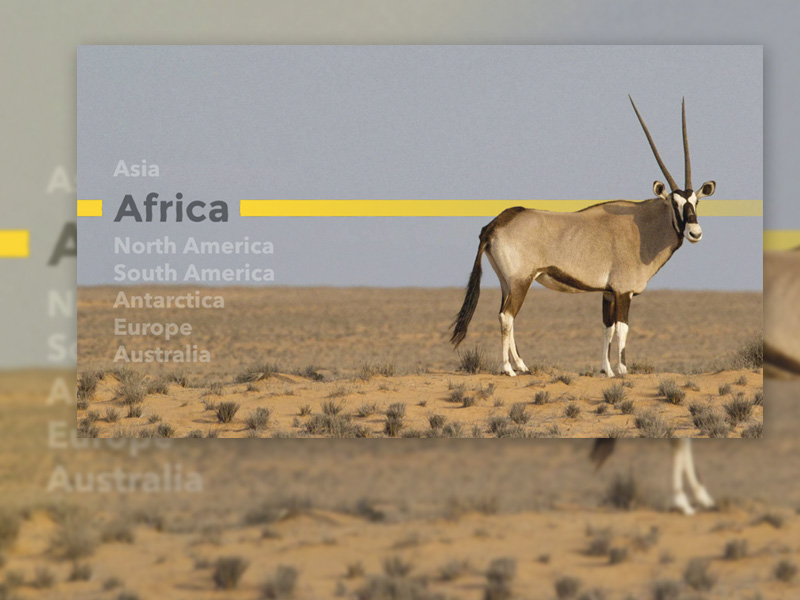
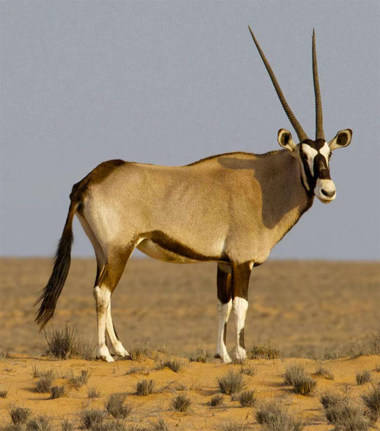
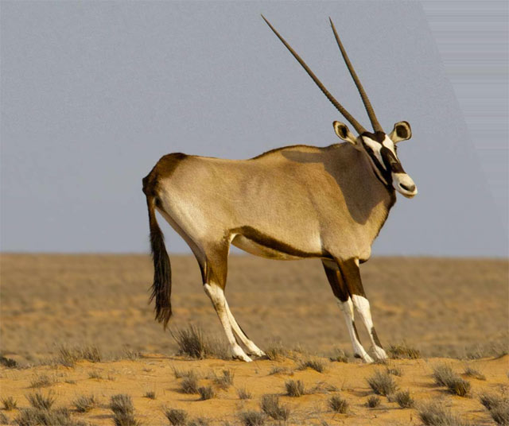
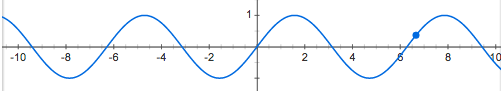
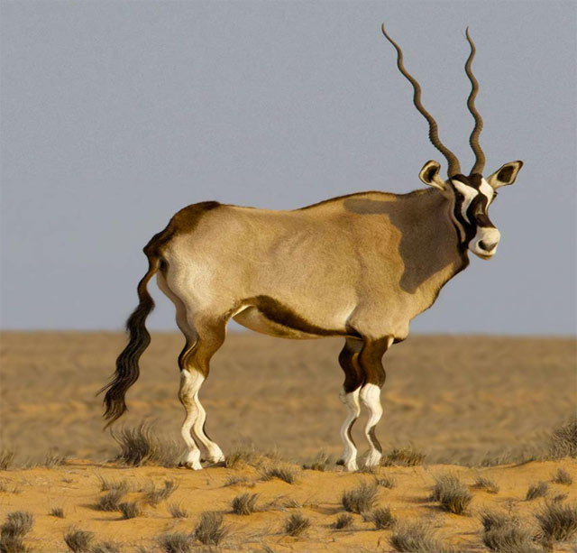
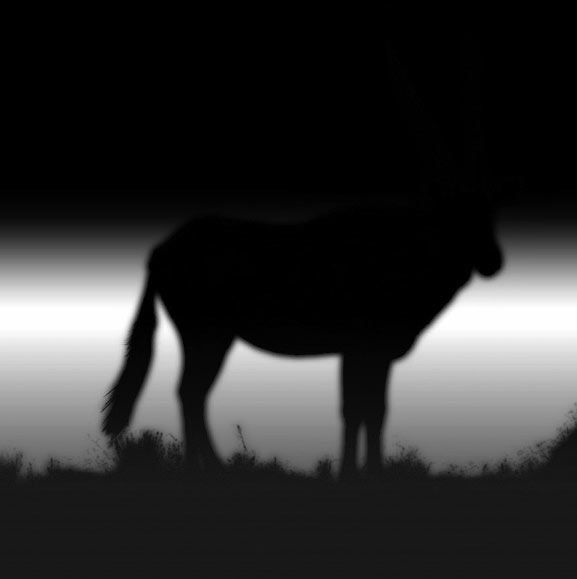
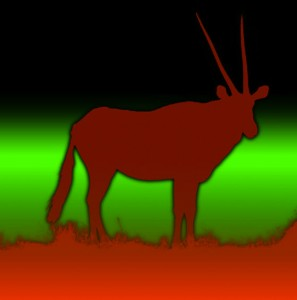
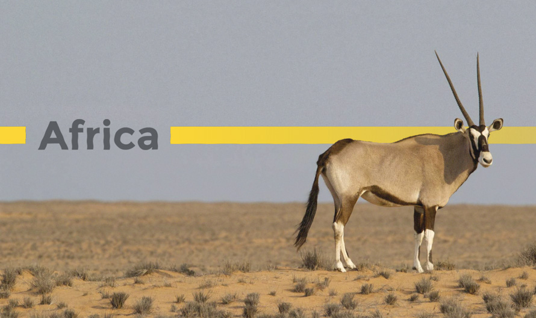

## [轉載] Animated Heat Distortion Effects with WebGL [Back](./../post.md)

> - Author: [Lucas Bebber](https://github.com/lbebber)
> - Origin: https://tympanus.net/codrops/2016/05/03/animated-heat-distortion-effects-webgl/
> - Time: May, 3rd, 2016

<br />

> A tutorial on how to use fragment shaders in WebGL to create an animated heat haze distortion effect on images and text.

<p align="center">
    
</p>

Today we want to show you how to create some realistic looking heat haze distortion effects using fragment shaders in WebGL. The idea is to add a subtle animated distortion to a static image and some text.

> **Attention**: The demos use some modern web technology that might not work in older browsers.

**Please note that the current ZIP file is the compiled build of this project; source files and GitHub link are coming soon! Stay tuned.**

### Overview

For this article, we'll pick apart one of the demos to give you an overview of how it works.

This effect uses **WebGL**. We've already seen WebGL being used in [some](http://tympanus.net/codrops/2016/04/26/the-aviator-animating-basic-3d-scene-threejs/) [experiments](http://tympanus.net/codrops/2015/11/04/rain-water-effect-experiments/) posted here on Codrops. [Here you can see an introduction on how it works](http://tympanus.net/codrops/2015/11/04/rain-water-effect-experiments/#WebGL_20). For a more in-depth explanation, take a look at the [WebGL Fundamentals](http://webglfundamentals.org/) page, look into [](http://learningwebgl.com/blog/)Learning WebGL, or start right away with [three.js](http://threejs.org/) or [pixi.js](http://www.pixijs.com/).

The important thing to have in mind for this effect is how fragment shaders, or pixel shaders, work: it runs a function for every pixel of the area that is being processed – in our case, the entire `canvas` – and returns a color, which will be set for the said pixel. In order to be able to do what we want with the shader, we can send information to it, such as the current pixel position, images (as textures), mouse position, etc.

Let's look into a few aspects of the demo to get an idea of how we can use it.

### Distortion

The heart of this effect is the heat haze distortion. First let's have a look at how we can draw a regular image, and then we'll look into how we can distort it.

This is how we can get the color of a pixel in a texture in the same position as the pixel being processed currently by the shader:

```glsl
// "attribute", "varying" and "uniform" variables are values passed down from
// other parts of the code: the program, the vertex shader, etc.
varying vec2 position;
uniform sampler2D texture;

void main(){
    // Get the color of the pixel at the current position
    vec4 color=texture2D(texture,position);

    gl_FragColor=color;
}
```

<p align="center">
    
</p>

Instead of simply getting the pixel from the current position though, we can apply some transform the `position` value to get the pixel from a different position. For example:

```glsl
...
float distortion=position.y*0.2;
vec4 color=texture2D(texture,vec2(position.x+distortion,position.y));
```

<p align="center">
    
</p>

Now, to get a simple but interesting distortion, we could vary the position based on a sine wave.

<p align="center">
    
</p>

Here we will add to the x position a sine curve based on the y position.

```glsl
...
// Since the position usually goes from 0 to 1, we have to multiply the result
// of the sine by a small value so to not make the effect too harsh.
// For the same reason, we have to multiply the value inside the sine function
// by a large value if we want a higher frequency of the curves.
float frequency=100.0;
float amplitude=0.003;
float distortion=sin(position.y*frequency)*amplitude;
vec4 color=texture2D(texture,vec2(position.x+distortion, position.y));
```

<p align="center">
    
</p>

To animate it, we may do the following: send to the shader a value that increments every frame, and use that value in the sine function.
To send a value every frame, we can use the JS function `requestAnimationFrame`:

```js
(function draw(){
    // do something every frame
    requestAnimationFrame(draw);
}());
```

Now let's step aside for a moment. One thing we have to keep in mind for animations in general: the frequency of updates, that is, frames per second, is often inconsistent and unpredictable. The device might hang for a moment, the device might be a bit slow – or, as sometimes is the case when one tries to run old games on modern hardware, far too fast – etc. So, a good way to compensate for that is to check how long it has been since the last frame has been drawn and take that into account when we draw the next frame. For example:

```js
var fps=60; // target frame rate
var frameDuration=1000/fps; // how long, in milliseconds, a regular frame should take to be drawn
var time=0; // time value, to be sent to shaders, for example
var lastTime=0; // when was the last frame drawn
(function draw(elapsed){
    // how long ago has the last frame been rendered
    var delta=elapsed-lastTime;
    lastTime=elapsed;
    
    // how much of a frame did the last frame take
    var step=delta/frameDuration;
    // add it to the time counter
    time+=step;
    
    // now for example we can compensate the speed of an animation
    ball.x += 20*step;
    
    requestAnimationFrame(draw);
}(0));
```

So now we can send the `time` value to our shader every frame and use it to animate the sine wave.

In the JS file:

```js
...
(function draw(elapsed){
    ...
    
    // get the location of the "time" variable in the shader
    var location=gl.getUniformLocation(program,"time");
    // send the time value
    gl.uniform1f(location,time);
    
    
    ...
});
```

... and in the shader:

```glsl
...
float speed=0.03;
float distortion=sin(position.y*frequency+time*speed)*amplitude;
vec4 color=texture2D(texture,vec2(position.x+distortion, position.y));
```

Notice though that the distortion is being applied to the entire image. One way to do so only on certain areas is to use another texture as a map, and paint areas brighter or darker proportionally to how strong or weak we want the distortion to be.

<p align="center">
    
</p>

Note that the edges are blurry – this is to attenuate the effect and keep from distorting things we don't want to.

Then, we can multiply the amount of the distortion by the brightness of the current pixel of the map.

```glsl
...
// if our map is grayscale, we only need to get the value of one channel
// (in this case, red) to get the brightness
float map=texture2D(map,position).r;
vec4 color=texture2D(texture,vec2(position.x+distortion*map, position.y));
```

### Depth

The depth/parallax effect works much the same way – get a color value from a slightly different position based on a map and some values. In this case, the values are the mouse x and y position.

```js
...
document.addEventListener('mousemove',function(event){
    var location=gl.getUniformLocation(program,"mouse");
    // send the mouse position as a vec2
    gl.uniform2f(location,event.clientX/canvas.width,event.clientY/canvas.height);
});
```

```glsl
...
vec2 parallax=mouse*0.005;
vec2 distortedPosition=vec2(position.x+distortion*map, position.y);
vec4 color=texture2D(texture,distortedPosition+parallax);
```

Now we just need a depth map. This will probably be a different map than the one we used before. So, instead of loading two textures, one for each map, we can add both maps on the same image file, each in a separate channel – that is, one in the red channel and one in the green channel. This way we can save loading time and system memory.

<p align="center">
    
</p>

In the code, we refer to each one of them by their respective channels:

```glsl
...
// get the current map pixel
vec4 maps=texture2D(mapsTexture,pos);

// get each map value
float depthMap=maps.r;
float distortionMap=maps.g;
...

vec2 distortedPosition=vec2(position.x+distortion*distortionMap, position.y);
vec4 color=texture2D(texture,distortedPosition+parallax*depthMap);
```

Keep in mind though that this is a quick and dirty way to do the depth effect. As such, it should be kept subtle, otherwise artifacts will soon be very apparent.

### Content

So far, we've seen that we can use images and do pretty much anything we like with them. So what about adding text to it?

We can't draw HTML content to a `canvas` object – neither in WebGL nor in its `2d` context. Creating text on `canvas` is tricky, and while loading a bitmap containing the text is possible, it has its problems: limited resolution, file size, harder to author, etc

A solution is to use SVG – we can draw externally loaded SVG files to a `canvas` object, and then use that `canvas` as a texture. SVG files are easier to maintain, are light when compared to bitmaps and are resolution independent, and could even possibly be generated by the server on the fly.

This is a quick way to load an SVG and paint it on a `canvas`

```js
var canvas=document.createElement('canvas');
loadSVG('file.svg',canvas);

function loadSVG(file,canvas){
    var svg=new Image();
    svg.addEventListener('load',function(){
        var ctx=canvas.getContext('2d');
        canvas.width=svg.width;
        canvas.height=svg.height;
        ctx.drawImage(svg,0,0);
    });
    svg.src=file;
}
```

Now we can use that `canvas` just like any other texture.

A trick to facilitate the positioning of the texture we just created into the WebGL container is to create and position the `canvas` just like any other element – that is, with HTML and CSS – and get its final position with `getBoundingClientRect`, and then send it to the shader.

```js
var title=document.querySelector('canvas');
var bounds=title.getBoundingClientRect();
var location=gl.getUniformLocation(program,"contentPosition");
gl.uniform2f(location,bounds.left,bounds.top);
var location=gl.getUniformLocation(program,"contentSize");
gl.uniform2f(location,bounds.width,bounds.height);
```

Then, when drawing the text, we can use yet another map to determine if anything goes over the text:

<p align="center">
    
</p>

And that's our final result. We've take this first example and explained it in detail, but there are many more possibilities, including distortion effects for water, like you can see in the last demo.

**And that's it! Hope you enjoyed this effect and find it inspiring!**
