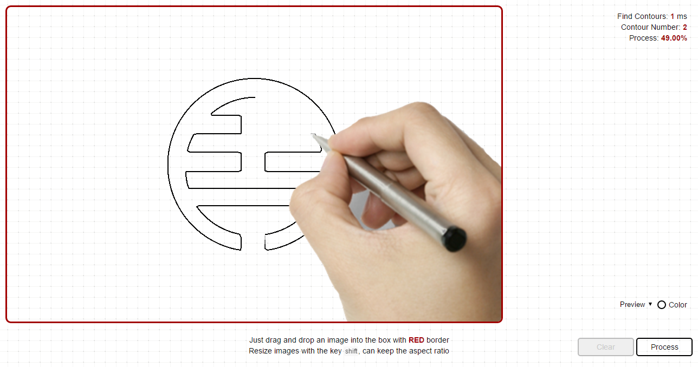
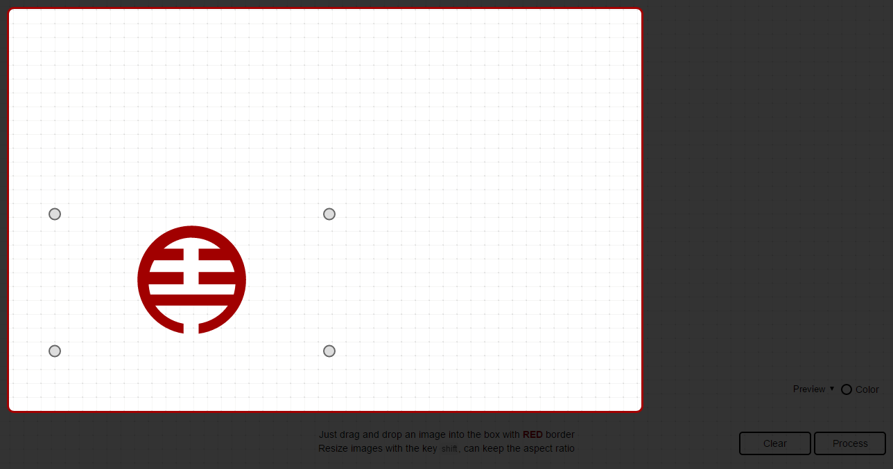

## [原創] How to draw in JavaScript? [Back](./../post.md)

<p align="center"></p>
<p align="center"><strong>Figure 1.1</strong> A simple preview</p>

Since my company has given me a requirement of drawing in a browser programmatically, simply shown as Figure 1.1 above, I would like to share some points with you about drawing in JavaScript. Actually, what we're going to draw? **Any kind of images and graphics**.

Note that this is a project which belongs to my company, and that's why I'm not going to *open* the source code in the public community.

At the beginning of the project, I was exactly inspired by the animation of drawing glowing line in [this article](./../../Programming/JavaScript/webgl/canvas/line_drawing/line_drawing.md). If you read it in details, you'll also find that before we draw any graphics, what we need is the data of paths, with which we are able to simulate the drawing. The format of those data should be like this:

```nginx
M 161.70443,272.07413
C 148.01517,240.84549 134.3259,209.61686 120.63664,178.38822
C 132.07442,172.84968 139.59482,171.3636 151.84309,171.76866
```

You may doubt that such data is only legal in an SVG element, named `path`, and how can we draw all kinds of pictures like JPG, PNG, or GIF. That's another topic going to be discussed later in this post. Before that, we can just simply draw an SVG file.

### Drawing an SVG file

What is SVG? Scalable Vector Graphics a.k.a SVG is an XML-based vector image format for two-dimensional graphics with support for interactivity and animation. In older IE browsers, such kind of files is not supported at all. If you're a designer, or an illustrator who usually used Adobe Illustration as one of your drawing tools, you may be already similar with those kinds of graphics. What the main difference is, an SVG is scalable and lossless, opposed to other formats of pictures.

Note that, generally pictures with SVG formats are called as **graphics**, while those with any other formats are called as **images**.

#### Extracting data from an SVG file

As mentioned above, before drawing an SVG file, what you need to do is to read data from an SVG file. It's actually the duty of an object, named `FileReader` in JavaScript, of which the initialization code snippet should be look like this:

```js
if (FileReader) {
    /** if the browser support FileReader Objects */
    var fileReader = new FileReader();
}
```

As a Web API, `FileReader` has given you a chance to read local files, in which `readAsText` is one of methods supported for reading contents with text format. As it may trigger the `onload` event set before being called, we can exactly read the content inside an event handler. So, the code of reading contents should be:

```js
fileReader.onload = function (e) {
    /** contents of an SVG file */
    var contents = e.target.result;
};

fileReader.readAsText(file);
```

With reading listener, you may consider whether we're going to upload a file with a button? Oh, that may be just a normal and unattractive way for interactions. Besides this, we can improve this way with dragging and dropping. It means that you can drag any graphics you want and drop it into the box for reading contents. Since Canvas is the first technical choice of my project, I would like to implement this way with setting up an event listener and registered for the `drop` event of a canvas.

```js
/** Drop Event Handler */
canvas.addEventListener('drop', function (e) {
    /** e is where we can extract out the `file` objecj */
    var file = e.dataTransfer.files[0];

    /** start to read file contents */
    fileReader.readAsText(file);
});
```

#### Processing data

Now we know the data is already stored in the variable `contents`, and how can we process it, which is only text for us. At the beginning, I have tried to use regular expressions to extract path nodes:

```js
var paths = contents.match(/<path([\s\S]+?)\/>/g);
```

But with this way, it may result in two drawbacks:

- Lose the whole structure of the SVG file.
- Unable to create a legal DOM element, `SVGPathElement`.

To explain it more explicitly, you can check the code as followed:

```js
if (paths) {
    var pathNodes = [];
    var pathLen = paths.lenght;

    for (var i = 0; i < pathLen; i++) {
        /** create a legal DOM node, SVGPathElement */
        var pathNode = document.createElementNS('http://www.w3.org/2000/svg', 'path');

        /** use a temporary div elements for reading the attribute `d` */
        var tmpDiv = document.createElement('div');
        tmpDiv.innerHTML = path[i];

        /** set it into the legal one */
        pathNode.setAttribute('d', tmpDiv.childNodes[0]
            .getAttribute('d')
            .trim()
            .split('\n').join('')
            .split('    ').join('')
        );

        /** store it into an array */
        pathNodes.push(pathNode);
    }
}
```

As you see, `tmpDiv.childNodes[0]` is not an `SVGPathElement`, so we need to create another node. What if I use another way to read the whole SVG file, and you can see that the variable `SVGPath` has stored the whole SVG objects with a clear structure, and it's also available to be accessed wherever you want:

```js
var tempDiv = document.createElement('div');
tempDiv.innerHTML = contents.trim()
    .split('\n').join('')
    .split('	').join('');

var SVGNode = tempDiv.childNodes[0];
```

With a recursive way, we can easily extract all `SVGPathElement`s and directly push them into the array `pathNodes`:

```js
var pathNodes = [];

function recursivelyExtract(parentNode) {
    var children = parentNode.childNodes;
    var childLen = children.length;

    /** If the node has no children, then directly return */
    if (childLen === 0) {
        return;
    }

    /** Loop to extract nodes when it's an SVGPathElement */
    for (var i = 0; i < childLen; i++) {
        if (children[i].nodeName === 'path') {
            pathNodes.push(children[i]);
        }
    }
};

recursivelyExtract(SVGNode);
```

It does seem so elegant to use that way, and at least it does for me, especially in the case with other elements to draw, I can just use a `switch` structure to extract different elements, rather than using several regular expressions. Generally, in an SVG file, also can shapes be defined as `circle`, `rect`, `polyline`, or `line`, not only as `path`. Therefore, how can we handle them? Just to convert them all into `path` elements with JavaScript, mentioned later.

### Drawing in Canvas

Now that paths has been extracted and stored in a local variable, the next step we should do is to draw them with points:

```js
var pointsArr = [];
var pathLen = pathNodes.length;

for (var j = 0; j < pathLen; j++) {
    var index = pointsArr[].push([]);
    var pointsLen = pathNodes[j].getTotalLength();

    for (var k = 0; k < pointsLen; k++) {
        /** extract points from a path */
        pointsArr[index].push(pathNodes[j].getPointAtLength(k));
    }
}
```

As you can see, `pointsArr` is a two-dimensional array, with paths in the first dimension, and points of each path in the second one. Certainly, those points is exactly what we can used to draw in Canvas like this:

```js
/** draw the path with a given index */
function drawPath(index) {
    var ctx = canvas.getContext('2d');
    ctx.beginPath();

    /** set path */
    ctx.moveTo(pointsArr[index][0].x, pointsArr[index][0].y);

    for (var i = 1; i < pointsArr[index].length; i++) {
        ctx.lineTo(pointsArr[index][i].x, pointsArr[index][i].y);
    }

    /** render */
    ctx.stroke();
}
```

Try to think about a problem: what if a path includes so many points to draw, how can we optimize it to draw fast? Perhaps, jumping to draw is a simple way to solve the problem, but how to jump is, however, another critical problem for you and me. Though I haven't found the perfect solution, I'm glad that you can give out any ideas.

```js
function optimizeJump() {
    var perfectJump = 1;

    /**
     * a algorithm to calculate the perfect jump value
     * ...
     */
    return perfectJump;
}

function drawPath(index) {
    var ctx = canvas.getContext('2d');
    ctx.beginPath();

    ctx.moveTo(pointsArr[index][0].x, pointsArr[index][0].y);

    /** optimization with jumping to draw */
    var perfectJump = optimizeJump();
    for (var i = 1; i < pointsArr[index].length; i+= perfectJump) {
        ctx.lineTo(pointsArr[index][i].x, pointsArr[index][i].y);
    }

    ctx.stroke();
}
```

The algorithm is exactly the place we should think more about.

### Calibration parameters

As the requirement gets more and more complicated, we may find that data of paths cannot fit the case at all, when we want to scale and resize, or move graphics in Canvas.

#### Why we need calibration parameters?

Since you would like to scale and resize, or even move graphics in Canvas, it means that the data of paths should be changed corresponding to your actions. Unfortunately, it won't, and that's exactly why we need calibration parameters.

<p align="center"></p>
<p align="center"><strong>Figure 2.1</strong> A so-called panel</p>

Figure 2.1 has shown you a highlight work area, which is called **a panel** by me, and it is that panel in which you can drop, drag and resize, or move graphics. In fact, it has included a Canvas object inside, which is implemented to satisfy your requirements. Supposed we have an SVG file (Figure 2.2) to draw, we can just drop it into the panel box, and rendered on the screen like Figure 2.3:

<p align="center"></p>
<p align="center"><strong>Figure 2.2</strong> An SVG file to draw</p>

Such a wonderful logo, full with Chinese styles.

<p align="center"></p>
<p align="center"><strong>Figure 2.3</strong> Rendered graphics </p>

Except your operating on the graphic, some attributes of the SVG file will also affect data of paths, like `width`, `height`, and `viewBox`.

```html
<svg xmlns="http://www.w3.org/2000/svg" width="400" height="200" viewBox="0 0 200 200">
    <!-- paths -->
</svg>
```

Therefore, the calculation of calibration parameters will have two factors: corresponding to **attributes** and **actions**.

#### Calculation

Before calculating, we're going to know about some defined variables, and what they actually represent for.

Firstly, when it comes to the position of graphics:

- **oriX**: the original `x` value of the graphic
- **oriY**: the original `y` value of the graphic
- **moveX**: difference of the `x` value after moving.
- **moveY**: difference of the `y` value after moving.
- **viewBoxX**: the `x` value of the attribute `viewBox` in that graphic
- **viewBoxY**: the `y` value of the attribute `viewBox` in that graphic

And then, the size of graphics:

- **oriW**: the original width of the graphic
- **oriH**: the original height of the graphic
- **svgW**: the width of the SVG element
- **svgH**: the height of the SVG element
- **viewBoxW**: the width of the attribute `viewBox` in that SVG element
- **viewBoxH**: the height of the attribute `viewBox` in that SVG element
- **curW**: the current width of the graphic
- **curH**: the current height of the graphic

Now we know what all these parameters mean, and then we can start to calculate the calibration parameters.

To calculate the current position of graphics, we can use an expression like this:

```js
var x = oriX + moveX;   /** current x value of the graphic */
var y = oriY + moveY;   /** current y value of the graphic */
```

And to calculate the difference of ratios, here is another expression:

```js
var ratioParam = Math.max(oriW / svgW, oriH / svgH) * Math.min(svgW / viewBoxW, svgH / viewBoxH);

var ratioX = (curW / oriW) * ratioParam;
var ratioY = (curH / oriH) * ratioParam;
```

What we should remember is that the `x` and `y` value of the attribute `viewBox` will also affect graphics with cropping (as shown in Figure 2.4). Therefore, we need to filter them out of original points.

<p align="center"></p>
<p align="center"><strong>Figure 2.4</strong> Cropped graphics</p>

For me, I have just rewrite them with a maximum or a minimum for the edge point. For example, if the position of points is out of the graphic, I will rewrite them by changing `x` or `y`, or even both when necessary, to the edge of graphics.

```js
point.x = point.x >= x && point.x <= x + curW ? point.x : ((point.x < x) ? x : x + curW);
point.y = point.y >= y && point.y <= x + curH ? point.y : ((point.y < y) ? y : y + curH);
```

As far as I'm concerned, it's recommended to remove them rather than to rewrite when the number of points is large.
