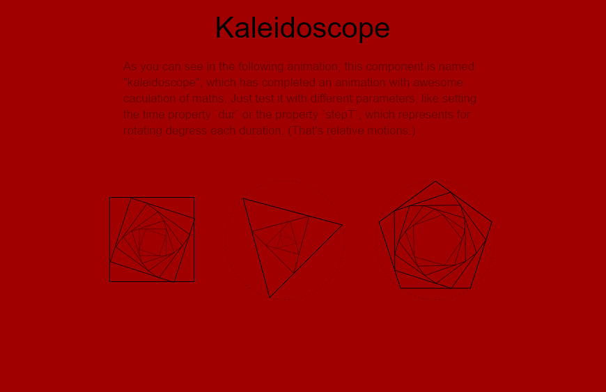
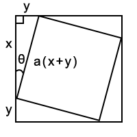
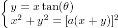
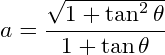
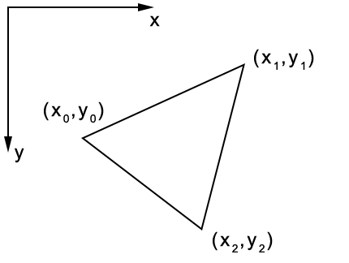
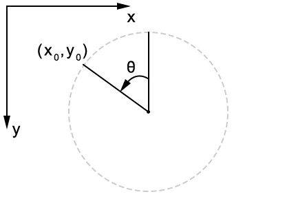
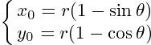
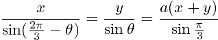
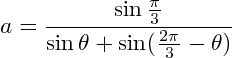
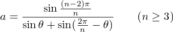

## [原創] Kaleidoscope [Back](./../post.md)

<p align="center"></p>
<p align="center"><strong>Figure 1</strong> A simple preview of kaleidoscopes</p>

In Chinese, we will name kaleidoscopes as "萬花筒", which is a toy showing colorful shapes of thousands of flowers. Today, inspired by the project, [spring loaders](https://github.com/claudiocalautti/spring-loaders), I have tried myself to create a similar component with CSS and SVG, rather than Canvas. As the Figure 1 shown, that's my **kaleidoscope**.

### 1. Introduction

Without reading the article, I have just created it through several processes. How to create, how to create regular polygons, and how to make it reusable for all kinds of regular polygons.

#### 1.1 How to create?

At the start, I have utilized the feature of `div`, which is an HTML elements with a shape of rectangles. With setting a same value for the property `width` and `height` of these elements, I can easily generate a square like the first item from the left side in the Figure 1.

Then, to simulate such rotating animation, I would like to use `transform` and `transform-origin` property to implement it, rather than use Canvas, as Canvas is something complicated, which has been always confusing me.

```css
.item {
    transform: scale(0.5) rotateZ(45deg);
    transform-origin: center;
    
    /** other browsers */
    -webkit-transform: scale(0.5) rotateZ(45deg);
    -webkit-transform-origin: center;
    
    -moz-transform: scale(0.5) rotateZ(45deg);
    -moz-transform-origin: center;
    
    -ms-transform: scale(0.5) rotateZ(45deg);
    -ms-transform-origin: center;
    
    -o-transform: scale(0.5) rotateZ(45deg);
    -o-transform-origin: center;
}
```

The code snippet above has shown us how to use such two properties to animate our elements. With setting `scale(0.5)` and `rotateZ(45deg)`, the element will be scaled by half, and rotate 45 degrees clockwise.

If using JavaScript to change this value dynamically, we can code like this:

```js
/** theta is the rotating degree */
const theta = 45; 
const scaleRatio = 0.5;
const target = document.querySelector('.item');

target.style.transformOrigin = 'center';
target.style.transform = 'scale(' + scaleRatio + ') rotateZ(' + theta + 'deg)';

/** other browsers */
target.style.WebkitTransformOrigin = 'center';
target.style.WebkitTransform = 'scale(' + scaleRatio + ') rotateZ(' + theta + 'deg)';

target.style.MozTransformOrigin = 'center';
target.style.MozTransform = 'scale(' + scaleRatio + ') rotateZ(' + theta + 'deg)';

target.style.MsTransformOrigin = 'center';
target.style.MsTransform = 'scale(' + scaleRatio + ') rotateZ(' + theta + 'deg)';

target.style.OTransformOrigin = 'center';
target.style.OTransform = 'scale(' + scaleRatio + ') rotateZ(' + theta + 'deg)';
```

<p align="center"></p>
<p align="center"><strong>Figure 2</strong> The relationship between sita and scale</p>

Then as the Figure 2 shown, how to calculate a proper value of `scaleRatio` (***a***) with `theta` (***θ***) as the variable, in order that vertexes of the item can stay on each side of another square? We may just have to solve the following equation:

<p align="center"></p>

After calculating, we can easily get that:

<p align="center"></p>

As we can see, the value of `scale` can be calculated with `sita` as the variable.

<p align="center"></p>
<p align="center"><strong>Figure 3</strong> Multinested squares</p>

Besides, we should also solve the case when a square is embedded with another square, while another square is embedded with another square (Figure 3). To work around this complicated problem of calculation, I have used relative motions instead. For example, I will create this three squares like this:

```html
<div class="rect rect1">
    <div class="rect rect2">
        <div class="rect rect3"></div>
    </div>
</div>
```

Then rotate the second square and the third one with scaling at the same time:

```css
.rect2 {
    transform: scale(0.8155975296668455) rotateZ(15deg);
    transform-origin: center;
}

.rect3 {
    transform: scale(0.8155975296668455) rotateZ(15deg);
    transform-origin: center;
}
```

Then, that's done! Easy right? The following code is implemented for this square item:

```js
/** the difference of degree in each duration */
const stepT = 0.5;

/** the time (ms) to update the sita value */
const dur = 10;

/** the number of mutinested squares */
const num = 6;

/** the current value of theta */
var theta = 0;

/** direction to change */
var dir = 1;

/** append mutinested squares */
for (var i = 0; i < num; i++) {
	var div = document.createElement('div');
	div.className = 'rect rect' + (i + 1);
	document.querySelector('.rect' + i).appendChild(div);
}

/** start to animiate */
setInterval(function () {
	theta += stepT * dir;

	if (Math.abs(theta) > 90) {
		dir *= -1;
		theta = (Math.abs(theta) - 90) * dir;
	}

    /** calculate the scaleRatio */
	const tan = parseFloat(Math.tan(Math.abs(theta) * Math.PI / 180).toFixed(2));
	const scaleRatio = Math.sqrt(1 + tan * tan) / (1 + tan);

	for (var i = 0; i < num; i++) {
		document.querySelector('.rect' + (i + 1)).style.transform = 'scale(' + scaleRatio + ') rotate(' + theta + 'deg)';
	}
}, dur);
```

#### 1.2 How to create regular polygons?

From the preceding section, we can see that we have just implemented for squares, but I wonder how to use it in other regular polygons like equilateral triangles or even pentagons. Before discussing the problem, we should create such regular polygons at first.

Certainly, we can easily generate squares by setting the width and the height with a same value, but what if generating other regular polygons? **SVG** is my choice.

<p align="center"></p>
<p align="center"><strong>Figure 4</strong> A triangle</p>

In SVG, we can easily create a polygon by using `polygon` tags, with setting the attribute `points` to set up each vertex. For instance, the triangle in the Figure 4 can be created like this:

```html
<svg>
    <polygon stroke="#000" fill="none" points="x0,y0 x1,y1 x2,y2"></polygon>
</svg>
```

Utilizing this feature, what we should do to generate regular polygons is just to solve positions of each vertex.

<p align="center"></p>
<p align="center"><strong>Figure 5</strong> An equilateral triangles within a specific circle</p>

In addition, can such polygons be generated within a circle with a specific radius (Figure 5)? Apparently, the answer is yes.

<p align="center"></p>
<p align="center"><strong>Figure 6</strong> The specific cordinates</p>

Before calculating, to make it more clear, I have drawn the Figure 6 which has shown coordinates for us, and in which the relationship between ***θ*** and ***(x,y)*** is what we should solve later.

Then, here is the equation:

<p align="center"></p>

After that, just create regular polygons with ***θ***:

```html
<svg class="svg__container"></svg>
```

```js
function createPolygon(obj, sides, startDeg) {
    /** the degree of the start position */
	startDeg = startDeg || 0;
	
	/** generate group to embed other group */
	var group = document.createElementNS('http://www.w3.org/2000/svg', 'g');
	
	/** the polygon you want to create */
	var polygon = document.createElementNS('http://www.w3.org/2000/svg', 'polygon');

    /** an array for storing points of this regular polygon */
	var pos = [];
	
	/** the radius of the given circle */
	const radius = document.querySelector('.svg__container').clientWidth / 2;

	for (var i = 0; i < sides; i++) {
		const deg = 360 / sides * i + startDeg;
		const x = radius * (1 - Math.sin(deg * Math.PI / 180));
		const y = radius * (1 - Math.cos(deg * Math.PI / 180));

		pos.push(x + ',' + y);
	}

	polygon.setAttribute('points', pos.join(' '));
	group.appendChild(polygon);
	obj.appendChild(group);
	
	/** set up the origin position of your transformation */
	group.style.transformOrigin = radius + 'px ' + radius + 'px';
	
	/** return the group so that we can create multinested elements recursively */
	return group;
}

/** equilateral triangles */
const sides = 3;

/** to create 6 nested triangles */
const num = 6;

var parent = document.querySelectorAll('.svg__container')[0];

for (var i = 0; i < num; i++) {
	parent = createPolygon(parent, sides, 45);
	parent.setAttribute('class', 'polygon polygon' + (i + 1));
}
```

#### 1.3 How to make it reusable?

Now that we can generate any side of regular polygons (the number of sides should be more than 3), it's time to solve the problem mentioned above? To make it reusable.

<p align="center"></p>
<p align="center"><strong>Figure 7</strong> The case of equilaterial triangles</p>

Firstly, we should solve the case in which the number of sides is 3 (Figure 7). Based on the Law of Sine, it's easily to get the following equation:

<p align="center"></p>

Then solve it:

<p align="center"></p>

What if the number of sides is 4, 5, 6, and etc.? You may find that all of them should obey the following rule, where ***n*** stands for the number of sides:

<p align="center"></p>

Then, just complete it with JavaScript:

```js
const sides = 5;
var parent = document.querySelectorAll('.svg__container')[1];

const stepT = 0.8;
const dur = 10;
const num = 7;

var theta = 0;
var dir = 1;

/** append mutinested polygons */
for (var i = 0; i < num; i++) {
	parent = createPolygon(parent, sides);
	parent.setAttribute('class', 'polygon polygon' + (i + 1));
}

/** start to animate */
setInterval(function () {
	theta += stepT * dir;
	
	const innerCornerDeg = Math.round(360 / sides);
	
	if (Math.abs(theta) > innerCornerDeg) {
		dir *= -1;
		theta = (Math.abs(theta) - innerCornerDeg) * dir;
	}

	const thetaValue = Math.abs(theta) * Math.PI / 180;
	const scaleRatio = Math.sin((180 - innerCornerDeg) * Math.PI / 180) / (Math.sin(thetaValue) + Math.sin(innerCornerDeg * Math.PI / 180 - thetaValue));

	for (var i = 1; i < num; i++) {
		document.querySelector('.polygon' + (i + 1)).style.transform = 'scale(' + scaleRatio + ') rotate(' + theta + 'deg)';
	}
}, dur);
```

If you want to use it in **React** as a component, you can check the POC [**here**](http://codepen.io/aleen42/pen/JbmBjK).


### 2. Demo

<p>
<p data-height="568" data-theme-id="21735" data-slug-hash="mOzbWW" data-default-tab="result" data-user="aleen42" data-embed-version="2" data-pen-title="mOzbWW" class="codepen">See the Pen <a href="http://codepen.io/aleen42/pen/mOzbWW/">mOzbWW</a> by aleen42 (<a href="http://codepen.io/aleen42">@aleen42</a>) on <a href="http://codepen.io">CodePen</a>.</p>
<script async src="https://production-assets.codepen.io/assets/embed/ei.js"></script>
</p>


