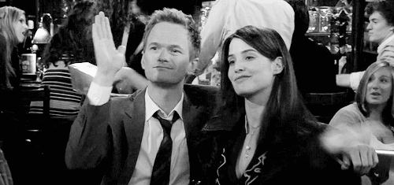
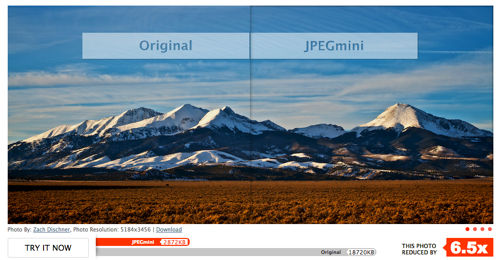

## [轉載] 5 Reasons Why Your Startup Needs a Security Consultant(安全顧問) [Back](./../post.md)

> - Author: [Michiel Heijmans](https://yoast.com/about-us/michiel-heijmans/)
- Origin: https://yoast.com/image-seo/
- Time: Oct, 12nd, 2016

 

> If you are for instance a blogger or write articles for an online magazine or newspaper, you encounter this question on a probably daily basis: should I add an image to my article? The answer is “Yes”. Images make an article more vivid and can actually contribute to improving the SEO for your article. In this post, I’d like to explain the steps that should be taken to fully optimize an image for SEO.

When optimizing an image you make sure it as small as it can be in terms of download size by using the right image compression. A well-optimized image also has the right name and alt text, so it’s optimized for search engines too.

### Use images

Images, when added with a certain consideration, will help understand your article a lot. “A picture is worth a thousand words”. Yeah, well, probably not for Google, but it can for sure spice up a 1,000 dull words, illustrate what you mean in a chart or data flow diagram, or simply make your social media efforts more attractive.

It’s a simple recommendation: use images to every article you write online. It’ll make it more appealing.

### Finding the right image

If you have the opportunity to add your own image, please do so. Your team page needs pictures of your team, not this dude on the right or one of his stock photo friends. Off topic: let alone that the dude might need a haircut.

Your article needs an image that has the same subject as your article. If you would use an image, just to use an image and get a green bullet in our SEO plugin, you are doing it wrong. The image should reflect the topic of the post, or have illustrative purposes within the article, of course.

There is a simple image SEO reason for that: an image that is surrounded by related text, ranks better for the keyword it is optimized for. More details on image SEO later.

You might have seen the images we are using for our posts (the ones with the titles). We have added these for a number of reasons:

- They emphasize the title or subject of the post
- It’ll trigger a visitor to read the post, as the first view isn’t just text
- These images are used in OpenGraph tags and Twitter Cards, which will add the image to our social shares.

Just another way to go about adding images. By the way, most of these ‘featured images’ are stock photos. We have made them our own by adding the title in the same way over and over, making the actual image subservient to the text in the image. That goes against a much-heard recommendation to not add text in images, but as mentioned, we use that specific image for other purposes, not per se for SEO.

If there is no way to use images of your own, there are other ways to find more unique images and refrain from using stock photos. [Flickr.com](http://flickr.com/) is a nice image source for instance, as explained in this article: [How to Use Creative Commons Images from Flickr](http://www.labnol.org/internet/creative-commons-flickr/18017/). I also like the images provided by sites like [freeimages.com](http://www.freeimages.com/) (formerly known as sxc.hu). Check [here for more image resources](https://designschool.canva.com/blog/free-stock-photos/). You should stay away from the [obvious stock photos](http://peopleimages.com/search#business), and rather pick the ones that look (ok, just a bit) [more genuine](http://www.shutterstock.com/cat.mhtml?searchterm=leisure&language=en&lang=en&search_source=&safesearch=1&version=llv1&media_type=). It almost seems like images with people always look like stock photos, unless taken by yourself. In the end, that is still the best idea.

Obvious alternatives for photos could be illustrations, like we sometimes use, or graphs, of course. An honorable mention should go to [animated GIFs](http://blog.hubspot.com/blog/tabid/6307/bid/33560/The-Ultimate-Guide-to-Using-Animated-GIFs-in-Your-Marketing.aspx), as these seem to become more and more popular these days.

Animated GIFs are very popular these days. Don’t go overboard. It’ll make your post less attractive to read, as your reading will be interrupted by the movement in the image, of course. Like in the post [where I found the above image](http://www.emagine.com/b2b-blog/5-things-to-look-at-when-optimizing-your-post-for-seo-gifs/).

### Preparing images for use in your article

When you have found the right image to use, either an illustration, chart or photo, the next step is to optimize that image for use on your website. There are a number of things to take in consideration:

#### Choose the right file name

Image SEO starts with the right file name. Of course this is the first location to use that keyword. Without even looking at the actual image, you want Google to know what the image is about. It’s simple: if your image is a sunrise in Paris showing the Notre Dame, the file name shouldn’t be DSC4536.jpg, but notre-dame-paris-sunrise.jpg. The main keyword would be Notre Dame, as that is the main subject of the photo, that is why I added that at the beginning of the file name.

#### Scale for image SEO

Loading times are an important UX and therefore SEO aspect. The faster the site, the easier to visit and index a page is. Images can have a huge impact on loading times, especially when you load a huge image and show it really small, like using a 2500×1500 pixels image and showing it at 250×150 pixels size. The entire image will still have to be loaded. Scale the image to the size you want to show it. WordPress helps by providing the image in multiple sizes after upload already. Unfortunately that doesn’t mean the file size is optimized as well, that’s just the image size.

#### Reduce file size

The next step in image SEO should be to make sure that scaled image is served in the smallest file size possible. There are tools for that. Of course you could just export the image an test what percentage of quality is acceptable, but I prefer (especially with retina and similar screens) to use 100% quality images.

    

Optimize image file size for instance using JPEGMini

You can still reduce the file size of these images by for instance removing the [EXIF data](http://en.wikipedia.org/wiki/Exchangeable_image_file_format). We recommend using tools like [ImageOptim](https://imageoptim.com/) or websites like [JPEGMini](http://www.jpegmini.com/) or [PunyPNG](http://www.punypng.com/). I’ve also heard great stories about [Kraken.io](https://yoast.com/out/kraken/), but I haven’t used that myself, to be honest.

After you have uploaded the image, tools like [YSlow](http://yslow.org/) can tell you if your image optimization succeeded.

### Adding the image to your article

Don’t just stuff it in somewhere. I already mentioned adding it near / at / in related textual content. That simply helps a lot. It makes sure the content is relevant for the image as well, as it is the other way around.

#### Captions

The caption of the image is the text that accompanies the image. At most images in this article, it’s the text in the gray box below it. Why is that text important for image SEO as well? People use that text in scanning an article. Next to headings, people tend to scan the image and include the caption as well in that scan. Nielsen actually [wrote back in 1997](http://www.nngroup.com/articles/concise-scannable-and-objective-how-to-write-for-the-web/): “Elements that enhance scanning include headings, large type, bold text, highlighted text, bulleted lists, graphics, captions, topic sentences, and tables of contents.” In 2012, [KissMetric even stated](https://blog.kissmetrics.com/shocking-truth-about-graphics/) that “Captions under images are read on average 300% more than the body copy itself, so not using them, or not using them correctly, means missing out on an opportunity to engage a huge number of potential readers.”

Do we add captions to all images? No. As mentioned, sometimes images just serve another purpose. Decide whether the image at hand is an image you want to use for SEO as well or not. Keeping over-optimization in mind, I’d say you should add a caption if it would make sense to the visitor if that caption is added. Think about the visitor first, don’t add a caption just for image SEO.

#### Alt text and title text

The alt text is added to an image so there will be a descriptive text when the image for whatever reason can’t be displayed to the visitor. I can’t put it any better than Wikipedia: “In situations where the image is not available to the reader, perhaps because they have turned off images in their web browser or are using a screen reader due to a visual impairment, the alternative text ensures that no information or functionality is lost.” Be sure to add alt texts. Make sure the alt text includes your SEO keyword and relates to / describes the image.

When hovering an image, IE shows the alt text as a ‘tooltip’. Chrome show the title text, like it was intended. Title text for images is similar and a lot of people that use these simply copy the alt text. More and more people simply leave these out. What is it for? “The title attribute can be very useful, but it is not a safe way of providing crucial information. Instead it offers a good way to provide non-essential information, for example the mood of the image, or what it means in context.” it’s nice to have information indeed, and isn’t taken in account for image SEO.
