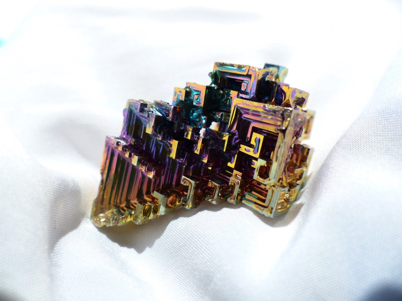

## [轉載] Presentational and Container Components [Back](./../post.md)

> - Author: [Dance Abramov](https://medium.com/@dan_abramov)
> - Origin: https://medium.com/@dan_abramov/smart-and-dumb-components-7ca2f9a7c7d0#.qmkjybrk1
> - Time: Mar, 23rd, 2015

    

    <a href="http://en.wikipedia.org/wiki/Bismuth" target="_blank">Bismuth</a>

There's a simple pattern I find immensely useful when writing React applications. If [you've been doing React for a while](http://facebook.github.io/react/blog/2015/03/19/building-the-facebook-news-feed-with-relay.html), you have probably already discovered it. [This article explains it well](https://medium.com/@learnreact/container-components-c0e67432e005), but I want to add a few more points.

You'll find your components much easier to reuse and reason about if you **divide them into two categories**. I call them Container and Presentational components* but I also heard Fat and Skinny, Smart and Dumb, Stateful and Pure, Screens and Components, etc. These all are not exactly the same, but the core idea is similar.

My **presentational** components:

- Are concerned with *how things look*.
- May contain both presentational and container components** inside, and usually have some DOM markup and styles of their own.
- Often allow containment via `this.props.children`.
- Have no dependencies on the rest of the app, such as Flux actions or stores.
- Don't specify how the data is loaded or mutated.
- Receive data and callbacks exclusively via props.
- Rarely have their own state (when they do, it's UI state rather than data).
- Are written as [functional components](./../reusable_components/reusable_components.md) unless they need state, lifecycle hooks, or performance optimizations.
- Examples: `Page`, `Sidebar`, `Story`, `UserInfo`, `List`.

My **container** components:

- Are concerned with *how things work*.
- May contain both presentational and container components** inside but usually don't have any DOM markup of their own except for some wrapping divs, and never have any styles.
- Provide the data and behavior to presentational or other container components.
- Call Flux actions and provide these as callbacks to the presentational components.
- Are often stateful, as they tend to serve as data sources.
- Are usually generated using [higher order components](https://medium.com/@dan_abramov/mixins-are-dead-long-live-higher-order-components-94a0d2f9e750) such as `connect()` from React Redux, `createContainer()` from Relay, or `Container.create()` from Flux Utils, rather than written by hand.
- Examples: `UserPage`, `FollowersSidebar`, `StoryContainer`, `FollowedUserList`.

I put them in different folders to make this distinction clear.

### Benefits of This Approach

- Better separation of concerns. You understand your app and your UI better by writing components this way.
- Better reusability. You can use the same presentational component with completely different state sources, and turn those into separate container components that can be further reused.
- Presentational components are essentially your app's "palette". You can put them on a single page and let the designer tweak all their variations without touching the app's logic. You can run screenshot regression tests on that page.
- This forces you to extract "layout components" such as `Sidebar`, `Page`, `ContextMenu` and use `this.props.children` instead of duplicating the same markup and layout in several container components.

Remember, **components don't have to emit DOM**. They only need to provide composition boundaries between UI concerns.

Take advantage of that.

### When to Introduce Containers?

I suggest you to start building your app with just presentational components first. Eventually you'll realize that you are passing too many props down the intermediate components. When you notice that some components don't use the props they receive but merely forward them down and you have to rewire all those intermediate components any time the children need more data, it's a good time to introduce some container components. This way you can get the data and the behavior props to the leaf components without burdening the unrelated components in the middle of the tree.

This is an ongoing process of refactoring so don't try to get it right the first time. As you experiment with this pattern, you will develop an intuitive sense for when it's time to extract some containers, just like you know when it's time to extract a function. My [free Redux Egghead series](https://egghead.io/series/getting-started-with-redux) might help you with that too!

### Other Dichotomies

It's important that you understand that the distinction between the presentational components and the containers is not a technical one. Rather, it is a distinction in their purpose.

By contrast, here are a few related (but different!) technical distinctions:

- **Stateful and Stateless**. Some components use React `setState()` method and some don't. While container components tend to be stateful and presentational components tend to be stateless, this is not a hard rule. Presentational components can be stateful, and containers can be stateless too.
- **Classes and Functions**. Since [React 0.14](https://facebook.github.io/react/blog/2015/10/07/react-v0.14.html#stateless-functional-components), components can be declared both as classes and as functions. Functional components are simpler to define but they lack certain features currently available only to class components. Some of these restrictions may go away in the future but they exist today. Because functional components are easier to understand, I suggest you to use them unless you need state, lifecycle hooks, or performance optimizations, which are only available to the class components at this time.
- **Pure and Impure**. People say that a component is pure if it is guaranteed to return the same result given the same props and state. Pure components can be defined both as classes and functions, and can be both stateful and stateless. Another important aspect of pure components is that they don't rely on deep mutations in props or state, so their rendering performance can be optimized by a shallow comparison in their [`shouldComponentUpdate()` hook](https://facebook.github.io/react/docs/pure-render-mixin.html). Currently only classes can define `shouldComponentUpdate()` but that may change in the future.

Both presentational components and containers can fall into either of those buckets. In my experience, presentational components tend to be stateless pure functions, and containers tend to be stateful pure classes. However this is not a rule but an observation, and I've seen the exact opposite cases that made sense in specific circumstances.

Don't take the presentational and container component separation as a dogma. Sometimes it doesn't matter or it's hard to draw the line. If you feel unsure about whether a specific component should be presentational or a container, it might be too early to decide. Don't sweat it!

### Footnotes

> \* In an earlier version of this article I called them "smart" and "dumb" components but this was overly harsh to the presentational components and, most importantly, didn't really explain the difference in their purpose. I enjoy the new terms much better, and I hope that you do too!

> \*\* In an earlier version of this article I claimed that presentational components should only contain other presentational components. I no longer think this is the case. Whether a component is a presentational component or a container is its implementation detail. You should be able to replace a presentational component with a container without modifying any of the call sites. Therefore, both presentational and container components can contain other presentational or container components just fine.
