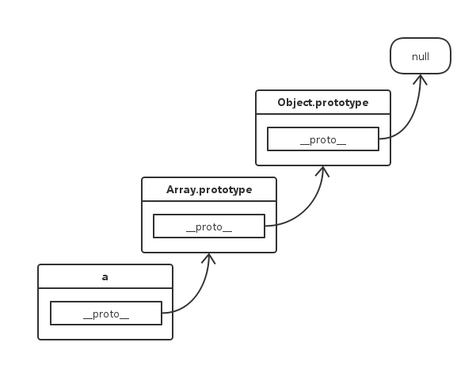
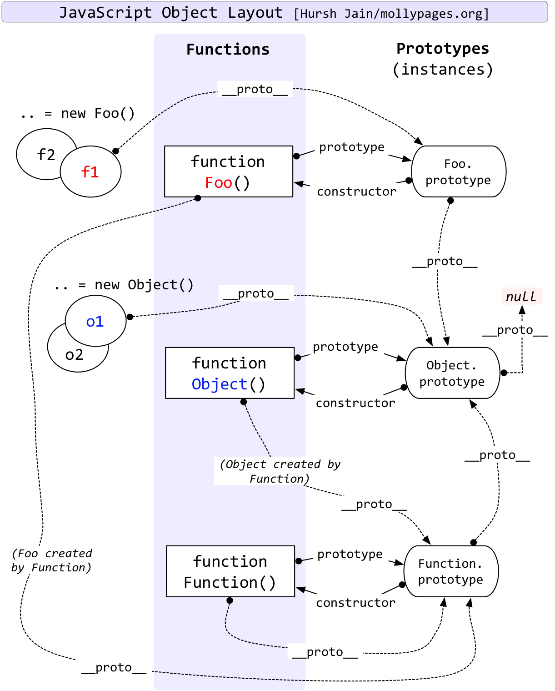

## [轉載] JavaScript 原型中的哲學思想 [Back](./../post.md)

> - Author: [JerryC](huang-jerryc.com)
> - Origin: http://huang-jerryc.com/2016/06/28/JavaScript%E5%8E%9F%E5%9E%8B%E4%B8%AD%E7%9A%84%E5%93%B2%E5%AD%A6%E6%80%9D%E6%83%B3/
> - Time: Jun, 28th, 2016


记得当年初试前端的时候，学习JavaScript过程中，原型问题一直让我疑惑许久，那时候捧着那本著名的红皮书，看到有关原型的讲解时，总是心存疑虑。


当在JavaScript世界中走过不少旅程之后，再次萌发起研究这部分知识的欲望，翻阅了不少书籍和资料，才搞懂`__proto__`和`prototype`的概念。

故以作此笔记，日后忘了可以回来看看。

如果你看的过程中觉得理解有些困难，把例子在代码中跑一跑，亲手试一试也许能解决不少疑惑。

### 一切皆为对象

> 殊不知，JavaScript的世界中的对象，追根溯源来自于一个 null

「一切皆为对象」，这句着实是一手好营销，易记，易上口，印象深刻。
万物初生时，一个`null`对象，凭空而生，接着`Object`、`Function`学着`null`的模样塑造了自己，并且它们彼此之间喜结连理，提供了`prototype`和`constructor`，一个给子孙提供了基因，一个则制造万千子子孙孙。
在JavaScript中，`null`也是作为一个对象存在，基于它继承的子子孙孙，当属对象。
乍一看，`null`像是上帝,而`Object`和`Function`犹如JavaScript世界中的**亚当**与**夏娃**。

### 原型指针 `__proto__`

在JavaScript中，每个对象都拥有一个原型对象，而指向该原型对象的内部指针则是`__proto__`，通过它可以从中继承原型对象的属性，原型是JavaScript中的基因链接，有了这个，才能知道这个对象的祖祖辈辈。从对象中的`__proto__`可以访问到他所继承的原型对象。

```js
var a = new Array();
a.__proto__ === Array.prototype;    // true
```

上面代码中，创建了一个Array的实例`a`，该实例的原型指向了`Array.prototype`。
`Array.prototype`本身也是一个对象，也有继承的原型:

```js
a.__proto__.__proto__ === Object.prototype  // true
// 等同于 Array.prototype.__proto__ === Object.prototype
```

这就说了明了，Array本身也是继承自Object的，那么Object的原型指向的是谁呢？


```js
a.__proto__.__proto__.__proto__ === null  // true
// 等同于 Object.prototype.__proto__ === null
```



所以说，JavaScript中的对象，追根溯源都是来自一个null对象。佛曰：万物皆空，善哉善哉。

除了使用.`__proto__`方式访问对象的原型，还可以通过`Object.getPrototypeOf`方法来获取对象的原型，以及通过`Object.setPrototypeOf`方法来重写对象的原型。

值得注意的是，按照语言标准，`__proto__`属性只有浏览器才需要部署，其他环境可以没有这个属性，而且前后的两根下划线，表示它本质是一个内部属性，不应该对使用者暴露。因此，应该尽量少用这个属性，而是用`Object.getPrototypeof`和`Object.setPrototypeOf`，进行原型对象的读写操作。
这里用`__proto__`属性来描述对象中的原型，是因为这样来得更加形象，且容易理解。

### 原型对象 `prototype`

函数作为JavaScript中的一等公民，它既是函数又是对象，函数的原型指向的是`Function.prototype`

```js
var Foo = function() {}
Foo.__proto__ === Function.prototype // true
```

函数实例除了拥有`__proto__`属性之外，还拥有`prototype`属性。
通过该函数构造的新的实例对象，其原型指针`__proto__`会指向该函数的`prototype`属性。

```js
var a = new Foo();
a.__proto__ ==== Foo.prototype; // true
```

而函数的`prototype`属性，本身是一个由`Object`构造的实例对象。

```js
Foo.prototype.__proto__ === Object.prototype; // true
```

`prototype`属性很特殊，它还有一个隐式的`constructor`，指向了构造函数本身。

```js
Foo.prototype.constructor === Foo; // true
a.constructor === Foo; // true
a.constructor === Foo.prototype.constructor; // true
```


### 原型链

#### 概念

原型链作为实现继承的主要方法，其基本思想是利用原型让一个引用类型继承另一个引用类型的属性和方法。
每个构造函数都有一个原型对象(`prototype`)，原型对象都包含一个指向构造函数的指针(`constructor`)，而实例都包含一个指向原型对象的内部指针(`__proto__`)。

那么，假如我们让原型对象等于另一个类型的实例，此时的原型对象将包含一个指向另一个原型的指针，相应地，另一个原型中也包含着一个指向另一个构造函数的指针。假如另一个原型又是另一个类型的实例，那么上述关系依然成立。

如此层层递进，就构造了实例与原型的链条，这就是**原型链**的基本概念。

#### 意义

“原型链”的作用在于，当读取对象的某个属性时，JavaScript引擎先寻找对象本身的属性，如果找不到，就到它的原型去找，如果还是找不到，就到原型的原型去找。以此类推，如果直到最顶层的Object.prototype还是找不到，则返回undefine

### 亲子鉴定

在JavaScript中，也存在鉴定亲子之间DNA关系的方法：

instanceo：
运算符返回一个布尔值，表示一个对象是否由某个构造函数创建。

Object.isPrototypeOf()：
只要某个对象处在原型链上，isProtypeOf都返回true

```js
var Bar = function() {}
var b = new Bar();
b instanceof Bar // true
Bar.prototype.isPrototypeOf(b) // true
Object.prototype.isPrototypeOf(Bar) // true
```

要注意，实例`b`的原型是`Bar.prototype`而不是`Bar`

### 一张历史悠久的图



这是一张描述了`Object`、`Function`以及一个函数实例`Foo`他们之间原型之间联系。如果理解了上面的概念，这张图是不难读懂。

从上图中，能看到一个有趣的地方。

`Function.prototype.__proto__` 指向了 `Object.prototype`，这说明`Function.prototype` 是一个 `Object`实例，那么应当是先有的`Object`再有`Function`。

但是`Object.prototype.constructor.__proto__` 又指向了 `Function.prototype`。这样看来，没有`Function`，`Object`也不能创建实例。

这就产生了一种类「先有鸡还是先有蛋」的经典问题，到底是先有的`Object`还是先有的`Function`呢？

这么哲学向的问题，留给你思考了。

我只是感慨：

**越往JavaScript的深处探索，越发觉得这一门语言很哲学。**