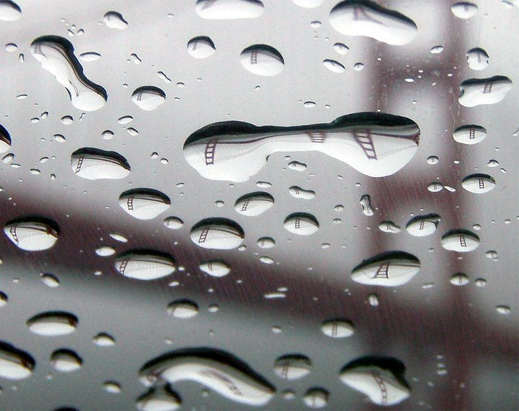
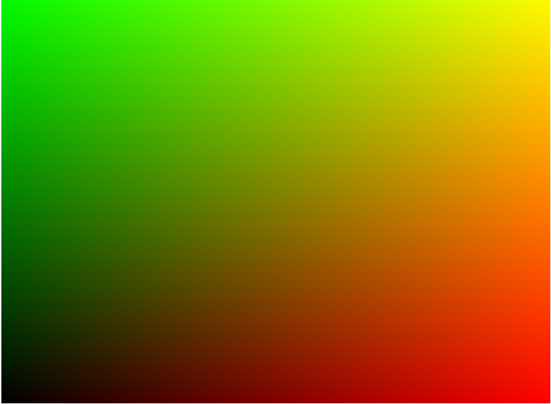
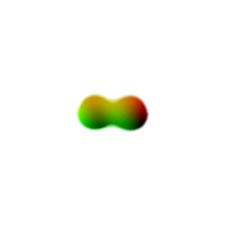
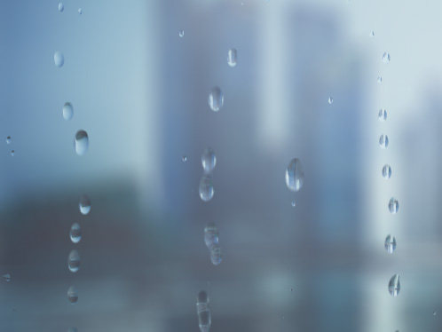
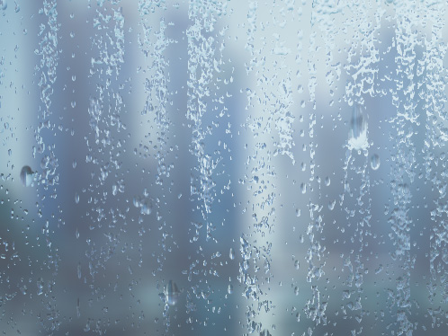
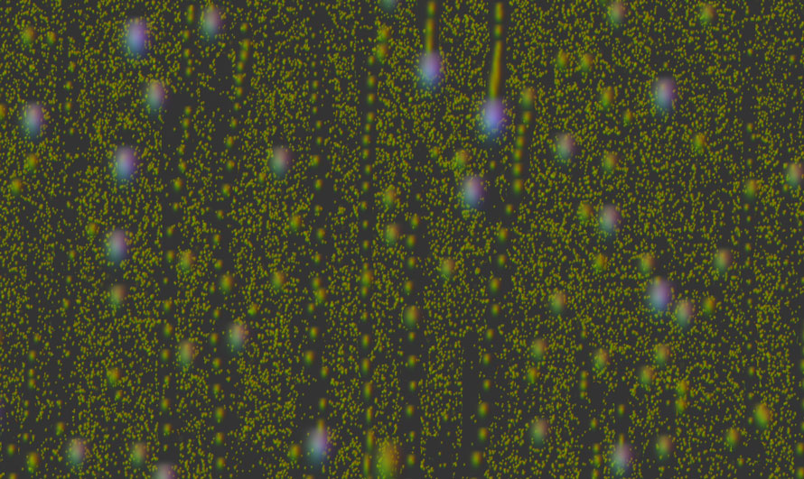

## [轉載] Rain & Water Effect Experiments [Back](./../post.md)

> - Author: [Lucas Bebber](https://github.com/lbebber)
> - Origin: https://tympanus.net/codrops/2015/11/04/rain-water-effect-experiments/
> - Time: Nov, 4th, 2015

<br />

> Some experimental rain and water drop effects made with WebGL and shown in different demo scenarios.

<p align="center">
    
</p>

Today we'd like to share some WebGL experiments with you. The idea is to create a very realistic looking rain effect and put it in different scenarios. In this article, we'll give an overview of the general tricks and techniques used to make this effect.

> Please note that the effect is highly experimental and might not work as expected in all browsers. Best viewed in Chrome.

### Getting Started

If we want to make an effect based on the real world, the first step is to dissect how it actually looks, so we can make it look convincing.

If you look up pictures of water drops on a window in detail (or, of course, observed them in real life already), you will notice that, due to refraction, the raindrops appear to turn the image behind them upside down.

<p align="center">
    
</p>
<p align="center">
    <em>Image credits: Wikipedia, <a href="https://en.wikipedia.org/wiki/File:GGB_reflection_in_raindrops.jpg" target="_blank">GGB reflection in raindrop</a></em>
</p>

You'll also see that drops that are close to each other get merged – and if it gets past a certain size, it falls down, leaving a small trail.

To simulate this behavior, we'll have to render a lot of drops, and update the refraction on them on every frame, and do all this with a decent frame rate, we'll need a pretty good performance – so, to be able to use hardware accelerated graphics, **we'll use WebGL**.

### WebGL

WebGL is a JavaScript API for rendering 2D and 3D graphics, allowing the use of the GPU for better performance. It is based on OpenGL ES, and the *shaders* aren't written in JS at all, but rather in a language called GLSL.

All in all, that makes it look difficult to use if you're coming from exclusively web development — it's not only a new language, but new concepts as well — but once you grasp some key concepts it will become much easier.

In this article we will only show a basic example of how to use it; for a more in depth explanation, check out the excellent [WebGl Fundamentals](http://webglfundamentals.org/) page.

The first thing we need is a `canvas` element. WebGL renders on `canvas`, and it is a rendering context like the one we get with `canvas.getContext('2d')`.

```html
<canvas id="container" width="800" height="600"></canvas>
```

```js
var canvas = document.getElementById("container");
var gl = canvas.getContext("webgl");
```

Then we'll need a program, which is comprised of a *vertex shader* and a *fragment shader*. Shaders are functions: a vertex shader will be run once per vertex, and the fragment shader is called once per pixel. Their jobs are to return coordinates and colors, respectively. **This is the heart of our WebGL application.**

First we'll create our shaders. This is the vertex shader; we'll make no changes on the vertices and will simply let the data pass through it:

```html
<script id="vert-shader" type="x-shader/x-vertex">
    // gets the current position
    attribute vec4 a_position;

    void main() {
        // returns the position
        gl_Position = a_position;
    }
</script>
```

And this is the fragment shader. This one sets the color of each pixel based on its coordinates.

```html
<script id="frag-shader" type="x-shader/x-fragment">
    precision mediump float;

    void main() {
        // current coordinates
        vec4 coord = gl_FragCoord;
        // sets the color
        gl_FragColor = vec4(coord.x/800.0,coord.y/600.0, 0.0, 1.0);
    }
</script>
```

Now we'll link the shaders to the WebGL context:

```js
function createShader(gl,source,type){
    var shader = gl.createShader(type);
    source = document.getElementById(source).text;
    gl.shaderSource(shader, source);
    gl.compileShader(shader);

    return shader;
}

var vertexShader = createShader(gl, 'vert-shader', gl.VERTEX_SHADER);
var fragShader = createShader(gl, 'frag-shader', gl.FRAGMENT_SHADER);

var program = gl.createProgram();
gl.attachShader(program, vertexShader);
gl.attachShader(program, fragShader);

gl.linkProgram(program);
gl.useProgram(program);
```

Then, we'll have to create an object in which we will render our shader. Here we will just create rectangle — specifically, two triangles.

```js
// create rectangle
var buffer = gl.createBuffer();
gl.bindBuffer(gl.ARRAY_BUFFER, buffer);
gl.bufferData(
    gl.ARRAY_BUFFER,
    new Float32Array([
        -1.0, -1.0,
         1.0, -1.0,
        -1.0,  1.0,
        -1.0,  1.0,
         1.0, -1.0,
         1.0,  1.0]),
    gl.STATIC_DRAW);

// vertex data
var positionLocation = gl.getAttribLocation(program, "a_position");
gl.enableVertexAttribArray(positionLocation);
gl.vertexAttribPointer(positionLocation, 2, gl.FLOAT, false, 0, 0);
```

Finally, we render the whole thing:

```js
gl.drawArrays(gl.TRIANGLES, 0, 6);
```

And this is the result:

<p align="center">
    
</p>

After that, you can play with the shaders to get a hang of how it works. You can see a lot of great shader examples on [ShaderToy](http://shadertoy.com/).

### Raindrops

Now let's see how to make the raindrop effect. First, let's see how a single raindrop looks:

<p align="center">
    
</p>

Now, there are a couple of things going on here.
The alpha channel looks like this because we'll use a technique similar to the one in the [Creative Gooey Effects](http://tympanus.net/codrops/2015/03/10/creative-gooey-effects/) article to make the raindrops stick together.

<p align="center">
    
</p>

There's a reason for the color: we'll be using a technique similar to [normal mapping](https://en.wikipedia.org/wiki/Normal_mapping) to make the refraction effect. We'll use the color of the raindrop to get the coordinates of the texture we'll see through the drop. This is how it looks without the mask:

<p align="center">
    
</p>

From this image, we'll use data from the green channel to get the X position, and from the red channel to get the Y position.

<p align="center">
    
</p>

Now we can write our shader and use both that data and the drop's position to flip and distort the texture right behind the raindrop.

<p align="center">
    
</p>

### Raining

After creating our raindrop, we'll make our rain simulation.

Making the raindrops interact with each other can get heavy fast — the number of calculations increase exponentially with each new drop — so we'll have to optimize a little bit.

In this demo, I'm splitting between large and small drops. The small drops are rendered on a separate `canvas` and are not kept track of. That way, I can make thousands of them and not get any slower. The downside is that they are static, and since we are making new ones every frame, they accumulate. To fix that, we'll use our bigger drops.

Since the big drops do move, we can use them to erase smaller drops underneath them. Erasing in canvas is tricky: we have to actually *draw* something, but use `globalCompositeOperation='destination-out'`. So, every time a big drop moves, we draw a circle on the small drops canvas using that composite operation to clean the drops and make the effect more realistic.

<p align="center">
    
</p>

Finally, we'll render them all on a big `canvas` and use that as a texture for our WebGL shader.

<p align="center">
    
</p>

To make things lighter, we'll take advantage of the fact that the background is out of focus, so we'll use a small texture for it and stretch it out; in WebGL, texture size directly impacts performance. We'll have to use a different, in-focus texture for the raindrops themselves. Blur is an expensive operation, and doing it in real time should be avoided – but since the raindrops are small, we can make that texture small as well.

<p align="center">
    
</p>

<p align="center">
    
</p>

### Conclusion

To make realistic looking effects like raindrops we need to consider many tricky details. Taking apart a real world effect first is the key to every effect recreation. Once we know how things work in reality, we can map that behavior to the virtual world. With WebGL we can aim for good performance for this kind of simulation (we can use hardware accelerated graphics) so it's a good choice for this kind of effect.

**We hope you enjoyed this experiment and find it inspiring!**
