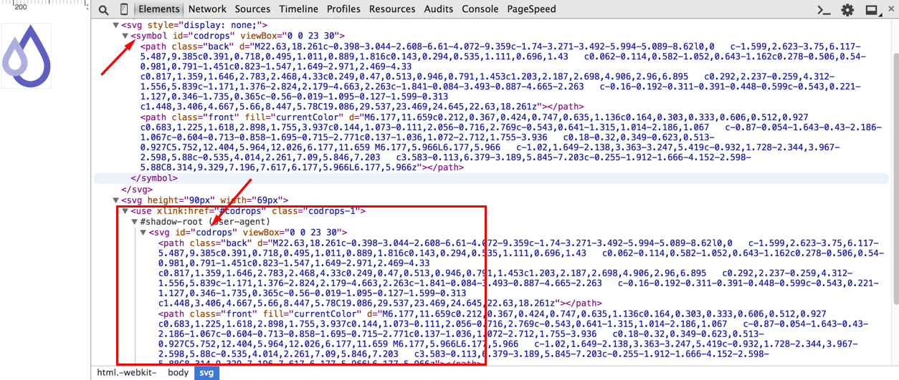
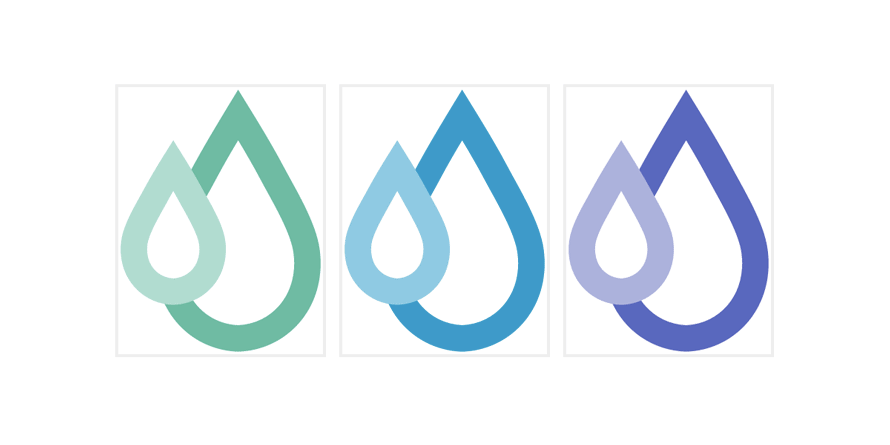

## [轉載] Styling SVG &lt;use&gt; Content with CSS [Back](./../post.md)

> - Author: [Sara Soueidan](https://github.com/SaraSoueidan)
> - Origin: http://tympanus.net/codrops/2015/07/16/styling-svg-use-content-css/
> - Time: Jul, 16th, 2015


One of the most common use cases for SVG graphics is icon systems, and one of the most commonly-used SVG spriting techniques is one that uses the [SVG &lt;use&gt; element to "instantiate" the icons](https://css-tricks.com/svg-sprites-use-better-icon-fonts/) anywhere they are needed in a document.

Instantiating icons or any other SVG element or image using the `<use>` element introduces some challenges when it comes to styling the instance of that element. The aim of this article is to give you an overview of some of the possible ways to work around the styling limitations introduced by `<use>`.

But before we get started, let's take a quick look into SVG's main structuring and grouping elements that will gradually take us into the world of `use`, the shadow of its DOM, and then bring us back into the light with CSS. We'll go over why styling `<use>` content can be challenging and ways to work around that.

### Quick Overview of SVG Structuring, Grouping and Referencing (Re-using) Elements in SVG

There are four main elements in SVG that are used to define, structure and reference SVG code within the document. These elements make reusing elements easy, while maintaining clean and readable code. Because of the nature of SVG, some of these elements have the same functionality as certain commands in graphics editors.

The four main SVG grouping and referencing elements are: `<g>`, `<defs>`, `<use>` and `<symbol>`.

The `<g>` element (short for "group") is used for logically grouping together sets of related graphical elements. In terms of graphics editors, such as Adobe Illustrator, the `<g>` element serves a similar functionality as the *Group Objects* function. You can also think of a group as being similar to the concept of a layer in a graphics editor, since a layer is also a grouping of elements.

Grouping elements together is useful for when you want to apply a style and have that style be inherited by all the elements in the group, and is particularly useful for when you want to animate a group of elements while maintaining their spatial relationships with each other.

The `<defs>` element is used to *define* elements that you want to reuse later. Defining elements with `<defs>` is useful for when you want to create sort of a "template" that you want to use multiple times throughout the document. Elements defined inside a `<defs>` element are not rendered on the canvas except if you "call" them somewhere in the document.

`<defs>` is useful for defining many things, but one of the main use cases is defining patterns like gradients, for example, and then using those gradients as stroke fills on other SVG elements. It can be used to define any elements that you want to render anywhere on the canvas by reference.

The `<symbol>` element combines the benefits of both the `<defs>` and the `<g>` elements in that it is used to group together elements that define a template that is going to be referenced elsewhere in the document. Unlike `<defs>`, `<symbol>` is not usually used to define patterns, but is mostly used to define symbols such as icons, for example, that are referenced throughout the document.

The `<symbol>` element has an important advantage over the other two elements: it accepts a `viewBox` attribute which allows it to scale-to-fit inside any viewport it is rendered in.

The `<use>` element is the element you use to reference any element defined elsewhere in the document. It lets you reuse existing elements, giving you a similar functionality to the copy-paste functionality in a graphics editor. It can be used to reuse a single element, or a group of elements defined with the `<g>` element, the `<defs>` element, or a `<symbol>`.

To use an element you pass a reference to that element—an ID—inside the `use`'s `xlink:href` attribute, and you position that element using `x` and `y` attributes. You can apply styles to the `use` element and those styles will cascade into the contents of the `use` element.

But what is the content of `<use>`? Where is it cloned? And how does the CSS cascade work with that content?

Before we answer these questions, and since we only covered a quick overview of SVG's structuring and grouping elements, it's worth mentioning a couple of articles to learn more about these elements and about the `viewBox` attribute used with `<symbol>`:

- [Structuring, Grouping, and Referencing in SVG — The `<g>`, `<use>`, `<defs>` and `<symbol>` Elements](http://sarasoueidan.com/blog/structuring-grouping-referencing-in-svg/)
- [Understanding SVG Coordinate Systems (Part 1): The Viewport, `viewBox` and `PreserveAspectRatio`](http://sarasoueidan.com/blog/svg-coordinate-systems)

### SVG &lt;use&gt; and The Shadow DOM

When you reference an element with `<use>`, the code might look something like this:

```html
<symbol id="my-icon" viewBox="0 0 30 30">
    <!-- icon content / shapes here -->
</symbol>

<use xlink:href="#my-icon" x="100" y="300" />
```

What is rendered on the screen is the icon whose content is defined inside `<symbol>`, but it's not *that* content that got rendered, but rather the content of the `<use>`, which is a duplicate—or clone—of the `<symbol>`'s content.

But the `<use>` element is only one element and it is self-closing—there is no content somewhere between an opening and closing `use` tag, so where has the `<symbol>` content been cloned?

The answer to that is: **the Shadow DOM**. (Somehow the Shadow DOM always reminds me of the Batman. I don't know why.)

#### What is the Shadow DOM?

The Shadow DOM is similar to the normal DOM except that, instead of being part of the main document subtree, nodes in the Shadow DOM belong to a *document fragment* which is basically just another subtree of nodes which are not as vulnerable to scripts and styles as normal DOM nodes are. This gives authors a way to encapsulate and scope styles and scripts when creating modular components. If you've ever used the HTML5 `video` element or the range input type and wondered where the video controls or range slider components came from, then you've already come across the Shadow DOM before.

In the case of the SVG `<use>` element, the contents of the referenced element are cloned into a document fragment that is "hosted" by `<use>`. `<use>`, in this case, is called a *Shadow Host*.

So, the contents of `<use>` (the clone or copy of whatever element it is referencing) are present inside a shadow document fragment.

In other words, they are *there*, but they are not visible. They are just like normal DOM content, but instead of being available in the "high-level" DOM which is accessible by CSS selectors and JavaScript in the main document, they are copied into a document fragment that is hosted by `<use>`.

Now, if you're a designer, you might be thinking: "OK, I get it but is there a way to inspect that sub-document to actually *see* into its contents?" The answer is: Yes! You can preview the contents of the shadow DOM using Chrome's developer tools. (Inspecting the contents of a shadow DOM is currently not possible in Firefox.) But in order to do that, you need to first enable shadow DOM inspection in the "General" tab inside the Settings panel that can be opened by clicking on the Cog icon. You can learn more about how to do that here.

Once you've enable shadow DOM inspection in the dev tools, you can see the cloned elements in the Elements panel, just like you would with normal DOM elements. The following image shows an example of a `<use>` element referencing the contents of a `<symbol>`. Notice the "#shadow-root" and the contents of that fragment when expanded—they are a copy of the contents of the `<symbol>`.

> 

> Using Chrome's developer tools, you can inspect the contents of the &lt;use&gt; element inside the shadow DOM (see the "#shadow-root" in grey). This screenshot inspects the Codrops logo from an example we will go over in the next section.

Looking at the inspected code, you can see that the shadow DOM is pretty much the same as the normal DOM, except that is has different characteristics when it comes to handling with CSS and JavaScript from the main document. There are also other differences between them, but the shadow DOM cannot possibly be covered in this section because it is too big of a concept, so if you want to read and learn more about it, I recommend the following articles:

- [Intro to Shadow DOM](http://code.tutsplus.com/tutorials/intro-to-shadow-dom--net-34966)
- [What the Heck is Shadow DOM?](http://glazkov.com/2011/01/14/what-the-heck-is-shadow-dom/)
- [Shadow DOM 101](http://www.html5rocks.com/en/tutorials/webcomponents/shadowdom/)
- [Introduction to Shadow DOM (Video)](http://webcomponents.org/articles/introduction-to-shadow-dom/)

For me, and considering how limited my interaction with the shadow DOM is, I think of it as being just like the normal DOM, except that it needs to be handled differently when it comes to accessing its elements for styling with CSS (and JavaScript). This is what matters to us as SVG developers: how the existence of the contents of `<use>` inside a shadow DOM affects that content when it comes to applying or changing styles, because we want to be able to style them. The whole point of using `<use>` is being able to create different "copies" of an element, and in a lot of cases, what we want is to be able to style each copy differently. For example, think about a logo with two styles (inverted color themes) or multi-coloured icons of which each has its own theme. So, it would only make sense for us to expect to be able to do that using CSS.
That being said, we mentioned earlier that the contents of the shadow DOM are not vulnerable to CSS like the normal DOM is. So how *do* we style its content? We cannot target a path descendant of `<use>` like this:

```css
use path#line {
    stroke: #009966;
}
```

because we cannot access the shadow DOM using regular CSS selectors.

There are a couple of special selectors that allow you to penetrate the shadow DOM boundaries to apply styles to nodes inside of it, but those selectors are not only not well supported, but they are limited compared to the long list of selectors provided in CSS for selecting and styling regular DOM elements.

Moreover, we want a simpler way to style the contents of an SVG `<use>` without having to get our hands dirty with shadow DOM specifics—using simple CSS and SVG only.

In order to achieve that and get a little more control over styling the contents of `<use>`, we need to think from a different angle, and start by leveraging the CSS cascade and taking advantage of its inheritance capabilities.

### The Style Cascade

Since SVG elements can be styled using CSS using one of three different ways: external CSS styles (in an external style sheet), internal style blocks (`<style>` elements) and inline styles (in a `style` attribute), it only makes sense that the cascade governs how these styles are applied to these elements.

In addition to CSS properties, SVG elements can also be styled using *presentation attributes*. Presentation attributes are a shorthand for setting a CSS property on an element. Think of them as special style properties. Their nature is what makes them contribute to the style cascade, but maybe in a less expected way.

In the following code snippet which simply displays a pink circle with a yellow stroke, `stroke`, `stroke-width`, and `fill` are all presentation attributes.

```html
<svg viewBox="0 0 100 100">
    <circle fill="deepPink" stroke="yellow" stroke-width="5" cx="50" cy="50" r="10"></circle>
</svg>
```

In SVG, a subset of all CSS properties may be set by SVG attributes, and vice versa. This means that not all CSS properties can be specified on an SVG element as presentation attributes, and not all presentation attributes available in SVG (there are *a lot* of them!) can be specified in CSS.

The SVG specification lists the SVG attributes that may be set as CSS properties. Some of these attributes are shared with CSS (already available as CSS properties), such as `opacity` and `transform`, among others, while some are not, such as `fill`, `stroke` and `stroke-width`, among others.

In SVG 2, this list will include `x`, `y`, `width`, `height`, `cx`, `cy` and a few other presentation attributes that were not possible to set via CSS in SVG 1.1. The new list of attributes can be found in the SVG 2 specification.

If you're like me, then you would expect presentation attributes to have a higher specificity than all other style declarations. I mean, after all, external styles are overridden by internal styles in style blocks, and style block declarations are overridden by inline styles in a style attribute.. so it seems as though the more "internal" the styles get, the more specificity they have, and so when a property gets its own attribute, it makes it more powerful and thus it would override all other style declarations. Although that *still* makes sense to me, this is not how it really works.

As a matter of fact, presentation attributes count as low-level "author style sheets" and are overridden by any other style definitions: external style sheets, document style sheets and inline styles. The only power presentation attributes have in the style cascade is over inherited styles. That is, presentation attributes can only override inherited styles on an element, and are overridden by any other style declaration.

Great, now that that's been cleared up, let's get back to the `<use>` element and its content.

We now know that we cannot set styles on the elements inside `<use>` using CSS selectors.

We also know that, just like with the `<g>` element, styles you apply to `<use>` will be inherited by all its descendants (those in the shadow DOM).

So a first attempt to change the `fill` color of an element inside `<use>` would be to apply that fill color to the `<use>` element itself and let inheritance and the cascade do its thing.

However, that brings up two issues:

1. The fill color will be inherited by *all* the descendants of `<use>`, even those you may not want to style. (If you have only one element inside `<use>`, then this won't be an issue.)
2. If you've exported an SVG from a graphics editor and/or got an SVG from a designer who did that and for any reason you can't touch the SVG code, then you're likely to end up with SVG elements with presentation attributes applied (unless you explicitly specified that you don't want this to happen upon exporting the SVG, but that's another topic), and the values of these attributes are going to override any styles you apply on `<use>`. Now, I'm assuming that if you are specifying styles on `<use>` then you *want* those styles to be inherited by its descendants, so presentation attributes would be causing an inconvenience in this case.

And even if you *do* have access to the SVG code and you *can* get rid of the presentation attributes, **I highly recommend against that** because:

1. Removing the attributes used to set certain properties will reset those properties to their initial browser-default values—which, in most cases, is all black fills and strokes (if we're talking about colors, for example).
2. By resetting all values you force yourself into specifying styles for all the properties set, so unless you want to do just that, then you don't want to get rid of those presentation attributes.
3. The presentation attributes that are initially available are a great fallback mechanism for when the external styles you set are not applied for any reason. If the CSS fails to load because something was messed up, your icon will at least have some default nice styles to fall back to. I highly recommend keeping them.

OK so now we have those attributes but we also want to style different instances of our, say, icon, differently.

The way to do that is to make sure we *force* the presentation attributes into inheriting the styles set on `<use>` or find a way to work around them overriding those values. And in order to do *that*, we need to take advantage of the CSS cascade.

Let's start with the simplest of examples and gradually move on to more complex scenarios.

### Overriding Presentation Attribute Values From CSS

Presentation attributes are overridden by any other style declaration. We can take advantage of this and have an external style declaration force the presentation attribute into overriding its value with the inherited value from `use`.

By using the CSS [`inherit` keyword](http://tympanus.net/codrops/css_reference/inherit), this becomes quite simple. Take a look at the following example where we have an ice cream icon made up of just one path whose fill color we want to change for different instances. The icon is Created by Erin Agnoli from the [Noun Project](http://tympanus.net/codrops/2015/07/16/styling-svg-use-content-css/thenounproject.com).

```html
<svg>
    <symbol id="ic">
        <path fill="#000" d="M81,40.933c0-4.25-3-7.811-6.996-8.673c-0.922-5.312-3.588-10.178-7.623-13.844  c-2.459-2.239-5.326-3.913-8.408-4.981c-0.797-3.676-4.066-6.437-7.979-6.437c-3.908,0-7.184,2.764-7.979,6.442  c-3.078,1.065-5.939,2.741-8.396,4.977c-4.035,3.666-6.701,8.531-7.623,13.844C22.002,33.123,19,36.682,19,40.933  c0,2.617,1.145,4.965,2.957,6.589c0.047,0.195,0.119,0.389,0.225,0.568l26.004,43.873c0.383,0.646,1.072,1.04,1.824,1.04  c0.748,0,1.439-0.395,1.824-1.04L77.82,48.089c0.105-0.179,0.178-0.373,0.225-0.568C79.855,45.897,81,43.549,81,40.933z   M49.994,11.235c2.164,0,3.928,1.762,3.928,3.93c0,2.165-1.764,3.929-3.928,3.929s-3.928-1.764-3.928-3.929  C46.066,12.997,47.83,11.235,49.994,11.235z M27.842,36.301c0.014,0,0.027,0,0.031,0c1.086,0,1.998-0.817,2.115-1.907  c0.762-7.592,5.641-13.791,12.303-16.535c1.119,3.184,4.146,5.475,7.703,5.475c3.561,0,6.588-2.293,7.707-5.48  c6.664,2.742,11.547,8.944,12.312,16.54c0.115,1.092,1.037,1.929,2.143,1.907c2.541,0.013,4.604,2.087,4.604,4.631  c0,1.684-0.914,3.148-2.266,3.958H25.508c-1.354-0.809-2.268-2.273-2.268-3.958C23.24,38.389,25.303,36.316,27.842,36.301z   M50.01,86.723L27.73,49.13h44.541L50.01,86.723z"/>
</symbol>
</svg>
```

The ice cream icon's contents (the `path`) are defined in a `<symbol>` element, which means that they won't be directly rendered on the SVG canvas.

Then, we render multiple instances of the icon using `<use>`.

```html
<svg class="icon" viewBox="0 0 100 125">
    <use class="ic-1" xlink:href="#ic" x="0" y="0" />
</svg>
<svg class="icon" viewBox="0 0 100 125">
    <use class="ic-2" xlink:href="#ic" x="0" y="0" />
</svg>
```

And we set the width and height of the icons from CSS. I am using the same dimensions as the `viewBox` dimensions but they don't have to be identical. However, to avoid getting any excess white space inside the SVG, make sure you maintain the same aspect ratio between them.

```css
.icon {
    width: 100px;
    height: 125px;
}
```

Using the above code, you get the following result:


Note that I have added a black border to the SVGs so you can see the boundaries of each one and to show you that the contents of the first SVG where we defined the icon contents are not rendered. This is to make a point here: **the SVG document where you define your `symbol`s will still be rendered on the page, even if it contains no rendered shapes**. In order to avoid that, make sure you set `display: none` on the first SVG. If you don't hide the SVG containing the icon definitions, it will be rendered even if you don't explicitly set any dimensions for it—the browser will default to 300 pixels by 150 pixels, which is the default size for non-replaced elements in CSS, so you will end up with a white area on the page that you do not want.

Now let's try to change the fill color for each icon instance:

```css
use.ic-1 {
    fill: skyblue;
}

use.ic-2 {
    fill: #FDC646;
}
```

The fill color of the icons still does not change because the inherited color values are being overridden by the `fill="#000"` on the `path` element. To prevent that from happening, let's force the `path` into inheriting the color value:

```css
svg path {
    fill: inherit;
}
```

And voila!—the colors we set on the `<use>` elements are now applied to the `path` in each one. Check the live demo out and play with the values creating more instances and changing their colors as you go:

<p>
<p data-height="300" data-theme-id="21735" data-slug-hash="wzxWxR" data-default-tab="result" data-user="aleen42" data-embed-version="2" data-pen-title="wzxWxR" class="codepen">See the Pen <a href="http://codepen.io/aleen42/pen/wzxWxR/">wzxWxR</a> by aleen42 (<a href="http://codepen.io/aleen42">@aleen42</a>) on <a href="http://codepen.io">CodePen</a>.</p>
<script async src="https://production-assets.codepen.io/assets/embed/ei.js"></script>
</p>

Now this technique is useful when you want to force the contents of `<use>` to inherit the styles you set on it. But in most cases, this may not be exactly what you want. There are other styling scenarios, so we'll go over some of them next.

#### Styling `<use>` Content with the CSS `all` Property

A while back I was working on an icon referenced with `use` and I wanted one of the elements inside of it to inherit all the styles I set on `<use>` like `fill`, `stroke`, `stroke-width`, `opacity` and even `transform`. Basically, I wanted to be able to control all of those attributes from CSS while also keeping the presentation attributes in the markup as fallback.

If you find yourself in such a scenario as well, you will probably find it time-consuming to have to do this in the CSS:

```css
path#myPath {
    fill: inherit;
    stroke: inherit;
    stroke-width: inherit;
    transform: inherit;
    /* ... */
}
```

Looking at the above snippet, you can see a pattern and it would only make sense for us to be able to combine *all* of those properties into one property and set that property's value to `inherit`.


Fortunately, this is where the CSS `all` property helps. I have written about using the `all` property to style SVG `<use>` content in [property's CSS Reference entry](http://tympanus.net/codrops/css_reference/all/), but it is worth a second look here since we're in the right context.

Using the `all` property, we can do this:

```css
path#myPath {
    all: inherit;
}
```

This works great in all browsers that support the `all` property (see property's entry for details), however there is something important to keep in mind: **this declaration will set literally *all* of the properties on the element to inherit their values from their ancestor**, even those you might not have wanted to target. So unless you want to style *all* the properties of your element from your CSS, then you do not want to use this—it is **an extreme measure** and is particularly useful for when you want to "bare-bone" your element and have complete control over its styling properties in CSS, which may not be too often. If you use this declaration and don't specify values for all of the properties in your CSS, they will go up and cascade until they find a value to inherit, which in most cases will be the default browser styles from the default user agent style sheet.

Note that this will only affect the attributes that can be set in CSS, not the SVG-only attributes. So if an attribute can be set as a CSS property, it will be set to `inherit`, otherwise it won't.

---

Being able to force the presentation attributes to inherit from `<use>` styles is powerful, but what if you have an icon with multiple elements and you *don't* want *all* of those elements to inherit the same `fill` color from `use`? What if you want to apply multiple different fill colors to different `use` descendants? Setting one style on `use` no longer suffices. We need something else to help us cascade the right colors to the right elements.

### Using the CSS `currentColor` Variable For Styling `<use>` Content

Using the CSS [`currentColor` variable ](http://tympanus.net/codrops/css_reference/color_value/#section_currentColor)in conjunction with the above technique, we can specify two different colors on an element, instead of just one. Fabrice Weinberg [wrote about this technique on his Codepen blog](http://codepen.io/FWeinb/blog/quick-tip-svg-use-style-two-colors) a little less than a year ago.

The idea behind this technique is to use both the `fill` and the `color` properties on `<use>`, and then have these colors cascade into the contents of `<use>` by taking advantage of the variable nature of `currentColor`. Let's jump right into a code example to see how this works.

Suppose we want to style this minimal Codrops logo using two colors—one for the front drop and one for the back drop—for every instance of that logo.



First, let's start with the code for the above screenshot: we have the `symbol` containing our icon definition and then three `<use>` instances creating the three logo instances.

```html
<svg style="display: none;">
<symbol id="codrops" viewBox="0 0 23 30">
    <path class="back" fill="#aaa" d="M22.63,18.261c-0.398-3.044-2.608-6.61-4.072-9.359c-1.74-3.271-3.492-5.994-5.089-8.62l0,0   c-1.599,2.623-3.75,6.117-5.487,9.385c0.391,0.718,0.495,1.011,0.889,1.816c0.143,0.294,0.535,1.111,0.696,1.43   c0.062-0.114,0.582-1.052,0.643-1.162c0.278-0.506,0.54-0.981,0.791-1.451c0.823-1.547,1.649-2.971,2.469-4.33   c0.817,1.359,1.646,2.783,2.468,4.33c0.249,0.47,0.513,0.946,0.791,1.453c1.203,2.187,2.698,4.906,2.96,6.895   c0.292,2.237-0.259,4.312-1.556,5.839c-1.171,1.376-2.824,2.179-4.663,2.263c-1.841-0.084-3.493-0.887-4.665-2.263   c-0.16-0.192-0.311-0.391-0.448-0.599c-0.543,0.221-1.127,0.346-1.735,0.365c-0.56-0.019-1.095-0.127-1.599-0.313   c1.448,3.406,4.667,5.66,8.447,5.78C19.086,29.537,23.469,24.645,22.63,18.261z"/>
    <path class="front" fill="#ddd" d="M6.177,11.659c0.212,0.367,0.424,0.747,0.635,1.136c0.164,0.303,0.333,0.606,0.512,0.927   c0.683,1.225,1.618,2.898,1.755,3.937c0.144,1.073-0.111,2.056-0.716,2.769c-0.543,0.641-1.315,1.014-2.186,1.067   c-0.87-0.054-1.643-0.43-2.186-1.067c-0.604-0.713-0.858-1.695-0.715-2.771c0.137-1.036,1.072-2.712,1.755-3.936   c0.18-0.32,0.349-0.623,0.513-0.927C5.752,12.404,5.964,12.026,6.177,11.659 M6.177,5.966L6.177,5.966   c-1.02,1.649-2.138,3.363-3.247,5.419c-0.932,1.728-2.344,3.967-2.598,5.88c-0.535,4.014,2.261,7.09,5.846,7.203   c3.583-0.113,6.379-3.189,5.845-7.203c-0.255-1.912-1.666-4.152-2.598-5.88C8.314,9.329,7.196,7.617,6.177,5.966L6.177,5.966z"/>
</symbol>
</svg>
<svg height="90px" width="69px">
    <use xlink:href="#codrops" class="codrops-1"/>
</svg>
<svg height="90px" width="69px">
    <use xlink:href="#codrops" class="codrops-2"/>
</svg>
<svg height="90px" width="69px">
    <use xlink:href="#codrops" class="codrops-3"/>
</svg>
```

If we were to set the `fill` color on the `<use>` element for each instance, that color would be inherited by both paths (drops) and they would both end up having the same color—which is not what we want.

So instead of specifying only the `fill` color and having it cascade the default way, we are going to use the `currentColor` variable to make sure the small drop in the front gets a different color value: the value specified using the `color` property.

First, we need to insert the `currentColor` where we want that color value to be applied; it goes into the markup where the icon contents are defined, inside the `<symbol>`. So the code looks like this:

```html
<svg style="display: none;">
	<symbol id="codrops" viewBox="0 0 23 30">
		<path class="back" fill="#aaa" d="..."/>
		<path class="front" fill="currentColor" d="..."/>
	</symbol>
</svg>
```

Next we need to remove the `fill` presentation attribute from the other drop, and let it inherit the `fill` color from `use` without using the `inherit` technique.

If we were to use the `inherit` keyword to force the presentation attributes into inheriting their values from `use`, both paths will inherit the same value and the `currentColor` will no longer have an effect. So, in this technique, we do need to remove the attribute we want to set in CSS, and only keep the one whose value we want to set using `currentColor`.

```html
<svg style="display: none;">
	<symbol id="codrops" viewBox="0 0 23 30">
		<path class="back" d="..."/>
		<path class="front" fill="currentColor" d="..."/>
	</symbol>
</svg>
```

Now, using `fill` and `color` properties on `<use>`, we style the drops:

```css
.codrops-1 {
    fill: #4BC0A5;
    color: #A4DFD1;
}
.codrops-2 {
    fill: #0099CC;
    color: #7FCBE5;
}
.codrops-3 {
    fill: #5F5EC0;
    color: #AEAFDD;
}
```

Each `<use>` element gets its own `fill` and `color` values. For each one, the `fill` color cascades and is inherited by the first path which does not have a `fill` attribute, and the value of the `color` property is used as a value for the `fill` attribute on the second path.

So what happened here is that the current color value was *leaked* into the innards of the `<use>` element, using the `currentColor` variable. Pretty neat, right?

Here is the live demo for the above code:

<p>
<p data-height="300" data-theme-id="21735" data-slug-hash="vXaKvR" data-default-tab="result" data-user="aleen42" data-embed-version="2" data-pen-title="vXaKvR" class="codepen">See the Pen <a href="http://codepen.io/aleen42/pen/vXaKvR/">vXaKvR</a> by aleen42 (<a href="http://codepen.io/aleen42">@aleen42</a>) on <a href="http://codepen.io">CodePen</a>.</p>
<script async src="https://production-assets.codepen.io/assets/embed/ei.js"></script>
</p>

This two-color variation technique is quite useful for simple bicoloured logos. In Fabrice's article, he created three different variations of the Sass logo by changing the color of the text versus that of the background.

The `currentColor` keyword is the only available CSS variable in CSS today. However, if we had more variables, wouldn't it make it possible for us to distribute and leak even more values into the `<use>` content? Yes, it would. Amelia Bellamy-Royds introduced this very concept in [a Codepen blog post](http://codepen.io/AmeliaBR/thoughts/customizable-svg-icons-css-variables) a little less than a year ago as well. Let's take a look at how that works.

### The Future: Styling &lt;use&gt; Content with CSS Custom Properties a.k.a CSS Variables

Using [CSS Custom Properties (a.k.a CSS Variables)](http://www.w3.org/TR/css-variables/), you can style the contents of `<use>` without having to force the browser into overriding any presentation attribute values.

As [defined on MDN](https://developer.mozilla.org/en-US/docs/Web/CSS/Using_CSS_variables), CSS Variables are entities defined by authors, or users, of Web pages to contain specific values throughout a document. They are set using custom properties and are accessed using a specific functional notation `var()`. They are very similar to CSS preprocessor (like Sass) variables, but are more flexible and [can do things preprocessor variables can't](http://www.sitepoint.com/css-variables-can-preprocessors-cant/). (An entry on CSS Variables will soon be added to the Codrops CSS Reference, so stay tuned.)

Variables, be it CSS variables or preprocessor variables, can have many usage examples, but theming (colors) is one of the most common use cases. And in this section we'll go over how that can be done when styling SVGs.

We'll start with one image defined in a `symbol` and instantiated with `use` and apply this technique to one image only; the concepts applied to style the contents of `<use>` in this example can be applied to as many `<use>` elements as you want.

So, suppose we have the following cute hipster robot illustration [designed by Freepik](http://www.freepik.com/free-vector/cute-vector-hipster-robot-character_714905.htm).

<a href="./1.png"></a>

The code for the robot contains the colors that make it up.

```html
<svg style="display: none">
    <symbol id="robot" viewBox="0 0 340 536">
        <path d="..." fill="#fff" />
        <path d="..." fill="#D1312C" />
        <path d="..." fill="#1E8F90" />
        <path d="..." fill="#1E8F90" />
        <path d="..." fill="#fff" />
        <path d="..." fill="#6A4933" />
        <path d="..." fill="#1E8F90"  />
        <path d="..." fill="#6A4933" />
        <path d="..." fill="#fff" />
        <path d="..." fill="#6A4933" />
        <path d="..." fill="#F2B42B" />
        <path d="..." fill="#fff" />

        <!-- rest of the shapes -->
    </symbol>
</svg>
```

Now, we are *not* going to use the CSS Variables as values for the `fill` attribute of each path; instead, we're going to use them as fill color values using the CSS `fill` *property*, and we're going to keep the `fill` attributes in place. **The attributes will be used as a fallback for browsers that don't support CSS Variables**, so the image will still look as it initially did if the variables fail to work in those browsers.

With the variables added, the above code will look like so:

```html
<svg style="display: none">
    <symbol id="robot" viewBox="0 0 340 536">
        <path d="..." fill="#fff" />
        <path d="..." fill="#D1312C" />
        <path d="..." fill="#1E8F90" style="fill: var(--primary-color)" />
        <path d="..." fill="#1E8F90" style="fill: var(--primary-color)" />
        <path d="..." fill="#fff" />
        <path d="..." fill="#6A4933" style="fill: var(--tertiary-color)" />
        <path d="..." fill="#1E8F90" style="fill: var(--primary-color)" />
        <path d="..." fill="#6A4933" style="fill: var(--tertiary-color)" />
        <path d="..." fill="#fff" />
        <path d="..." fill="#6A4933" style="fill: var(--tertiary-color)" />
        <path d="..." fill="#F2B42B" style="fill: var(--secondary-color)" />
        <path d="..." fill="#fff" />

        <!-- rest of the shapes -->
    </symbol>
</svg>
```

Since inline `style` tags override presentation attributes, browsers that support CSS Variables will use those variables as fill colors for the shapes. Browsers that do not support CSS variables will use the `fill` attribute values instead.

Next, we need to define the values for the variables in CSS. First, the illustration will be instantiated using `use`:

```html
<svg width="340" height="536">
    <use xlink:href="#robot" id="robot-1" />
</svg>
```

Then, the variables will be defined on `use` so that they cascade into its contents. The colors you choose for the variables will make up the color scheme of the contents of your illustration. So, for the above robot, there were three main colors making up the graphic, so I named them primary, secondary and tertiary.

```css
#robot-1 {
    --primary-color: #0099CC;
    --secondary-color: #FFDF34;
    --tertiary-color: #333;
}
```

You can still use the `fill` and `color` properties alongside these variables, but you may not need to or simply not want to. So, given the above colors defined for the variables, the robot now looks like this:

<a href="./2.png"></a>

You can have as many copies of the image as you want, and for each `use` define a set of different colors to be used, and end up with different themes. This is particularly useful for when you want to style a logo in different ways depending on the context, or for any other similar use cases.

Now, we mentioned that browsers that don't support CSS Variables are going to fall back to the initial styles defined in the presentation attributes, and browsers that do support the variables will use the variables in the `fill` properties to override the attributes. Great. But what happens if the browser *does* support CSS Variables but the author fails to provide them with a value for a specific variable or if the value they provided is invalid?

For our hipster robot here, we defined three variables, and only a few elements inside of the image did not get any variables because the colors used were complimentary and would go with pretty much any color theme used. So, if you display the above code in a browser that supports CSS variables (currently only Firefox) and remove the variable declarations from the CSS, you will end up with this:

<a href="./3.png"></a>

If the values provided for the variables are either not set or invalid, the browser will default to its own colors, which is usually black for fill and stroke colors in SVG.

A way to avoid that is to provide **another fallback color for supporting browsers**. Indeed, the CSS variables syntax comes with a way to do just that: instead of providing only the variable name inside the `var()` function as an argument, you provide two comma-separated arguments: the variable name and a fallback color value—which in this case is the value we have in the presentation attributes.

So, going over the above code for the robot, it will look like this:

```html
<svg style="display: none">
    <symbol id="robot" viewBox="0 0 340 536">
        <path d="..." fill="#fff" />
        <path d="..." fill="#D1312C" />
        <path d="..." fill="#1E8F90" style="fill: var(--primary-color, #1E8F90)" />
        <path d="..." fill="#1E8F90" style="fill: var(--primary-color, #1E8F90)" />
        <path d="..." fill="#fff" />
        <path d="..." fill="#6A4933" style="fill: var(--tertiary-color, #6A4933)" />
        <path d="..." fill="#1E8F90" style="fill: var(--primary-color, #1E8F90)" />
        <path d="..." fill="#6A4933" style="fill: var(--tertiary-color, #6A4933)" />
        <path d="..." fill="#fff" />
        <path d="..." fill="#6A4933" style="fill: var(--tertiary-color, #6A4933)" />
        <path d="..." fill="#F2B42B" style="fill: var(--secondary-color, #F2B42B)" />
        <path d="..." fill="#fff" />

        <!-- rest of the shapes -->
    </symbol>
</svg>
```

And that's it. For any variable that fails to load its defined value or that does not have one, the browser will fall back to the initial color defined in the markup. Wonderful.

Using this technique, you can now reference the robot anywhere you want on the page with `<use>`, and for every new instance define a set of variable values in the CSS, and you'll have a different color theme per instance.

You can play with the above demo, create as many copies of the robot as you want and assign different variable values to them in this live demo, just make sure you use Firefox at this time because it's the only browser supporting CSS Variables at the time of writing of this article:

<p>
<p data-height="352" data-theme-id="21735" data-slug-hash="rrArWW" data-default-tab="html,result" data-user="aleen42" data-embed-version="2" data-pen-title="rrArWW" class="codepen">See the Pen <a href="http://codepen.io/aleen42/pen/rrArWW/">rrArWW</a> by aleen42 (<a href="http://codepen.io/aleen42">@aleen42</a>) on <a href="http://codepen.io">CodePen</a>.</p>
<script async src="https://production-assets.codepen.io/assets/embed/ei.js"></script>
</p>

If you view the demo in Firefox, you will see the blue + yellow version of the robot that we defined with CSS variables. Make sure you check the demo in Chrome to see how it falls back to the initial colors (green version), and try removing the variable declarations from the CSS in Firefox to also see how the fallback works.

### Summing Up

Phew. That was a lot.

By taking advantage of the CSS cascade, styling the contents of `<use>`—though in a shadow DOM—can become less complicated. And with CSS variables (be it `currentColor` alone or the custom properties) we can penetrate the lines of the shadow DOM and customize our graphics to our liking while also providing very good fallback for when anything goes wrong.

Personally, I am incredibly excited about the CSS Variables + SVG combination. I love how powerful they are together, especially given the great fallback mechanism we have with it. **They are currently only supported in Firefox, as we mentioned, but if you want to see them get wider support you can start by voting for them in other browsers such as on the [MS Edge User Voice forums](https://wpdev.uservoice.com/forums/257854-internet-explorer-platform/suggestions/6261292-css-variables)**.

We may even get other ways to style `use` content in the future as well since there are already discussions going on about using CSS Variables as SVG parameters; so this article, though long, might have not covered everything there is to know about this topic. If you have any other ideas, please feel free to share them in the comments below.

Dealing with the contents of re`use`d SVG elements has been one of those SVG topics that many people seem to find some hardship with, because of the nature of how the cloned code behaves and where it is cloned to. There are a lot more topics to cover that are related to that, but those are topics for other articles.

I hope you enjoyed this article and found it useful. Thank you for reading.
