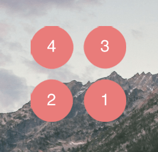

## \[轉載\] The Gooey Effect [Back](../post.md)

> - Author: [Lucas Bebber](https://github.com/lbebber)
> - Origin: https://css-tricks.com/gooey-effect/
> - Time: Feb 22nd, 2019

*The following is a post by [Lucas Bebber](https://codepen.io/lbebber/). Lucas the originator of some of the most creative effects I've ever seen on the web. So much so I couldn't resist [blogging about them](https://css-tricks.com/glitch-effect-text-images-svg/) myself [several times](https://css-tricks.com/shape-blobbing-css/). Much better this time: we got the man himself to explain how SVG filters work and how you can use them to create a very cool gooey effect.*

A while ago, Chris wrote about [Shape Blobbing in CSS](https://css-tricks.com/shape-blobbing-css/). The effect is cool and the technique behind it is clever, but the approach, through regular CSS filters, has several drawbacks: no transparency, no content inside the blobs, hard to make it in any color besides black and white, etc.

However, these days, playing around with SVG filters, I figured I could use them to get around most of the problems of a pure CSS approach. Here you can see a gooey menu I made to demonstrate the effect:

<p align="center">
<p class="codepen" data-height="550" data-theme-id="light" data-default-tab="css,result" data-user="lbebber" data-slug-hash="LELBEo" style="height: 550px; box-sizing: border-box; display: flex; align-items: center; justify-content: center; border: 2px solid; margin: 1em 0; padding: 1em;" data-pen-title="Gooey Menu">
  <span>See the Pen <a href="https://codepen.io/lbebber/pen/LELBEo">
  Gooey Menu</a> by Lucas Bebber (<a href="https://codepen.io/lbebber">@lbebber</a>)
  on <a href="https://codepen.io">CodePen</a>.</span>
</p>
<script async src="https://static.codepen.io/assets/embed/ei.js"></script>
</p>

### SVG Filters 101

SVG filters are quite powerful. It is a pretty extensive topic. Here we will only cover the basics necessary to understand how this effect works.

Despite the name, we can apply SVG filters on regular DOM elements through CSS, [in most browsers](https://css-tricks.com/gooey-effect/#gooey-support).

This is the basic syntax to define a filter:

```html
<svg xmlns="http://www.w3.org/2000/svg" version="1.1">
    <defs>
        <filter id="name-your-filter-here">
            ...          
            <!-- insert filters here -->
            ...
        </filter>
        ...
    </defs>
</svg>
```

To apply a SVG filter to a DOM element:

```css
.selector {
    filter: url('#name-of-your-filter-here');

    /* you can also load filters from external SVGs this way: */
    filter: url('filters.svg#name-of-your-other-filter-here');
}
```

You may need vendor prefixes to use the [filter](https://css-tricks.com/almanac/properties/f/filter/) property.

A `<filter>` element contains one or more filter primitives, which are the operations done by the filter, e.g. blur, color transform, shading. A complete list of filter primitives can be found [here](https://www.w3.org/TR/SVG/filters.html).

Let's see a couple of examples:

<p align="center">
<p class="codepen" data-height="400" data-theme-id="light" data-default-tab="css,result" data-user="lbebber" data-slug-hash="gbxGWy" style="height: 400px; box-sizing: border-box; display: flex; align-items: center; justify-content: center; border: 2px solid; margin: 1em 0; padding: 1em;" data-pen-title="svg blur demonstration">
  <span>See the Pen <a href="https://codepen.io/lbebber/pen/gbxGWy">
  svg blur demonstration</a> by Lucas Bebber (<a href="https://codepen.io/lbebber">@lbebber</a>)
  on <a href="https://codepen.io">CodePen</a>.</span>
</p>
<script async src="https://static.codepen.io/assets/embed/ei.js"></script>
</p>

```html
<filter id="blur">
    <feGaussianBlur in="SourceGraphic" stdDeviation="3" />
</filter>
```

This filter will do a single simple 3px blur on the object. Notice the `in="SourceGraphic"` attribute. The `in` attribute defines the input of a filter primitive. `SourceGraphic` is a keyword that returns the original, pre-filter graphic of the element. So what this means is that the input of the blur filter will be the original graphic of the object. Pretty straightforward.

Now let's see a common but more complex effect: a drop shadow filter. This will be useful in demonstrating how to chain filter primitives together:

<p align="center">
<p class="codepen" data-height="400" data-theme-id="light" data-default-tab="html,result" data-user="lbebber" data-slug-hash="JoyrNp" style="height: 400px; box-sizing: border-box; display: flex; align-items: center; justify-content: center; border: 2px solid; margin: 1em 0; padding: 1em;" data-pen-title="svg drop shadow demonstration">
  <span>See the Pen <a href="https://codepen.io/lbebber/pen/JoyrNp">
  svg drop shadow demonstration</a> by Lucas Bebber (<a href="https://codepen.io/lbebber">@lbebber</a>)
  on <a href="https://codepen.io">CodePen</a>.</span>
</p>
<script async src="https://static.codepen.io/assets/embed/ei.js"></script>
</p>

```html
<filter id="drop-shadow">
    <feGaussianBlur in="SourceGraphic" stdDeviation="7" result="shadow" />
    <feOffset in="shadow" dx="3" dy="4" result="shadow" />
    <feColorMatrix in="shadow" type="matrix" values="0 0 0 0 0  0 0 0 0 0  0 0 0 0 0  0 0 0 0.6 0" result="shadow" />
    <feBlend in="SourceGraphic" in2="shadow" />
</filter>
```

Take a look at the `result` attribute of the first filter and the subsequent `in` attributes. With the `result` attribute you can name the result of a filter and then apply a filter to *that result* instead of the source graphic. This allows you to, in this example, blur an object, darken the *blurred object* , and then shift the position of the *blurred and darkened* object.

Pay attention to the last element there, the `<feBlend>` primitive. It demonstrates that some filter primitives take multiple inputs (the `in2` parameter), and that you can call the `SourceGraphic` keyword multiple times and at any point of the filter. That last filter, in this example, is taking both the `SourceGraphic` keyword and the `shadow` result to put back the original image over the shadow we made.

Now that the basics of SVG filters are covered, let's take a look at how to make that gooey effect.

### Making Things Stick

The basic technique has been already covered [here](https://css-tricks.com/shape-blobbing-css/). To recap, the idea is to blur two or more objects together and increase the contrast. Pretty simple and works like a charm:

<p align="center">
<p class="codepen" data-height="400" data-theme-id="light" data-default-tab="css,result" data-user="lbebber" data-slug-hash="ZYJXeB" style="height: 400px; box-sizing: border-box; display: flex; align-items: center; justify-content: center; border: 2px solid; margin: 1em 0; padding: 1em;" data-pen-title="metaballs demonstration">
  <span>See the Pen <a href="https://codepen.io/lbebber/pen/ZYJXeB">
  metaballs demonstration</a> by Lucas Bebber (<a href="https://codepen.io/lbebber">@lbebber</a>)
  on <a href="https://codepen.io">CodePen</a>.</span>
</p>
<script async src="https://static.codepen.io/assets/embed/ei.js"></script>
</p>

However, as we've seen before, this also

1. Messes the colors up, making it hard to do anything other than black and white.
2. Blurs the content together, making it unusable.
3. The container requires a background, so no transparency.

All in all, this makes this effect usually unpractical.

With SVG filters, though, we can do some things that were not possible with CSS filters alone: we can increase the contrast of only the alpha channel, not changing the colors; and we can, with the `SourceGraphic` keyword we've seen before, make the content visible as well. Also, since we're dealing with the alpha channel, not only it will be transparent, a transparent background is \*required\*, so be careful with that.

So this is the basic code:

```html
<filter id="goo">
    <feGaussianBlur in="SourceGraphic" stdDeviation="10" result="blur" />
    <feColorMatrix in="blur" type="matrix" values="1 0 0 0 0  0 1 0 0 0  0 0 1 0 0  0 0 0 18 -7" result="goo" />
    <feBlend in="SourceGraphic" in2="goo" />
</filter>
```

It's quite short, let's break it down:

1. First, we apply a 10px blur to the `SourceGraphic` and name that result.
2. Then, to the previous result, we apply a color matrix filter in order to increase the contrast of the alpha channel.
3. Finally, we insert the original graphics over the effect we made.

### About Color Matrices

If you haven't used a color matrix filter before, it might need some explanation. You can think of it as a table of four rows and five columns. It looks like this:

```
   | R | G | B | A | +
---|-------------------
 R | 1 | 0 | 0 | 0 | 0
---|-------------------
 G | 0 | 1 | 0 | 0 | 0
---|-------------------
 B | 0 | 0 | 1 | 0 | 0
---|-------------------
 A | 0 | 0 | 0 | 1 | 0
---|-------------------
```

Each row represents a channel (red, green, blue and alpha) and is used to set the channel's value. Each of the first four columns represents a channel as well, and they return the current value of their respective channels. A number in a cell, then, adds to its row channel the result of the multiplication of that number by the current value of the channel represented by its column. For example, a 0.5 on the row R, column G, will, for each pixel, add to the red channel the current value of green\*0.5. The last column doesn't represent any channel and is used for addition/subtraction, meaning that a number there will add to its channel its value multiplied by 255.

That's a lengthy explanation, but using the filter is quite simple. In our case, since we are only increasing the contrast of the alpha channel, our matrix will look like this:

```
   | R | G | B | A | +
---|-------------------
 R | 1 | 0 | 0 | 0 | 0
---|-------------------
 G | 0 | 1 | 0 | 0 | 0
---|-------------------
 B | 0 | 0 | 1 | 0 | 0
---|-------------------
 A | 0 | 0 | 0 |18 |-7
---|-------------------
```

This leaves the RGB channels unmodified, multiplies the value of the alpha channel by 18, and then subtracts 7\*255 from that value, effectively increasing the contrast of the transparency alone. These values can be tweaked to your needs.

To apply this matrix to our `feColorMatrix` filter, all we have to do is write these numbers sequentially, like this:

```
values="1 0 0 0 0  0 1 0 0 0  0 0 1 0 0  0 0 0 18 -7"
```

### Demo

And with that we have our basic effect ready! Here is it:

<p align="center">
<p class="codepen" data-height="413" data-theme-id="light" data-default-tab="result" data-user="lbebber" data-slug-hash="OPjxZL" style="height: 413px; box-sizing: border-box; display: flex; align-items: center; justify-content: center; border: 2px solid; margin: 1em 0; padding: 1em;" data-pen-title="svg goo effect demonstration">
  <span>See the Pen <a href="https://codepen.io/lbebber/pen/OPjxZL">
  svg goo effect demonstration</a> by Lucas Bebber (<a href="https://codepen.io/lbebber">@lbebber</a>)
  on <a href="https://codepen.io">CodePen</a>.</span>
</p>
<script async src="https://static.codepen.io/assets/embed/ei.js"></script>
</p>

You can then customize it to your needs, like adding a drop shadow, using different colors for each element, or whatever have you!

### Considerations

<ul>
    <li>The filter should be applied to the *container* of the elements, not to the elements themselves.</li>
    <li>
        <p>The container should have some bleeding area, i.e., it should be a bit larger than its contents, otherwise you might get artifacts on the edges:</p>
        <p>
            <figure>
                
                <figcaption>Artifacts on the edges</figcaption>
            </figure>
        </p>
    </li>
    <li>
        <p>To be able to apply this filter to pointy objects like rectangles, we have to take a slightly more sophisticated approach. Instead of just drawing the original image over the goo effect, we could use the <code>feComposite</code> filter with the <code>atop</code> operator to mask out anything outside the goo:</p>
        <p>
            <pre><code class="lang-html"><span class="hljs-tag">&lt;<span class="hljs-name">filter</span> <span class="hljs-attr">id</span>=<span class="hljs-string">"fancy-goo"</span>&gt;</span>
    <span class="hljs-tag">&lt;<span class="hljs-name">feGaussianBlur</span> <span class="hljs-attr">in</span>=<span class="hljs-string">"SourceGraphic"</span> <span class="hljs-attr">stdDeviation</span>=<span class="hljs-string">"10"</span> <span class="hljs-attr">result</span>=<span class="hljs-string">"blur"</span> /&gt;</span>
    <span class="hljs-tag">&lt;<span class="hljs-name">feColorMatrix</span> <span class="hljs-attr">in</span>=<span class="hljs-string">"blur"</span> <span class="hljs-attr">type</span>=<span class="hljs-string">"matrix"</span> <span class="hljs-attr">values</span>=<span class="hljs-string">"1 0 0 0 0  0 1 0 0 0  0 0 1 0 0  0 0 0 19 -9"</span> <span class="hljs-attr">result</span>=<span class="hljs-string">"goo"</span> /&gt;</span>
    <span class="hljs-tag">&lt;<span class="hljs-name">feComposite</span> <span class="hljs-attr">in</span>=<span class="hljs-string">"SourceGraphic"</span> <span class="hljs-attr">in2</span>=<span class="hljs-string">"goo"</span> <span class="hljs-attr">operator</span>=<span class="hljs-string">"atop"</span>/&gt;</span>
<span class="hljs-tag">&lt;/<span class="hljs-name">filter</span>&gt;</span>
</code></pre>
        </p>
        <p>
            <p class="codepen" data-height="378" data-theme-id="light" data-default-tab="result" data-user="lbebber" data-slug-hash="razrxv" style="height: 378px; box-sizing: border-box; display: flex; align-items: center; justify-content: center; border: 2px solid; margin: 1em 0; padding: 1em;" data-pen-title="comparison between methods of applying the goo filter">
              <span>See the Pen <a href="https://codepen.io/lbebber/pen/razrxv">
              comparison between methods of applying the goo filter</a> by Lucas Bebber (<a href="https://codepen.io/lbebber">@lbebber</a>)
              on <a href="https://codepen.io">CodePen</a>.</span>
            </p>
            <script async src="https://static.codepen.io/assets/embed/ei.js"></script>
        </p>
        <p>This way, we can use the filter not only to make that fancy goo effect, but also for simpler applications like, for example, rounding the corners of shapes that take multiple rectangles.</p>
    </li>
    <li>This filter, although light in size, can be resource intensive if applied to large areas, so beware of that.</li>
</ul>

### Support

SVG filters have [good support](https://caniuse.com/#feat=svg-filters), but not all browsers support them being applied to regular DOM elements, notably Safari. However, they do work at least on Firefox and Chrome, even the Android version, and the filter degrades nicely if it doesn't work. If you absolutely need the effect to work, consider using SVG elements instead of DOM elements.
