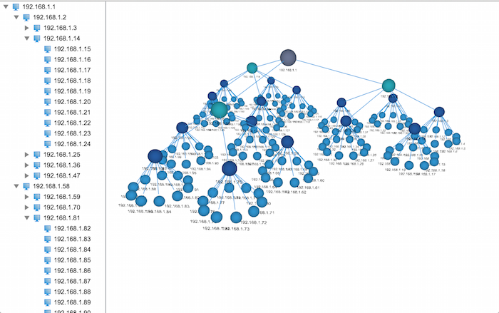
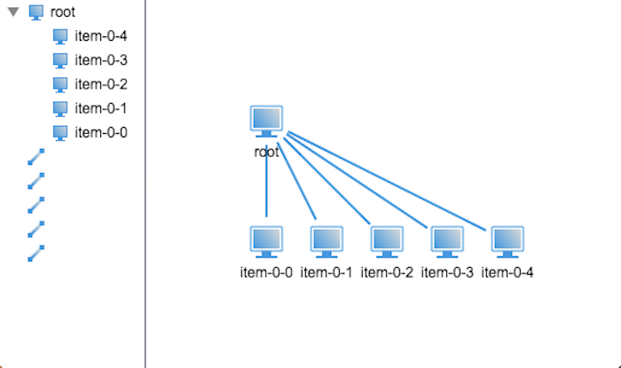
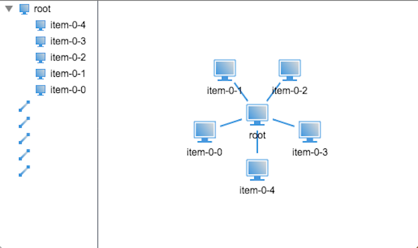
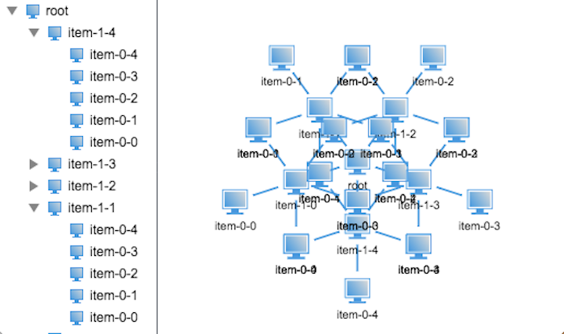
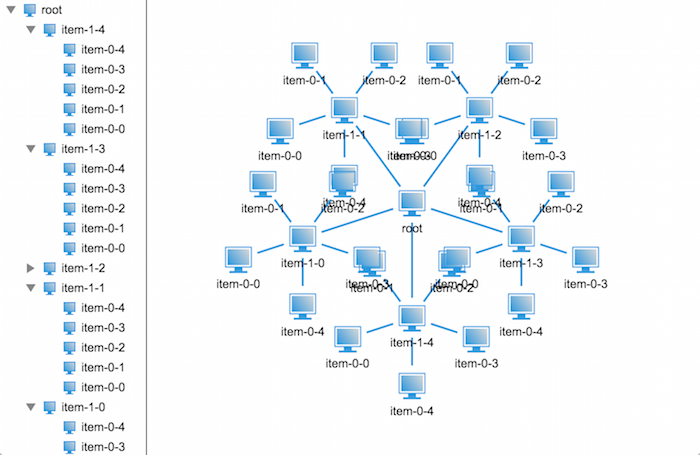
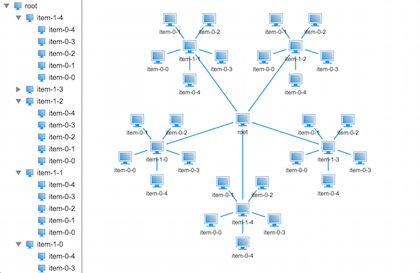
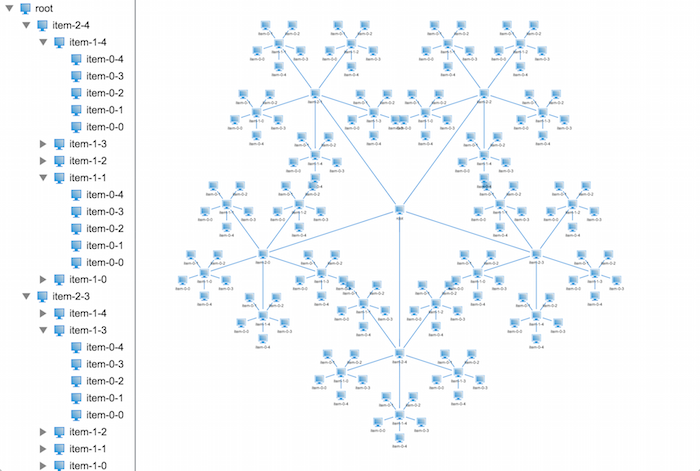
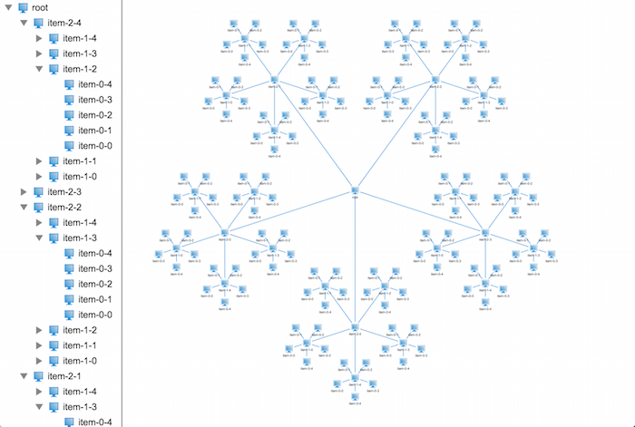
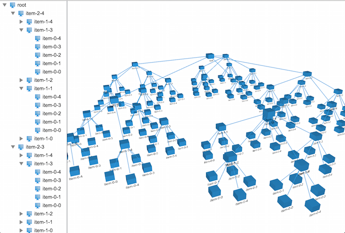
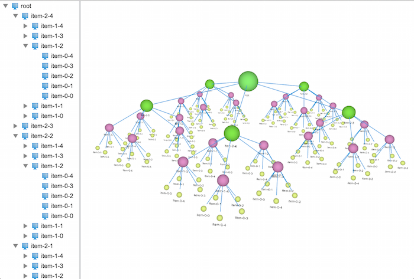

## [轉載] HTML5的WebGL實現的3D和2D拓撲樹 [Back](./../post.md)

> - Author: Eric
> - Origin: http://www.hightopo.com/blog/453.html
> - Time: Feb, 24th, 2016

在[HT for Web](http://www.hightopo.com/)中2D和3D应用都支持树状结构数据的展示，展现效果各异，2D上的树状结构在展现层级关系明显，但是如果数据量大的话，看起来就没那么直观，找到指定的节点比较困难，而3D上的树状结构在展现上配合[HT for Web](http://www.hightopo.com/)的弹力布局组件会显得比较直观，一眼望去可以把整个树状结构数据看个大概，但是在弹力布局的作用下，其层次结构看得就不是那么清晰了。所以这时候结构清晰的[3D树](http://www.hightopo.com/)的需求就来了，那么这个3D树具体长成啥样呢，我们来一起目睹下~



要实现这样的效果，该从何下手呢？接下来我们就将这个问题拆解成若干个小问题来解决。

### 1. 创建一个树状结构

有了解过[HT for Web](http://www.hightopo.com/)的朋友，对树状结构数据的创建应该都不陌生，在这里我就不做深入的探讨了。树状结构数据的创建很简单，在这里为了让代码更简洁，我封装了三个方法来创建树状结构数据，具体代码如下：

```js
/**
 * 创建连线
 * @param {ht.DataModel} dataModel - 数据容器
 * @param {ht.Node} source - 起点
 * @param {ht.Node} target - 终点
 */
function createEdge(dataModel, source, target) {
    // 创建连线，链接父亲节点及孩子节点
    var edge = new ht.Edge();
    edge.setSource(source);
    edge.setTarget(target);
    dataModel.add(edge);
}

/**
 * 创建节点对象
 * @param {ht.DataModel} dataModel - 数据容器
 * @param {ht.Node} [parent] - 父亲节点
 * @returns {ht.Node} 节点对象
 */
function createNode(dataModel, parent) {
    var node = new ht.Node();
    if (parent) {
        // 设置父亲节点
        node.setParent(parent);

        createEdge(dataModel, parent, node);
    }
    // 添加到数据容器中
    dataModel.add(node);
    return node;
}

/**
 * 创建结构树
 * @param {ht.DataModel} dataModel - 数据容器
 * @param {ht.Node} parent - 父亲节点
 * @param {Number} level - 深度
 * @param {Array} count - 每层节点个数
 * @param {function(ht.Node, Number, Number)} callback - 回调函数(节点对象，节点对应的层级，节点在层级中的编号)
 */
function createTreeNodes(dataModel, parent, level, count, callback) {
    level--;
    var num = (typeof count === 'number' ? count : count[level]);

    while (num--) {
        var node = createNode(dataModel, parent);
        // 调用回调函数，用户可以在回调里面设置节点相关属性
        callback(node, level, num);
        if (level === 0) continue;
        // 递归调用创建孩子节点
        createTreeNodes(dataModel, node, level, count, callback);
    }
}
```

嘿嘿，代码写得可能有些复杂了，简单的做法就是嵌套几个for循环来创建树状结构数据，在这里我就不多说了，接下来我们来探究第二个问题。

### 2. 在[2D拓扑](http://www.hightopo.com/)下模拟[3D树](http://www.hightopo.com/)状结构每层的半径计算

在3D下的树状结构体最大的问题就在于，每个节点的层次及每层节点围绕其父亲节点的半径计算。现在树状结构数据已经有了，那么接下来就该开始计算半径了，我们从两层树状结构开始推算：



我现在先创建了两层的树状结构，所有的子节点是一字排开，并没有环绕其父亲节点，那么我们该如何去确定这些孩子节点的位置呢？

首先我们得知道，每个末端节点都有一圈属于自己的领域，不然节点与节点之间将会存在重叠的情况，所以在这里，我们假定末端节点的领域半径为25，那么两个相邻节点之间的最短距离将是两倍的节点领域半径，也就是50，而这些末端节点将均匀地围绕在其父亲节点四周，那么相邻两个节点的张角就可以确认出来，有了张角，有了两点间的距离，那么节点绕其父亲节点的最短半径也就能计算出来了，假设张角为a，两点间最小距离为b，那么最小半径r的计算公式为：

r = b / 2 / sin(a / 2);

那么接下来我么就来布局下这个树，代码是这样写的：

```js
/**
 * 布局树
 * @param {ht.Node} root - 根节点
 * @param {Number} [minR] - 末端节点的最小半径
 */
function layout(root, minR) {
    // 设置默认半径
    minR = (minR == null ? 25 : minR);
    // 获取到所有的孩子节点对象数组
    var children = root.getChildren().toArray();
    // 获取孩子节点个数
    var len = children.length;
    // 计算张角
    var degree = Math.PI * 2 / len;
    // 根据三角函数计算绕父亲节点的半径
    var sin = Math.sin(degree / 2),
        r = minR / sin;
    // 获取父亲节点的位置坐标
    var rootPosition = root.p();

    children.forEach(function(child, index) {
        // 根据三角函数计算每个节点相对于父亲节点的偏移量
        var s = Math.sin(degree * index),
            c = Math.cos(degree * index),
            x = s * r,
            y = c * r;

        // 设置孩子节点的位置坐标
        child.p(x + rootPosition.x, y + rootPosition.y);
    });
}
```

在代码中，你会发现我将末端半径默认设置为25了，如此，我们通过调用layout()方法就可以对结构树进行布局了，其布局效果如下：


从效果图可以看得出，末端节点的默认半径并不是很理想，布局出来的效果连线都快看不到了，因此我们可以增加末端节点的默认半径来解决布局太密的问题，如将默认半径设置成40的效果图如下:



现在两层的树状分布解决了，那么我们来看看三层的树状分布该如何处理。

将第二层和第三层看成一个整体，那么其实三层的树状结构跟两层是一样的，不同的是在处理第二层节点时，应该将其看做一个两层的树状结构来处理，那么像这种规律的处理用递归最好不过了，因此我们将代码稍微该着下，在看看效果如何：



不行，节点都重叠在一起了，看来简单的递归是不行的，那么具体的问题出在哪里呢？

仔细分析了下，发现父亲节点的领域半径是由其孩子节点的领域半径决定的，因此在布局时需要知道自身节点的领域半径，而且节点的位置取决于父亲节点的领域半径及位置信息，这样一来就无法边计算半径边布局节点位置了。

那么现在只能将半径的计算和布局分开来，做两步操作了，我们先来分析下节点半径的计算：

首先需要明确最关键的条件，父亲节点的半径取决于其孩子节点的半径，这个条件告诉我们，只能从下往上计算节点半径，因此我们设计的递归函数必须是先递归后计算，废话不多说，我们来看下具体的代码实现：

```js
/**
 * 就按节点领域半径
 * @param {ht.Node} root - 根节点对象
 * @param {Number} minR - 最小半径
 */
function countRadius(root, minR) {
    minR = (minR == null ? 25 : minR);

    // 若果是末端节点，则设置其半径为最小半径
    if (!root.hasChildren()) {
        root.a('radius', minR);
        return;
    }

    // 遍历孩子节点递归计算半径
    var children = root.getChildren();
    children.each(function(child) {
        countRadius(child, minR);
    });

    var child0 = root.getChildAt(0);
    // 获取孩子节点半径
    var radius = child0.a('radius');

    // 计算子节点的1/2张角
    var degree = Math.PI / children.size();
    // 计算父亲节点的半径
    var pRadius = radius / Math.sin(degree);

    // 设置父亲节点的半径及其孩子节点的布局张角
    root.a('radius', pRadius);
    root.a('degree', degree * 2);
}
```

OK，半径的计算解决了，那么接下来就该解决布局问题了，布局树状结构数据需要明确：孩子节点的坐标位置取决于其父亲节点的坐标位置，因此布局的递归方式和计算半径的递归方式不同，我们需要先布局父亲节点再递归布局孩子节点，具体看看代码吧：

```js
/**
 * 布局树
 * @param {ht.Node} root - 根节点
 */
function layout(root) {
    // 获取到所有的孩子节点对象数组
    var children = root.getChildren().toArray();
    // 获取孩子节点个数
    var len = children.length;
    // 计算张角
    var degree = root.a('degree');
    // 根据三角函数计算绕父亲节点的半径
    var r = root.a('radius');
    // 获取父亲节点的位置坐标
    var rootPosition = root.p();

    children.forEach(function(child, index) {
        // 根据三角函数计算每个节点相对于父亲节点的偏移量
        var s = Math.sin(degree * index),
            c = Math.cos(degree * index),
            x = s * r,
            y = c * r;

        // 设置孩子节点的位置坐标
        child.p(x + rootPosition.x, y + rootPosition.y);

        // 递归调用布局孩子节点
        layout(child);
    });
}
```

代码写完了，接下来就是见证奇迹的时刻了，我们来看看效果图吧：



不对呀，代码应该是没问题的呀，为什么显示出来的效果还是会重叠呢？不过仔细观察我们可以发现相比上个版本的布局会好很多，至少这次只是末端节点重叠了，那么问题出在哪里呢？

不知道大家有没有发现，排除节点自身的大小，倒数第二层节点与节点之间的领域是相切的，那么也就是说节点的半径不仅和其孩子节点的半径有关，还与其孙子节点的半径有关，那我们把计算节点半径的方法改造下，将孙子节点的半径也考虑进去再看看效果如何，改造后的代码如下：

```js
/**
 * 就按节点领域半径
 * @param {ht.Node} root - 根节点对象
 * @param {Number} minR - 最小半径
 */
function countRadius(root, minR) {
    /** ... */
    
    var child0 = root.getChildAt(0);
    // 获取孩子节点半径
    var radius = child0.a('radius');

    var child00 = child0.getChildAt(0);
    // 半径加上孙子节点半径，避免节点重叠
    if (child00) radius += child00.a('radius');
    
    /** ... */
}
```

下面就来看看效果吧~



哈哈，看来我们分析对了，果然就不再重叠了，那我们来看看再多一层节点会是怎么样的壮观场景呢？



哦，NO！这不是我想看到的效果，又重叠了，好讨厌。

不要着急，我们再来仔细分析分析下，在前面，我们提到过一个名词——领域半径，什么是领域半径呢？很简单，就是可以容纳下自身及其所有孩子节点的最小半径，那么问题就来了，末端节点的领域半径为我们指定的最小半径，那么倒数第二层的领域半径是多少呢？并不是我们前面计算出来的半径，而应该加上末端节点自身的领域半径，因为它们之间存在着包含关系，子节点的领域必须包含于其父亲节点的领域中，那我们在看看上图，是不是感觉末端节点的领域被侵占了。那么我们前面计算出来的半径代表着什么呢？前面计算出来的半径其实代表着孩子节点的布局半径，在布局的时候是通过该半径来布局的。

OK，那我们来总结下，节点的领域半径是其下每层节点的布局半径之和，而布局半径需要根据其孩子节点个数及其领域半径共同决定。

好了，我们现在知道问题的所在了，那么我们的代码该如何去实现呢？接着往下看：

```js
/**
 * 就按节点领域半径及布局半径
 * @param {ht.Node} root - 根节点对象
 * @param {Number} minR - 最小半径
 */
function countRadius(root, minR) {
    minR = (minR == null ? 25 : minR);

    // 若果是末端节点，则设置其布局半径及领域半径为最小半径
    if (!root.hasChildren()) {
        root.a('radius', minR);
        root.a('totalRadius', minR);
        return;
    }

    // 遍历孩子节点递归计算半径
    var children = root.getChildren();
    children.each(function(child) {
        countRadius(child, minR);
    });

    var child0 = root.getChildAt(0);
    // 获取孩子节点半径
    var radius = child0.a('radius'),
        totalRadius = child0.a('totalRadius');

    // 计算子节点的1/2张角
    var degree = Math.PI / children.size();
    // 计算父亲节点的布局半径
    var pRadius = totalRadius / Math.sin(degree);

    // 缓存父亲节点的布局半径
    root.a('radius', pRadius);
    // 缓存父亲节点的领域半径
    root.a('totalRadius', pRadius + totalRadius);
    // 缓存其孩子节点的布局张角
    root.a('degree', degree * 2);
}
```

在代码中我们将节点的领域半径缓存起来，从下往上一层一层地叠加上去。接下来我们一起验证其正确性：



搞定，就是这样子了，[2D拓扑](http://www.hightopo.com/)上面的布局搞定了，那么接下来该出动3D拓扑啦~

### 3. 加入z轴坐标，呈现3D下的树状结构

[3D拓扑](http://www.hightopo.com/)上面布局无非就是多加了一个坐标系，而且这个坐标系只是控制节点的高度而已，并不会影响到节点之间的重叠，所以接下来我们来改造下我们的程序，让其能够在3D上正常布局。

也不需要太大的改造，我们只需要修改下布局器并且将[2D拓扑](http://www.hightopo.com/)组件改成3D拓扑组件就可以了。

```js
/**
 * 布局树
 * @param {ht.Node} root - 根节点
 */
function layout(root) {
    // 获取到所有的孩子节点对象数组
    var children = root.getChildren().toArray();
    // 获取孩子节点个数
    var len = children.length;
    // 计算张角
    var degree = root.a('degree');
    // 根据三角函数计算绕父亲节点的半径
    var r = root.a('radius');
    // 获取父亲节点的位置坐标
    var rootPosition = root.p3();

    children.forEach(function(child, index) {
        // 根据三角函数计算每个节点相对于父亲节点的偏移量
        var s = Math.sin(degree * index),
            c = Math.cos(degree * index),
            x = s * r,
            z = c * r;

        // 设置孩子节点的位置坐标
        child.p3(x + rootPosition[0], rootPosition[1] - 100, z + rootPosition[2]);

        // 递归调用布局孩子节点
        layout(child);
    });
}
```

上面是改造成3D布局后的布局器代码，你会发现和2D的布局器代码就差一个坐标系的的计算，其他的都一样，看下在3D上布局的效果：



恩，有模有样的了，在文章的开头，我们可以看到每一层的节点都有不同的颜色及大小，这些都是比较简单，在这里我就不做深入的讲解，具体的代码实现如下：

```js
var level = 4,
    size = (level + 1) * 20;

var root = createNode(dataModel);
root.setName('root');
root.p(100, 100);

root.s('shape3d', 'sphere');
root.s('shape3d.color', randomColor());
root.s3(size, size, size);

var colors = {},
    sizes = {};
createTreeNodes(dataModel, root, level - 1, 5, function(data, level, num) {
    if (!colors[level]) {
        colors[level] = randomColor();
        sizes[level] = (level + 1) * 20;
    }

    size = sizes[level];

    data.setName('item-' + level + '-' + num);
    // 设置节点形状为球形
    data.s('shape3d', 'sphere');
    data.s('shape3d.color', colors[level]);
    data.s3(size, size, size);
});
```

在这里引入了一个随机生成颜色值的方法，对每一层随机生成一种颜色，并将节点的形状改成了球形，让页面看起来美观些（其实很丑）。



提个外话，节点上可以贴上图片，还可以设置文字的朝向，可以根据用户的视角动态调整位置，等等一系列的拓展，这些大家都可以去尝试，相信都可以做出一个很漂亮的[3D树](http://www.hightopo.com/)出来。

到此，整个Demo的制作就结束了，今天的篇幅有些长，感谢大家的耐心阅读，在设计上或则是表达上有什么建议或意见欢迎大家提出，[点击这里](http://www.hightopo.com/demo/blog_3dtree_20150908/3D-tree.html)可以访问[HT for Web](http://www.hightopo.com/)官网上的[手册](http://www.hightopo.com/guide/readme.html)。