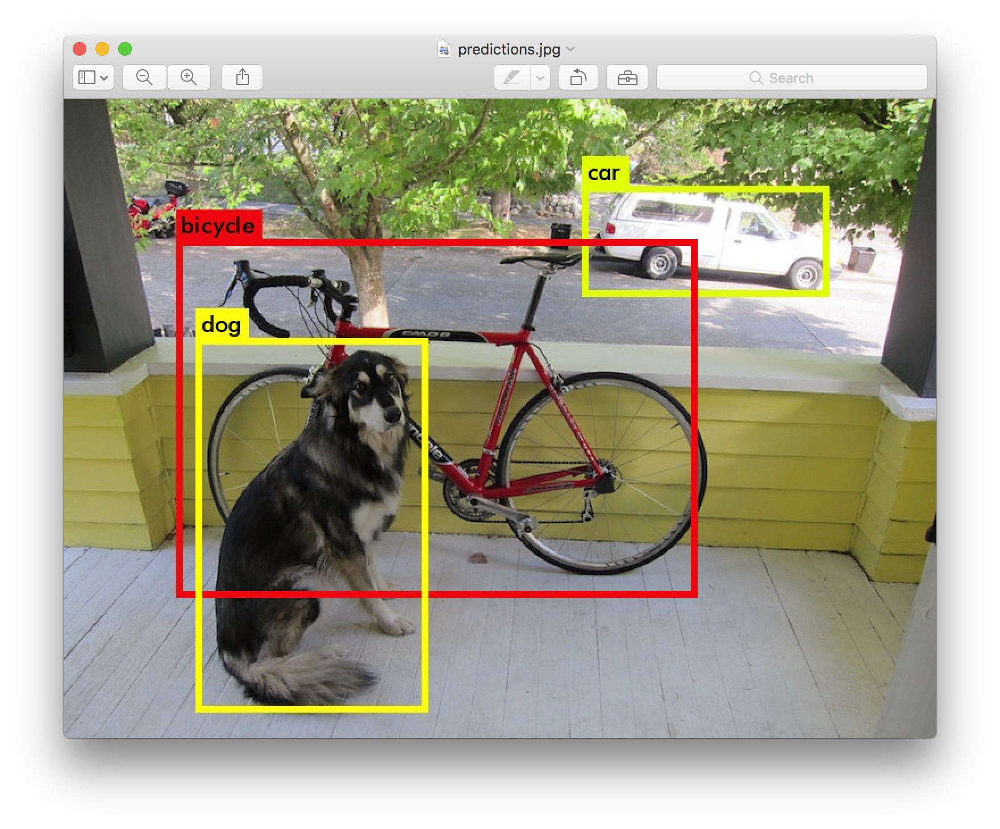
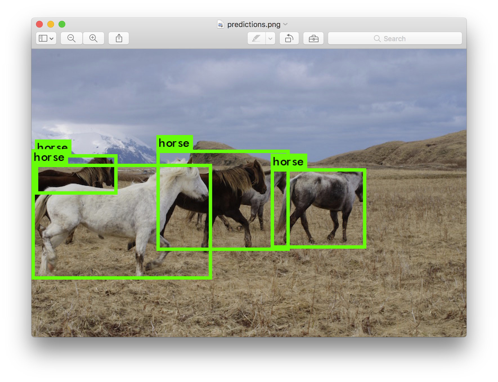
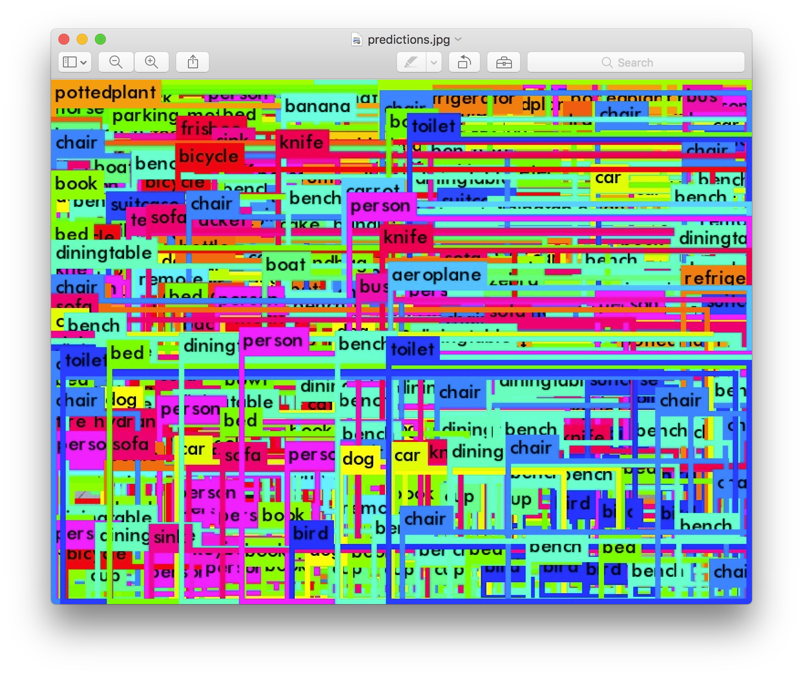
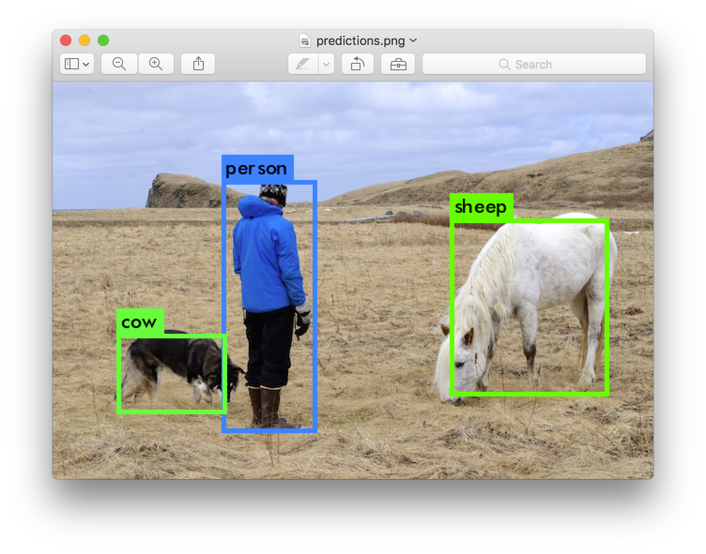

## [轉載] YOLO: Real-Time Object Detection [Back](./../post.md)

> - Author: [pjreddie](https://github.com/pjreddie)
> - Origin: http://pjreddie.com/darknet/yolo/

You only look once (YOLO) is a state-of-the-art, real-time object detection system. On a Titan X it processes images at 40-90 FPS and has a mAP on VOC 2007 of 78.6% and a mAP of 44.0% on COCO test-dev.

<iframe width="100%" height="415" src="https://www.youtube.com/embed/VOC3huqHrss" frameborder="0" allowfullscreen=""></iframe>

Model|Train|Test|mAP|FLOPS|FPS|Cfg|Weights
:----|----:|---:|--:|----:|--:|--:|------:
Old YOLO|VOC 2007+2012|2007|63.4|40.19 Bn|45||link
SSD300|VOC 2007+2012|2007|74.3|-|46||link
SSD500|VOC 2007+2012|2007|76.8|-|19||link
YOLOv2|VOC 2007+2012|2007|76.8|34.90 Bn|67|cfg|weights
YOLOv2 544x544|VOC 2007+2012|2007|78.6|59.68 Bn|40|cfg|weights
Tiny YOLO|VOC 2007+2012|2007|57.1|6.97 Bn|207|cfg|weights
SSD300|COCO trainval|test-dev|41.2|-|46||link
SSD500|COCO trainval|test-dev|46.5|-|19||link
YOLOv2 544x544|COCO trainval|test-dev|44.0|59.68 Bn|40|cfg|weights
Tiny YOLO|COCO trainval|-|-|7.07 Bn|200|cfg|weights

### How It Works

Prior detection systems repurpose classifiers or localizers to perform detection. They apply the model to an image at multiple locations and scales. High scoring regions of the image are considered detections.

We use a totally different approach. We apply a single neural network to the full image. This network divides the image into regions and predicts bounding boxes and probabilities for each region. These bounding boxes are weighted by the predicted probabilities.

<p align="center"></p>

Our model has several advantages over classifier-based systems. It looks at the whole image at test time so its predictions are informed by global context in the image. It also makes predictions with a single network evaluation unlike systems like [R-CNN](https://github.com/rbgirshick/rcnn) which require thousands for a single image. This makes it extremely fast, more than 1000x faster than R-CNN and 100x faster than [Fast R-CNN](https://github.com/rbgirshick/fast-rcnn). See our [paper](http://arxiv.org/abs/1506.02640) for more details on the full system.

#### What's New in Version 2?

YOLOv2 uses a few tricks to improve training and increase performance. Like Overfeat and SSD we use a fully-convolutional model, but we still train on whole images, not hard negatives. Like Faster R-CNN we adjust priors on bounding boxes instead of predicting the width and height outright. However, we still predict the `x` and `y` coordinates directly. The full details are in our paper soon to be released on Arxiv, stay tuned!

### Detection Using A Pre-Trained Model

This post will guide you through detecting objects with the YOLO system using a pre-trained model. If you don't already have Darknet installed, you should [do that first](http://pjreddie.com/darknet/install/). Or instead of reading all that just run:

```bash
git clone https://github.com/pjreddie/darknet
cd darknet
make
```

Easy!

You already have the config file for YOLO in the `cfg/` subdirectory. You will have to download the pre-trained weight file [here (258 MB)](http://pjreddie.com/media/files/yolo.weights). Or just run this:

```bash
wget http://pjreddie.com/media/files/yolo.weights
```

Then run the detector!

```bash
./darknet detect cfg/yolo.cfg yolo.weights data/dog.jpg
```

You will see some output like this:

```bash
layer     filters    size              input                output
    0 conv     32  3 x 3 / 1   416 x 416 x   3   ->   416 x 416 x  32
    1 max          2 x 2 / 2   416 x 416 x  32   ->   208 x 208 x  32
    .......
   29 conv    425  1 x 1 / 1    13 x  13 x1024   ->    13 x  13 x 425
   30 detection
Loading weights from yolo.weights...Done!
data/dog.jpg: Predicted in 0.016287 seconds.
car: 54%
bicycle: 51%
dog: 56%
```

<p align="center"></p>

Darknet prints out the objects it detected, its confidence, and how long it took to find them. We didn't compile Darknet with `OpenCV` so it can't display the detections directly. Instead, it saves them in `predictions.png`. You can open it to see the detected objects. Since we are using Darknet on the CPU it takes around 6-12 seconds per image. If we use the GPU version it would be much faster.

I've included some example images to try in case you need inspiration. Try `data/eagle.jpg`, `data/dog.jpg`, `data/person.jpg`, or `data/horses.jpg`!

The `detect` command is shorthand for a more general version of the command. It is equivalent to the command:

```bash
./darknet detector test cfg/coco.data cfg/yolo.cfg yolo.weights data/dog.jpg
```

You don't need to know this if all you want to do is run detection on one image but it's useful to know if you want to do other things like run on a webcam (which you will see [later on](http://pjreddie.com/darknet/yolo/#demo)).

#### Multiple Images

Instead of supplying an image on the command line, you can leave it blank to try multiple images in a row. Instead you will see a prompt when the config and weights are done loading:

```bash
./darknet detect cfg/yolo.cfg yolo.weights
layer     filters    size              input                output
    0 conv     32  3 x 3 / 1   416 x 416 x   3   ->   416 x 416 x  32
    1 max          2 x 2 / 2   416 x 416 x  32   ->   208 x 208 x  32
    .......
   29 conv    425  1 x 1 / 1    13 x  13 x1024   ->    13 x  13 x 425
   30 detection
Loading weights from yolo.weights ...Done!
Enter Image Path:
```

Enter an image path like `data/horses.jpg` to have it predict boxes for that image.

<p align="center"></p>

Once it is done it will prompt you for more paths to try different images. Use `Ctrl-C` to exit the program once you are done.

#### Changing The Detection Threshold

By default, YOLO only displays objects detected with a confidence of .25 or higher. You can change this by passing the `-thresh <val>` flag to the `yolo` command. For example, to display all detection you can set the threshold to 0:

```bash
./darknet detect cfg/yolo.cfg yolo.weights data/dog.jpg -thresh 0
```

Which produces:

<p align="center"></p>

So that's obviously not super useful but you can set it to different values to control what gets thresholded by the model.

### Tiny YOLO

Tiny YOLO is based off of the [Darknet reference network](http://pjreddie.com/darknet/imagenet/#reference) and is much faster but less accurate than the normal YOLO model. To use the version trained on VOC:

```bash
wget http://pjreddie.com/media/files/tiny-yolo-voc.weights
./darknet detector test cfg/voc.data cfg/tiny-yolo-voc.cfg tiny-yolo-voc.weights data/dog.jpg
```

Which, ok, it's not perfect, but boy it sure is fast. On GPU it runs at >200 FPS.

<p align="center"></p>

### Real-Time Detection on a Webcam

Running YOLO on test data isn't very interesting if you can't see the result. Instead of running it on a bunch of images let's run it on the input from a webcam!

To run this demo you will need to compile [Darknet with CUDA and OpenCV](http://pjreddie.com/darknet/install/#cuda). Then run the command:

```bash
./darknet detector demo cfg/coco.data cfg/yolo.cfg yolo.weights
```

YOLO will display the current FPS and predicted classes as well as the image with bounding boxes drawn on top of it.

You will need a webcam connected to the computer that OpenCV can connect to or it won't work. If you have multiple webcams connected and want to select which one to use you can pass the flag `-c <num>` to pick (OpenCV uses webcam `0` by default).

You can also run it on a video file if OpenCV can read the video:

```bash
./darknet detector demo cfg/coco.data cfg/yolo.cfg yolo.weights <video file>
```

That's how we made the YouTube video above.

### What Happened to the Old YOLO Site?

If you are using YOLO version 1 you can still find the site here: http://pjreddie.com/darknet/yolov1/