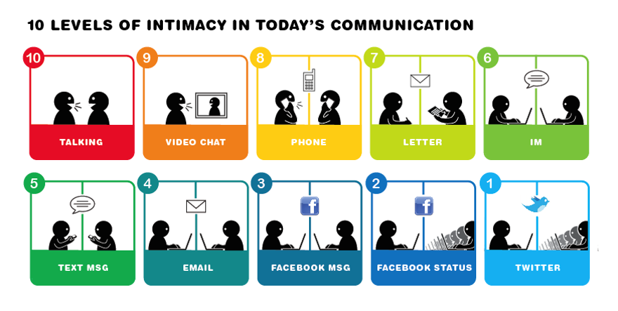
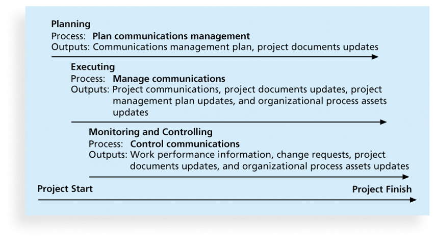

## Project Communication Management	[Back](./../projectManagement.md)

### 1. Processes

1. Planning communications management
    - Communications Management Plan Contents
        - Stakeholder communications requirements
        - Information to be communicated, including format, content, and level of detail
        - Who will receive the information and who will produce it
        - Suggested methods or technologies for conveying(傳達) the information
        - Frequency of communication
        - Escalation(升級) procedures for resolving issues
        - Revision procedures for updating the communications management plan
        - A glossary(詞匯表) of common terminology(術語)
2. Managing communications
    - Determining the number of communications channels:
        - channels = n(n-1) / 2
    - Classifications for communication methods:
        - Interactive communication
        - Push communication
        - Pull communication
3. Controlling communications

### 2. Understanding Group and Individual Communication Needs

- As illustrated in Brooks' book The Mythical Man-Month(人月神話), you cannot assume that a task originally scheduled to take two months of one person's time can be done in one month by two people.
- Nine women cannot produce a baby in one month!

### 3. Running Effective Meetings

- Determine if a meeting can be avoided
- Define the purpose and intended outcome of the meeting
- Determine who should attend the meeting
- Provide an **agenda(議程)** to participants before the meeting
- Prepare handout(會議文字資料) and visual aids, and make logistical arrangements(後勤安排) ahead of time
- Run the meeting professionally
- Set the ground rules(基本原則) for the meeting
- Build relationships

### 4. Lessons Learned(經驗總結) Reports

- The project manager and project team members should each prepare a **lessons-learned report**.

### 5. Project Archives(檔案)

- **Project archives** are a complete set of organized project records that provide an accurate history of the project.

### 6. Q&A

- Managing communications is part of the which process of the project communication management?
    - closing
    - planning
    - executing
    - monitoring and controlling

> answer: <strong>*executing.*</strong>

- As a manager, you want to praise a team member, Phil, for doing a good job on a particular project. However, you know that Phil tends to be an introvert. Which of the following communication methods would Phil be most comfortable with?
    - Call Phil in for a private meeting to appreciate his work.
    - Announce Phil's accomplishment on the company Web site.
    - Call a team meeting to praise Phil for his work on the project.
    - Have top management and the other teams in the company award Phil.

> answer: <strong>*Call Phil in for a private meeting to appreciate his work.*</strong>

- Which of the following communication methods would be most appropriate for assessing the commitment of project stakeholders?
    - Wikis
    - Web sites
    - E-mail
    - Meetings
    
> answer: <strong>*Meetings.*</strong>

- According to the guidelines provided by Practical Communications, Inc., what is a medium that is "excellent" for encouraging creative thinking?
    - phone call
    - meeting
    - e-mail
    - Web Site
    
> answer: <strong>*e-mail.*</strong>

- According to the guidelines provided by Practical Communications, Inc., what is the most inappropriate medium for addressing negative behavior?
    - voice mail
    - meeting
    - e-mail
    - Web Site

> answer: <strong>*meeting.*</strong>

- According to the guidelines provided by Practical Co, which address where the project stands in terms of meeting scope, time, and cost goals?
    - Technical reports
    - Progress reports
    - Status reports
    - Lessons-learned reports

> answer: <strong>*Status reports.*</strong>

- What describe where the project stands at a specific point in time?
    - Progress reports
    - Forecasts
    - Status reports
    - Lessons-learned reports

> answer: <strong>*Status reports.*</strong>

- What describe what the project team has accomplished during a certain period?
    - Progress reports
    - Forecasts
    - Status reports
    - Lessons-learned reports

> answer: <strong>*Progress reports.*</strong>

- What predict future project status and progress based on past information and trends?
    - Progress reports
    - Forecasts
    - Status reports
    - Project updates
    
> answer: <strong>*Forecasts.*</strong>

- Which of the following questions is typically addressed by a project forecast?
    - How much more money will be needed to complete the project?
    - Are our clients satisfied with the speed and quality of work on this project?
    - Does the quality of output match our goals?
    - How comfortable are employees with the software and technology being used on the project?
    
> answer: <strong>*How much more money will be needed to complete the project?*</strong>

- E-mail communication is most suited for:
    - assessing commitment to a project.
    - mediating a conflict between multiple parties.
    - building consensus among disputing parties.
    - communicating routine information.
    
> answer: <strong>*communicating routine information.*</strong>

- Which line for any e-mail messages you write should clearly state the intention of the e-mail?
    - to
    - subject
    - from
    - cc

> answer: <strong>*subject.*</strong>

- Which of the following is a guideline that project managers should follow when communicating with their teams through e-mail?
    - Always reply to all the people to whom the initial message was sent.
    - If the entire message can fit in the subject line, put it there.
    - Minimize the total number of e-mails by including as many subjects as possible in a single e-mail.
    - Continue replying to e-mail messages without changing the subject line to maintain continuity.

> answer: <strong>*If the entire message can fit in the subject line, put it there.*</strong>

- What are a complete set of organized project records that provide an accurate history of the project?
    - Project archives
    - Project plans
    - Forecasts
    - Project notes

> answer: <strong>*Project archives.*</strong>
