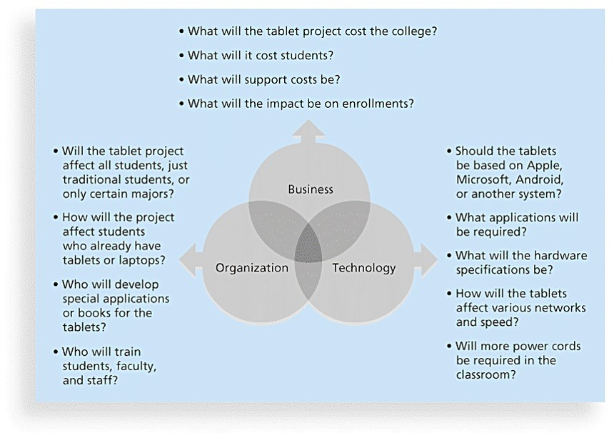
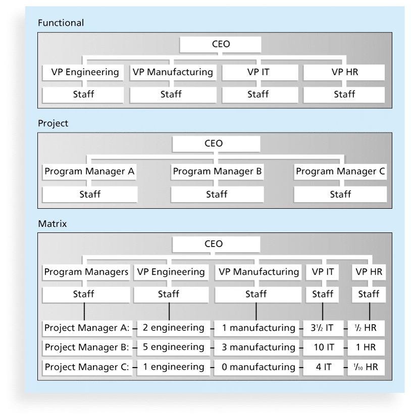
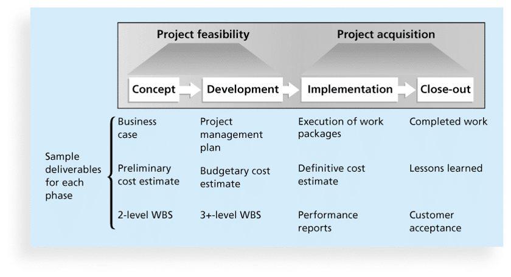

## Information Technology Context	[Back](./../projectManagement.md)

### 1. Systems view

- Project managers need to use **systems thinking**: to take a holistic(整體的) view of carrying out projects within the context of the organization.
- a **systems approach** includes:
    - **Systems philosophy**
    - **Systems analysis**
    - **Systems management**

### 2. Three Sphere(領域) Model of Systems Management

- Organizations:
    - **Structural frame**: Roles and responsibilities, coordination and control.  (Organizational charts help describe the frame)
    - **Human resources frame**: Providing harmony between needs of the organization and needs of people.
    - **Political frame**: Coalitions(並集) composed of varied individuals and interest groups. Conflicts and power are key issues.
    - **symbolic frame**: Symbols and meanings related to events. Culture, language, traditions and image are all parts of this frame.

### 3. Organizational Structures

- Functional: **functional managers** -> **CEO**
- Project: **program managers** -> **CEO**
- Matrix: **personnel** -> **two or more bosses** (between functional and project structures)

### 4. Organiazational Culture

- a set of shared assumptions, values and behaviors that characterize the functioning of an organiaztion.
- characteristics of organizational culture (**bold** means it's more important):
    - **Member identify**
    - **Risk tolerance**
    - **Group emphasis**
    - **Reward criteria**
    - People focus
    - **Conflict tolerance**
    - **Unit integration**
    - Means-ends orientation(導向)
    - Control
    - **Open-systems focus**

### 5. Project Life Cycle

- a **project life cycle**: a collection of project phases. (from the projects' start point to the end point)
- phases of a traditional project life cycle.

- a **Systems Development Life Cycle(ADLC)** is a framework for describing the phases involved in developing and maintaining information systems. A system development project can follow:
    - **Predictive life cycle**: the scope of the project can be clearly articulated(清楚說明的) and the schedule and cost can be predicted.
        - **Waterfall Model**: has well-defined, linear stages of systems development and support.
        - **Spiral Model**: shows that software is developed using an iterative(迭代) or spiral(螺旋) approach rather than a linear approach.
        - **Incremental Build Model**: provides for progressive(漸進的) development of operational software.
        - **Prototyping(原型) Model**: used for developing prototypes to clarify user requirements.
        - **Rapid Application Development(RAD) Model**: used to produce systems quickly without sacrificing(犧牲) quality.
    - **Adaptive software development life cycle**: requirements cannot be clearly expressed, projects are mission driven and component based, using time-based cycles to meet target dates.
        - **Agile Development Model** 

### 6. Definitives

- **Globalization**: software has been completed by people all around the world in many companies.
- **Outsourcing(外包)**: an organization acquires goods and/or sources from an outside source.
    - **Offshoring(離岸外包)**: to describe outsourcing from another countries.
- **Virtual teams**: 

=====

